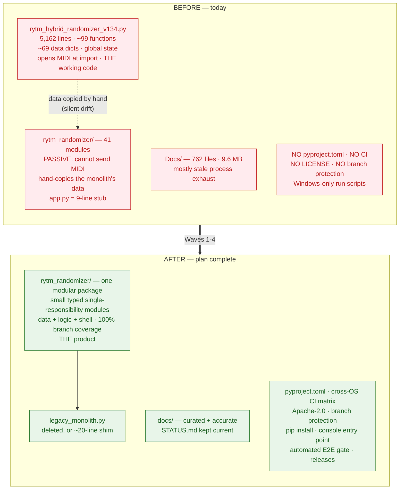
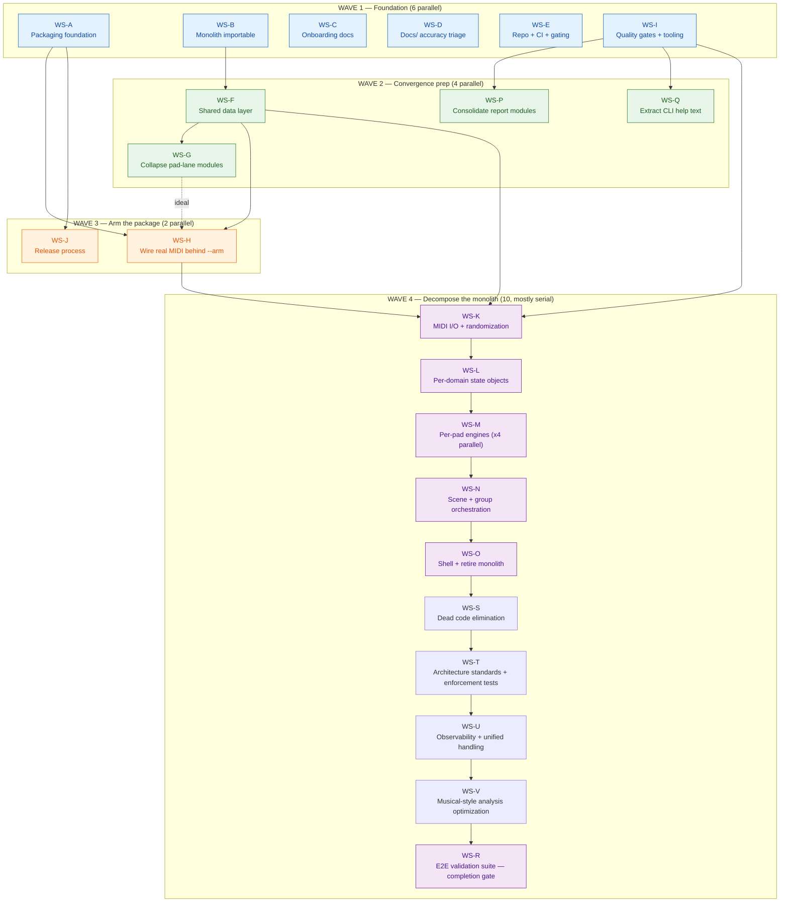
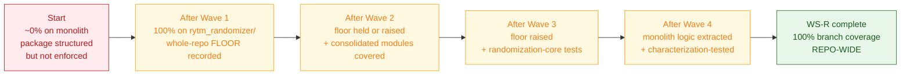
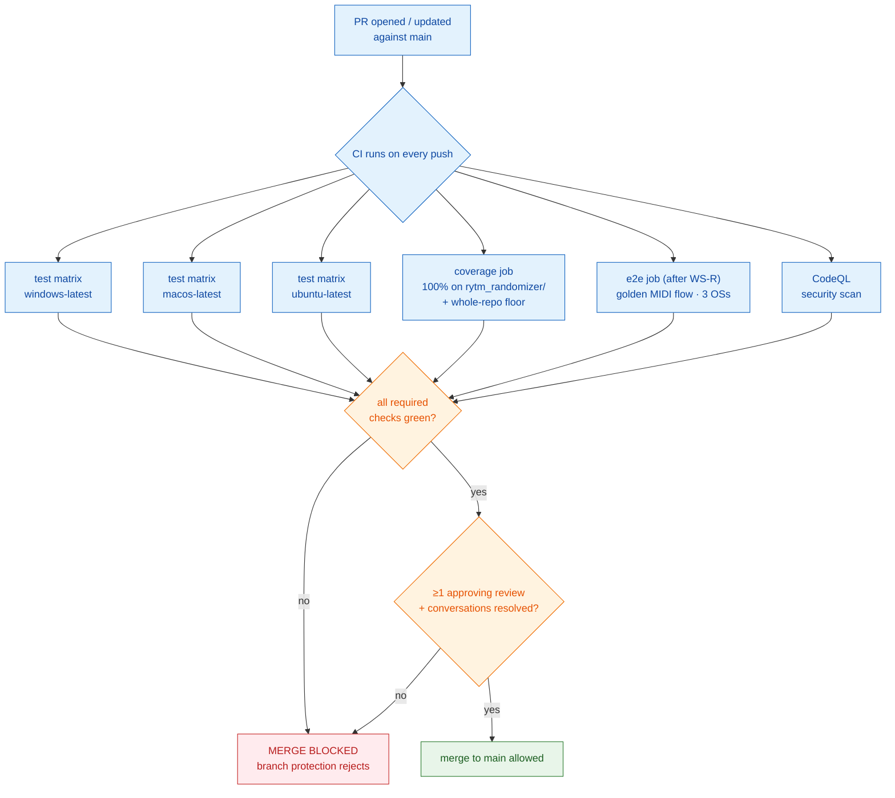
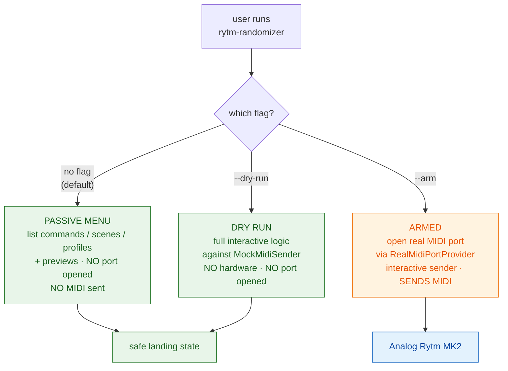
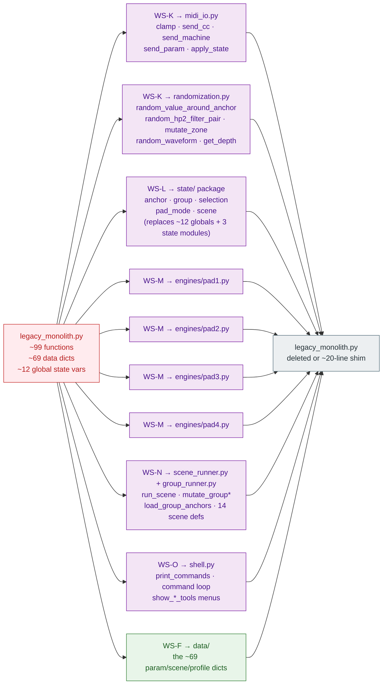
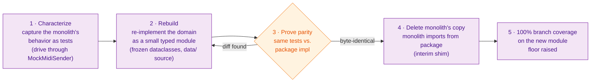
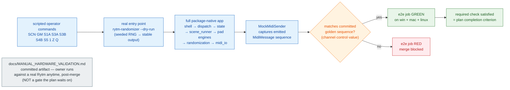

# RytmRandomizer — Parallel Execution Plan

**Source:** `CODE_REVIEW_SUGGESTIONS.md` (2026-05-14 multi-agent review)
**Repo:** `RytmRandomizer`, branch `modularize-v1.34`
**Status:** Proposal for repo-owner review. No code changes are included with this document — it is the execution plan only.
**Sequencing:** Interleaved — independent Phase 1 (packaging/onboarding) and Phase 2 (architecture) streams run in parallel from the start, since they touch disjoint files.
**Docs policy:** Accuracy pass, not blind archival. Every `Docs/` file is triaged: **accurate + useful → keep/curate**, **inaccurate but worth having → update**, **inaccurate or pure process exhaust → remove**.
**Quality gates:** CI must run the tests on every push/PR and **block merge** unless they pass. Coverage is enforced with a **ratcheting, package-first** policy: 100% branch coverage on `rytm_randomizer/` immediately, a whole-repo floor that can only increase, and the monolith reaching 100% as its logic is extracted (WS-F/WS-K…WS-O). Hardware I/O paths are excluded with explicit `# pragma: no cover` justification.

---

## Execution model — runs to completion unattended

This plan is designed to **run start-to-finish without pausing for human review or validation**, and to **end by opening a PR**. The point of the gated builds is that *the CI does the checking* — not a person at a checkpoint.

- **No step in this plan blocks on a human decision.** Every decision the plan needed has already been made and baked into the workstreams (see *Owner inputs — all resolved*). There are no "flag for owner" pauses, no "confirm before proceeding" steps.
- **Validation is automated, not manual.** Correctness is proven by the cross-OS CI matrix, the ratcheting coverage gate, and the WS-R automated end-to-end suite — all of which run in the pipeline. The plan's *completion criterion* is "the automated `e2e` suite is green on `main`," not "a human signed off."
- **The one genuinely-manual thing — a hardware run against a physical Analog Rytm MK2 — is not a checkpoint.** WS-R *writes and commits* `docs/MANUAL_HARDWARE_VALIDATION.md` as a deliverable; the owner can run that checklist whenever they like, after the fact. The plan does not wait on it.
- **The one genuinely-admin thing — applying GitHub branch-protection rules — is not a checkpoint either.** WS-E *commits* the exact ruleset and a ready-to-run script; an admin runs that script once, out of band. Workstreams keep producing PRs regardless; the rules simply begin enforcing once applied.
- **The plan ends with a PR.** Each workstream produces its own reviewable PR against `main`; the plan running "to completion" means all workstreams' PRs are open (or merged) with green gates. Human review happens *on the PRs*, after the automated work is done — it is not interleaved into the plan's execution.

---

## Context — why this plan exists

The review found the project has strong engineering habits (disciplined commits, a tested safety boundary, excellent data-layer modules) but three blockers: (1) it cannot be installed on any OS — no dependency declaration or packaging; (2) the `rytm_randomizer/` package is gated by its own tests to stay *passive forever* while hand-re-typing the working monolith's data, so the modularization is aimed at a dead end; (3) it cannot be onboarded — no real README/CONTRIBUTING, five plausible "the code" locations, and `Docs/` is 762 files of mostly stale agent-process exhaust.

This plan turns the review's 3-phase recommendation into concrete, parallelizable workstreams with explicit dependencies, file ownership (to prevent collisions), agent briefs, and acceptance criteria. The goal state: an installable cross-OS product with a converging (not dead-end) architecture and a repo a new developer can onboard into in under a day.

### Diagram A — Before vs. after: the whole-repo shape change

The core musical behavior — scenes, guardrails, the four-pad layout — is **preserved exactly** and proven preserved by characterization + E2E tests. What changes is the structure and process around that behavior, not the behavior.

---

## Parallelization strategy

Work is split into **22 workstreams (WS-A … WS-V)** grouped into **4 waves**. Within a wave, streams own disjoint file sets and can run as simultaneous subagents. Waves are gated by dependencies.

### Diagram 1 — Workstream dependency graph (all 22 workstreams, 4 waves)

Within each wave, the workstreams shown side-by-side have **disjoint file ownership** and run as simultaneous subagents. Arrows are hard dependencies; the dotted `G -.ideal.-> H` is a soft preference, not a blocker. Branch-per-workstream off `main` (created first — WS-E step 1); each workstream produces one reviewable PR; wave boundaries are merge points.

### Diagram 2 — The coverage ratchet over time

The floor only ever moves up. Every workstream's PR must hold or raise it; CI fails the PR otherwise. The whole-repo 100% target is reached by *extraction* (Wave 4 turns un-testable monolith code into testable package modules), not by mock-stuffing.

---

## WAVE 1 — Foundation (6 parallel workstreams)

### WS-A — Packaging foundation
**Owns:** `pyproject.toml` (new), `.python-version` (new), `requirements-dev.txt` (new, optional)
**Addresses:** C1, C2, C12, I8 (partial)
**Depends on:** nothing

Steps:
1. Create PEP 621 `pyproject.toml`:
   - `[project]`: `name = "rytm-randomizer"` (working name — the rename question is parked, see WS-D step 7), `version = "1.34.0"`, `description`, `readme = "README.md"`, `requires-python = ">=3.9"`, `license = "Apache-2.0"` (owner decision, 2026-05-14).
   - `dependencies = ["mido>=1.3,<2", "python-rtmidi>=1.5,<2"]`.
   - `[project.optional-dependencies] dev = ["pytest>=8,<9"]`.
   - `[project.scripts] rytm-randomizer = "rytm_randomizer.app:main"` (entry point becomes real in WS-H; until then `app.main` is the stub — acceptable, the console script is wired ahead of the implementation).
   - `[build-system]` using `hatchling` or `setuptools`.
   - `[tool.pytest.ini_options]` pointing at `tests/`.
2. Pin a tested Python in `.python-version` (confirm the actual version the suite passes on — likely 3.11/3.12; verify, don't guess).
3. Document per-OS backend prerequisites in a `## Requirements` block that WS-C will fold into README (hand WS-C the text, or write it into `pyproject.toml` description and let WS-C reference it):
   - Windows/macOS: `python-rtmidi` wheels exist — `pip install` works.
   - Linux: may need ALSA dev headers (`libasound2-dev`) if no wheel.
4. Verify: `pip install -e ".[dev]"` succeeds in a clean venv on the dev machine; `pytest` still green.

Acceptance: a clean `pip install -e ".[dev]"` works; `pytest` passes; `rytm-randomizer` console command exists (even if it prints the stub message).

---

### WS-B — Make the monolith importable
**Owns:** `rytm_hybrid_randomizer_v134.py`
**Addresses:** C4, I1 (the bare-`except` clauses), I3 (the `__main__` guard; full type annotation is owned by Wave 4 as each domain is re-implemented in the package)
**Depends on:** nothing
**Constraint:** This is the hardware-validated reference. **Behavior must not change.** No logic edits — only structural wrapping.

Current state (verified against the file, 5,162 lines):
- **Module-level I/O side effects** at the top: the banner `print` (line 5), `mido.get_output_names()` (line 7), the no-output `SystemExit` block (lines 9–11), the port-list print + loop (lines 13–14), the `input()` port prompt (line 17), and the bare-`except` choice handler (lines 19–23).
- **Module-level mutable global state** at lines ~2074–2125: `active_profile`, `anchor_state = {}`, `current_state = {}`, `previous_state`, `group_anchor_states`, `group_current_states`, `group_previous_states`, `isolated_pad`, `current_scene_name`, `pad2_current_profile_key`, `pad3_current_mode_key`, `pad4_current_mode_key`. These are *not constants* — the ~99 functions read and mutate them as globals.
- **The command loop** is the `with mido.open_output(port_name) as out:` block at line 4852 to EOF.
- **Two bare `except:` clauses** — line 21 and line 5101 (confirmed; no others).

Steps:
1. Wrap the module-level I/O side effects (banner print, `get_output_names`, port prompt, `open_output` command loop — lines 5–28 and 4850–EOF) into `def main() -> None:`.
2. Add `if __name__ == "__main__": main()` at the file end.
3. **The mutable global state (lines ~2074–2125) stays module-level for now** — moving it is WS-L's job (it becomes injected `state.py` objects in Wave 4). WS-B must *not* turn these into locals inside `main()`, because the ~99 functions reference them as globals; doing so would silently break them. WS-B's only structural change is hoisting the *I/O* into `main()`, leaving the globals, constants, the ~69 param-map dicts, and all `def`s at module scope.
4. Fix the two bare `except:` clauses (line 21, line 5101) → catch the specific exceptions actually expected (`(ValueError, IndexError)` for the line-21 port-choice parse; inspect line 5101's context and narrow to its real expected exception). This is the only behavioral-adjacent change and it is strictly safer (no longer swallows `KeyboardInterrupt`).
5. Smoke test: `python -c "import rytm_hybrid_randomizer_v134"` must complete silently with no prompt, no port open, no exit. `python rytm_hybrid_randomizer_v134.py` must still run the interactive tool exactly as before.
6. The file rename to `legacy_monolith.py` is **owned by WS-E** (WS-E owns the run scripts that reference it, so the rename and the script updates land together). WS-B does only the structural wrap.

Acceptance: the file imports as a side-effect-free module; running it directly is behaviorally identical to today; no bare `except:` remains; module-level mutable globals are intentionally untouched here — they are owned by WS-L, which models them as the per-domain `state/` package.

---

### WS-C — Onboarding documentation
**Owns:** `README.md`, `CONTRIBUTING.md` (new), `LICENSE` (new), `.gitignore`
**Addresses:** C7, C8, I13 (partial)
**Depends on:** nothing (consumes text fragments from WS-A and WS-E but can stub-and-reconcile at the Wave 1 merge)

Steps:
1. Rewrite `README.md` as a true onboarding doc:
   - One-paragraph plain-language "what this is" (Python tool that randomizes Elektron Analog Rytm MK2 drum-synth params over MIDI; 4-pad layout; layered scene system).
   - **Repository map** section — state plainly: `rytm_randomizer/` is the active codebase being built; `rytm_hybrid_randomizer_v134.py` (or its renamed form) is the frozen hardware-validated reference; `Patches/`, `CaptureTools/` are auxiliary one-off tooling; `Skills/` is agent tooling (or relocated by WS-E).
   - **Requirements / Install / Run / Test** sections — reference WS-A's `pyproject.toml` flow, including the Linux ALSA note.
   - Keep the existing scene tables and safety rules (they are good content) but move them below the onboarding material.
2. Write `CONTRIBUTING.md`:
   - Branching model (from WS-E): `main` is integration target; feature branches merge via PR.
   - How to run the verification gate (`pytest`, and `Scripts/closeout_check.ps1` — note its PowerShell-only limitation, WS-E may add a cross-platform equivalent).
   - The **"preserve V1.34 behavior"** rule — promote the genuinely useful content from `Docs/MODULARIZATION_RULES.md` here (coordinate with WS-D, which owns that file — WS-D marks it "folded into CONTRIBUTING" rather than deleting independently).
   - Commit conventions, the data-vs-code guiding principle from the review.
3. Add a `LICENSE` — **Apache-2.0** (owner decision, 2026-05-14). Use the standard Apache-2.0 license text; set the `[project] license` field in `pyproject.toml` to match (coordinate with WS-A), and add the short Apache header to new source files where practical.
4. `.gitignore`: add a `.claude/` scratch-dir entry and a `docs-scratch/` (or similar) so future agent process artifacts never re-enter the repo (the WS-D long-term fix).

Acceptance: a new developer can read `README.md` + `CONTRIBUTING.md` and answer "what is it / how do I run it / how do I contribute / where is the real code" without reading anything else.

---

### WS-D — Docs/ accuracy triage
**Owns:** `Docs/**`, `RytmRandomizer_Resume_Point_V132.md`, root `*.md` except `README.md`/`CONTRIBUTING.md`/`CODE_REVIEW_SUGGESTIONS.md`/`EXECUTION_PLAN.md`
**Addresses:** C9, I11, plus the explicit directive: *docs must be accurate — update or remove.*
**Depends on:** nothing

This is the most judgment-heavy stream. The instruction overrides the review's "archive wholesale" suggestion: **triage every file for accuracy.**

Steps:
1. **Inventory & classify.** Script a pass over all 762 `Docs/` files producing a triage table: filename, size, last-meaningful-content, and a proposed disposition:
   - **KEEP** — accurate and useful to a human (candidates: `ARCHITECTURE_DIAGRAMS.md`, `MODULARIZATION_RULES.md`, `V134_OPERATOR_COMMAND_SURFACE_REFERENCE.md`, `LOCAL_DEV_TOOLING_NOTES.md`, `HARDWARE_MANUAL_REFERENCE_INVENTORY.md`).
   - **UPDATE** — useful purpose, but stale/inaccurate (wrong version, superseded paths, claims that no longer hold). Must be corrected against current code state.
   - **REMOVE** — pure agent-process exhaust (the PLAN/CHECKPOINT/REVIEW/PROGRESS_REPORT quartets, packet-by-packet logs, `SESSION_AGENDA_*`, `SESSION_HANDOFF_*`, `NEXT_ACTION.md`, the 24k–30k-line append-logs). These describe a process, not the product, and are inaccurate the moment the next commit lands.
2. **Verify accuracy of KEEP/UPDATE candidates against the code.** For each, cross-check claims against the actual `rytm_randomizer/` and monolith state. Anything that can't be verified true → downgrade to UPDATE or REMOVE.
3. **Execute dispositions:**
   - KEEP → move into a curated lowercase `docs/` directory.
   - UPDATE → correct the content (fix versions, paths, stale architecture claims), then move to `docs/`.
   - REMOVE → delete from the working tree. Capture the full pre-deletion file list in the PR description for the record. (History retains them; no `filter-repo` — no history scrub was requested and pack size is only ~3.2 MiB.)
4. **Write one hand-authored `docs/STATUS.md`** — replaces the three giant append-logs (`PROJECT_CHECKPOINT_CURRENT.md`, `NEXT_ACTION.md`, `PASSIVE_ARCHITECTURE_SUMMARY.md`). A concise, accurate, *maintained-in-place* (never appended) snapshot of: current version, what works, what's in progress, known gaps.
5. Delete `RytmRandomizer_Resume_Point_V132.md` (stale: wrong script version, hardcoded foreign user path `C:\Users\Jose Buzzi\...`).
6. Empty tracked dir `Docs/Session_Logs/` → remove.
7. **Project-rename question — parked explicitly** (owner decision, 2026-05-14). The project keeps the working name `RytmRandomizer` / package `rytm-randomizer` for now; a rename may happen later. Keep `PROJECT_IDENTITY_NAME_SHORTLIST.md` and `PROJECT_IDENTITY_RENAME_PLAN.md` in `docs/`, but prepend a clear banner to each: *"STATUS: PARKED — not an active workstream as of 2026-05-14. The project ships as `rytm-randomizer` until/unless this is revisited."* This is a decided state, not an open question — no rename work appears anywhere in this plan.

Acceptance: `docs/` contains only files verified accurate against current code; no stale claims; `STATUS.md` exists; the triage table is in the PR for auditability. **Coordinate with WS-C** on `MODULARIZATION_RULES.md` (WS-C folds its rules into `CONTRIBUTING.md`; WS-D then removes or stubs the original with a pointer).

---

### WS-E — Repo & CI hygiene + merge gating
**Owns:** `.github/**` (new), branch model, branch-protection rules, `CODEOWNERS`, Dependabot config, CodeQL workflow, `Scripts/**`, file-rename of the monolith, `run_current.bat/ps1`, `run_modular.py` (rename only — WS-H owns its logic), `Skills/` relocation
**Addresses:** C3 (partial), I9, I10, I8 (partial), I13, plus the collaboration directive: *CI must run tests on every commit and block merge otherwise.*
**Depends on:** nothing (but its file-rename of the monolith should land *after* WS-B merges to avoid a rebase conflict — sequence within Wave 1: WS-E's rename step waits for WS-B). Its CI install step references WS-A's `pyproject.toml`; the required-checks list must include WS-I's coverage job — reconcile at the Wave 1 merge.

Steps:
1. **Create `main` branch** as the integration target; point `origin/HEAD` at `main`. Rebase/retarget `modularize-v1.34` as a feature branch (or rename it `modularize`, dropping the version number).
2. **Add `.github/workflows/test.yml`** — matrix `[windows-latest, macos-latest, ubuntu-latest]`, triggers on `push` and `pull_request`: install via `pip install -e ".[dev]"` (depends on WS-A's `pyproject.toml`), run `pytest`, run an import smoke test (`python -c "import rytm_hybrid_randomizer_v134; import rytm_randomizer"`). Ubuntu job installs `libasound2-dev` first.
3. **Branch protection on `main` (the merge gate).** This is repo *settings*, not a committed file — execute via `gh api` (or document for the owner to apply in repo settings), and record the exact config in `CONTRIBUTING.md`. Required rules:
   - Require status checks to pass before merge — the **CI matrix (all 3 OSs)**, the **WS-I coverage job**, and (once WS-R lands) the **WS-R end-to-end job** are required checks. The required-checks list is updated as WS-I and WS-R add their jobs — WS-E ships the initial list and a documented procedure for adding the later checks.
   - Require branches to be up to date before merge.
   - Require ≥1 approving review; dismiss stale approvals when new commits are pushed.
   - Require conversation resolution before merge.
   - No direct pushes to `main` — all changes via PR.
4. **Add `.github/` templates** — PR template, issue templates (bug report, feature request).
5. **Add `CODEOWNERS`** — assign the repo owner as default owner so every PR auto-requests their review; pairs with the required-review rule in step 3.
6. **Add Dependabot** (`.github/dependabot.yml`) — weekly update PRs for `pip` dependencies (`mido`, `python-rtmidi`, `pytest`, dev tooling) and `github-actions`.
7. **Add CodeQL** (`.github/workflows/codeql.yml`) — GitHub's free static security scanning on the Python codebase, on push/PR and a weekly schedule.
8. **Rename the monolith** `rytm_hybrid_randomizer_v134.py` → `legacy_monolith.py` (waits for WS-B). Update `run_current.bat`, `run_current.ps1` references. Add a one-line deprecation note pointing at the package.
9. **Relocate `Skills/`** → `.claude/skills/` (or `tooling/`) with a one-line README explaining it's agent tooling, not product code.
10. **Add a cross-platform `closeout_check`** — a Python script alongside the existing PowerShell one, so the verification gate runs on all three OSs, not just Windows. (Not optional — the project's verification gate must work everywhere the product does.)

### Diagram 3 — The merge gate (what WS-E + WS-I + WS-R enforce on `main`)

Acceptance: `main` exists and is the default branch; **a PR with failing tests or below-floor coverage cannot be merged**; CI runs green on all three OSs; PR/issue templates, `CODEOWNERS`, Dependabot, and CodeQL are all active; the branch-protection config is documented in `CONTRIBUTING.md` with a committed apply-script; `Skills/` is no longer mistakable for product code; the verification gate runs cross-platform.

---

### WS-I — Quality gates & dev tooling
**Owns:** coverage config (`[tool.coverage.*]` in `pyproject.toml` — coordinate with WS-A, which creates the file), `.pre-commit-config.yaml` (new), `SECURITY.md` (new), the coverage CI job
**Addresses:** the collaboration directive: *100% branch coverage for the repo* (scoped as a ratchet — see below), plus review items I7 (test depth) and the house-style tooling expectations.
**Depends on:** WS-A owns `pyproject.toml`; WS-I adds the `[tool.coverage.*]` and `[tool.pytest.ini_options]` coverage sections to it — handle as a coordinated edit at the Wave 1 merge (or WS-A stubs the sections and WS-I fills them). The coverage CI job is added to WS-E's `test.yml` (or as a sibling job) and registered as a required check by WS-E step 3.

**Coverage policy — ratcheting, package-first.** A flat "100% whole-repo" gate from day one would block every PR until the 5,162-line monolith is fully retrofitted, stalling the plan. Instead:
- **`rytm_randomizer/` (the package): 100% branch coverage, enforced now.** This is the future codebase and is already structured for it.
- **Whole-repo: a coverage floor that can only go up.** CI fails if total branch coverage drops below the recorded floor. Every workstream raises or holds the floor; none may lower it.
- **New/changed code: 100% branch coverage on the diff.** Any line a PR adds or modifies must be covered (diff-coverage check).
- **Hardware I/O boundary: excluded with justification.** Real MIDI paths (`mido.open_output`, `out.send`), `input()` prompts, and port enumeration are marked `# pragma: no cover` with an inline reason — covering them honestly requires hardware; mock-only coverage there is low-value (per the review). The exclusion list is finite, enumerated, and reviewed.
- **The monolith reaches 100% by extraction, not by mock-stuffing.** As WS-F and WS-H pull its logic into importable modules, those modules get real behavior tests and the monolith's covered fraction climbs. The whole-repo 100% target is the *exit condition of Wave 3*, not a Wave 1 gate.

Steps:
1. Add `pytest-cov` to the `dev` optional-dependencies group (in WS-A's `pyproject.toml`).
2. Add `[tool.coverage.run]` (branch = true, source = the package + monolith) and `[tool.coverage.report]` (the enumerated `# pragma: no cover` / `exclude_lines` list, `fail_under` for the package) to `pyproject.toml`.
3. Add a **coverage CI job**: runs `pytest --cov --cov-branch`, fails if `rytm_randomizer/` is below 100% or if total coverage dropped below the floor, and posts a diff-coverage check on PRs. Record the current floor in the job config; bump it as it rises.
4. Add `.pre-commit-config.yaml` wiring `black`, `ruff`, and `isort` (the house-style tools) plus basic hygiene hooks (trailing whitespace, EOF newline, YAML/TOML validity). Document `pre-commit install` in `CONTRIBUTING.md` (coordinate with WS-C).
5. Add `SECURITY.md` — how to report a vulnerability, supported versions, expected response. Relevant because the end state is a consumer product installed on user machines.
6. Run `pre-commit run --all-files` once to establish a formatting baseline, committed as a **single, isolated, clearly-labelled commit** (`chore: apply formatting baseline (black/ruff/isort)`) separate from any logic change, so it does not pollute other workstreams' review diffs. This is a deterministic step, not an option — doing it once up front means every subsequent PR has a clean formatting base and the pre-commit hooks never produce surprise diffs.

Acceptance: `pytest --cov --cov-branch` reports and enforces 100% on `rytm_randomizer/`; the whole-repo floor is recorded and CI fails on regression; diff-coverage is checked on PRs; `pre-commit` is configured and documented; `SECURITY.md` exists; the `# pragma: no cover` exclusion list is finite and justified.

---

## WAVE 2 — Architecture convergence prep (4 parallel workstreams)

### WS-F — Shared data layer
**Owns:** `rytm_randomizer/data/**` (new), `rytm_randomizer/profiles.py`, `scenes.py`, `constants.py`
**Addresses:** C6
**Depends on:** WS-B (the monolith must be importable so its param maps / scene defs can be read programmatically rather than hand-copied)

Steps:
1. Identify the canonical domain data in the now-importable monolith: the ~69 param-map dicts (`BD_SHARP_PARAMS`, `BD_HARD_PARAMS`, `PAD1_BD_MUTATION_PLANS`, …), scene definitions, group-profile metadata.
2. Create `rytm_randomizer/data/` as the single source of truth — either pure-data Python modules or JSON/TOML loaded by a thin loader. Frozen dataclasses / `MappingProxyType` per the house style already used in `mock_midi.py`.
3. Re-point the monolith to import from `rytm_randomizer/data/` instead of defining the dicts inline. **Behavior must stay identical** — verify the monolith still runs and the values are byte-identical.
4. Re-point `profiles.py`, `scenes.py`, `constants.py` to consume the shared data instead of their current hand-typed *subsets* (`profiles.py` currently re-types `PAD_3_SY_RAW_CC_MAP`, `GROUP_PROFILE_METADATA`, etc.; `scenes.py` re-lists all 14 scene commands).
5. **Add a drift-guard test** asserting the package's view of the data and the monolith's agree (or simply: both import the same module, so the test asserts the loader's output matches known-good fixtures).

Acceptance: param maps / scenes / profiles exist in exactly one place; monolith behavior unchanged; a test fails if the two codebases ever diverge.

---

### WS-G — Collapse the pad-lane modules
**Owns:** `rytm_randomizer/behavior_pad1_lane.py` … `behavior_pad4_lane.py`, their tests
**Addresses:** I4
**Depends on:** WS-F (the collapsed registry should be built from the shared data layer)

Steps:
1. Define a `PadLaneCommand` frozen dataclass capturing the fields currently spread across the 14 parallel dicts in `behavior_pad1_lane.py` (`_LANE_ACTIONS`, `_DEPTH_DEPENDENCIES`, `_REQUIRES_DEPTH_SELECTION`, `_BEHAVIOR_FAMILIES`, `_REASONS`, etc.) and the 10/10/5 hand-written `_accepted_p*_result` functions in pads 2/3/4.
2. Build a single `{key: PadLaneCommand}` registry in one `behavior_pad_lane.py`, sourced from WS-F's data layer.
3. Per-pad public functions become thin filters over the registry (`pad_lane_commands(pad=1)`).
4. Migrate `test_behavior_pad1_lane.py` … `pad4` to the unified module. The snapshot fixtures must still match — this is a refactor, not a behavior change.
5. Delete the four old modules.

Acceptance: ~2,145 lines → one module + a registry; all existing pad-lane tests still pass; no behavior or output-string change.

---

### WS-P — Consolidate the report modules
**Owns:** `rytm_randomizer/registry_report.py`, `active_boundary_report.py`, `mock_mapper_report.py`, `runtime_plan_report.py`, `behavior_anchor_profile_report.py`, `behavior_parity_coverage_report.py`, `mock_runtime_active_bridge_report.py`, `audit.py`, `inspection.py`, `preview.py`, and their tests. **Excludes `project_status_report.py`** — that one is owned by WS-H (which changes its semantics); WS-P consolidates the *other* seven report modules plus the three inspection modules.
**Addresses:** I5
**Depends on:** WS-I (coverage gate). Independent of WS-F/WS-G/WS-Q — no shared files.

The review found 8 `*_report.py` modules plus `audit.py`/`inspection.py`/`preview.py`, each a read-only formatter over a dict, each with its own CLI subcommand and snapshot-fixture pair — migration bookkeeping that became permanent surface area.

Steps:
1. Define one `reports.py` module with a generic `format_report(section)` dispatcher and a `{report_key: builder}` registry — the same data-driven pattern WS-G applies to pad lanes.
2. Migrate each of the seven report modules' `build_*` / `format_* `/ `summarize_*` functions into the registry as builders. Keep every public function name importable (re-export from `reports.py`) so nothing downstream breaks, or update call sites in the same PR.
3. Fold `audit.py`, `inspection.py`, `preview.py` into the same module or a sibling `inspection.py` — they are the same "format a view over package metadata" shape.
4. Re-point `cli.py`'s report subcommands at the dispatcher (coordinate with WS-Q, which owns `cli.py` — handle as one combined `cli.py` edit at the Wave 2 merge, or sequence WS-Q first).
5. Migrate the report tests; the snapshot fixtures must still match byte-for-byte — this is a refactor, not a behavior change.
6. Delete the now-empty old modules.
7. Update `docs/ARCHITECTURE_DIAGRAMS.md` (or its curated successor) to reflect the consolidated module count.

Acceptance: seven report modules + three inspection modules → one `reports.py` (+ optional `inspection.py`); all report/inspection tests pass; all `cli_*` fixtures still match; no output change; module count visibly down.

---

### WS-Q — Extract CLI help text out of `cli.py`
**Owns:** `rytm_randomizer/cli.py`, `tests/fixtures/cli_*` (the 51 CLI fixture files), `tests/test_cli.py`
**Addresses:** I6
**Depends on:** WS-I (coverage gate). Coordinates with WS-P on `cli.py` (see WS-P step 4) — sequence WS-Q's structural extraction first, then WS-P re-points subcommands, or do both in one combined `cli.py` PR.

`cli.py` is 1,049 lines; ~21 multi-line `*_HELP = """..."""` constants are ~80% of the file, and the same text is triplicated in the 51 `tests/fixtures/cli_*` files.

Steps:
1. Move the 21 help-text blocks out of `cli.py` — into a `cli_help/` data directory (one text file per command) or a structured `help_text.py` data module. The command-to-help mapping becomes data, not inline literals.
2. `cli.py` keeps only the argument parsing and dispatch logic — it loads help text from the data source. Target: `cli.py` drops from ~1,049 lines to a few hundred.
3. Where possible, generate help text from the command registry (the data layer / WS-G's command keys) so help, parser, and fixtures share one source — eliminating the triplication.
4. Keep all 51 `cli_*` fixtures matching byte-for-byte; if generation changes whitespace, regenerate fixtures deliberately and review the diff.
5. `test_cli.py` continues to pass unchanged.

Acceptance: `cli.py` is mostly logic, not string literals; help text lives in one data source; all 51 `cli_*` fixtures still match; `test_cli.py` green; the help/parser/fixture triplication is reduced to one source of truth.

---

## WAVE 3 — Arm the package (2 parallel workstreams, gated)

### WS-H — Convergence: wire real MIDI behind an explicit flag
**Owns:** `rytm_randomizer/app.py`, `rytm_randomizer/real_midi_adapter.py`, `rytm_randomizer/project_status_report.py`, `run_modular.py`, `tests/test_project_status_report.py`
**Addresses:** C5, I2
**Depends on:** WS-A (entry point + deps declared), WS-F (shared data layer), and ideally WS-G

This is the milestone the review said is missing: the packet that lets the package actually *do its job*.

**Note on `cli.py`:** the existing `rytm_randomizer/cli.py` is the *passive report CLI* — it already has `def main(argv=None)` (line 771) and an `if __name__` guard, and it dispatches read-only `report` / `inspect` / `list` / `preview` subcommands. WS-H does **not** own or rewire `cli.py`; that surface stays passive and is intentionally separate from the interactive `app.py` entry point. The two coexist: `cli.py` = read-only inspection, `app.py` = the interactive randomizer. (Help-text de-bloat of `cli.py`, review item I6, is **not in any current workstream** — see Gaps & open items below.)

Steps:
1. Implement one concrete `mido`-backed `RealMidiPortProvider` behind the existing `real_midi_adapter.py` boundary (the boundary, `RealMidiSender`, `build_real_midi_sender` are already cleanly designed for this — they just need a real provider injected). Keep the passive import-safety: the `mido` import stays lazy / inside the provider, not at module top.
2. Make `rytm_randomizer/app.py:main()` a real entry point with this exact flag behavior (owner decision, 2026-05-14):
   - **No flag (default): passive menu only.** Show the inspection/preview menu — list commands, scenes, profiles, previews. No MIDI port is opened, no MIDI is sent. This is the safe landing state for a user who just runs `rytm-randomizer`.
   - **`--arm`: the interactive sender.** Opens a port via the real provider and enters the interactive randomizer command loop. This is the only mode that touches hardware, and it is opt-in.
   - **`--dry-run`: full logic against the mock.** Runs the complete interactive logic against `MockMidiSender` — no hardware, no port opened — so a user can exercise the real behavior before arming (I2).
   - At this wave the interactive logic still lives in the monolith; `app.py` may call into it (the monolith is importable after WS-B). Wave 4 (WS-O) moves the logic itself into the package and makes `app.py` fully package-native.
3. `run_modular.py` becomes meaningful (calls the real `main`).
4. **Flip `project_status_report.py`** from asserting `active_execution == "absent"` forever to *tracking progress* — e.g. "% of commands with an active implementation." Update `tests/test_project_status_report.py` and `Scripts/closeout_check.ps1` (coordinate with WS-E, which owns `Scripts/**` — handle as a coordinated edit) so the gate measures convergence instead of forbidding it. The import-safety boundary tests (`test_real_midi_adapter_boundary.py`) stay — passive modules must still be passive; only `app.py`/the provider are allowed to touch real MIDI, behind the flag.
5. Add behavior tests for the randomization core now that the monolith is importable (the review's I7) — `clamp`, `random_value_around_anchor`, scene guardrails — driven through `MockMidiSender`. (These are the *seed* of WS-K/WS-N's characterization tests; WS-H starts them, Wave 4 completes the coverage.)

### Diagram 4 — Runtime flag behavior (the WS-H safety model)

Touching hardware is **opt-in** — only `--arm` opens a port. Default and `--dry-run` are provably safe and need no hardware, which is also what makes the WS-R end-to-end suite fully automatable in CI.

Acceptance: `rytm-randomizer` with no flag shows the passive menu and opens no port; `rytm-randomizer --dry-run` runs the real logic against the mock with no hardware; `rytm-randomizer --arm` sends MIDI; the status report tracks convergence %; passive modules remain verified passive; the package is no longer a dead-end stub.

---

### WS-J — Release process
**Owns:** `.github/workflows/release.yml` (new), `CHANGELOG.md` (new)
**Addresses:** I8 (the "no update story" half), and the consumer-product goal: users need a defined way to get and update the product.
**Depends on:** WS-A (packaging metadata, version field, entry point must exist before anything can be built/released).

Steps:
1. Add `CHANGELOG.md` in Keep-a-Changelog format; seed it with the V1.34 baseline and an `[Unreleased]` section that subsequent PRs append to.
2. Add `.github/workflows/release.yml` triggered on a version tag (`v*`): builds the wheel/sdist from `pyproject.toml`, runs the full test + coverage gate, and publishes a GitHub Release with the built artifacts attached and the changelog section as release notes.
3. Define the version-bump flow in `CONTRIBUTING.md` (coordinate with WS-C): single source of version is `pyproject.toml`; tagging is the release trigger; no version-in-filename (the antipattern the review flagged).
4. Forward-looking hooks (documented as a follow-up, not built here): artifact checksums and code signing for the eventual bundled installers (the briefcase/PyInstaller output from the review's Phase 3) — a consumer product installed on user machines should ship verifiable artifacts. **Flag the signing-cert decision for the owner.**

Acceptance: pushing a `v*` tag produces a GitHub Release with built, test-gated artifacts and changelog-derived notes; the version-bump/release flow is documented; there is one source of version truth.

---

## WAVE 4 — Decompose the monolith into the package

**Goal:** retire the 5,162-line `rytm_hybrid_randomizer_v134.py` as the source of behavior. Its ~99 functions and ~69 data dicts move into small, single-responsibility, fully-typed, fully-tested modules under `rytm_randomizer/`. The monolith does not get rewritten in place — each domain is rebuilt *beside* it as a package module, proven byte-identical against the monolith, then the monolith's copy is deleted. When Wave 4 completes, `legacy_monolith.py` (renamed in WS-E) is either a ~20-line shim that imports from the package, or removed entirely.

**Why this is its own wave:** Waves 1–3 made the monolith *importable* (WS-B), shared its *data* (WS-F), and *armed* the package (WS-H) — but the monolith still owns all the randomization, anchor, per-pad, and scene *logic*. Modularizing that is the largest single piece of work and depends on every earlier wave: importable (WS-B), shared data (WS-F), real adapter wired (WS-H), and the coverage ratchet (WS-I) to prove parity.

**Decomposition map.** The monolith's 99 functions cluster into six domains. Each becomes one workstream owning a focused set of new package modules:

| Domain | New module(s) under `rytm_randomizer/` | Representative monolith functions |
|--------|----------------------------------------|-----------------------------------|
| MIDI I/O primitives | `midi_io.py` | `clamp`, `send_cc`, `send_machine`, `send_param`, `apply_state` |
| Randomization core | `randomization.py` | `random_value_around_anchor`, `random_hp2_filter_pair`, `mutate_zone`, `random_waveform`, `get_depth` |
| Anchor & runtime state | `state/` package — `anchor.py`, `group.py`, `selection.py`, `pad_mode.py`, `scene.py` (consolidates the existing `anchor_state.py`, `selected_target_state.py`, `selected_isolated_pad_runtime_state.py`) | `commit_current_as_anchor`, `show_anchor`, `show_current`, `undo`, `choose_target_pad`, `require_profile` |
| Per-pad engines | `engines/pad1.py … pad4.py` | the `load_pad*`, `apply_pad*_partial`, `*_discovery`, `rotate_pad*`, `mutate_current_pad*`, `return_pad*` families |
| Group & scene orchestration | `scene_runner.py`, `group_runner.py` | `run_scene`, `mutate_group*`, `load_group_anchors`, `set_group_context`, `mutate_global_page_plan` |
| Interactive shell | `shell.py` | `print_commands` (line 4736), the `with mido.open_output(...)` command-loop dispatch (line 4852–EOF), the menu `show_*_tools` functions (`show_global_mutation_tools`, `show_scene_tools`, `show_bd_engine_tools`, `show_pad3_tools`, `show_pad4_tools`, etc.) |

### Diagram 5 — Wave 4: the monolith's 99 functions, by domain → target module

### Diagram 6 — The parity method (applied uniformly to every Wave 4 workstream)

**Parity method (applies to every Wave 4 workstream):**
1. **Characterization tests first.** Before moving a domain, capture the monolith's current behavior as tests — drive each target function through `MockMidiSender` and snapshot its emitted messages and return values. These tests import the *monolith* and lock in today's behavior. (This is feasible only because WS-B made the monolith importable.)
2. **Rebuild in the package.** Re-implement the domain as a small typed module — frozen dataclasses for state, `Protocol` boundaries, full type annotations, sourcing all data from WS-F's `rytm_randomizer/data/`. House style as demonstrated by `mock_midi.py`.
3. **Prove parity.** Run the same characterization tests against the *package* implementation. Byte-identical emitted messages and return values, or the diff is justified and signed off.
4. **Delete the monolith's copy.** Once parity holds, remove those functions from the monolith and have it import from the package (interim shim) — keeps the monolith runnable throughout, shrinking each wave.
5. **100% branch coverage on the new module** (WS-I's package-first gate applies — every new module lands at 100%, raising the whole-repo floor).

### WS-K — Extract MIDI I/O + randomization core
**Owns:** `rytm_randomizer/midi_io.py` (new), `rytm_randomizer/randomization.py` (new), their tests
**Depends on:** WS-F (shared data), WS-H (real adapter wired), WS-I (coverage gate)
These are the leaf-level primitives everything else calls — extract them first so the per-pad and scene workstreams can build on package modules, not the monolith. `midi_io.py` wraps the real adapter from `real_midi_adapter.py`; `randomization.py` is pure, deterministic-under-seed logic and is the easiest domain to get to 100% branch coverage.
Acceptance: `midi_io` + `randomization` exist as typed modules at 100% coverage; characterization tests prove parity with the monolith; the monolith imports `clamp`/`send_cc`/`mutate_zone`/etc. from the package.

### WS-L — Extract anchor & runtime state (per-domain state objects)
**Owns:** `rytm_randomizer/state/` (new package), consolidating/superseding `anchor_state.py`, `selected_target_state.py`, `selected_isolated_pad_runtime_state.py`; their tests
**Depends on:** WS-K
This is the highest-risk extraction — the monolith threads ~12 module-level mutable globals (`active_profile`, `anchor_state`, `current_state`, `previous_state`, `group_anchor_states`, `group_current_states`, `group_previous_states`, `isolated_pad`, `current_scene_name`, `pad2_current_profile_key`, `pad3_current_mode_key`, `pad4_current_mode_key`) implicitly through nearly every function.

**State model — per-domain state objects** (owner decision, 2026-05-14). Rather than one monolithic `AppState`, model state as separate, focused objects per domain, each injected only where it's actually used:
- `state/anchor.py` — anchor / current / previous state (the `*_state` globals)
- `state/group.py` — the four-pad group state (`group_*_states`)
- `state/selection.py` — target-pad and isolated-pad selection (`target_pad`, `isolated_pad`, `active_profile`)
- `state/pad_mode.py` — per-pad current-mode tracking (`pad2/3/4_current_*_key`)
- `state/scene.py` — `current_scene_name`

Each is a frozen-dataclass-based object with explicit transition functions (a transition returns a *new* state object, not a mutation), matching the house style in `mock_midi.py`. Functions take only the domain state they need — less coupling, smaller signatures than a single god-object, and each domain's transitions are independently testable to 100% branch coverage. The composition (which state objects a given command needs) is wired by WS-N/WS-O.

Steps follow the Wave 4 parity method: characterization-test the monolith's state transitions first (not just outputs — the *transitions*), rebuild as the five per-domain modules, prove parity, delete the monolith's globals, 100% coverage on each.

Acceptance: the `state/` package replaces the three scattered state modules and all ~12 monolith globals; each domain's transitions are characterization-tested and at 100% branch coverage; no module-level mutable state remains in the package.

### WS-M — Extract the per-pad engines
**Owns:** `rytm_randomizer/engines/pad1.py … pad4.py` (new), their tests
**Depends on:** WS-K, WS-L
The four pad domains are independent of each other → **the four pad modules can be built in parallel as four sub-streams.** Each pad's `load_*` / `apply_*_partial` / `*_discovery` / `rotate_*` / `mutate_current_*` / `return_*` family moves into one `engines/padN.py`. Coordinate with WS-G's collapsed `behavior_pad_lane.py` (the *descriptor* registry) — WS-M provides the *executable* engine the descriptors describe; they should share the pad-command keys.
Acceptance: four `engines/padN.py` modules, each parity-proven against the monolith's pad functions, each at 100% coverage; the monolith's per-pad functions are gone.

### WS-N — Extract group & scene orchestration
**Owns:** `rytm_randomizer/scene_runner.py` (new), `rytm_randomizer/group_runner.py` (new), their tests
**Depends on:** WS-K, WS-L, WS-M (scenes orchestrate pad engines)
The scene system (`run_scene` and the 14 scene definitions) and the four-pad group mutation logic move here, composing the per-pad engines from WS-M. This is where the review's randomization-core behavior tests (I7) get their fullest expression — scene guardrails, anchor-return, the main-prompt `1/2/3` guardrail.
Acceptance: `scene_runner` + `group_runner` reproduce every validated V1.34 scene (the `SCN → GM → S1A → … → S5` flows) byte-identically; 100% coverage.

### WS-O — Extract the interactive shell + retire the monolith
**Owns:** `rytm_randomizer/shell.py` (new), `legacy_monolith.py` (deletion/shim), `rytm_randomizer/app.py` (final wiring), `run_modular.py`, `run_current.bat/ps1`, plus a final pass over `README.md` / `CONTRIBUTING.md` / `docs/**`
**Depends on:** WS-K, WS-L, WS-M, WS-N (everything the shell dispatches to must exist in the package first)

Steps:
1. Move the command loop and menu system into `shell.py`; `app.py:main()` becomes the real, complete entry point composing shell + engines + scene runner + real adapter. The `--dry-run` / `--arm` flags from WS-H now drive the *fully package-native* application.
2. Reduce `legacy_monolith.py` to a deprecation shim (`from rytm_randomizer.app import main`) or delete it; point the run scripts at the package.
3. **Final documentation reconciliation.** Because the monolith is now retired, every doc that still describes "the monolith is the real code / the package is passive scaffolding" is now wrong. Sweep `README.md` (repository map — the package *is* the product now; there is no two-codebase split), `CONTRIBUTING.md` (the "preserve V1.34 behavior" rule becomes "preserve parity with the V1.34 tag / characterization tests"), `docs/STATUS.md` (decomposition complete), `docs/ARCHITECTURE_DIAGRAMS.md` (the final module layout), and grep all of `docs/` for references to `rytm_hybrid_randomizer_v134.py` / `legacy_monolith.py` / "passive" / "scaffold" and correct each. This is the capstone of the cross-cutting "documentation must stay accurate" rule.
4. **README setup — split developer and end-user paths.** The README must contain two clearly-separated, complete setup sections:
   - **End-user setup** — for someone who just wants to *run* the tool: install via `pip install rytm-randomizer` (or the platform installer once Phase 3 ships), the per-OS MIDI prerequisites (Windows/macOS wheels just work; Linux ALSA note), how to launch (`rytm-randomizer` — lands on the passive menu by default), how to try it with no hardware (`--dry-run`), and how to actually drive the Rytm (`--arm`). No git, no test suite, no dev tooling — just get-it-running.
   - **Developer setup** — for someone who wants to *work on* the code: clone, `pip install -e ".[dev]"`, `pre-commit install`, run the suite (`pytest`), the coverage check, where the architecture standard lives (`docs/ARCHITECTURE.md`), and a pointer to `CONTRIBUTING.md`.
   These two paths must not be intermingled — an end user should never have to read the developer section, and vice versa.

Acceptance: `rytm-randomizer` runs the complete tool from the package alone; `legacy_monolith.py` is a shim or gone; the ~5,162-line file no longer holds any behavior; whole-repo branch coverage reaches **100%** (the coverage ratchet's exit condition); **no doc anywhere in the repo still describes the retired two-codebase architecture**. Parity is proven by WS-R's automated end-to-end suite in CI (next) — no human checkpoint gates this workstream.

---

### WS-S — Dead code elimination + post-migration cleanup
**Owns:** unused/dead code across the whole tree — `legacy_monolith.py` (if still a shim), the Wave 1–2 backward-compat shims, unused imports, orphaned helpers, stale auxiliary directories
**Addresses:** the directive: *kill all dead code paths and remove all unnecessary code once we have migrated to the new structure.* Also closes the review's Minor items (dead `run_modular.py` paths, packet-number constants, `re.compile` shadow, etc.).
**Depends on:** WS-O (the monolith must be fully retired and the package must own all behavior before dead code can be safely identified — you cannot delete a path until its replacement is proven and in place).

Once Wave 4 has migrated everything to the package, the tree carries migration scaffolding that is now dead weight:
- **`legacy_monolith.py`** — if WS-O left it as a deprecation shim, decide deliberately: keep a *minimal* shim only if something external still imports it, otherwise delete it outright.
- **Backward-compat shims from Waves 1–2** — `behavior_pad1_lane.py`…`pad4_lane.py` (WS-G's thin re-export shims), the 10 `*_report.py` / `audit.py` / `inspection.py` / `preview.py` shims (WS-P's). These existed to keep old import paths and module-name string literals working through the migration. Now: update every caller and test to import from the real modules (`behavior_pad_lane.py`, `reports.py`, `inspection.py`), then delete the shims.
- **The old state modules** — `anchor_state.py`, `selected_target_state.py`, `selected_isolated_pad_runtime_state.py` (superseded by `state/`) — delete if nothing depends on them; migrate any remaining dependents first.
- **Auxiliary directories** — `Patches/` (the `make_v1X_*.py` one-off patch scripts) and `CaptureTools/`: these are historical, not product code. Evaluate each — relocate genuinely-useful capture tooling to a clearly-labelled `tooling/` location, delete the rest.
- **Unused imports, unreachable branches, orphaned helpers** — run static analysis (`ruff` with the unused-import / unreachable rules, `python -m pyflakes`, optionally `vulture` for dead-code detection) across `rytm_randomizer/` and fix everything it flags.
- **Migration-artifact noise** — packet-number constants (`PACKET_5C_*`), "scaffold_only" flags, `re.compile` builtin shadow (`validation.py`), and similar review Minor items.

Steps:
1. Run dead-code analysis (`ruff check --select F401,F811,F841 .`, `vulture rytm_randomizer/`, `python -m pyflakes rytm_randomizer/`) and produce a candidate list.
2. For each shim/old-module: grep for every importer and module-name string-literal reference; migrate them to the real module; then delete the shim. Do this one shim at a time, running the suite between each, so a break is immediately attributable.
3. Delete confirmed-dead code (unreachable branches, orphaned helpers, unused imports).
4. Resolve the auxiliary directories (`Patches/`, `CaptureTools/`) — relocate or delete with a one-line rationale per decision.
5. Sweep the review's Minor items (packet constants, `re.compile` shadow, dead `run_modular.py` paths if any remain).

**Constraint:** this is a *deletion* workstream — it must not change behavior. Every deletion is proven safe by the suite staying green. If removing something turns a test red, that thing was not dead — revert and investigate.

Acceptance: `ruff check` reports no unused-import / unreachable warnings across `rytm_randomizer/`; the Wave 1–2 compat shims are gone (callers migrated); `legacy_monolith.py` is gone or a deliberate minimal shim; `Patches/` and `CaptureTools/` are resolved; the full suite is still green at the same count (deletions removed code, not tests); whole-repo branch coverage holds at 100% (less code, same coverage — dead branches removed *raise* the honest number).

---

### WS-T — Architecture standards, skill automation + enforcement tests
**Owns:** `.claude/skills/` (architecture-standard skills + a code-review skill), `.claude/rules/` (architecture rules + skill-routing rules), `.claude/agents/` (architecture-guardian + code-reviewer agents), `.claude/settings.json` (hooks + skill-routing config), `docs/ARCHITECTURE.md` (the canonical standards doc), `tests/architecture/**` (new — automated architecture-enforcement tests), the architecture CI job in `.github/workflows/test.yml`
**Addresses:** the directives: *create a set of skills, rules, and agents that set the architecture standards; add tests that enforce the architecture so it can't be undone by another agent; run those tests gated and enforced; set up the repo so agents automatically invoke the correct skills; create a code-review skill and a code-review agent that kicks off after each push via an agent hook.*
**Depends on:** WS-S — the architecture must be in its final, dead-code-free shape before its standards can be codified and locked.

By the end of Wave 4 the codebase has a clear, intentional architecture: a single modular package (`rytm_randomizer/`), a shared data layer (`data/`), per-domain state objects (`state/`), per-pad engines (`engines/`), orchestration modules (`scene_runner.py`, `group_runner.py`), a thin shell, a passive CLI, an injected MIDI adapter boundary, house style (frozen dataclasses, full type annotations, `Protocol` boundaries, no module-level mutable state, no module-level I/O side effects). **That architecture must be documented as the standard AND mechanically defended** — otherwise the next agent or contributor erodes it.

This workstream has two halves:

**Half 1 — Codify the standards (skills / rules / agent):**
1. **`docs/ARCHITECTURE.md`** — the canonical, human-readable architecture standard: the layer diagram, the module-responsibility map, the dependency direction rules (e.g. `engines/` may import `data/` + `state/` + `midi_io` + `randomization` but NOT `cli`/`shell`/`app`; `data/` imports nothing from the package; nothing imports the retired monolith), and the house-style rules (frozen dataclasses for state/DTOs, full type annotations on all signatures, `Protocol` for boundaries, no module-level mutable globals, no I/O at import time, data-not-code for fact tables, lazy `mido` import).
2. **`.claude/rules/architecture.md`** — a concise rules file (the machine/agent-facing distillation of `ARCHITECTURE.md`) so any agent working in this repo inherits the constraints.
3. **`.claude/skills/`** — one or more skills that encode *how* to work within the architecture: e.g. an `add-pad-command` skill (where command data goes, which engine, which registry, what test), an `extend-data-layer` skill, an `architecture-review` skill. Each skill is a `SKILL.md` with the procedure.
4. **`.claude/agents/architecture-guardian.md`** — an agent definition specialized to review changes against `ARCHITECTURE.md` and the enforcement tests — usable proactively on any future change.

**Half 2 — Enforce it mechanically (the tests are the real lock):**
5. **`tests/architecture/`** — automated tests that FAIL if the architecture is violated. These are the irreversible part — skills/rules guide, but tests *enforce*. Concretely:
   - **Import-direction tests** — parse each module's imports (via `ast`) and assert the dependency rules: `data/` imports nothing from `rytm_randomizer`; `engines/` does not import `cli`/`shell`/`app`/`scene_runner`/`group_runner`; `state/` is leaf; no module imports `rytm_hybrid_randomizer_v134` / `legacy_monolith`; the passive layer (`cli`, `reports`, `inspection`) imports no `mido` and opens no ports.
   - **No-module-level-side-effects test** — importing any `rytm_randomizer` submodule must be silent and must not open ports / call `input()` / construct real senders (extend the existing import-safety tests to the whole package).
   - **House-style tests** — assert state/DTO classes are `@dataclass(frozen=True)`; assert public function signatures are type-annotated (`ast`-walk for missing annotations); assert no module-level mutable globals in the package (`ast`-walk for module-scope mutable assignments outside constants).
   - **Layering structure test** — assert the expected package layout exists (`data/`, `state/`, `engines/`, the orchestration + shell + adapter modules) and that the monolith is gone or a ≤N-line shim.
   - **Data-not-code test** — assert the fact tables live under `data/` and aren't re-typed elsewhere (extend WS-F's drift-guard).
6. **Wire `tests/architecture/` into CI as a required, gated check** — add an `architecture` job (or fold into the existing test job) to `.github/workflows/test.yml`, and add it to the branch-protection required-checks list (via the `scripts/apply-branch-protection.sh` update). After this, **a PR that violates the architecture cannot merge** — the enforcement is gated, not advisory.

**Half 3 — Skill automation + an automatic post-push code review:**
7. **Make agents auto-invoke the correct skills.** Set up the repo so an agent working here picks up the right skill without being told. Two mechanisms, both committed:
   - **Skill-routing rules** — `.claude/rules/skill-routing.md`: a concise mapping of "if you are doing X, use skill Y" (e.g. adding a pad command → `add-pad-command` skill; touching the data layer → `extend-data-layer` skill; reviewing code → the `code-review` skill; any architecture-affecting change → consult `architecture.md` + run `tests/architecture/`). Rules files are auto-loaded into agent context, so this routes behavior without manual selection.
   - **Skill descriptions tuned for auto-trigger** — each `SKILL.md` in `.claude/skills/` gets a precise, trigger-oriented `description` frontmatter (the field the harness uses to decide when a skill applies) so the skill surfaces automatically for the right task.
8. **Create the code-review skill** — `.claude/skills/code-review/SKILL.md`: a detailed, repo-specific procedure for *how to review code in this project*. It must cover: check against `docs/ARCHITECTURE.md` (layer/import-direction/house-style compliance); confirm `tests/architecture/` + the full suite pass; verify coverage held or rose (the ratchet); confirm no new module-level side effects or `mido` import leaks into the passive layer; confirm data-not-code (no fact tables re-typed outside `data/`); confirm parity discipline for any monolith-adjacent change; the severity-calibrated output format (Critical / Important / Minor + verdict). This is the project's own review standard, written down.
9. **Create the code-review agent** — `.claude/agents/code-reviewer.md`: an agent definition that *executes* the `code-review` skill against a change set. Self-contained prompt, scoped to review (read + analyze, no edits), produces the structured verdict.
10. **Auto-trigger it after each push via an agent hook** — in `.claude/settings.json`, configure a hook that fires the `code-reviewer` agent automatically after a push (a `PostToolUse` hook matching the push command, or the closest available post-push event the harness supports). The hook runs the review against the just-pushed commits and surfaces the verdict. Document the hook in `CONTRIBUTING.md`. **Note:** this is a *local agent-harness* hook (it makes the agent review after a push) — it is complementary to, not a replacement for, the GitHub-side gated CI checks (WS-E's branch protection). The CI checks *block merge*; this hook gives an *immediate review* the moment code is pushed.

**Why this matters:** the whole plan's value is undone if the architecture drifts back. Skills and rules make the right thing easy; auto-invocation means an agent doesn't have to *know* to use them; the gated `tests/architecture/` suite makes the wrong thing *impossible to merge*; and the post-push code-review agent catches problems the instant they're pushed. Together that's defense in depth — guidance, automation, enforcement, and review — which is what keeps the architecture intact after this plan ends.

Acceptance: `docs/ARCHITECTURE.md` documents the standard; `.claude/rules/` (architecture + skill-routing), the `.claude/skills/` (including `code-review`), and the `architecture-guardian` + `code-reviewer` agents exist; `tests/architecture/` enforces import-direction, no-side-effects, house-style, layering, and data-not-code rules and is GREEN on the final tree; the `architecture` CI job runs on every push/PR and is a **required merge check**; a deliberate violation (tested locally) is caught by the suite and blocks merge; the post-push hook in `.claude/settings.json` auto-fires the `code-reviewer` agent and is documented in `CONTRIBUTING.md`; skill descriptions and `.claude/rules/skill-routing.md` are tuned so agents auto-invoke the right skill for the task.

---

### WS-U — World-class observability + unified handling
**Owns:** `rytm_randomizer/observability/` (new — unified logging + error taxonomy + diagnostic context), every package module's `print()` / `except` / `raise` sites, the `tests/architecture/` observability-conformance tests, `docs/OBSERVABILITY.md`
**Addresses:** the directive: *ensure world-class observability for troubleshooting; unified handling.* Grounded in the code review: the package currently has **zero `logging` usage**, **8 modules + the monolith using bare `print()`** (554 `print()` calls in the monolith alone), **5 unrelated `*Error` classes** with no common base, and **no diagnostic/trace context** — which is exactly why failures (like a hung subprocess) are invisible.
**Depends on:** WS-S — observability is woven through *every* module, so the module set must be final and dead-code-free first. Also informed by WS-T's house-style rules (the conformance tests live in `tests/architecture/`).

The current state is the opposite of observable: output is unstructured stdout dumps, errors are an ad-hoc scattering of exception types, and there is no way to see *where* the program is or *how long* something took. World-class observability here means: structured, leveled, capturable logging; one coherent error taxonomy; diagnostic context on every operation; and conformance tests that keep it that way.

Steps:
1. **Unified logging.** Create `rytm_randomizer/observability/logging.py` — a single configured `logging` setup (named loggers per module, levels, a structured formatter, an opt-in JSON handler for machine parsing). Replace the package's bare `print()` calls: *user-facing* CLI/menu output stays as deliberate stdout writes (it's the product's UI), but *diagnostic* output — what the engines/runners/midi_io emit while working — moves to `logging` at appropriate levels. A `--verbose` / `--debug` flag on `app.py` raises the log level so a troubleshooter can see everything.
2. **Unified error taxonomy.** Create `rytm_randomizer/observability/errors.py` — one base `RytmRandomizerError` and a coherent hierarchy under it (e.g. `MidiError`, `StateError`, `DataError`, `ConfigError`, with the existing `RealMidiDependencyError`/`RealMidiPortError`/`RealMidiSendError`/`ActiveBoundaryError`/`MockMessageMappingError` re-homed under the right parents). Every `raise` in the package raises a member of this taxonomy; every `except` catches specifically (no bare, no over-broad). Errors carry structured context (what operation, what inputs, what state) — not just a string.
3. **Diagnostic context.** Add lightweight operation tracing — a context manager / decorator in `observability/` that logs entry/exit + timing for the meaningful operations (a scene run, a group mutation, a MIDI send batch, a subprocess parity call). When something stalls or misbehaves, the log shows exactly which operation was in flight and how long it ran. This is the direct fix for the "process stalled and we couldn't see why" class of problem.
4. **MIDI-send observability.** The MIDI boundary specifically: every emitted CC is logged (channel/control/value) at debug level, so a troubleshooter can diff "what the tool intended to send" against "what the hardware did" without a logic analyzer. The `MockMidiSender` already captures messages — make the real path equally inspectable.
5. **Conformance tests.** Add to `tests/architecture/`: assert no package module uses bare `print()` for diagnostics (user-facing UI writes are explicitly allow-listed); assert every package `raise` uses the `RytmRandomizerError` taxonomy; assert no bare `except:`. These keep observability from eroding — same gated-enforcement principle as WS-T.
6. **`docs/OBSERVABILITY.md`** — how to turn on debug logging, how to read the structured output, the error taxonomy, how to use the trace context when troubleshooting. The troubleshooter's manual.

**Why this matters:** the stall during this very plan's execution was invisible for two full test runs *because there was no observability*. World-class observability is not a nice-to-have — it is the difference between "the process hung, no idea why" and "operation X timed out after N seconds in module Y." Baked into every module, enforced by conformance tests.

Acceptance: `rytm_randomizer/observability/` provides unified logging, a single `RytmRandomizerError` taxonomy, and operation tracing; the package's diagnostic `print()` calls are gone (user-facing UI writes deliberately retained); every package `raise`/`except` uses the taxonomy / is specific; a `--debug` flag surfaces full structured logs incl. every MIDI send; `tests/architecture/` enforces the no-bare-print / taxonomy / no-bare-except rules and is gated; `docs/OBSERVABILITY.md` is the troubleshooting guide; the full suite is still green.

---

### WS-V — Musical-style analysis: optimize skills + real audio-feature extraction
**Owns:** `.claude/skills/MusicLibraryGuardrails/`, `.claude/skills/DataAnalysisGuardrails/` (restructure), `rytm_randomizer/style_analysis/` (new — deterministic audio-feature extraction), `tests/test_style_analysis.py`, `docs/STYLE_ANALYSIS.md`
**Addresses:** the user's question made actionable: *how does the app learn a person's musical style, how are those skills invoked, can we optimize token usage.* Today there is **no style-learning code at all** — `MusicLibraryGuardrails` / `DataAnalysisGuardrails` are ~140-line agent-prose skills that have *Claude* eyeball a track/library and hand-write a `mutation_guardrail_profile` JSON. It is a manual agent ritual, not an app capability, and it is token-expensive (the whole skill loads every trigger).
**Depends on:** WS-T (skill-routing infra) for the auto-invocation half; the audio-extraction half is independent but Wave 4 is its home.

Two halves:

**Half 1 — Optimize the existing skills (token + auto-invocation):**
1. **Slim the skills.** `MusicLibraryGuardrails/SKILL.md` and `DataAnalysisGuardrails/SKILL.md` are loaded *in full* on every trigger. Cut each to a tight ~30-line procedure + decision tree; move the exhaustive feature checklists, examples, and the long input/output enumerations into a `reference.md` the agent reads *on demand only when actually running an analysis*. This is the biggest token win — eager skill load shrinks ~5×.
2. **Tune for auto-invocation.** Give each skill a precise trigger-oriented `description` and add the music-analysis routing entry to WS-T's `.claude/rules/skill-routing.md`, so "analyze this track / my library / 'rolling techno'" auto-surfaces `MusicLibraryGuardrails` without the user naming it.
3. Keep the `mutation_guardrail_profile` JSON template — it's already a low-token fill-in structure.

**Half 2 — Add real, deterministic style analysis (the actual capability):**
4. **`rytm_randomizer/style_analysis/`** — a Python module that mechanically extracts musical features from audio files (BPM/tempo stability, kick/percussion density, low-end weight, spectral brightness, texture/noise amount, arrangement energy arc) using an audio library (`librosa` or similar — declare it as an optional `[project.optional-dependencies] style` extra so the core install stays lean). It emits the `mutation_guardrail_profile` JSON *deterministically* — no LLM in the measurement loop.
5. **The division of labor becomes:** code *measures* (cheap, precise, repeatable), Claude *interprets* the measured summary into mutation-direction guidance (where judgment genuinely helps). The agent receives a compact feature summary, not a wall of raw audio description — turning an expensive imprecise pass into a cheap accurate one.
6. **Tests + docs.** `tests/test_style_analysis.py` — deterministic tests on known fixture audio (or synthetic signals) asserting the extractor produces stable, correct feature values. `docs/STYLE_ANALYSIS.md` — explains the reference→discovery model, how the code+agent split works, how to run an analysis, and the copyright-safe "influence not replica" rule (preserved from the current skill).

**Why this matters:** "how does it learn my style" currently has the uncomfortable answer "it doesn't — an agent guesses from a description." WS-V makes it a real, testable, token-efficient capability: deterministic measurement in code, judgment from the agent only where it adds value, and the skills auto-invoked and ~5× lighter.

Acceptance: the two style skills are restructured (tight `SKILL.md` + on-demand `reference.md`), auto-invoke via tuned descriptions + `skill-routing.md`; `rytm_randomizer/style_analysis/` deterministically extracts audio features into the guardrail-profile JSON; `librosa` (or chosen lib) is an optional `style` extra, core install unaffected; `tests/test_style_analysis.py` is green; `docs/STYLE_ANALYSIS.md` documents the model; total token cost of a style analysis is materially lower than the all-prose status quo.

---

### WS-R — End-to-end validation suite (automated in the pipeline)
**Owns:** `tests/e2e/**` (new), the `e2e` job in `.github/workflows/test.yml`, `docs/MANUAL_HARDWARE_VALIDATION.md` (new)
**Addresses:** the directive: *an E2E test to validate the changes at the end, automated in the pipeline.*
**Depends on:** WS-O — the full package-native application must exist before it can be exercised end-to-end. This is the **final workstream**; it runs last and is the plan's exit gate.

**The product is an interactive MIDI CLI, so "end-to-end" has two layers — and the automatable one is genuinely end-to-end:**

The tool's real job is: take a sequence of operator commands → run the full scene/pad/group logic → emit a specific sequence of MIDI CC messages. The *only* part that cannot run in CI is the physical Rytm receiving those messages. Everything upstream — argument parsing, the interactive shell, the command dispatch, the state transitions, the scene runner, the pad engines, the randomization core, the message translation — runs in CI by pointing the real flow at `MockMidiSender` instead of a hardware port. That is a true end-to-end exercise of the application, not a unit test: it drives the actual `rytm-randomizer` entry point and asserts on the actual emitted output.

### Diagram 7 — The end-to-end validation flow (WS-R)

**Layer 1 — Automated E2E in the pipeline (the bulk of WS-R):**
1. Build `tests/e2e/` that invokes the real entry point (`rytm-randomizer --dry-run`, or `app.main` directly) and feeds it scripted operator-command sequences via stdin — exactly as a user would type them.
2. The canonical E2E scenario is the project's own documented validation flow: `SCN` → `GM` → `S1A` → `S3A` → `S3B` → `S4B` → `S5` → `1` → `Z` → `Q`. The test asserts the **full ordered sequence of `MidiMessage`s** captured by `MockMidiSender` matches a committed golden expectation — channel, control, value, for every message.
3. Add E2E scenarios for the safety-critical behaviors the review and the V1.34 docs call out: the bare main-prompt `1/2/3` guardrail emits **no** MIDI; `S5` / `Z` return all four pads to anchors; scene/group commands auto-load anchors when needed; `--arm` is the *only* mode that would open a real port (assert the dry-run path never constructs a real provider).
4. Make the randomization deterministic under a fixed seed so the golden message sequence is stable (the randomization core is seedable — WS-K owns it; WS-R sets the seed in the harness).
5. Cross-OS coverage: the `e2e` CI job runs on the same `[windows-latest, macos-latest, ubuntu-latest]` matrix as the unit tests — proving the *whole application* behaves identically on all three OSs, not just that it imports.
6. Wire the `e2e` job into `.github/workflows/test.yml` (coordinate with WS-E, which owns that file — handle as a coordinated edit, or add `e2e` as a sibling job file `e2e.yml`) and **register it as a required status check** in the branch-protection ruleset (coordinate with WS-E step 3). After WS-R, a PR cannot merge unless the end-to-end golden flow passes on all three OSs.

**Layer 2 — Documented manual hardware checklist (a committed artifact, not a run-blocking gate):**
7. Write `docs/MANUAL_HARDWARE_VALIDATION.md` — a short, exact checklist for validating against a real Analog Rytm MK2: connect hardware, `rytm-randomizer --arm`, run the `SCN GM S1A S3A S3B S4B S5 1 Z Q` flow, confirm the pads behave as the V1.34 baseline did, confirm clean exit. **This file is a deliverable of the plan, not a checkpoint within it** — writing it is the WS-R step; *running* it is something the owner can do at any time after merge (and WS-J's release process references it as a recommended pre-release check). The plan does not pause for a hardware run; the automated suite (Layer 1) is what gates the work.

Acceptance: `tests/e2e/` drives the real entry point through the canonical validation flow and the safety-guardrail scenarios, asserting on the exact emitted MIDI message sequences; the `e2e` job runs on all three OSs in CI and is a **required check** that blocks merge on failure; randomization is deterministic under a fixed seed so the golden sequences are stable; `docs/MANUAL_HARDWARE_VALIDATION.md` is written and committed. **The automated `e2e` suite passing in CI is the completion criterion for the entire plan — no human checkpoint is required for the plan to run to completion and open its final PR.**

---

## Cross-cutting: collision-avoidance rules

- **Disjoint ownership is enforced by the WS file lists above.** No two Wave-N streams edit the same file.
- **Coordination seams, handled at merge:**
  1. WS-C ↔ WS-D on `MODULARIZATION_RULES.md` — WS-C folds rules into `CONTRIBUTING.md`; WS-D removes/stubs the original *after* WS-C merges.
  2. WS-C ↔ WS-A ↔ WS-E on the README's install instructions and CI's install command — all reference WS-A's `pyproject.toml`; reconcile at the Wave 1 merge point.
  3. WS-A ↔ WS-I on `pyproject.toml` — WS-A creates the file; WS-I adds the `[tool.coverage.*]` sections. WS-A stubs them, WS-I fills them.
  4. WS-E ↔ WS-I ↔ WS-R on required CI checks — WS-I's coverage job and WS-R's `e2e` job must both be added to WS-E's branch-protection required-checks list. WS-E ships the procedure for adding later checks; WS-I and WS-R each register their own job when they land.
  5. WS-P ↔ WS-Q on `cli.py` — WS-Q extracts help text out of `cli.py`; WS-P re-points `cli.py`'s report subcommands at the consolidated dispatcher. Sequence WS-Q's structural extraction first, then WS-P, or combine into one `cli.py` PR at the Wave 2 merge.
  6. WS-E ↔ WS-H on `Scripts/closeout_check.ps1` — WS-E owns `Scripts/**`; WS-H updates `closeout_check.ps1` when it flips `project_status_report`. Coordinated edit at the Wave 3 merge.
  7. WS-E ↔ WS-R on `.github/workflows/test.yml` — WS-R adds the `e2e` job; either edit `test.yml` jointly at the Wave 4 merge or WS-R ships it as a sibling `e2e.yml`.
- **Intra-wave sequencing constraints:** WS-E's monolith-rename step waits for WS-B; WS-E's CI step references WS-A's `pyproject.toml`; WS-J references WS-A's packaging metadata; WS-R is strictly last (needs WS-O's package-native app).
- **The monolith is sacred until it is replaced, not edited into.** WS-B (structural wrap) and WS-F (data extraction) must produce *byte-identical runtime behavior*. The Wave 4 decomposition (WS-K…WS-N) does **not** rewrite the monolith in place — it builds importable, tested package modules *beside* it and proves parity, then the monolith is retired as a thin shim. WS-H is the one workstream that intentionally adds new runtime behavior, and only behind an explicit flag.

## Cross-cutting: documentation must stay accurate

WS-D establishes an accurate, curated `docs/` set and a hand-written `docs/STATUS.md` in Wave 1. But Waves 2–4 change the architecture underneath it — the shared data layer, the collapsed pad modules, the decomposed monolith, the retired monolith. **Stale docs are the exact problem this plan exists to fix; they must not be allowed to re-accumulate.** Therefore:

- **Definition of Done includes docs.** No workstream that changes structure, file layout, the run/install flow, or the architecture is "done" until it has updated every doc its change affects — `README.md` (repository map, install/run), `CONTRIBUTING.md`, `docs/STATUS.md`, `docs/ARCHITECTURE_DIAGRAMS.md` (or its curated successor), and any `docs/` file that names a moved/renamed/deleted file. The PR description must list which docs were touched and why (or state "no docs affected" explicitly).
- **`docs/STATUS.md` is updated in place at every wave gate** — never appended. After each wave it reflects current reality: what works, what's in progress, what's next, known gaps.
- **A doc-affecting change with no doc update is a review blocker.** The PR template (WS-E) includes a "docs updated?" checkbox.
- **Per-workstream doc steps** are called out explicitly in WS-E (repository map after the rename + branching model), WS-F (architecture diagram for the new data layer), WS-G (module-count/architecture note), WS-H (run flow: `--dry-run`/`--arm`; convergence status), WS-P (consolidated module count), WS-J (release/version-bump flow), WS-O (the final reconciliation pass — see below), and WS-R (`docs/MANUAL_HARDWARE_VALIDATION.md`).

---

## Critical files referenced

| File | Workstream | Role |
|------|-----------|------|
| `rytm_hybrid_randomizer_v134.py` → `legacy_monolith.py` | WS-B, WS-F, WS-E(rename), WS-K…WS-O | Wrap → extract data → rename → decompose → retire as shim/delete |
| `pyproject.toml` (new) | WS-A creates, WS-I extends | Packaging single source of truth; coverage config |
| `.python-version` (new) | WS-A | Pinned tested Python |
| `README.md`, `CONTRIBUTING.md`, `LICENSE` | WS-C | Onboarding |
| `Docs/**` (762 files) → `docs/**` | WS-D | Accuracy triage — keep/update/remove |
| `.github/workflows/test.yml` (new) | WS-E | Cross-OS CI matrix |
| Branch protection on `main`, `CODEOWNERS`, `dependabot.yml`, `codeql.yml` | WS-E | Merge gating + security automation |
| `.pre-commit-config.yaml`, `SECURITY.md` (new); `[tool.coverage.*]` | WS-I | Quality gates & dev tooling |
| `.github/workflows/release.yml`, `CHANGELOG.md` (new) | WS-J | Release process |
| `rytm_randomizer/data/**` (new) | WS-F | Shared domain data |
| `rytm_randomizer/profiles.py`, `scenes.py`, `constants.py` | WS-F | Re-pointed to shared data |
| `rytm_randomizer/behavior_pad*_lane.py` (4 files) | WS-G | Collapsed to one descriptor registry |
| `rytm_randomizer/app.py`, `real_midi_adapter.py`, `project_status_report.py` | WS-H, WS-O | Arm the package; final entry-point wiring |
| `rytm_randomizer/mock_midi.py` | WS-H, WS-K…WS-O (consumed) | Mock sender for `--dry-run` and all parity tests |
| `rytm_randomizer/midi_io.py`, `randomization.py` (new) | WS-K | Extracted MIDI primitives + randomization core |
| `rytm_randomizer/state/` package (new — `anchor.py`, `group.py`, `selection.py`, `pad_mode.py`, `scene.py`); supersedes `anchor_state.py`, `selected_target_state.py`, `selected_isolated_pad_runtime_state.py` | WS-L | Per-domain runtime state objects |
| `rytm_randomizer/engines/pad1..pad4.py` (new) | WS-M | Extracted per-pad executable engines |
| `rytm_randomizer/scene_runner.py`, `group_runner.py` (new) | WS-N | Extracted scene/group orchestration |
| `rytm_randomizer/shell.py` (new) | WS-O | Extracted interactive command loop |
| `rytm_randomizer/reports.py` (new); 7 `*_report.py` + `audit.py`/`inspection.py`/`preview.py` | WS-P | Consolidated report/inspection layer |
| `rytm_randomizer/cli.py`, `cli_help/` or `help_text.py` (new) | WS-Q | CLI logic; help text extracted to data |
| `tests/e2e/**` (new); `e2e` job in CI; `docs/MANUAL_HARDWARE_VALIDATION.md` (new) | WS-R | Automated end-to-end validation (the completion gate) + committed manual hardware checklist |

---

## Verification — end to end

After each wave:

- **Wave 1:** clean venv → `pip install -e ".[dev]"` succeeds → `pytest` green → `python -c "import rytm_hybrid_randomizer_v134"` is silent (no prompt) → `python rytm_hybrid_randomizer_v134.py` still runs the tool interactively → CI matrix green on all 3 OSs → **a PR with failing tests cannot be merged into `main`** → `pytest --cov --cov-branch` reports 100% on `rytm_randomizer/` and the whole-repo coverage floor is recorded → `pre-commit` configured → `README.md`/`CONTRIBUTING.md` answer the four onboarding questions → `docs/` contains only accuracy-verified files.
- **Wave 2:** monolith still runs byte-identically after data extraction → drift-guard test passes → pad-lane tests pass against the collapsed module → line count of `behavior_pad*` collapsed ~2,145 → ~1 module → 7 report modules + 3 inspection modules consolidated to one `reports.py` (WS-P) → `cli.py` mostly logic, help text in data, 51 fixtures still match (WS-Q) → coverage floor held or raised.
- **Wave 3:** `rytm-randomizer` with no flag shows the passive menu and opens no port → `rytm-randomizer --dry-run` exercises real logic against the mock with no hardware → the `--arm` code path is unit/integration-tested against a fake provider (no hardware needed in CI) → passive-boundary tests still pass → `project_status_report` shows a non-zero convergence % → new randomization-core tests pass → a `v*` tag produces a test-gated GitHub Release → coverage floor held or raised.
- **Wave 4:** each domain's characterization tests pass against *both* the monolith and the new package module (parity proven) → after WS-O, `legacy_monolith.py` holds no behavior (shim or deleted) and `rytm-randomizer` runs the complete tool from the package alone → **whole-repo branch coverage reaches 100%** (the coverage ratchet's exit condition) → **WS-R: the automated end-to-end suite drives the real entry point through the canonical `SCN GM S1A S3A S3B S4B S5 1 Z Q` flow and the safety-guardrail scenarios, asserting exact emitted MIDI sequences, green on all 3 OSs as a required merge check**. The automated `e2e` suite passing in CI is the plan's completion criterion. `docs/MANUAL_HARDWARE_VALIDATION.md` is committed as an artifact for the owner to run against real hardware at their convenience — it is not a checkpoint the plan waits on.

**Final goal state:** `pip install` works on Windows/macOS/Linux; one entry point with a safe passive-menu default; one source of truth for domain data and logic (the package — the monolith is retired); the package sends MIDI only behind an explicit `--arm` flag, with a no-hardware `--dry-run`; merge is gated on a green cross-OS CI matrix, the coverage ratchet, and the automated end-to-end suite; 100% branch coverage repo-wide; a tagged release produces verifiable artifacts; a new developer onboards from `README.md` + `CONTRIBUTING.md` alone; `docs/` is accurate and stays accurate.

---

## Coverage of the review — nothing deferred

Every Critical and Important item from `CODE_REVIEW_SUGGESTIONS.md` is owned by a workstream. This plan defers nothing; the table below is the proof.

| Review item | Owned by | Notes |
|-------------|----------|-------|
| C1 — no dependency declaration | WS-A | `pyproject.toml` |
| C2 — undeclared `python-rtmidi` backend | WS-A | declared + pinned + per-OS docs |
| C3 — no cross-OS entry point | WS-A (console script), WS-O (package-native entry) | |
| C4 — monolith side effects, no `__main__` guard | WS-B | structural wrap |
| C5 — two-codebase split, no convergence plan | WS-H (arm), Wave 4 WS-K…WS-O (decompose) | |
| C6 — package re-types monolith data | WS-F | shared data layer + drift-guard test |
| C7 — no onboarding docs | WS-C | README, CONTRIBUTING, LICENSE |
| C8 — no source-of-truth clarity | WS-C (repo map), WS-O (final reconciliation) | |
| C9 — `Docs/` is process exhaust | WS-D | accuracy triage |
| I1 — bare `except:` clauses | WS-B | both clauses (lines 21, 5101) |
| I2 — no no-hardware / dry-run path | WS-H | `--dry-run` mode |
| I3 — zero type annotations on the monolith | Wave 4 WS-K…WS-O | annotated as each domain is re-implemented in the package; the monolith is then retired, so "fully typed" is reached by replacement, not by editing the monolith in place |
| I4 — `behavior_pad*_lane.py` copy-paste | WS-G | collapse to one registry |
| I5 — report-module sprawl | **WS-P** | consolidate 7 report modules + 3 inspection modules |
| I6 — `cli.py` help-text bloat | **WS-Q** | extract help text to data |
| I7 — tests verify formatting, not behavior | WS-H (seed), Wave 4 WS-K…WS-N (characterization tests) | |
| I8 — version-in-filename, no update story | WS-E (rename), WS-A (version field), WS-J (release process) | |
| I9 — no CI | WS-E | cross-OS matrix |
| I10 — no branching/release model | WS-E (`main` + branch protection), WS-J (releases) | |
| I11 — stale top-level files | WS-D | delete `RytmRandomizer_Resume_Point_V132.md` |
| I12 — no minimum Python version | WS-A | `requires-python` + `.python-version` |
| I13 — `Skills/` unexplained | WS-E | relocate with README |
| All Minor items | folded into the owning workstream's cleanup | naming, `re.compile` shadow, packet-number constants, dead `run_modular.py`, etc. — addressed as each module is touched |

## Owner inputs — all resolved

The plan required four owner decisions. All are now made (2026-05-14) and folded into the workstreams above — they are recorded here as a changelog, not open questions:

1. **License → Apache-2.0.** Folded into WS-C step 3 and WS-A's `[project] license` field.
2. **Project rename → parked explicitly.** Ships as `rytm-randomizer`; rename docs kept with a "PARKED" banner. Folded into WS-D step 7. No rename work in this plan.
3. **Default safety behavior → passive menu by default.** No flag = inspection menu, no port opened; `--arm` = interactive sender; `--dry-run` = full logic against the mock. Folded into WS-H step 2.
4. **Monolith state model → per-domain state objects.** Five focused `state/` modules, each a frozen-dataclass object with transition functions. Folded into WS-L.

## Standing process notes (not gaps — operating rules for execution)

These are not unresolved items; they are how the plan is executed safely:

1. **Branch protection: WS-E commits a ready-to-run artifact; applying it is a one-time settings action that does not block the plan.** WS-E step 3's `gh api` config needs repo-admin rights. WS-E's *deliverable* is fully autonomous and committable: the documented exact ruleset in `CONTRIBUTING.md` plus a committed `scripts/apply-branch-protection.sh` (the exact `gh api` call). An admin runs that one script once. The plan does not pause for it — workstreams continue producing PRs against `main`; the protection rules simply start enforcing once applied. Nothing in the plan's execution waits on this.
2. **`Scripts/closeout_check.ps1` coordinated edit.** WS-E owns `Scripts/**`; WS-H must update `closeout_check.ps1` when it flips `project_status_report`. Handled as a coordinated edit at the Wave 3 merge — both workstreams know about it (WS-H step 4, WS-E acceptance), so it is not a collision.
3. **`tests/fixtures/` regeneration is always a reviewed change.** ~51 `cli_*` fixture files and the report fixtures lock in output. WS-G, WS-H, WS-P, WS-Q, and Wave 4 may all touch output formatting; each regenerates affected fixtures *deliberately*, with the diff reviewed — never auto-accepted. This rule is part of every affected workstream's acceptance, not a loose end.
4. **Wave 4 risk ordering is built into the dependency graph.** WS-K (leaf primitives) is lowest-risk and goes first; WS-L (implicit global state) is highest-risk and is gated behind WS-K; WS-M's four pad engines are independent and parallelizable; WS-N composes them; WS-O is last. The characterization-test-first method (capture monolith behavior → rebuild → prove parity → delete) is the safety net for every Wave 4 workstream, applied uniformly.
5. **One forward-looking item, explicitly scoped, not deferred.** Code-signing certificates for the eventual bundled installers (the briefcase/PyInstaller artifacts) are *out of scope for this plan* because bundled installers themselves are the review's Phase 3, which this plan does not cover — this plan delivers `pip install` + a `pip`-based release (WS-J), which is complete and shippable on its own. WS-J step 4 documents the signing hook as the defined entry point for that future Phase 3 work. This is a scope boundary, clearly drawn — not an unfinished piece of the work this plan commits to.
