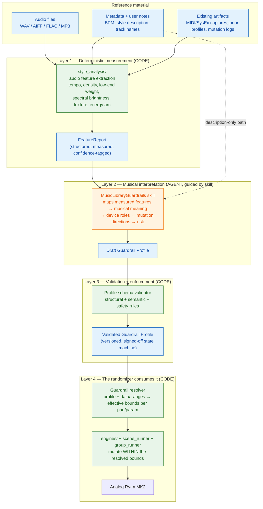
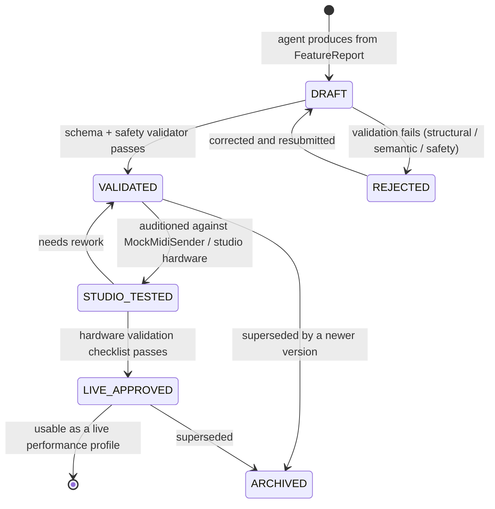
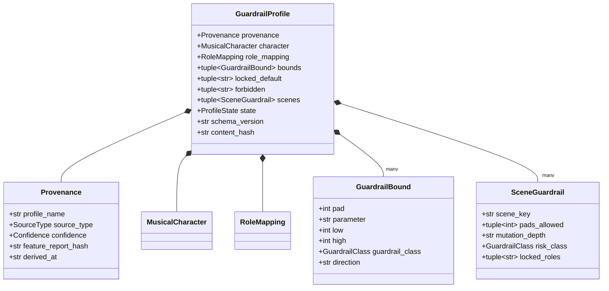
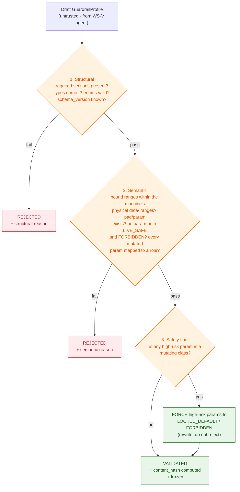
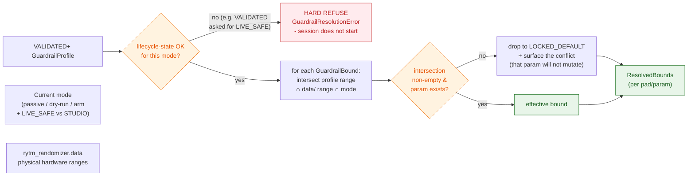

# Design Spec — The Guardrails Intelligence System

**Status:** Design specification — proposal for review. No code is included with this document.
**Relationship to the execution plan:** This spec is the detailed design behind **WS-V** (`EXECUTION_PLAN.md`). WS-V's acceptance criteria are the build checklist; this document is the *what* and *why* behind them.
**Companion docs:** `EXECUTION_PLAN.md` (the 22-workstream migration plan), `CODE_REVIEW_SUGGESTIONS.md` (the review that started it), `WHY_THIS_MATTERS.md` (the rationale).

---

## 1. Why this system exists — the thesis

A randomizer that moves parameters by random amounts is a toy. It produces noise as often as music, and a performer cannot trust it on stage.

**RytmRandomizer's value proposition is that it is an *intelligent* randomizer** — it mutates *within musically-informed boundaries derived from real reference material*. The boundaries are the intelligence. A "rolling hypnotic techno" profile and a "raw peak-time Schranz" profile produce *different, style-appropriate* mutations from the same hardware, because each carries a different set of guardrails: which parameters may move, how far, in which direction, with what risk, on which pads.

That boundary-derivation system — analyze reference material → produce a structured, validated set of mutation guardrails → feed those guardrails into the randomizer engines — **is the platform.** Everything else (the MIDI plumbing, the scene system, the CLI) is delivery mechanism. This spec defines that system.

### Where it is today (the honest baseline)

- The concept exists as **agent prose**: `.claude/skills/MusicLibraryGuardrails/SKILL.md` (~370 lines) and `DataAnalysisGuardrails/` — a repeatable *procedure for Claude* to eyeball a track and hand-write a profile.
- There is a **JSON template** (`Templates/mutation_guardrail_profile_template.json`) — a fill-in shape, no schema, no validator.
- There is **zero code**. No audio analysis, no profile data model, no validation, no wiring into the randomizer. The randomizer engines (`rytm_randomizer/engines/`, `scene_runner.py`, `group_runner.py`) do **not consume guardrail profiles at all** today — they mutate against the static `*_SAFE` / `*_ZONES` / `*_DELTAS` ranges baked into `rytm_randomizer/data/`.
- So the "intelligence" is currently: a human asks Claude, Claude guesses from a description, a human reads the result. It is a manual ritual, not a capability, and it does not actually drive the tool.

**This spec's job:** turn that conceptual framework — which is *good* — into a specified, code-backed, validated, wired-in platform subsystem.

---

## 2. Goals and non-goals

### Goals

1. **A formal Guardrail Profile** — a versioned, schema-validated data contract that *is* the unit of intelligence. Everything produces, validates, stores, or consumes this artifact.
2. **Deterministic measurement** — audio/library features extracted by code, repeatably, not by an LLM reading prose. Same input → same features, every time.
3. **A clear human/agent/code division of labor** — code *measures*, the agent *interprets* musical meaning where judgment genuinely helps, code *validates and enforces*. No step does another's job.
4. **Profiles actually drive the randomizer** — a Guardrail Profile, once active, constrains the real engine mutation ranges. The intelligence reaches the hardware.
5. **Safety is structural** — risk classes, locked/forbidden parameters, and the live-safe boundary are enforced by the type system and validation, not by an agent remembering a rule.
6. **Copyright-safe by design** — reference → discovery, never reference → replica. Enforced by what the profile *can express* (behavioral ranges) vs. cannot (melodies, arrangements, sound-alike patches).
7. **Token-efficient** — the agent receives compact measured summaries, not walls of raw audio prose; skills are lean and load reference detail on demand.

### Non-goals

- **Not** a track cloner, artist emulator, or sample generator. The profile expresses *behavior boundaries*, structurally — it cannot express a copyrighted hook.
- **Not** a real-time audio engine. Analysis is an offline, pre-performance step.
- **Not** a replacement for hardware validation. A profile defines *direction and ranges*; only hardware validation promotes a guardrail to `LIVE_SAFE`.
- **Not** auto-applied. Analyzing reference material *produces* a profile; *activating* it is a deliberate, separate user action.

---

## 3. System overview

**The pipeline in one sentence:** code measures reference material into a `FeatureReport`, the agent interprets that report into a draft Guardrail Profile, code validates the profile against structural + safety rules, and the randomizer engines resolve the validated profile against the hardware's parameter ranges and mutate strictly within the resolved bounds.

The four layers map to four clear ownership boundaries — and three of the four are **code**, which is the whole point: today it is one big agent step.

---

## 4. The core artifact — the Guardrail Profile

The Guardrail Profile is the unit of intelligence. It is the contract every layer agrees on. It must be: **versioned** (schema can evolve), **schema-validated** (structurally and semantically), **immutable once validated** (a frozen artifact), **provenance-carrying** (what it was derived from, at what confidence), and **state-tracked** (draft → validated → studio-tested → live-approved).

### 4.1 Conceptual structure

The existing JSON template is the right starting shape. The spec formalizes it into these sections:

| Section | What it holds | Owner that fills it |
|---|---|---|
| **Provenance** | `profile_name`, `source_type` (SINGLE_TRACK / FOLDER_LIBRARY / REFERENCE_PLAYLIST / USER_RELEASE_LIBRARY / LIVE_RECORDING / FACTORY_SOUND_STUDY / STYLE_DESCRIPTION_ONLY), `confidence` (HIGH / MEDIUM / LOW), source identifiers, derivation date, the `FeatureReport` hash it was built from | Layers 1+2 |
| **Musical character** | `style_tags` (3–8, behavioral not marketing), `bpm_range`, `energy_profile`, `density_profile`, the measured `musical_findings` block (tempo/groove, low-end, percussion density, bass movement, texture, FX space, energy arc) | Layer 1 measures, Layer 2 tags |
| **Role mapping** | Per device (Rytm MK2 pads 1–4 today; pads 5–12 and Analog Four reserved for future), the role and the derived `mutation_direction` for each pad/track | Layer 2 |
| **Guardrail classes** | The risk-tiered mutation bounds — see §5. This is the heart of the profile. | Layer 2 proposes, Layer 3 validates |
| **Locked / forbidden** | Explicit `locked_default` and `forbidden` parameter lists with reasons | Layer 2 + Layer 3 (safety floor is non-negotiable) |
| **Scene guardrails** | Per-scene behavior: which pads/scopes it may touch, mutation depth, risk class, locked roles, anchor-return behavior | Layer 2 |
| **Validation state** | The profile's lifecycle state (§4.3) + the hardware validation checklist and its results | Layer 3 + human |

### 4.2 Why it is a typed, validated artifact and not "some JSON"

The current template is a JSON file with empty strings. That cannot be the intelligence layer because nothing stops it from being *wrong* — a profile that says "mutate kick volume ±40" or "FORBIDDEN: filter cutoff" would sail straight through. The spec requires:

- **A schema** (`rytm_randomizer/guardrails/schema.py` — frozen dataclasses, the house style) — every field typed, every enum closed.
- **A validator** that enforces, in code:
  - **Structural** — required sections present, types correct, enums valid.
  - **Semantic** — ranges are within the hardware's physical bounds (cross-checked against `rytm_randomizer/data/`'s `*_SAFE`/`*_ZONES`); a parameter cannot be both `LIVE_SAFE` and `FORBIDDEN`; every musical feature that claims a mutation must map to a device role first.
  - **Safety floor** — the high-risk parameter set (volume, clock, transport, pattern/program/project change, kit save/clear — see §5.3) is *forced* to `LOCKED_DEFAULT` or `FORBIDDEN` regardless of what the draft says. The agent cannot author an unsafe profile; the validator won't let it.
- **Immutability** — once validated, the profile is a frozen artifact with a content hash. Changing it means deriving a new version.

### 4.3 Profile lifecycle (a state machine)

A profile is not "done" when written — it is *promoted* through validated states. This mirrors the project's existing "analysis is not implementation" rule and the state-machine discipline already in the codebase.

Only a `LIVE_APPROVED` profile may supply `LIVE_SAFE` bounds to a performance. A `VALIDATED` profile can drive `STUDIO_DISCOVERY` mutation. The state is part of the artifact and is checked at consumption time — the randomizer refuses to run a profile in a mode its state doesn't permit.

---

## 5. The guardrail model — risk classes and bounds

This is the part the existing skill already gets *conceptually* right. The spec's contribution is making it a *typed, enforced contract*.

### 5.1 The five guardrail classes

Every mutation bound in a profile carries exactly one class (closed enum):

| Class | Meaning | Consumable in |
|---|---|---|
| `LIVE_SAFE` | Modest range, no volume spikes, no destructive changes, stable low-end, anchor-return available | Performance — but only from a `LIVE_APPROVED` profile |
| `STUDIO_DISCOVERY` | Wider ranges, more surprise, possible instability — audition before performance | Studio mode, from a `VALIDATED`+ profile |
| `EXPERIMENTAL` | High movement, strong timbral change, possible harshness — needs manual review | Studio mode, explicit opt-in |
| `LOCKED_DEFAULT` | Not mutated unless the user explicitly unlocks it | Never auto-mutated |
| `FORBIDDEN` | Must not be mutated by this tool, ever | Never — validator rejects any profile that tries to mutate it |

### 5.2 The per-parameter risk tiers (the safety floor)

Independently of the guardrail *class* a profile assigns, every hardware parameter has an intrinsic **risk tier** that the validator enforces as a floor:

- **Low risk** — filter cutoff (in role-safe range), decay (role-safe), noise level on percussion/accent roles, FX send on pad/accent roles, safe LFO depth. A profile may place these in any class up to `STUDIO_DISCOVERY`/`EXPERIMENTAL`.
- **Medium risk** — resonance, overdrive, oscillator tune, filter type, delay/reverb send, LFO speed/destination, envelope attack/release. A profile may use these but the validator constrains the ranges and flags wide settings.
- **High risk** — track/master volume, clock, transport, pattern/program/project change, kit save/clear, extreme oscillator tuning, unvalidated SysEx, live machine switching. **The validator forces these to `LOCKED_DEFAULT` or `FORBIDDEN`.** No profile, no matter what the agent drafts, can put a high-risk parameter into a mutating class.

This is the structural safety guarantee: **the intelligence layer cannot author something that endangers the performance or the hardware**, because the validator is code and the risk tiers are not negotiable.

### 5.3 Per-role guardrails

Bounds are organized by *musical role*, not raw parameter — because "what's safe" depends on what the pad *is*. The spec carries the existing skill's role model as the typed default set:

- **Kick / low-end foundation** (Pad 1) — protect pitch, volume, decay-from-extremes; avoid reverb/delay wash, high-resonance spikes, sudden HP filtering; mutate filter/tone modestly.
- **Snare / secondary percussion** (Pad 2) — allow snap/noise/body and controlled decay variation, moderate filter movement; avoid volume/FX spikes.
- **Bass / synth-percussion** (Pad 3) — protect root/pitch center; allow controlled filter motion, moderate timbre changes, safe-destination LFO; avoid wide pitch LFO live.
- **Body / impact / accent** (Pad 4) — allow body and accent variation; the widest of the four, but level-safe.
- **(Future) hats / cymbals, pad / drone, FX / noise** — role defaults reserved for Pads 5–12 and Analog Four expansion.

A profile's role mapping *tightens or loosens within* these defaults based on the reference; it cannot *escape* the role's risk tier.

### 5.4 How a profile actually constrains the randomizer (Layer 4)

This is the missing link today — the engines don't consume profiles at all. The spec defines the **guardrail resolver** (`rytm_randomizer/guardrails/resolver.py`):

> **Input:** a validated Guardrail Profile + the static hardware ranges in `rytm_randomizer/data/` (`*_SAFE`, `*_ZONES`, `*_DELTAS` per machine).
> **Output:** the *effective mutation bounds* for each pad/parameter for the current mode — the **intersection** of (what the hardware physically allows) ∩ (what the profile's guardrail class permits) ∩ (what the current mode, e.g. `LIVE_SAFE`, allows).
> **Guarantee:** the engines (`engines/pad1-4.py`, `scene_runner.py`, `group_runner.py`) mutate strictly within the resolved bounds. The profile narrows; it can never widen past the hardware-safe `data/` ranges.

So the data flow is: `data/` defines the *physical* envelope → the profile defines the *musical/style* envelope → the resolver intersects them → the engine mutates inside the result. Today only the first and last steps exist; the spec adds the middle two.

---

## 6. Layer 1 — deterministic measurement (code)

**Module:** `rytm_randomizer/style_analysis/` (WS-V Half 2).

The current skill has *Claude* estimate "kick density: high, low-end weight: heavy" from listening or from a description. That is imprecise, unrepeatable, and token-expensive. Layer 1 replaces the *measurement* with code.

### 6.1 What it measures

From audio files, using an audio-analysis library (`librosa` or equivalent — declared as an optional `[project.optional-dependencies] style` extra so the core install stays lean):

- **Tempo** — BPM and tempo stability.
- **Rhythmic density** — kick density, percussion density, onset rate.
- **Low-end** — sub/low-frequency energy weight.
- **Spectral character** — brightness (spectral centroid), texture/noise amount, midrange pressure.
- **Dynamics / arc** — energy curve over the track, intensity, repetition vs. variation.

Output: a **`FeatureReport`** — a structured, typed, confidence-tagged measurement artifact. Same audio in → same `FeatureReport` out, deterministically. It carries a content hash so the profile derived from it can reference exactly which measurement it came from.

### 6.2 The three input paths and their confidence

The system must handle three input qualities, and **confidence is a first-class field** on every output:

- **Audio available** → full deterministic extraction → `confidence: HIGH`.
- **Partial audio + user notes** → extraction on what exists, agent fills gaps from notes → `confidence: MEDIUM`.
- **Description only** (no audio) → no measurement possible; the agent works from the description alone → `confidence: LOW`, and the profile is explicitly marked **description-based, not audio-measured**.

A `LOW`-confidence profile can still be useful (it captures intent) but the validator and the resolver treat it conservatively — e.g. it cannot reach `LIVE_APPROVED` without hardware validation doing the verification the audio would have.

---

## 7. Layer 2 — musical interpretation (agent, guided by the skill)

**Skill:** the restructured `MusicLibraryGuardrails` skill (WS-V Half 1).

This is the one layer where an LLM genuinely adds value: turning *measured features* into *musical meaning and mutation intent*. "Spectral centroid is low, onset rate is moderate, sub-energy is heavy, tempo is rock-steady" → *"this is rolling, hypnotic, dark; kick should stay anchored, bass gets subtle filter motion, avoid large tuning jumps, gradual scene transitions."* That mapping is judgment, and it's worth an agent.

### 7.1 What the agent receives and produces

- **Receives:** the compact `FeatureReport` from Layer 1 (not raw audio, not a wall of prose) — *this is the token optimization*. On the description-only path, it receives the user's description.
- **Produces:** a **draft Guardrail Profile** — style tags, role mapping, mutation directions, proposed guardrail classes, proposed scene behaviors.
- **Does NOT:** measure (Layer 1 did), validate (Layer 3 will), or decide safety (the risk tiers are a floor it cannot lower).

### 7.2 Skill restructure for token efficiency

The current `SKILL.md` is ~370 lines loaded *in full* on every trigger. The spec (per WS-V) requires:
- A tight **~40-line `SKILL.md`** — the procedure and decision tree only.
- The exhaustive material (the feature checklists, the per-style mutation examples, the role-behavior tables, the output template) moves to a **`reference.md`** the agent reads *only when actually running an analysis*.
- A precise, trigger-tuned `description` frontmatter so the skill **auto-invokes** when the user asks to analyze music (wired via WS-T's `.claude/rules/skill-routing.md`).

Net: the eager per-trigger token cost drops sharply; the full detail is still there, loaded on demand.

### 7.3 Copyright-safety, structurally enforced

The existing skill states the reference-not-replica rule in prose. The spec makes it *structural*: the Guardrail Profile schema **can only express behavioral boundaries** — ranges, classes, directions, risk. It has **no field for a melody, an arrangement map, a copyrighted hook, or a sound-alike patch**. The agent literally cannot output a replica through this contract, because the contract has nowhere to put one. Reference → discovery is enforced by the shape of the artifact, not by the agent's goodwill.

---

## 8. Layer 3 — validation and enforcement (code)

**Module:** `rytm_randomizer/guardrails/` — `schema.py` (the typed model), `validation.py` (the validator), `store.py` (profile persistence + lifecycle state).

Already specified in §4.2 and §5.2. The key principle restated: **the draft from Layer 2 is untrusted.** It is an LLM's proposal. Layer 3 is the gate that turns a proposal into a usable artifact — structural check, semantic check against real hardware ranges, and the non-negotiable safety floor. A draft that violates any of these is `REJECTED` with a specific reason, not silently accepted.

This layer is also where the **profile store** lives — profiles are versioned, persisted (likely JSON-on-disk under a user profiles directory, schema-version-stamped), and lifecycle-state-tracked. A user builds a *library* of profiles over time ("my rolling set", "peak-time", "the warm-up profile") and the store manages them.

---

## 9. Layer 4 — consumption (code)

**Module:** `rytm_randomizer/guardrails/resolver.py`, consumed by the engines.

Specified in §5.4. The acceptance test for this layer: with no profile active, the randomizer behaves exactly as today (mutates against `data/`'s static ranges — full backward compatibility). With a profile active, *the same command produces mutations constrained to the resolved bounds* — and a different profile produces *different, style-appropriate* mutations from the identical command. That observable difference **is** the intelligence, made real.

---

## 10. How this maps to the execution plan

**The four-layer system is split across two workstreams** (decided 2026-05-14, via the brainstorming process). The split seam is the **Guardrail Profile contract** (`guardrails/schema.py`): WS-V *produces* a draft Profile conforming to that schema; WS-W *validates and consumes* it. That schema is the entire interface between the two — clean, well-bounded, each workstream gets its own spec→plan→build cycle.

| Spec layer | Workstream | Notes |
|---|---|---|
| The `data/` ranges the resolver intersects against | **WS-F** (done) | `*_SAFE`/`*_ZONES`/`*_DELTAS` shared data layer already exists |
| Engines that will consume resolved bounds | **WS-M, WS-N** (done) | `engines/`, `scene_runner`, `group_runner` exist and are parity-tested |
| **Layer 1** — `style_analysis/` deterministic audio-feature extraction | **WS-V** (style analysis) | `librosa` as an optional `style` extra; produces the `FeatureReport` |
| **Layer 2** — restructured, token-lean, auto-invoked interpretation skill | **WS-V** (style analysis) | tight `SKILL.md` + on-demand `reference.md` + `skill-routing.md` entry (WS-T); produces the draft Guardrail Profile |
| **Layer 3** — `guardrails/schema.py` + `validation.py` + `store.py` | **WS-W** (guardrails engine) | the typed Profile contract, the three-layer validator, the JSON-file profile store + lifecycle state machine |
| **Layer 4** — `guardrails/resolver.py` + engine wiring | **WS-W** (guardrails engine) | the missing link — the resolver intersects profile ∩ `data/` ∩ mode; the engines gain an optional `resolved_bounds` parameter |
| Observability of the analysis + validation pipeline | **WS-U** | the analysis, validation, and resolution steps log through the unified observability layer; `GuardrailResolutionError` lives in WS-U's error taxonomy |
| Architecture conformance (profile is data, layering, import-direction) | **WS-T** | `tests/architecture/` enforces the `guardrails/` and `style_analysis/` package boundaries |

**WS-V — style analysis (Layers 1–2).** Owns audio measurement and the interpretation skill. Its deliverable is a *draft* Guardrail Profile (a `guardrails/schema.py` object). WS-V imports `schema` from WS-W and nothing else of WS-W. Detailed in `EXECUTION_PLAN.md`.

**WS-W — guardrails engine (Layers 3–4).** Owns the typed Profile contract, the validator, the profile store, the resolver, and the engine wiring. This is the code-heavy subsystem that turns a draft into a *validated, enforced, consumed* artifact. Sections 11–14 below are WS-W's detailed design (the output of the brainstorming process).

The dependency order: WS-W's `schema.py` can be built first (it is a leaf — no dependencies); WS-V then builds against it; WS-W's `validation`/`store`/`resolver` and the engine wiring complete the loop. In the `EXECUTION_PLAN.md` Wave 4 chain, WS-V precedes WS-W (style analysis produces what the guardrails engine consumes), but `schema.py` is the shared contract both are written against.

---

## 11. Verification — how we know the intelligence works

- **Layer 1** — deterministic-extraction tests on known fixture audio (or synthetic signals with known properties): the same input always yields the same `FeatureReport`; the measured values are correct (a 128-BPM loop measures 128 BPM; a bright signal measures high centroid).
- **Layer 2** — the skill is exercised against sample `FeatureReport`s; the drafts it produces are well-formed inputs to Layer 3. (The agent's *musical judgment* is not unit-testable, but the *shape and validity* of its output is.)
- **Layer 3** — validator tests: a good profile validates; a profile with a high-risk parameter in a mutating class is `REJECTED`; a profile with ranges outside the hardware envelope is `REJECTED`; the lifecycle state machine only permits legal transitions.
- **Layer 4** — the decisive test: **the same randomizer command, run with profile A vs. profile B vs. no profile, produces three different but each-within-bounds mutation sequences** (asserted via `MockMidiSender` — exactly the parity-test pattern Wave 4 already uses). This is the proof that the profile is steering the tool.
- **End-to-end** — a reference track → `FeatureReport` → draft profile → validated profile → resolved bounds → a mutation sequence that is demonstrably style-appropriate and stays inside every guardrail. Run in CI against fixtures; confirmed once on hardware by the owner (per `MANUAL_HARDWARE_VALIDATION.md`).

---

## 12. Summary

The guardrails system is what makes RytmRandomizer *intelligent* rather than *random*. Today it is a good idea expressed as agent prose with no code behind it and no connection to the actual randomizer. This spec defines it as a real four-layer subsystem:

1. **Code measures** reference material — deterministically, repeatably.
2. **The agent interprets** the measurements into musical mutation intent — the one place judgment is worth an LLM.
3. **Code validates** the result — structural, semantic, and a non-negotiable safety floor; the intelligence layer *cannot* author something unsafe.
4. **Code consumes** the validated profile — the resolver intersects it with the hardware ranges, and the engines mutate strictly within the result.

The Guardrail Profile — versioned, typed, validated, lifecycle-tracked — is the artifact that ties all four together. It is the unit of the platform's intelligence, and it is copyright-safe by construction because it can only express *behavior boundaries*, never a replica.

---

# Part B — WS-W Detailed Design (Layers 3–4: the guardrails engine)

Sections 13–16 are the detailed design for **WS-W**, produced through the brainstorming process and approved section-by-section. They define the code-heavy half of the system: the typed Profile contract, the validator, the profile store, the resolver, and the engine wiring.

## 13. WS-W Components & boundaries

Four new modules under a `rytm_randomizer/guardrails/` package, each with one clear purpose:

| Module | Purpose | Depends on |
|---|---|---|
| `guardrails/schema.py` | The typed Guardrail Profile model — frozen dataclasses, closed enums (`GuardrailClass`, `RiskTier`, `SourceType`, `Confidence`, `ProfileState`). The data contract WS-V produces and WS-W validates. | nothing (leaf) |
| `guardrails/validation.py` | The validator — structural + semantic (cross-checked against `data/`'s real hardware ranges) + the non-negotiable safety floor. Turns an untrusted draft into a `VALIDATED` artifact or a `REJECTED` one with a specific reason. | `schema`, `rytm_randomizer.data` |
| `guardrails/store.py` | Profile persistence — JSON files under a user profiles directory, schema-version-stamped, lifecycle-state-tracked. List / load / save / promote-state. | `schema`, `validation` |
| `guardrails/resolver.py` | Intersects (profile guardrails) ∩ (hardware `data/` ranges) ∩ (current mode) → effective per-pad/param bounds. Per-parameter fail-loud (drops to `LOCKED_DEFAULT`, surfaces the conflict); hard-refuses lifecycle-state mismatches. | `schema`, `rytm_randomizer.data` |

**The seam with WS-V:** WS-V produces a draft Profile object conforming to `guardrails/schema.py`. That is the entire interface between the two workstreams — WS-V imports `schema`, nothing else of WS-W.

**The seam with the engines:** `engines/pad1-4.py`, `scene_runner.py`, `group_runner.py` gain an *optional* resolved-bounds parameter. No profile active → they use `data/`'s static ranges exactly as today (full backward compatibility — the existing parity tests stay green). Profile active → they mutate within the resolver's output. The engines depend on `resolver`'s *output type*, not the resolver itself.

## 14. WS-W The Guardrail Profile data model (`schema.py`)

The existing JSON template gives the shape; `schema.py` makes it typed and closed.

**Key design decisions:**

- **Everything frozen.** `@dataclass(frozen=True)`, `MappingProxyType` for nested maps, `tuple` not `list` — matches the established house style (`mock_midi.py`, `state/`). A validated profile is immutable; a change means a new version.
- **Closed enums** — `GuardrailClass` (LIVE_SAFE / STUDIO_DISCOVERY / EXPERIMENTAL / LOCKED_DEFAULT / FORBIDDEN), `RiskTier` (low / medium / high), `SourceType` (the 7 from the skill), `Confidence` (HIGH / MEDIUM / LOW), `ProfileState` (DRAFT / VALIDATED / REJECTED / STUDIO_TESTED / LIVE_APPROVED / ARCHIVED). No free-text where a choice belongs.
- **`GuardrailBound` is the atom** — one pad + one parameter + a range + a class + a direction. A profile is fundamentally *a set of these*. The resolver works bound-by-bound (which is why per-parameter fail-loud is natural — it drops one `GuardrailBound`, not the profile).
- **`content_hash` + `schema_version`** on every profile — so the store can detect tampering, the resolver can confirm what it is running, and schema evolution is survivable.
- **`feature_report_hash`** in provenance — ties the profile to exactly the WS-V `FeatureReport` it was derived from. Full traceability: profile → measurement → source audio.
- **No field for a melody, arrangement, or patch.** The copyright-safety guarantee is structural — the schema simply has nowhere to put a replica.

## 15. WS-W Validation rules & the safety floor (`validation.py`)

`validation.py` turns an untrusted draft into `VALIDATED` or `REJECTED` with a specific reason. Three rule layers, run in order, short-circuiting on first failure:

**The three layers:**

1. **Structural** — required sections present, field types correct, every enum value valid, `schema_version` is one the validator understands. A malformed draft is `REJECTED` here. Cheap; runs first.
2. **Semantic** — the draft is well-formed but could still be *wrong*:
   - Every `GuardrailBound`'s `[low, high]` must fit inside that machine's physical range from `rytm_randomizer/data/` (e.g. a Pad-1 BD Hard filter bound must be within `BD_HARD_SAFE` / the param's hardware range). A bound outside it → `REJECTED` naming the param.
   - The `pad` + `parameter` must actually exist on the target machine.
   - No parameter can appear in both a mutating class and `forbidden`.
   - Every parameter that has a `GuardrailBound` must have a role in `role_mapping` first (the skill's "map to role before deriving ranges" rule, now enforced).
3. **Safety floor** — the non-negotiable part, and it **rewrites rather than rejects**: if the draft puts a *high-risk* parameter (track/master volume, clock, transport, pattern/program/project change, kit save/clear, extreme tuning, unvalidated SysEx, live machine switching) into any mutating class, the validator **forces it to `LOCKED_DEFAULT`** (or `FORBIDDEN` for the truly destructive set) and records that it did so. The agent *cannot* author an unsafe profile — not because it gets rejected, but because the unsafe part gets neutralized. The profile still validates; it has just been made safe.

**Why rewrite, not reject, for the safety floor:** an agent draft that is 95% good but put one risky param in `STUDIO_DISCOVERY` should not be thrown away — the *intent* is fine, the *safety* just needs enforcing. Rejecting would waste the whole analysis; rewriting keeps the good 95% and guarantees the safe 100%. The rewrite is logged (WS-U observability) so it is never silent.

**Output:** a `VALIDATED` (frozen, content-hashed) profile, or a `REJECTED` one carrying the specific structural/semantic reason so WS-V's agent loop can correct and resubmit.

## 16. WS-W The resolver, engine wiring & testing

### The resolver (`resolver.py`)

- **Two failure modes** (decided 2026-05-14): lifecycle-state mismatch → **hard refuse** (`GuardrailResolutionError`, session does not start — it is a state violation, not a range conflict). Range/param conflict → **per-bound drop to `LOCKED_DEFAULT`** + surface the conflict (that knob just does not move; the session runs with everything resolvable).
- **Output:** a `ResolvedBounds` value object — the effective `[low, high]` per pad/param for *this* profile in *this* mode. It is an intersection; it can only ever be *narrower* than `data/`, never wider.

### Engine wiring

`engines/pad1-4.py`, `scene_runner.py`, `group_runner.py` each gain an **optional `resolved_bounds` parameter**:
- **Omitted (no profile active)** → engines use `data/`'s static ranges exactly as today. The existing parity tests stay green untouched — full backward compatibility.
- **Provided** → the engine clamps its mutation to `resolved_bounds`. Same command, profile-constrained output.

The engines depend on the `ResolvedBounds` *type*, not on `resolver` — clean dependency direction (WS-T's architecture tests enforce this).

### Testing — the decisive proof

- **`schema`** — construction, immutability, enum-closure tests.
- **`validation`** — a good draft validates; a bound outside `data/` range → `REJECTED` with the right reason; a high-risk param in a mutating class → validated-but-rewritten-to-`LOCKED_DEFAULT`; structural garbage → `REJECTED`.
- **`store`** — round-trip a profile through JSON; lifecycle state machine permits only legal transitions; schema-version stamping survives.
- **`resolver`** — empty intersection drops that bound to `LOCKED_DEFAULT`; lifecycle mismatch hard-refuses; resolved bounds are always ⊆ `data/` ranges.
- **The decisive end-to-end test** — *the same randomizer command, run with profile A vs. profile B vs. no profile, produces three different but each-within-bounds MIDI sequences* (asserted via `MockMidiSender`, the Wave-4 parity-test pattern). **This test passing is the proof the intelligence is real** — that a profile genuinely steers the tool.
- All new modules at **100% branch coverage** (the ratchet); `tests/architecture/` gets guardrails-package import-direction rules (WS-T).

Build this, and "how does it learn my style" has a real answer: it measures your reference material, interprets it into guardrails, validates them for safety, and mutates your hardware inside them — and a "rolling hypnotic" profile and a "raw peak-time" profile genuinely make the same machine behave like two different instruments.
