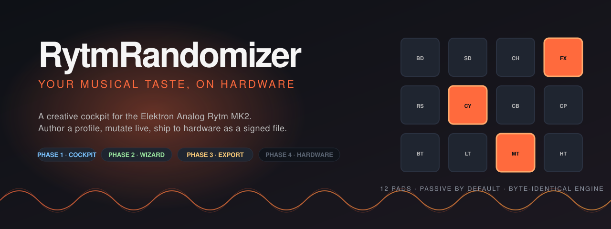
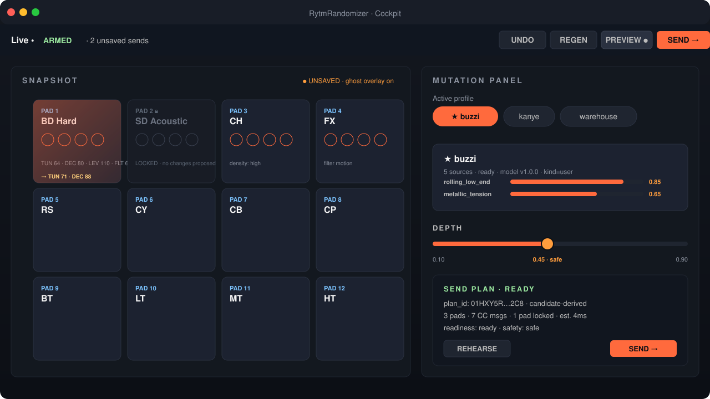
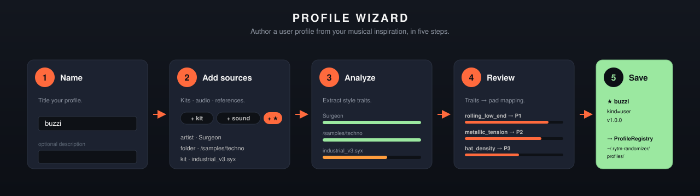
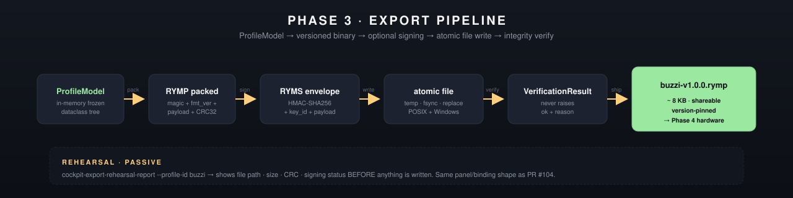
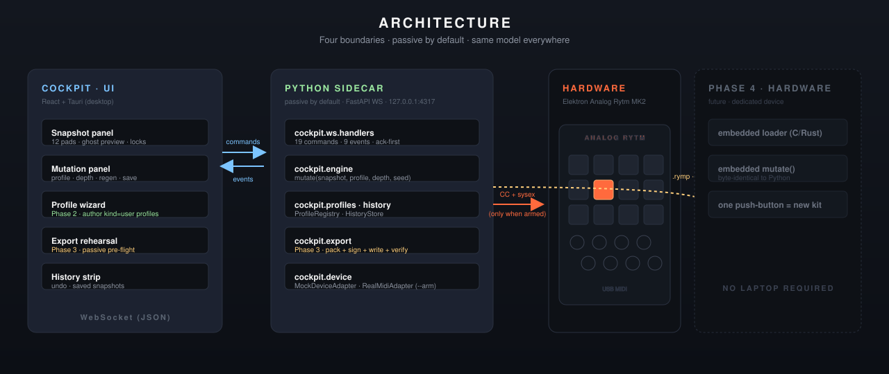

<div align="center">



# RytmRandomizer

**A live-but-passive performance cockpit for the Elektron Analog Rytm MK2 and Analog Four MK2.**
**Double-click to launch · see your devices immediately · nothing transmits until you arm.**

[](LICENSE)
[](pyproject.toml)
[](#testing)
[](docs/ACCESSIBILITY.md)
[](#cockpit)
[](#profile-wizard)
[](#export-pipeline)
[](#roadmap)

</div>

---

## What is it?

You own an Elektron drum machine and a musical taste — a sound you keep chasing when you sit in front of the hardware. RytmRandomizer is the desktop companion that bridges the two, built around one trust rule: **it listens freely, and it never transmits a byte until you explicitly arm it.**

What the app actually does today:

- **Double-click launch.** The desktop app bundles its own Python sidecar — no terminal, no interpreter setup. On launch it enumerates MIDI ports and opens **inputs only**, so you know within seconds whether your Analog Rytm MK2 or Analog Four MK2 is connected (`disconnected → searching → listening`). Passive listening never interrupts the device's sound output.
- **Explicit in-UI arm for every send.** Cockpit outbound MIDI routes through a single ArmedApply seam behind an arm toggle + per-action confirmation, and arming never survives a reconnect. Writes to **saved** kits and sounds are refused outright — there is no capture-before-write or restore path yet, so the app will not make a change it cannot undo. Only live-dial CC/NRPN into working memory is transmitted; reload the kit on the device to revert it.
- **Live MIDI monitor.** A Protokol-grade passive monitor with timestamps, decoded parameter names, and category/channel/pad filters — see exactly what your devices are saying at all times.
- **Connection Doctor.** When something is wrong (no ports, driver hints, wedged backend), a diagnostics panel and error journal tell you what and why, instead of a silent dead UI. The sidecar also serves a `GET /health` endpoint.
- **Sound library.** Capture kits from the device (input-only receive), then browse, tag, and search them locally. Captures are archived on your disk; there is no restore-to-device path, because writing a saved kit back is exactly the operation the safety model refuses today.
- **Kit morphing + scoped randomization.** Morph between your current kit and a target per track/page with a depth macro, and scope randomization with masks + intensity anchored on the kit you are actually playing. Both are pure, deterministic, and pinned byte-identical across languages.
- **Profile authoring + signed export.** Learn a style profile from your music (the [wizard](#profile-wizard)), mutate live against it, and ship it as a tiny signed `.rymp` file (the [export pipeline](#export-pipeline)).
- **Accessible by gate, not by afterthought.** Every cockpit route passes a WCAG 2.2 AA axe audit in CI with zero violations. See the [accessibility statement](docs/ACCESSIBILITY.md).

## Safety model — Live-but-Passive

The full rule lives in [`.claude/rules/live-but-passive-midi.md`](.claude/rules/live-but-passive-midi.md) and is mechanically enforced by architecture tests. In short:

| | Inputs (listening) | Outputs (transmitting) |
|---|---|---|
| **When** | Immediately on launch | Only after an explicit in-UI arm + per-action confirmation |
| **Gate** | None — passive listening is the connection-health signal | The `senders/` ArmedApply seam — the only transmit path for the cockpit |
| **After reconnect** | Resumes automatically | Never auto-re-arms |
| **Saved kit / sound writes** | — | **Refused.** No capture-before-write or restore exists, so persistent writes are blocked rather than "backed up" |
| **What does transmit** | — | Live-dial CC/NRPN into working memory only; undo by reloading the kit on the device |

The legacy V1.34 terminal entry points (`app.py`, `shell.py`) predate the seam
and still open their own output ports behind the CLI's `--arm` flag. They are
exempt only via the named, shrinking allowlist in
`tests/architecture/test_armed_entry_points.py`, and folding them into the seam
is tracked work — so "the only transmit path" is a statement about the cockpit,
not yet about the whole repository.

---

<a id="cockpit"></a>
## The Cockpit

<div align="center">

</div>

A Tauri desktop window backed by a bundled Python sidecar that hosts the mutation engine, connection manager, snapshot history, profile registry, sound library, and diagnostics.

| Surface | What it does |
|---|---|
| **Connection pill + device rail** | Live connection state per detected device; switch between the Analog Rytm MK2 12-pad surface and the Analog Four MK2 four-track review surface. |
| **Arm control** | The explicit gate between listening and transmitting. Disarmed is the default and the app returns to it on every reconnect. |
| **Snapshot panel** | All 12 pads at a glance, with a ghost overlay showing what the next mutation would change. Lock any pad to protect it. |
| **Mutation panel** | Pick a profile, set depth, regen on demand. Every change is deterministic for a given (snapshot, profile, depth, seed). |
| **Morph + scope** | Interpolate current ↔ target kit per track/page, and mask/intensity-scope randomization around the captured kit. |
| **Live MIDI monitor** | Passive decoded stream of everything the devices send — parameter names, channels, pads, pause/clear/copy. |
| **Connection Doctor** | Driver hints, error journal, and health status when the connection is not what you expect. |
| **Sound library** | Browse, tag, and search captured kits; restore-to-device is an armed action with explicit direction-of-sync UI. |
| **History strip** | Saved + auto snapshots. Undo any move. Jump to any past snapshot. |
| **SEND-plan readiness** | The cockpit refuses to fire SEND until the server confirms the plan is ready; stale plans clear automatically. |

Every new panel is schema-driven: a Python `PanelSpec` builder feeds the generated TypeScript protocol (`desktop/web/src/types/live_gui_protocol.ts` is generated from the Python TypedDicts, never hand-edited), and one generic renderer draws it. Adding an operator surface is a registry entry, not a bespoke React component.

**Sidecar security guarantees:** per-launch HMAC handshake token (`secrets.token_urlsafe(32)`, compared with `hmac.compare_digest`), pinned WebSocket subprotocol (`rytm-rand-cockpit-v1`), per-message size cap, and a wizard-source path allow-list — all pinned by architecture tests.

For the dev-loop launch (two-terminal split) see [`docs/COCKPIT_QUICKSTART.md`](docs/COCKPIT_QUICKSTART.md).

---

<a id="profile-wizard"></a>
## The Profile Wizard

<div align="center">

</div>

Click **"+ Create profile…"** in the cockpit and walk through five steps to author a `kind="user"` profile from whatever inspires you:

- **Kits** — SysEx dumps from your library
- **Sounds** — folders of `.wav` / `.aif` / `.flac` samples
- **Songs / albums** — audio files run through the `style_analysis/` extractor
- **Artists** — names looked up against a curated reference table
- **Folders** — point at a directory and the wizard does the right thing per file

Each source is analyzed, the derived `StyleTrait`s are averaged, and the wizard maps them onto pads via a tunable `TRAIT_TO_PAD` table. Hit **Save** and the new profile lands in `~/.rytm-randomizer/profiles/` — the cockpit's profile chips pick it up automatically.

The wizard is passive — it never opens a MIDI output and never sends MIDI.

---

<a id="export-pipeline"></a>
## Export Pipeline

<div align="center">

</div>

A profile in the cockpit is one thing. A **deployable artifact** is another. The export pipeline turns the in-memory `ProfileModel` into a tiny, self-describing, signed file:

```bash
rytm-randomizer cockpit-export-profile-model \
    --profile-id buzzi \
    --output ~/exports/buzzi-v1.0.0.rymp \
    --key-hex $RYMP_SIGNING_KEY --key-id buzzi-2026
```

1. **`pack`** the `ProfileModel` to MessagePack with a 4-byte magic (`RYMP`), versioned header, payload length, CRC32.
2. **`sign`** with HMAC-SHA256 (stdlib only — no crypto library dep). Wrap in a `RYMS` envelope carrying the algorithm, key id, and 32-byte signature.
3. **`write`** atomically: sibling temp file → complete write + file `fsync` → platform-native atomic publication (`os.replace` for overwrite, Windows `os.rename` / POSIX `os.link` for no-overwrite). **No partial files ever land on disk.** Parent-directory persistence after sudden power loss remains filesystem-dependent.
4. **`verify`** the bytes that were just written. The verifier never raises; it returns a `VerificationResult` with `ok` + a `reason` from a finite set.

Rehearse before you ship: the passive `cockpit-export-rehearsal-report` shows exactly what file would land — path, payload size, format version, CRC, signing status — without writing anything. See [`docs/COCKPIT_QUICKSTART.md`](docs/COCKPIT_QUICKSTART.md) §5c for the operator walkthrough.

---

## Architecture

<div align="center">

</div>

Four boundaries. The same `ProfileModel` shape lives in three of them: the cockpit's in-memory tree, the exported `.rymp` binary, and (eventually) the embedded hardware loader. Same model → same mutation output across Python and embedded C.

Invariants the codebase actively defends with mechanical architecture tests:

- **Live-but-Passive.** Inputs open freely; every transmit routes through the ArmedApply seam. A repo-root perimeter test bans `mido`/`rtmidi` imports outside three boundary modules, repo-wide; an armed-entry-point test whitelists the only modules allowed to construct real output ports.
- **V1.34 parity is byte-frozen.** The reference mutation engine's behaviour is captured as 505 golden JSON files under `tests/fixtures/v134_parity/`, asserted byte-for-byte as 685 parametrized test items on every PR.
- **The mutation engine is deterministic.** Same `(snapshot, profile, depth, seed)` → same `MutationCandidate`. Always.
- **The passive CLI stays passive.** A subprocess-driven sweep ([`tests/test_real_midi_passive_cli_safety.py`](tests/test_real_midi_passive_cli_safety.py)) auto-discovers every CLI command and asserts no MIDI backend loads; a full-stdout golden net pins each passive command's output byte-for-byte.
- **The UI protocol is generated, not hand-synced.** The TypeScript wire types are generated from the Python TypedDicts, so frontend and sidecar cannot drift silently.

See [`docs/ARCHITECTURE.md`](docs/ARCHITECTURE.md) for the long form and [`docs/ARCHITECTURE_DIAGRAMS.md`](docs/ARCHITECTURE_DIAGRAMS.md) for the diagrams.

---

## Accessibility

The cockpit targets **WCAG 2.2 AA** and enforces it in CI: an axe audit runs against every route on every PR and currently reports **zero violations**, backed by 44 dedicated a11y component tests (keyboard-operable sliders with APG semantics, colorblind-safe status — icon + shape + text, never hue alone — centralized aria-live announcements, focus restoration across live re-renders, reduced-motion support, and 200% zoom/reflow checks). The full statement, known Tauri-webview caveats, and the per-release screen-reader smoke protocol live in [`docs/ACCESSIBILITY.md`](docs/ACCESSIBILITY.md).

---

## Use cases

**Live-set sound design.** Three hours into a warehouse set, you need the kit to evolve without losing the bones. The app is already listening to the Rytm; capture the kit you are playing, morph or scope-randomize around it, watch the ghost preview, lock the kick, arm, confirm, send. What goes out is live-dial CC into working memory — your saved kit on the device is untouched, so reloading it is the way back.

**Dual-machine rigs.** If you run an Analog Four MK2 alongside the Rytm, the same surface plans both. Analog Four sends stay candidate/manifest-gated behind their own readiness checks and the same arm boundary.

**Studio profile authoring.** Drop a folder of reference tracks into the wizard, review the trait bars, save as `kind="user"`. You get a deployable model that captures *that sound* — a reference, not a copy.

**Share a sound with a friend.** Export your profile as a `.rymp`. They drop it into `~/.rytm-randomizer/profiles/` and are running mutations against your taste in 60 seconds. CRC32 + HMAC-SHA256 means the file you sent is the file they ran.

**Future: laptop-free performance.** Phase 4's dedicated hardware loads a `.rymp` from flash, runs a C port of the same engine, and emits CC back to the Rytm. One push-button = a new kit, no laptop in the loop.

---

<a id="install"></a>
## Install

### Desktop app (double-click launch)

The Tauri bundle ships with the Python sidecar **bundled**, and prefers it: the shell resolves `RYTM_RAND_SIDECAR_BIN` first, then the bundled binary next to the executable / in the resource dir. Only when no bundled binary is found does it fall back to a `python` on `PATH` — that fallback exists for development (`cargo run` against a source checkout), so a shipped bundle uses its own runtime. Build it locally today (signed installers wait on certificate acquisition; see [`docs/BUILDING_INSTALLERS.md`](docs/BUILDING_INSTALLERS.md) for the per-OS build matrix):

```bash
cd desktop/shell && cargo build --release
```

Launch the produced app: it opens in **listening** mode, shows detected Elektron devices (or an honest empty state + the Connection Doctor), and transmits nothing until you arm.

**Troubleshooting the launch:**

- If the sidecar fails to spawn, the shell shows a native failure dialog with the reason — no silent blank window.
- Port conflict? Set `RYTM_RAND_WS_PORT` to override the sidecar's WebSocket port.
- Suspect the MIDI backend itself (driver crash loops, CI, containers)? `RYTM_RAND_MIDI_BACKEND=off` starts the app with MIDI discovery disabled entirely — the UI runs with an explicit "no backend" state. For development and e2e testing, `RYTM_RAND_MIDI_BACKEND=fake` presents a list-only fake Elektron port (no transmit surface) so device-present flows work with zero hardware.
- Sidecar unreachable? **The cockpit loads anyway** — there is no connection gate. Panels render honest empty states, sidecar-requiring buttons are disabled with a stated reason (never hidden), and a reconnect banner carries the live retry state: attempt counter, next-dial countdown (retries never give up), a Retry-now button, and a connection-help disclosure with the exact WS target and per-OS hints. When the sidecar comes up, the app hydrates in place — no reload. With the sidecar up but no device plugged in, the device rail says so honestly — "No hardware detected — still scanning (every 2 s)" — and everything device-independent (sound library, profiles, wizard, reports, exports) keeps working.

### Dev loop (two terminals)

```bash
pip install -e ".[dev]"

# Terminal 1 — Python sidecar (WebSocket on 127.0.0.1:4317)
python -m rytm_randomizer.cockpit

# Terminal 2 — Tauri shell + web frontend
cd desktop/shell && cargo run
```

See [`docs/COCKPIT_QUICKSTART.md`](docs/COCKPIT_QUICKSTART.md) for prerequisites and the first-profile walkthrough.

### CLI (pip)

```bash
pip install -e .
rytm-randomizer              # passive menu — no output port, no MIDI sent
rytm-randomizer --dry-run    # full interactive logic against a mock sender
rytm-randomizer --arm        # the armed V1.34 four-pad runtime
```

`--arm` and `--dry-run` are mutually exclusive. The armed interactive shells (four-pad V1.34 runtime, all-12-pad style shell, current-kit snapshot shell, Analog Four sends) each require their own explicit `--confirm-*` flag on top of `--arm`; the full armed surface and every session-guardrail command are documented in [`docs/CLI_REFERENCE.md`](docs/CLI_REFERENCE.md).

---

## CLI cheat-sheet

The passive report surface is 100+ registered commands — see [`docs/CLI_REFERENCE.md`](docs/CLI_REFERENCE.md) for every command and its flags. The headline ones:

```bash
# Cockpit + export
python -m rytm_randomizer.cockpit                                     # sidecar
cockpit-export-profile-model --profile-id X --output Y.rymp           # ship a profile
cockpit-export-rehearsal-report --profile-id X                        # passive pre-flight

# Device + snapshot intelligence
dual-machine-target-report rytm | a4 | both                           # safe target surface
rytm-snapshot-intelligence-report KITS.syx --slot N                   # one Rytm kit snapshot
rytm-snapshot-mutation-preview-report KITS.syx --slot N --depth 2     # mock-only preview
rytm-12-pad-machine-matrix-report                                     # pad/machine compatibility
analog-rytm-midi-catalog-report                                       # Analog Rytm MIDI catalog (OS 1.72 CC/NRPN)

# Style + previews
reference-style-blueprint-report --description "rolling warehouse"    # 12-pad + A4 blueprint
dual-machine-style-kit-selection-report STYLE --rytm KITS --analog-four KITS
scoped-randomization-preview                                          # mask + depth plan preview
kit-morph-preview                                                     # current↔target morph preview

# Analog Four patch pipeline (hardware-validated writers; sends stay armed-only)
analog-four-saved-kit-export --source KIT.syx --output OUT.syx --filter2-resonance 1:64
analog-four-audio-patch-batch --audio REF.wav --source-kit KIT.syx --output-dir batch/
analog-four-audio-patch-batch --audio REF.wav --source-kit KIT.syx --output-dir batch/ --studio-handoff --a4-output-port "<exact A4 output>"
analog-four-audio-patch-rank --reference REF.wav --manifest batch.json --render 1=take1.wav

# AL16 Analog Rytm offline audit proof (no MIDI; current AL02 build is blocked)
al16-rytm-kit-export --reference output/local/reference/RYTM_Test1_Init_Kit.syx --recipe specs/al16/AL02_LOCK_RYTM.yaml --destination-slot 127 --output output/local/al16/AL02_LOCK_RYTM.syx
```

The AL16 command is currently an offline audit/evidence compiler, not a
positive kit writer or hardware sender. Keep the operator-local initialized
reference under the gitignored `output/local/reference/` subtree. Phase R1
accepts only `output/local/reference/RYTM_Test1_Init_Kit.syx` with SHA-256
`8bda94d6d5031e038c8d810789301f35242ed539338a0399548869a34e1dc4dd`.
The current `AL02 LOCK` proof validates that initialized reference and writes
deterministic mapping-gap evidence, but intentionally returns `2` and emits no
`.syx` while 18 critical writer mappings remain unverified. Positive kit
generation is future work after those writer mappings are verified. The
current reports are not an authorized hardware import. Operator runs belong
under the gitignored `output/local/` subtree; `output/al16/` is frozen review
evidence and is regenerated only by the repository's deterministic artifact
workflow. Evidence timestamps default to the reproducible Unix epoch; set
`SOURCE_DATE_EPOCH` to an in-range Unix timestamp when a deterministic release
timestamp is required.

Every command above is **passive by construction** — no output port opens, no MIDI is sent (armed A4 delivery requires `--arm` plus a reviewed batch manifest). The full list is auto-discovered and swept on every PR.

The optional studio handoff requires exactly four candidates, requires zero
calibration rounds, and prints the full-path dry-run, guarded audition,
recording, and ranking commands for one bounded session.

---

<a id="roadmap"></a>
## Roadmap

```
✅ Phase 1 · Cockpit                      Tauri shell, WS sidecar, mutation engine,
   shipped (PR #99)                       snapshot history, profile registry.

✅ Phase 2 · Profile Wizard               In-cockpit authoring of kind="user"
   shipped (PR #102)                      profiles from kits, audio, references.

✅ Phase 3 · Export Pipeline              Signed .rymp artifacts: HMAC-SHA256,
   shipped (PR #106)                      atomic writes, never-raises verifier,
                                          CLI driver, passive rehearsal report.

🔄 Rival program                          Live-but-Passive connection manager,
   in flight (branch rival-program)       ArmedApply seam, double-click launch,
                                          live monitor, doctor, sound library,
                                          morphing + scoped randomization,
                                          WCAG 2.2 AA gate. One bundle PR.

🔮 Phase 4 · Hardware Runtime             Dedicated device that loads .rymp
   next                                   from flash, runs an embedded C port
                                          of the same mutation engine, emits
                                          CC back to the Rytm.
```

See [`docs/STATUS.md`](docs/STATUS.md) for the dated snapshot and the per-phase implementation plans indexed at [`docs/superpowers/plans/INDEX.md`](docs/superpowers/plans/INDEX.md).

---

<a id="testing"></a>
## Testing

Counts as of the rival-program bundle (derived from the tree, not aspirational):

| Suite | Count |
|---|---|
| Full Python suite (`pytest`) | 6,643 tests, green |
| Architecture invariants (`tests/architecture/`) | 687 tests |
| V1.34 parity | 505 golden JSON files → 685 byte-identical test items |
| Frontend (`desktop/web`, vitest) | 582 tests + 44 a11y tests |
| Accessibility gate | axe WCAG 2.2 AA, 0 violations |

The suite uses `pytest-xdist` (`-n auto`). Don't pass `-o addopts=''` for normal runs — it disables xdist and triples the runtime.

---

## For contributors

```bash
git clone https://github.com/buzzijose-hub/RytmRandomizer.git
cd RytmRandomizer
pip install -e ".[dev]"
pytest                    # full suite, parallelized
just check                # lint + strict production typing + arch + tests + coverage
```

**Repository map** (high-level):

| Path | Purpose |
|---|---|
| `rytm_randomizer/cockpit/` | Cockpit runtime · data · engine · profiles · history · device (connection manager, live monitor) · diagnostics · library · ws · export · wizard |
| `rytm_randomizer/senders/` | The ArmedApply seam — the only outbound-MIDI path in the repo |
| `rytm_randomizer/devices/` | Cross-machine `Device` Protocol + registry (Analog Rytm MK2 + Analog Four MK2) |
| `rytm_randomizer/behavior/` | Pure behavior helpers, incl. kit morphing (`morph.py`) + scoped randomization (`scope.py`) |
| `rytm_randomizer/reports/`, `local_ai/` | Passive CLI reports (ReportSpec platform) — no MIDI side effects |
| `rytm_randomizer/engines/`, `group_runner.py`, `scene_runner.py` | V1.34 Analog Rytm orchestration (byte-frozen reference) |
| `rytm_randomizer/data/`, `state/`, `guardrails/`, `observability/` | Fact tables, runtime state, policy, logging |
| `desktop/shell/` | Tauri 2 Rust shell — spawns the bundled Python sidecar |
| `desktop/web/` | React + TypeScript + Vite cockpit UI · vitest + Playwright + axe |
| `tests/` | Architecture invariants, V1.34 parity, golden nets, integration, E2E |
| `docs/` | Architecture, status, plans index, specs, accessibility, quickstarts |

See [`CONTRIBUTING.md`](CONTRIBUTING.md) for the workflow (plan → TDD → code review → ship), the parity rules around V1.34, and the per-PR gate battery. Agentic contributors should read [`AGENTS.md`](AGENTS.md) and [`docs/CODEX_CONTRIBUTING.md`](docs/CODEX_CONTRIBUTING.md). New cockpit panels go through the `/add-cockpit-panel` skill — a registry entry, not a bespoke component.

---

## License

**Free for personal and noncommercial use. Commercial license available.**

RytmRandomizer is an independent, unofficial open-source project. It is not affiliated with, sponsored by, or endorsed by Elektron. Elektron, Analog Four, and Analog Rytm are trademarks of their respective owner.
RytmRandomizer is licensed under the [PolyForm Noncommercial License
1.0.0](LICENSE) — a [source-available](https://en.wikipedia.org/wiki/Source-available_software)
license that lets anyone clone, run, modify, share, and contribute to the
project for any **noncommercial** purpose. That includes hobby projects,
personal use, research, education, charitable work, and government use.

What requires a separate commercial license:

- Bundling RytmRandomizer (or a derivative) into a paid product
- Hosting RytmRandomizer as a paid service or SaaS offering
- OEM bundling, white-label distribution, or paid integrations
- Any other revenue-generating use

For commercial licensing inquiries, open an issue or contact the project
owners via the [GitHub project page](https://github.com/buzzijose-hub/RytmRandomizer).

Copyright (c) 2025-2026 Jose Buzzi ([@buzzijose-hub](https://github.com/buzzijose-hub))
and Edward Rosado ([@edward-rosado](https://github.com/edward-rosado)).

<div align="center">

**Made for the Analog Rytm MK2 and Analog Four MK2. Listening by default, armed by choice.**

[Docs](docs/) · [Status](docs/STATUS.md) · [Cockpit Quickstart](docs/COCKPIT_QUICKSTART.md) · [Architecture](docs/ARCHITECTURE.md) · [Accessibility](docs/ACCESSIBILITY.md) · [Contributing](CONTRIBUTING.md)

</div>
