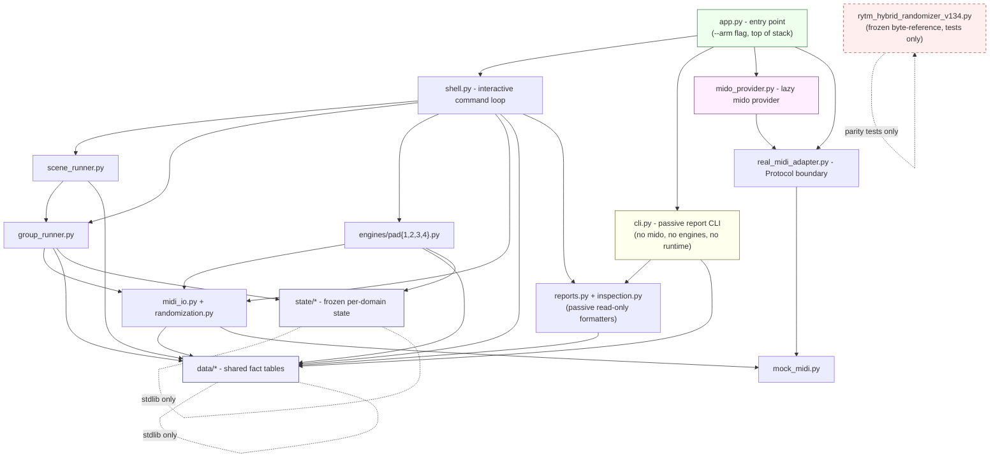

# RytmRandomizer Architecture

> Canonical, human-readable architecture standard for the modular
> RytmRandomizer package. **Authoritative**. The machine-enforced version lives
> in `tests/architecture/`; the agent-facing distillation is in
> `.claude/rules/architecture.md`. If any of those documents disagrees with
> this one, this one wins and the others get updated.

This document is the result of Waves 1-4 of the modularization (the V1.34
monolith decomposition). It describes the FINAL shape of the codebase and the
rules that future work must respect so the architecture cannot be eroded.

---

## 1. Module layer diagram

Arrows point in the **allowed import direction**. There are no cycles. Lower
layers know nothing about higher layers.

---

## 2. Module-responsibility map

One line per module. If you are about to add a responsibility that doesn't fit
on one line for an existing module, you probably need a new module instead.

### Bottom (leaves)

| Module                | Responsibility                                                                  |
| --------------------- | ------------------------------------------------------------------------------- |
| `data/param_maps.py`  | Per-machine CC maps, anchors, safe ranges, deltas, zones. Pure data.            |
| `data/profiles.py`    | The `PROFILES` discovery registry. Composed from `param_maps`.                  |
| `data/scenes.py`      | The 14 V1.34 `SCENE_PRESETS`. Pure data.                                        |
| `data/plans.py`       | Group layout, intensity plans, page plans, per-pad mode rotations. Pure data.  |
| `state/anchor.py`     | Frozen single-pad anchor/current/previous runtime state + transitions.          |
| `state/group.py`      | Frozen group / active-pad / four-pad anchor state + transitions.                |
| `state/pad_mode.py`   | Frozen per-pad mode-rotation index state + transitions.                         |
| `state/scene.py`      | Frozen current-scene-name state + transitions.                                  |
| `state/selection.py`  | Frozen target-pad / channel / isolated-pad selection state + transitions.       |

### Middle (runtime core)

| Module                       | Responsibility                                                              |
| ---------------------------- | --------------------------------------------------------------------------- |
| `midi_io.py`                 | Leaf MIDI primitives: build CC, send param, apply state. `mido` is lazy.    |
| `randomization.py`           | Pure randomization core: zone/depth mutation, waveform pick.                |
| `mock_midi.py`               | In-memory `MockMidiSender` and `MidiMessage` for tests + passive paths.     |
| `real_midi_adapter.py`       | Protocol boundary: `RealMidiPortProvider`, `RealMidiSender`. NO `mido`.     |
| `mido_provider.py`           | Concrete `mido`-backed provider. `mido` imported lazily INSIDE methods.     |
| `engines/pad1..4.py`         | Per-pad interactive engines. Dependencies injected, no module globals.      |

### Mid-upper (orchestration)

| Module                | Responsibility                                                                  |
| --------------------- | ------------------------------------------------------------------------------- |
| `group_runner.py`     | Four-pad group + isolated-pad orchestration. Drives `randomization` + `midi_io`.|
| `scene_runner.py`     | Scene/preset thin layer on top of `group_runner`.                               |

### Upper (entry points)

| Module                | Responsibility                                                                  |
| --------------------- | ------------------------------------------------------------------------------- |
| `shell.py`            | Interactive command loop. Owns the V1.34 command alphabet. Injected deps.       |
| `cli.py`              | **Passive** report-only CLI. NEVER imports `mido`, `mido_provider`, or engines. |
| `app.py`              | Top-of-stack entry point. `--arm` wires the `mido_provider` into `shell`.       |
| `reports.py`          | Consolidated passive in-memory report dispatcher.                               |
| `inspection.py`       | Consolidated passive command-metadata inspection + preview + audit.             |

### Frozen reference (NOT in the layered graph)

| File                                  | Responsibility                                                       |
| ------------------------------------- | -------------------------------------------------------------------- |
| `rytm_hybrid_randomizer_v134.py`      | Frozen byte-identical V1.34 reference. Used ONLY by parity tests.    |

The remaining files (`commands.py`, `command_lookup.py`, `profile_lookup.py`,
`scene_lookup.py`, `help_text.py`, `validation.py`, `audit.py`, `preview.py`,
`registry.py`, etc.) are passive, in-memory, no-I/O metadata helpers that
follow the same direction rules: they may read from `data/` and `state/` but
they may not import `engines`, `shell`, `app`, or `cli`.

---

## 3. Dependency direction rules (machine-enforced)

These are the rules that `tests/architecture/test_import_direction.py`
verifies. If you change a rule, change it here first, then update the test.

1. **`data/` is a leaf.**
   `data/*` may import only Python stdlib and other `data/*` modules.
   It MUST NOT import anything else from `rytm_randomizer`.

2. **`state/` is a leaf.**
   `state/*` may import only Python stdlib. It MUST NOT import `engines`,
   `scene_runner`, `group_runner`, `shell`, `app`, `cli`, `midi_io`,
   `randomization`, `mido`, or `mido_provider`.

3. **`engines/` is mid-layer.**
   `engines/*` MAY import `data/`, `state/`, `midi_io`, `randomization`,
   `mock_midi`, and the `real_midi_adapter` Protocol. They MUST NOT import
   `cli`, `shell`, `app`, `scene_runner`, `group_runner`, or `mido_provider`.

4. **`scene_runner` / `group_runner` are orchestration.**
   May import `engines`, `state`, `data`, `midi_io`, `randomization`,
   `mock_midi`. MUST NOT import `cli`, `shell`, or `app`.

5. **`shell.py` may import everything below it BUT NOT `app` or `cli`.**

6. **`app.py` is the top.**
   May import anything. Nothing imports `app`.

7. **`cli.py` is the PASSIVE entry point.**
   It MAY import `reports`, `inspection`, `data`, `validation`, metadata
   lookups, and `mock_midi`. It MUST NOT import `mido`, `mido_provider`,
   `real_midi_adapter`, any `engines/*`, `shell`, `app`, `scene_runner`,
   `group_runner`, `midi_io`, or `randomization`.

8. **The monolith is sealed.**
   No module inside the `rytm_randomizer` package may import
   `rytm_hybrid_randomizer_v134`. Only files under `tests/` (parity tests)
   may import it.

9. **`mido` is lazy and behind `--arm`.**
   `mido` must not be imported at module load time anywhere in the package.
   The only legitimate `mido` import sites are inside methods of
   `mido_provider.py` and inside conditional branches of `midi_io.py` that
   fire only when a real sender is constructed. Static `import mido` /
   `from mido` at module top level is forbidden in the package.

---

## 4. House-style rules (machine-enforced)

These are verified by `tests/architecture/test_house_style.py` and
`tests/architecture/test_no_side_effects.py`.

* **Frozen dataclasses.** Every `@dataclass` in `state/` and every DTO in the
  package is `frozen=True`. Mutation happens by returning a new instance, not
  by reassigning a field. The single allow-listed exception is bridge DTOs in
  `mock_runtime_active_bridge.py` and similar reporting shims, which are
  documented explicitly.

* **Type annotations on public signatures.** Every function and method whose
  name does not start with `_` has type annotations on all parameters and a
  return annotation.

* **Protocol for boundaries.** Cross-layer boundaries (real-MIDI providers,
  senders) are defined as `typing.Protocol` interfaces, not abstract base
  classes. Concrete implementations live one layer up.

* **No module-level mutable globals in the package.** A module-level name in
  `rytm_randomizer/*` is one of: a `Final`/constant, a frozen dataclass
  instance, a `MappingProxyType`, an immutable tuple/frozenset, a callable
  (function/class), or appears in an explicit allow-list defined by the
  test. The monolith is exempt (it is the historical mutable code).

* **No I/O at import time.** Importing any `rytm_randomizer.*` submodule must
  produce no stdout, must not open any MIDI port, must not call `input()`,
  and must not pull `mido` / `rtmidi` into `sys.modules`. The runtime stack
  is constructed explicitly from `app.py`.

* **Data, not code, for fact tables.** Anything that is "a table of facts"
  (CC numbers, anchors, deltas, zones, scenes, profiles, mutation plans, the
  four-pad layout) lives under `data/` exactly once. No other module is
  allowed to re-type these tables. Wrapper modules (`profiles.py`,
  `scenes.py`, `constants.py`) MUST derive their values from `data/`.

* **Unified logging through `observability/`.** Production log lines should go
  through the `observability/` helpers (placeholder; WS-U owns the build-out).
  Until then, the `print()` calls inside `shell.py` are the historical
  interactive UI surface and are exempt; `print()` outside `shell.py`,
  `cli.py`, and the report formatters is a smell.

---

## 5. Parity discipline (V1.34)

The hardware-validated V1.34 behavior is the baseline of truth. The monolith
file is frozen as a byte-identical reference and the parity tests run the
extracted engines/runners against it.

* Do not edit `rytm_hybrid_randomizer_v134.py`. The test
  `test_v134_reference_has_no_working_tree_diff` will fail otherwise.
* Do not introduce new MIDI CCs, new profiles, new pads (5-12), new parameter
  ranges, or new command behavior without explicit approval. See
  `CONTRIBUTING.md`.
* If you change an engine, scene runner, or group runner, the parity tests
  must still pass byte-for-byte against the monolith.

---

## 6. Where to put new work

| Change type                          | Where it goes                                          | Skill to invoke           |
| ------------------------------------ | ------------------------------------------------------ | ------------------------- |
| Add a new V1.34-equivalent command   | `shell.py` (dispatch) + relevant runner/engine.        | `add-pad-command`         |
| Add new fact table                   | A new module under `data/` + re-export in `__init__`.  | `extend-data-layer`       |
| Change MIDI primitives               | `midi_io.py`. Keep `mido` lazy.                        | (architecture review)     |
| Add new passive report               | `reports.py` (or `inspection.py`) + CLI wire-up.       | (none, follow existing)   |
| Add a new state domain               | A new module under `state/` (frozen + transitions).    | (architecture review)     |
| Music-analysis or guardrail change   | See `.claude/skills/MusicLibraryGuardrails/SKILL.md`. | `MusicLibraryGuardrails`  |

---

## 7. Enforcement summary

The rules above are mechanically enforced by:

* `tests/architecture/test_import_direction.py` (rules 1-9)
* `tests/architecture/test_no_side_effects.py` (no I/O at import, no `mido`)
* `tests/architecture/test_house_style.py` (frozen dataclasses, type hints,
  no module-level mutable globals)
* `tests/architecture/test_layering_structure.py` (the expected module layout
  exists and the monolith is the frozen reference)
* `tests/architecture/test_data_not_code.py` (fact tables live only in
  `data/`; no module re-defines a `data/` name)

These tests are run by `pytest tests/architecture/` and are wired into the
`test` job of `.github/workflows/test.yml` so a violation fails the build.
