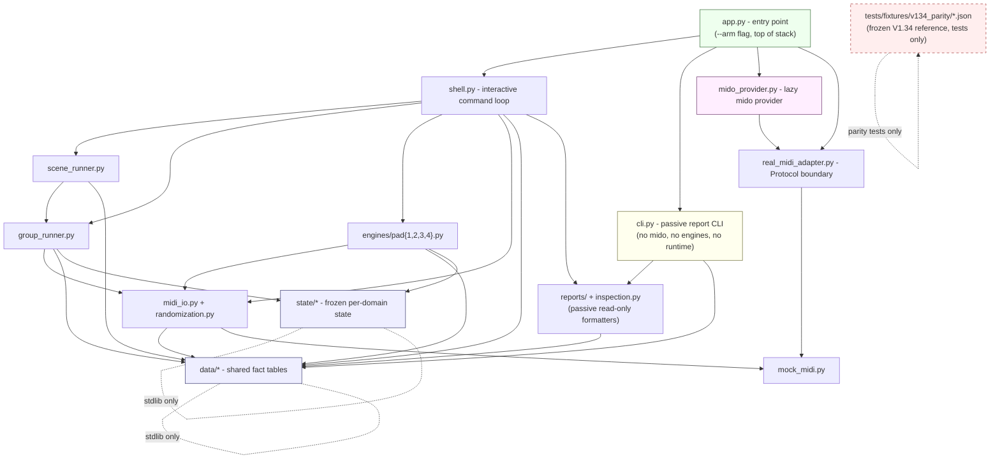

# RytmRandomizer Architecture

> Canonical, human-readable architecture standard for the modular
> RytmRandomizer package. **Authoritative**. The machine-enforced version lives
> in `tests/architecture/`; the agent-facing distillation is in
> `.claude/rules/architecture.md`. If any of those documents disagrees with
> this one, this one wins and the others get updated.

This document is the result of Waves 1-4 of the modularization (the V1.34
monolith decomposition). It describes the FINAL shape of the codebase and the
rules that future work must respect so the architecture cannot be eroded.

---

## 1. Module layer diagram



Arrows point in the **allowed import direction**. There are no cycles. Lower
layers know nothing about higher layers.

---

## 2. Module-responsibility map

One line per module. If you are about to add a responsibility that doesn't fit
on one line for an existing module, you probably need a new module instead.

### Bottom (leaves)

| Module                | Responsibility                                                                  |
| --------------------- | ------------------------------------------------------------------------------- |
| `data/param_maps.py`  | Per-machine CC maps, anchors, safe ranges, deltas, zones. Pure data.            |
| `data/profiles.py`    | The `PROFILES` discovery registry. Composed from `param_maps`.                  |
| `data/scenes.py`      | The 14 V1.34 `SCENE_PRESETS`. Pure data.                                        |
| `data/plans.py`       | Group layout, intensity plans, page plans, per-pad mode rotations. Pure data.  |
| `data/live_gui_contracts.py` | Shared passive GUI screen/desktop contract facts used by report builders. Pure data. |
| `state/anchor.py`     | Frozen single-pad anchor/current/previous runtime state + transitions.          |
| `state/group.py`      | Frozen group / active-pad / four-pad anchor state + transitions.                |
| `state/pad_mode.py`   | Frozen per-pad mode-rotation index state + transitions.                         |
| `state/scene.py`      | Frozen current-scene-name state + transitions.                                  |
| `state/selection.py`  | Frozen target-pad / channel / isolated-pad selection state + transitions.       |

### Middle (runtime core)

| Module                       | Responsibility                                                              |
| ---------------------------- | --------------------------------------------------------------------------- |
| `midi_io.py`                 | Leaf MIDI primitives: build CC, send param, apply state. `mido` is lazy.    |
| `randomization.py`           | Pure randomization core: zone/depth mutation, waveform pick.                |
| `mock_midi.py`               | In-memory `MockMidiSender` and `MidiMessage` for tests + passive paths.     |
| `real_midi_adapter.py`       | Protocol boundary: `RealMidiPortProvider`, `RealMidiSender`. NO `mido`.     |
| `mido_provider.py`           | Concrete `mido`-backed provider. `mido` imported lazily INSIDE methods.     |
| `engines/pad1..4.py`         | Per-pad interactive engines. Dependencies injected, no module globals.      |

### Mid-upper (orchestration)

| Module                | Responsibility                                                                  |
| --------------------- | ------------------------------------------------------------------------------- |
| `group_runner.py`     | Four-pad group + isolated-pad orchestration. Drives `randomization` + `midi_io`.|
| `scene_runner.py`     | Scene/preset thin layer on top of `group_runner`.                               |

### Upper (entry points)

| Module                | Responsibility                                                                  |
| --------------------- | ------------------------------------------------------------------------------- |
| `shell.py`            | Interactive command loop. Owns the V1.34 command alphabet. Injected deps.       |
| `cli.py`              | **Passive** report-only CLI. NEVER imports `mido`, `mido_provider`, or engines. |
| `app.py`              | Top-of-stack entry point. `--arm` wires the `mido_provider` into `shell`.       |
| `reports/`            | Passive in-memory report package + shared formatter/helper layer, including the style-performance arc chain through the live render bundle, live cue sheet, live runbook, reference match, snapshot preview, stage packet, stage snapshot-routing handoff, stage rehearsal-state packet, live set cockpit dashboard, live show export packet, live transition timeline, live command deck, live state packet, live analyzer handoff/targets, GUI readiness/session, capture queue/review, sidecar session packets, GUI screen-contract packets, GUI render-tree packets, GUI analyzer-overlay packets, GUI analyzer-frame packets, GUI interaction-script packets, GUI action-reducer packets, GUI controller-state packets, GUI playback-transcript packets, GUI playback-validation packets, GUI test-harness contract/readiness packets, GUI implementation-bridge/desktop-blueprint/desktop-app-plan/desktop-component-contract/desktop-view-model/desktop-render-contract/desktop-render-harness/cockpit-boundary-readiness packets, and cockpit send-plan operator-readiness packets. Static GUI contract facts stay in `data/live_gui_contracts.py`; repeated report CLI helpers stay in `reports/live_gui_common.py`. |
| `inspection.py`       | Consolidated passive command-metadata inspection + preview + audit.             |

### Frozen reference (NOT in the layered graph)

| File                                  | Responsibility                                                       |
| ------------------------------------- | -------------------------------------------------------------------- |
| `tests/fixtures/v134_parity/*.json`   | Frozen V1.34 reference behavior, one golden per parity request. Used ONLY by parity tests via `tests/_parity_worker.py`. (The original `rytm_hybrid_randomizer_v134.py` monolith was retired in 2026-05-17.) |

The remaining files (`commands.py`, `profile_lookup.py`, `help_text.py`,
`validation.py`, `audit.py`, `preview.py`, `registry.py`, etc.) are passive,
in-memory, no-I/O metadata helpers that follow the same direction rules: they
may read from `data/` and `state/` but they may not import `engines`, `shell`,
`app`, or `cli`.

---

## 3. Dependency direction rules (machine-enforced)

These are the rules that `tests/architecture/test_import_direction.py`
verifies. If you change a rule, change it here first, then update the test.

1. **`data/` is a leaf.**
   `data/*` may import only Python stdlib and other `data/*` modules.
   It MUST NOT import anything else from `rytm_randomizer`.

2. **`state/` is a leaf.**
   `state/*` may import only Python stdlib. It MUST NOT import `engines`,
   `scene_runner`, `group_runner`, `shell`, `app`, `cli`, `midi_io`,
   `randomization`, `mido`, or `mido_provider`.

3. **`engines/` is mid-layer.**
   `engines/*` MAY import `data/`, `state/`, `midi_io`, `randomization`,
   `mock_midi`, and the `real_midi_adapter` Protocol. They MUST NOT import
   `cli`, `shell`, `app`, `scene_runner`, `group_runner`, or `mido_provider`.

4. **`scene_runner` / `group_runner` are orchestration.**
   May import `engines`, `state`, `data`, `midi_io`, `randomization`,
   `mock_midi`. MUST NOT import `cli`, `shell`, or `app`.

5. **`shell.py` may import everything below it BUT NOT `app` or `cli`.**

6. **`app.py` is the top.**
   May import anything. Nothing imports `app`.

7. **`cli.py` is the PASSIVE entry point.**
   It MAY import `reports`, `inspection`, `data`, `validation`, metadata
   lookups, and `mock_midi`. It MUST NOT import `mido`, `mido_provider`,
   `real_midi_adapter`, any `engines/*`, `shell`, `app`, `scene_runner`,
   `group_runner`, `midi_io`, or `randomization`.

8. **The retired V1.34 monolith stays buried.**
   No module inside the `rytm_randomizer` package -- and no test helper --
   may import `rytm_hybrid_randomizer_v134`. The monolith was retired and
   the only authoritative source of V1.34 reference behavior is the JSON
   goldens under `tests/fixtures/v134_parity/`.

9. **`mido` is lazy and behind `--arm`.**
   `mido` must not be imported at module load time anywhere in the package.
   The only legitimate `mido` import sites are inside methods of
   `mido_provider.py` and inside conditional branches of `midi_io.py` that
   fire only when a real sender is constructed. Static `import mido` /
   `from mido` at module top level is forbidden in the package.

---

## 4. House-style rules (machine-enforced)

These are verified by `tests/architecture/test_house_style.py` and
`tests/architecture/test_no_side_effects.py`.

* **Frozen dataclasses.** Every `@dataclass` in `state/` and every DTO in the
  package is `frozen=True`. Mutation happens by returning a new instance, not
  by reassigning a field. The single allow-listed exception is bridge DTOs in
  `mock_runtime_active_bridge.py` and similar reporting shims, which are
  documented explicitly.

* **Type annotations on public signatures.** Every function and method whose
  name does not start with `_` has type annotations on all parameters and a
  return annotation.

* **Protocol for boundaries.** Cross-layer boundaries (real-MIDI providers,
  senders) are defined as `typing.Protocol` interfaces, not abstract base
  classes. Concrete implementations live one layer up.

* **No module-level mutable globals in the package.** A module-level name in
  `rytm_randomizer/*` is one of: a `Final`/constant, a frozen dataclass
  instance, a `MappingProxyType`, an immutable tuple/frozenset, a callable
  (function/class), or appears in an explicit allow-list defined by the
  test.

* **No I/O at import time.** Importing any `rytm_randomizer.*` submodule must
  produce no stdout, must not open any MIDI port, must not call `input()`,
  and must not pull `mido` / `rtmidi` into `sys.modules`. The runtime stack
  is constructed explicitly from `app.py`.

* **Data, not code, for fact tables.** Anything that is "a table of facts"
  (CC numbers, anchors, deltas, zones, scenes, profiles, mutation plans, the
  four-pad layout) lives under `data/` exactly once. No other module is
  allowed to re-type these tables. Wrapper modules (`profiles.py`,
  `scenes.py`, `constants.py`) MUST derive their values from `data/`.

* **Unified logging through `observability/`.** Production log lines should go
  through the `observability/` helpers (placeholder; WS-U owns the build-out).
  Until then, the `print()` calls inside `shell.py` are the historical
  interactive UI surface and are exempt; `print()` outside `shell.py`,
  `cli.py`, and the report formatters is a smell.

---

## 5. Parity discipline (V1.34)

The hardware-validated V1.34 behavior is the baseline of truth. It is frozen
as JSON goldens under `tests/fixtures/v134_parity/`, one per parity request,
and the parity tests run the extracted engines/runners against those goldens.

* Do not regenerate the V1.34 goldens casually. `PARITY_CAPTURE_MODE=1 pytest`
  rewrites them from the current engine output -- only do this when an
  intentional reference-output change is being committed, with reviewer
  sign-off.
* Do not introduce new MIDI CCs, new profiles, new pads (5-12), new parameter
  ranges, or new command behavior without explicit approval. See
  `CONTRIBUTING.md`.
* If you change an engine, scene runner, or group runner, the parity tests
  must still pass byte-for-byte against the monolith.

---

## 6. Where to put new work

| Change type                          | Where it goes                                          | Skill to invoke           |
| ------------------------------------ | ------------------------------------------------------ | ------------------------- |
| Add a new V1.34-equivalent command   | `shell.py` (dispatch) + relevant runner/engine.        | `add-pad-command`         |
| Add new fact table                   | A new module under `data/` + re-export in `__init__`.  | `extend-data-layer`       |
| Change MIDI primitives               | `midi_io.py`. Keep `mido` lazy.                        | (architecture review)     |
| Add new passive report               | A module under `reports/` + CLI wire-up only when it becomes an operator command. | (none, follow existing)   |
| Add a new state domain               | A new module under `state/` (frozen + transitions).    | (architecture review)     |
| **Add a new Elektron device family** (Analog Four, Digitakt, ...) | One module at `devices/<family>.py` registering a `Device` instance + three Strategy modules under `devices/strategies/`. See §6.1. | (architecture review)     |
| Music-analysis or guardrail change   | See `.claude/skills/MusicLibraryGuardrails/SKILL.md`. | `MusicLibraryGuardrails`  |

---

## 6.1 Device Protocol + Strategy seam (WS-S5 + Strategy)

The `rytm_randomizer.devices.Device` Protocol is the single cross-machine
boundary. Every Elektron device family — Rytm today, Analog Four next —
exposes exactly one registered `Device` instance and routes its behavior
through three Strategy sub-Protocols.

**Visual reference:** [`docs/ARCHITECTURE_DIAGRAMS.md`](ARCHITECTURE_DIAGRAMS.md) has six mermaid diagrams that illustrate this section in detail — [§3 Device + Strategy Capability Stack](ARCHITECTURE_DIAGRAMS.md#3-device--strategy-capability-stack-ws-s5--strategy) (class diagram), [§4 Snapshot → Plan → Render Lifecycle](ARCHITECTURE_DIAGRAMS.md#4-snapshot--plan--render-lifecycle-one-rytm-cc) (sequence), [§5 Composition vs Stub](ARCHITECTURE_DIAGRAMS.md#5-device--strategy-composition-vs-old-stub-shape) (before/after), [§9 Snapshot Subpackage](ARCHITECTURE_DIAGRAMS.md#9-snapshot-subpackage-ws-s6-envelope--protocols) (WS-S6 helpers), [§18 Future Codex PR Shape](ARCHITECTURE_DIAGRAMS.md#18-future-codex-pr-shape-post-pr-43-dual-machine-redo) (where the next dual-machine work plugs in), and [§19 Registry Fan-Out](ARCHITECTURE_DIAGRAMS.md#19-registry-fan-out-dual-machine-orchestration-via-mappingstr-device).

**Protocol shape:**

| Attribute                   | Type / Protocol                                       | Role |
| --------------------------- | ----------------------------------------------------- | ---- |
| `device_id`                 | `str`                                                 | Stable, lowercase, snake_case registry key (`"analog_rytm_mk2"`) |
| `display_name`              | `str`                                                 | Operator-facing label |
| `default_midi_channel`      | `int`                                                 | 0-based MIDI channel |
| `track_count`               | `int`                                                 | Pads / tracks (4 for A4, 12 for Rytm) |
| `sysex_manufacturer_id`     | `bytes`                                               | 3-byte Elektron ID (`0x00 0x20 0x3C`) |
| `snapshot_decoder`          | `snapshot.SnapshotDecoder` Protocol                   | `decode(raw, slot)` → device-specific snapshot |
| `mutation_planner`          | `snapshot.MutationPlanner` Protocol                   | `plan(snapshot, depth)` → device-specific plan |
| `message_renderer`          | `devices.MessageRenderer` Protocol                    | `to_mock_message(event, plan)` + `to_cc_triple(event, plan)` |
| `report_header`             | `str`                                                 | Header line for guarded / hardware send reports |

The Protocol's four legacy convenience methods (`decode_snapshot`,
`plan_mutation`, `to_mock_messages`, `to_cc_messages`) remain for
backward compatibility — they delegate to the strategies.

**To add a device family:**

1. Create three strategy modules under `rytm_randomizer/devices/strategies/`:
   - `<family>_snapshot_decoder.py` — implements `SnapshotDecoder.decode`. Use the shared `snapshot/envelope.py` helpers; do NOT fork them per family.
   - `<family>_mutation_planner.py` — implements `MutationPlanner.plan`. The plan must carry `ready: bool` and `readiness_reason: str` so the generic guarded sender can refuse on an unfinished plan without device-specific introspection.
   - `<family>_message_renderer.py` — implements `MessageRenderer.{to_mock_message, to_cc_triple}`. Looks up CC numbers through `data/profiles.py` (or the family's own param map).
   - Family-specific pure helper modules may live beside these strategies when they support the Strategy boundary, such as `analog_rytm_snapshot_routing.py` mapping snapshot-derived machine facts into planner profile keys. These helpers must remain passive and must not become parallel registries, senders, or device packages.
2. Create one device class at `rytm_randomizer/devices/<family>.py` that composes the three strategies in `__init__` and exposes the 9 Protocol attributes.
3. Register at import time: `registry.register_device(<Family>Device())`.
4. The `devices/__init__.py` must import the new module so the side-effect registration runs.

**What NOT to do:**

- Do NOT create a parallel `<family>/` subpackage at the package root with its own decoder / planner / renderer / sender — the architecture tests will reject it (see §7).
- Do NOT import private symbols (`_foo`, `_BAR`) from a sibling family's strategy module — same enforcement.
- Do NOT introduce a second registry; only `devices/registry.py` may define `register_device`.

`AnalogRytmDevice` is the reference implementation; `tests/test_devices.py` and `tests/test_devices_strategies_*.py` cover the contract.

---

## 6.2 Cockpit & Profile-Model layer (Phase 1)

The `rytm_randomizer.cockpit` subpackage is the live-performance GUI surface
and the home of the portable mutation engine. It is the **active runtime
counterpart** to the 40+ passive `live_gui_*` reports under `reports/`:
those reports define the declarative contracts the cockpit conforms to,
and the cockpit hosts the actual WebSocket Protocol the desktop shell
drives.

**Visual reference:** [`docs/ARCHITECTURE_DIAGRAMS.md`](ARCHITECTURE_DIAGRAMS.md)
has two new mermaid diagrams that illustrate this section —
[§28 Cockpit C4 Component Diagram](ARCHITECTURE_DIAGRAMS.md#28-cockpit--profile-model-c4-component-diagram-phase-1)
and [§29 Cockpit SEND Sequence](ARCHITECTURE_DIAGRAMS.md#29-cockpit-send-command-sequence-phase-1).
The source spec lives at [`docs/superpowers/specs/2026-05-23-cockpit-and-profile-model-design.md`](superpowers/specs/2026-05-23-cockpit-and-profile-model-design.md);
the implementation plan is at [`docs/superpowers/plans/2026-05-23-cockpit-and-profile-model.md`](superpowers/plans/2026-05-23-cockpit-and-profile-model.md).

### Package layout

```
rytm_randomizer/cockpit/
    __init__.py            # PROTOCOL_VERSION, re-exports
    __main__.py            # `python -m rytm_randomizer.cockpit` -> WS server
    data/                  # Frozen dataclasses for the wire format
        snapshot.py        # PadState, Snapshot
        profile_model.py   # StyleTrait, TraitPadWeight, ProfileModel
        mutation_candidate.py  # PadDelta, MutationCandidate
        send_plan.py       # CockpitSendPlan, SendPlanPacket
        history.py         # HistoryEntry, History
        types.py           # Literal aliases (kind, status, via, ...)
    engine/                # The deterministic mutation function
        mutate.py          # mutate(snapshot, profile, depth, seed)
        prng.py            # xorshift32 — documented cross-language PRNG
        send_plan.py       # prepare_send_plan(...) inert SEND preflight
        spec.md            # Normative C-portable algorithm spec
    profiles/              # Disk-backed profile registry
        registry.py        # load / save / list / get_by_id
        builtin.py         # Seven default `kind="scene"` profiles
    history/               # In-memory snapshot chain
        store.py           # append, undo, load, promote-to-saved
    device/                # Device adapter abstraction
        adapter.py         # DeviceAdapter Protocol
        mock.py            # MockDeviceAdapter (default, no MIDI)
        real.py            # RealMidiDeviceAdapter (wraps mido_provider)
    ws/                    # WebSocket Protocol surface
        server.py          # FastAPI app, single /ws endpoint
        protocol.py        # Wire-format event + command types
        handlers.py        # One handler per command
    export/                # Portable model export pipeline
        model_format.py    # Header: magic "RYMP" + format_version + crc32
        serialize.py       # MessagePack pack / unpack
```

The desktop shell (`desktop/shell/` — Rust + Tauri 2) and the web frontend
(`desktop/web/` — Vite + React + TypeScript) live **outside** the Python
package: they are bundled by `cargo build --release` into a single binary
that spawns the Python sidecar via `python -m rytm_randomizer.cockpit`.

### The Protocol — events out, commands in

The cockpit's wire format is transport-agnostic (WebSocket today; could
become subprocess JSON, in-process import, or hardware UART tomorrow).
Anything the engine knows is published as a **whole-state** event; the
UI drives the engine with **typed commands** that ack synchronously.

| Event (engine → UI) | Payload | When |
|---|---|---|
| `snapshot_changed` | `{ snapshot: Snapshot }` | After SEND, LOAD, or UNDO |
| `mutation_previewed` | `{ candidate: MutationCandidate \| null }` | After depth change, REGEN, or PREVIEW toggle |
| `send_plan_changed` | `{ send_plan: CockpitSendPlan \| null }` | After PREPARE, stale candidate/lock changes, or SEND |
| `history_updated` | `{ history: History }` | After SEND, SAVE, LOAD, or UNDO |
| `profile_changed` | `{ profile: ProfileModel \| null }` | After `select_profile` |
| `session_status` | `{ armed, midi_port, mode, unsaved_sends }` | On connect, on arm-toggle |

| Command (UI → engine) | Returns | Notes |
|---|---|---|
| `select_profile` | `{ ok }` | Sets active profile |
| `set_depth` | `{ ok, candidate? }` | Recomputes candidate at new depth |
| `set_pad_lock` | `{ ok }` | Locked pads are skipped on SEND |
| `toggle_preview` | `{ ok, candidate? }` | Ghost overlay on/off |
| `regen` | `{ ok, candidate }` | New seed, same depth |
| `prepare_send_plan` | `{ ok, send_plan }` | Builds an inert packet plan and readiness blockers |
| `send` | `{ ok, new_snapshot_id, send_plan_id }` | Applies the ready plan via device adapter |
| `save` | `{ ok, snapshot_id }` | Promotes current snapshot to device kit |
| `load_snapshot` | `{ ok }` | Restores a historical snapshot |
| `undo` | `{ ok, snapshot_id }` | Walks history back one step |
| `export_profile_model` | `{ ok, model_bytes }` | MessagePack + header + CRC |

Events are full-state — the UI re-renders from the latest event per kind,
no delta-ordering subtleties. Commands are idempotent given the same
engine state.

### Mutation engine — two reference implementations, identical output

The function `mutate(snapshot, profile, depth, seed) -> MutationCandidate`
lives in `cockpit/engine/mutate.py`. It is **pure, deterministic, and
constrained from day one to be C-portable** because the long-term goal
(Phase 4) is to run the same algorithm on dedicated hardware (Elektron
Rytm SysEx accessory; out of scope for this spec):

1. **Python reference** — `cockpit/engine/mutate.py`. The authoritative
   implementation; used by the cockpit, profile wizard, and all tests.
2. **C-portable algorithm spec** — `cockpit/engine/spec.md`. A normative
   document describing the algorithm in pseudocode, value ranges,
   clamping rules, and the documented `xorshift32` PRNG. Initially a
   document only; a reference C implementation lands in a later spec.

**Conformance:** for every `(snapshot, profile, depth, seed)` tuple, both
implementations must produce byte-identical `MutationCandidate.pad_deltas`.
A CI job runs this over fixtures in `tests/cockpit/fixtures/engine_conformance/`.

Constraints baked into the engine:

- No dict-iteration-order dependence (use sorted keys).
- No `numpy`, no language-level RNG without a documented spec.
- The PRNG is `xorshift32` with a fixed encoding — implementable in
  C99, Rust, or any language with 32-bit unsigned arithmetic.
- The model format is the exact dataclass tree the engine consumes —
  no Python-specific object serialization.

### Relationship to existing layers

The cockpit layer is **additive**: it does not displace the V1.34 engine,
the existing `MutationPlanner` Strategy on `Device`, or any passive
report. It sits **alongside** them:

- **V1.34 parity is untouched.** The 685 byte-frozen JSON goldens under
  `tests/fixtures/v134_parity/` remain the canonical V1.34 reference.
  The new `mutate(...)` function is a separate path used only by the
  cockpit; the existing `engines/pad{1..4}.py` + `group_runner.py` +
  `scene_runner.py` chain continues to drive armed CLI behavior.
- **Passive reports remain authoritative contracts.** The cockpit's
  web frontend derives its component props, state slices, action
  reducers, and test selectors directly from the corresponding
  `live_gui_*` report module. The reports stay passive and the cockpit
  is the active implementation of the same shape.
- **The Device Protocol seam is reused.** The cockpit's `RealMidiDeviceAdapter`
  routes hardware sends through the existing `mido_provider` + `real_midi_adapter`
  boundary — the same one the armed CLI path uses. The `--arm` discipline
  applies identically: passive default opens no MIDI port, only an
  explicit arm step does.
- **Architecture invariants apply unchanged.** `data/` stays a leaf
  (cockpit code may read `data/profiles.py` for CC-number lookups but
  never re-defines a fact table). The `cockpit/` subpackage satisfies
  Gate 9 (no new top-level `*.py`, one new subpackage justified by a
  distinct concern). `mido` imports stay lazy.
- **Device families plug in through `devices/`.** Phase 1 targets the
  Analog Rytm MK2 via the `AnalogRytmDevice` strategy chain. The Analog
  Four MK2 follows the same pattern when its mutation planner promotes
  out of candidate state — the cockpit consumes the existing `Device`
  Protocol; no parallel device registry is introduced.

### Environment + configuration

| Variable | Default | Purpose |
|---|---|---|
| `RYTM_RAND_WS_PORT` | `4317` | WebSocket port the sidecar binds; documented in `CONTRIBUTING.md` and `docs/COCKPIT_QUICKSTART.md`. |
| Profile directory | `$XDG_CONFIG_HOME/rytm-randomizer/profiles/` on Linux, platform-equivalents on macOS / Windows | Where user `kind="user"` profiles live as JSON files. Built-in `kind="scene"` profiles are bundled in `profiles/builtin.py`. |

### Phase boundaries

This subpackage covers **Phase 1** (cockpit + Python engine). The Phase 2
Profile Wizard, Phase 3 model-export CLI, and Phase 4 hardware runtime are
out of scope and will get their own design specs. The constraints above
(C-portable engine, language-agnostic model format) are the reason Phase 1
makes the choices it does — Phase 4's existence shapes Phase 1's seams.

---

## 6.3 Profile Wizard layer (Phase 2)

The `rytm_randomizer.cockpit.wizard` subpackage is the authoring surface
for user-defined `ProfileModel`s. Phase 1 shipped the cockpit GUI plus a
read-only `ProfileRegistry` populated with seven built-in `kind="scene"`
profiles; Phase 2 closes the authoring gap so the operator can create
`kind="user"` profiles by pointing the system at musical inspiration
(folders of SysEx, audio files, artist or song references) and letting the
analysis pipeline derive `StyleTrait`s and `TraitPadWeight` mappings.

**Visual reference:** [`docs/ARCHITECTURE_DIAGRAMS.md`](ARCHITECTURE_DIAGRAMS.md)
has two new mermaid diagrams that illustrate this section —
[§30 Profile Wizard sequence](ARCHITECTURE_DIAGRAMS.md#30-profile-wizard-sequence-name--add--analyze--review--save-phase-2)
and
[§31 Profile Wizard components](ARCHITECTURE_DIAGRAMS.md#31-profile-wizard-component-diagram-phase-2).
The source spec lives at
[`docs/superpowers/specs/2026-05-24-profile-wizard-design.md`](superpowers/specs/2026-05-24-profile-wizard-design.md);
the implementation plan is at
[`docs/superpowers/plans/2026-05-24-profile-wizard.md`](superpowers/plans/2026-05-24-profile-wizard.md).

### Package layout

```
rytm_randomizer/cockpit/wizard/
    __init__.py              # Re-exports the public surface
    state.py                 # WizardState, InspirationSource, AnalysisJob dataclasses
    analyze.py               # analyze_source dispatcher + FeatureReport -> StyleTrait mapping
    sysex_analyzer.py        # extract_kit_traits(path) for kit / sound SysEx dumps
    reference_analyzer.py    # lookup_traits(text) for artist / album / song references
    builder.py               # build_profile(name, description, jobs) -> ProfileModel
    pad_mapping.py           # TRAIT_TO_PAD: Final[Mapping[str, int]] (built-in trait -> pad table)
```

The new code lives entirely under the existing `cockpit/` subpackage and
adds no new top-level module (Gate 9). The web wizard surface
(`desktop/web/src/wizard/`) is bundled by Tauri exactly the same way as
the rest of the cockpit frontend.

### The three new typed entities

All three are frozen dataclasses defined in `cockpit/wizard/state.py`.
Each carries a `Literal` discriminator and supports JSON round-trip via
`to_dict` / `from_dict`. The wire format mirrors the Python shape so the
WebSocket Protocol can pass values through unchanged.

| Entity                | Purpose                                                                                          |
| --------------------- | ------------------------------------------------------------------------------------------------ |
| `InspirationSource`   | One operator-added source: ULID, `kind` (`kit`/`sound`/`song`/`album`/`artist`), `mode` (`file`/`folder`/`reference`), `location` (path for file/folder; name for reference), `display_name`, `added_at`. |
| `AnalysisJob`         | One per-source analysis run: `source_id` back-reference, `status` (`pending`/`analyzing`/`ok`/`failed`), `progress` 0.0–1.0, `error`, `extracted_traits: tuple[StyleTrait, ...]`. |
| `WizardState`         | Full wizard-session state: ULID, `step` (`name`/`add`/`analyze`/`review`), `name`, `description`, `sources` tuple, `jobs` tuple, `candidate_profile: ProfileModel \| None` (set on review). |

`WizardState` exposes pure transition methods — `next_step()`,
`with_source(...)`, `with_job_update(...)`, `with_candidate(...)` — that
return a new instance instead of mutating in place. The cockpit's
existing immutability discipline is preserved.

### The Protocol surface — 8 commands, 3 events

The wizard extends the Phase 1 WebSocket Protocol additively. Phase 1's
existing commands and events continue working unchanged; the wizard
commands are dispatched by a new branch in `cockpit/ws/handlers.py` that
delegates to `cockpit/ws/wizard_handlers.py`. The new types are also
registered in `cockpit/ws/protocol.py`'s `COMMAND_TYPES` and `EVENT_TYPES`
constants so the typed wire format stays exhaustive.

| Command (UI → engine)   | Returns                              | Notes |
|---|---|---|
| `wizard_start`          | `{ ok, wizard_id }`                  | Creates a new `WizardSession`. |
| `wizard_set_metadata`   | `{ ok, state }`                      | Updates `name` and/or `description`. |
| `wizard_add_source`     | `{ ok, state, source_id }`           | Appends one `InspirationSource`. |
| `wizard_remove_source`  | `{ ok, state }`                      | Removes a source by id. |
| `wizard_analyze`        | `{ ok }`                             | Runs each source through the analyzer; emits `analysis_progress` between sources. |
| `wizard_review`         | `{ ok, candidate_profile }`          | Assembles the candidate `ProfileModel` via `ProfileBuilder`. |
| `wizard_save`           | `{ ok, profile_id }`                 | Writes to `~/.rytm-randomizer/profiles/<id>.json` and emits `profile_created` plus `profile_changed`. |
| `wizard_cancel`         | `{ ok }`                             | Drops the in-flight `WizardSession`. |

| Event (engine → UI)       | Payload                              | When |
|---|---|---|
| `wizard_state_changed`    | `{ state: WizardState }`             | After any command that mutates state. |
| `analysis_progress`       | `{ job: AnalysisJob }`               | Once per source as `wizard_analyze` advances. |
| `profile_created`         | `{ profile: ProfileModel }`          | After `wizard_save` writes the profile to disk. |

The existing Phase 1 `profile_changed` event also fires after
`wizard_save` so the active-profile UI updates without a separate code
path. Events remain whole-state payloads; the UI re-renders from the
latest event per kind, matching the Phase 1 discipline.

### Analysis adapter

`cockpit/wizard/analyze.py` is the dispatcher that maps an
`InspirationSource` to a tuple of `StyleTrait` values. It reuses the
existing `rytm_randomizer.style_analysis/` infrastructure for the audio
path and adds two new analyzers for the SysEx and reference paths.

| Source kind / mode                                  | Analyzer path                                                                                        |
| --------------------------------------------------- | ---------------------------------------------------------------------------------------------------- |
| audio file (`kind="song"`/`"album"`/`"sound"`, `mode="file"`)    | `style_analysis.extractor.extract_features(path) -> FeatureReport` -> `feature_report_to_traits(...)` |
| audio folder (`mode="folder"`)                      | iterate `*.wav|*.mp3|*.flac|*.aif|*.aiff` per kind; weighted average of the per-file trait tuples.    |
| SysEx file or folder (`kind="kit"`)                 | `sysex_analyzer.extract_kit_traits(path)` — parses the kit dump using existing `snapshot/` helpers; folder mode iterates `*.syx`. |
| reference (`mode="reference"`)                      | `reference_analyzer.lookup_traits(text)` — a built-in `Final` lookup of 20 known artist / album names mapped to trait profiles; unknown names return a neutral profile with low confidence. |

All three analyzers are deterministic and side-effect free except for
reading files. They run synchronously on a worker thread (via
`asyncio.to_thread` in the WS handler) so the event loop stays
responsive while the WS server emits `analysis_progress` between
sources. Audio fingerprint lookup against external services is
explicitly out of scope for Phase 2 and is deferred to Phase 3+.

### ProfileBuilder

`cockpit/wizard/builder.py` aggregates the OK `AnalysisJob`s into one
`ProfileModel`:

```python
def build_profile(
    name: str,
    description: str | None,
    jobs: tuple[AnalysisJob, ...],
) -> ProfileModel:
    """Aggregate per-source traits into a single ProfileModel.

    - Traits: weighted average of `extracted_traits` across all OK jobs,
      normalized to 0..1.
    - pad_mappings: derived from trait names via the `TRAIT_TO_PAD`
      table in cockpit/wizard/pad_mapping.py.
    - kind: "user"
    - model_version: "1.0.0" initially; re-analysis bumps the patch level.
    - source_summary: e.g. "5 sources, 1,243 analyzed signals" for the UI.
    """
```

`pad_mapping.TRAIT_TO_PAD: Final[Mapping[str, int]]` is the built-in
trait → pad assignment table. The standard mapping is
`rolling_low_end → Pad 1 (BD)`, `metallic_tension → Pad 2 (SD)`,
`hat_density → Pad 3 (CH/OH)`, `filter_motion → Pad 4 (FX/FLT)`.
Operator-overridable pad mapping is deferred to a later iteration; for
Phase 2 the table is immutable.

Edge cases:

- No OK jobs → `build_profile` raises `EmptyAnalysisError`; the UI
  surfaces a "fix" affordance in the Review step.
- A job that finished with no extracted traits contributes nothing to
  the average (it is not an error — just a low-signal source).
- A job that failed entirely is excluded; the UI offers retry / remove /
  replace from the Analyze step before `wizard_review` runs.

### Relationship to existing layers

The wizard layer is **additive**: like the rest of the cockpit, it
displaces nothing.

- **`style_analysis/` is reused.** The audio path calls the existing
  `extract_features` function directly. The Phase 2 wizard adds the
  `feature_report_to_traits` mapping helper plus the two new analyzers,
  but the underlying feature extraction is the same code path the live
  analyzer reports already use.
- **`cockpit/data/profile_model.py` is reused.** `build_profile` returns
  the same `ProfileModel` dataclass the Phase 1 registry consumes.
  Saving a wizard-built profile is just `ProfileRegistry.save(profile)`.
- **`cockpit/ws/` is extended, not replaced.** The wizard's commands are
  added through a new dispatch branch in the existing
  `handlers.handle_command` function. The Phase 1 commands continue
  working unchanged; the `wizard_*` commands are isolated to their own
  handlers + session module.
- **V1.34 parity is untouched.** The wizard never touches engine code or
  the V1.34 reference path. The 685 JSON goldens under
  `tests/fixtures/v134_parity/` remain byte-identical after Phase 2.
- **Passive / armed boundary is preserved.** The wizard is passive by
  construction — it reads files, decodes SysEx in memory, and writes
  JSON profiles. It never opens a MIDI port and never sends MIDI. Only
  the cockpit's armed runtime can drive hardware.
- **`mido` lazy-import discipline is preserved.** None of the wizard
  analyzers import `mido`; SysEx parsing uses the existing
  `snapshot/envelope.py` helpers, which are pure bytes-in / dataclass-out.
- **Architecture invariants apply unchanged.** Gate 9 (subpackage by
  default) is satisfied because the new code lives under
  `cockpit/wizard/` rather than a new top-level module. Gate 10
  (`Literal` types) is satisfied by the discriminators on
  `InspirationSource`, `AnalysisJob`, and `WizardState`. Gate 12
  (`Final` constants) is satisfied by `TRAIT_TO_PAD` and the
  reference-analyzer lookup table.

### Frontend surface

The web wizard lives under `desktop/web/src/wizard/`:

- `<Wizard />` — top-level container; mounts when route is `/wizard`.
- `<WizardSteps />` — step indicator (Name · Add · Analyze · Review).
- `<NameStep />`, `<AddStep />`, `<AnalyzeStep />`, `<ReviewStep />` —
  one component per wizard step.
- `<WizardLauncher />` — a small "Create profile…" button added to the
  cockpit's `MutationPanel` that opens the wizard route.

State flows through a new `wizard` slice in
`desktop/web/src/state/wizard_store.ts`; the slice subscribes to
`wizard_state_changed`, `analysis_progress`, and `profile_created`. File
and folder selection in the `<AddStep />` uses
`@tauri-apps/plugin-dialog`'s `open({ directory: true })` and
`open({ multiple: false })`; reference selection is a plain text input.

### Phase boundaries

Phase 2 closes the authoring loop. Phase 3 (model export to portable
binary) and Phase 4 (hardware runtime) remain out of scope and will get
their own design specs. The wizard's output is the same `ProfileModel`
shape Phase 3 will export and Phase 4 will execute on dedicated
hardware, so Phase 2's choices stay forward-compatible with that
roadmap.

---

## 7. Enforcement summary

The rules above are mechanically enforced by:

* `tests/architecture/test_import_direction.py` (rules 1-9)
* `tests/architecture/test_no_side_effects.py` (no I/O at import, no `mido`)
* `tests/architecture/test_house_style.py` (frozen dataclasses, type hints,
  no module-level mutable globals)
* `tests/architecture/test_layering_structure.py` (the expected module layout
  exists and the retired V1.34 monolith has not been resurrected)
* `tests/architecture/test_data_not_code.py` (fact tables live only in
  `data/`; no module re-defines a `data/` name)
* `tests/architecture/test_device_protocol_enforcement.py` (every Elektron
  device family registers through `devices/registry.py`; no cross-family
  private imports; `dual_machine/` consumes only the registry; only one
  device registry exists; every registered Device satisfies the Protocol;
  Protocol surface is pinned against accidental drift — see §6.1)

These tests are run by `pytest tests/architecture/` and are wired into the
`test` job of `.github/workflows/test.yml` so a violation fails the build.

---

## 8. V1.34 parity API surface

A handful of symbols in the package have no production callers — they exist
only because the parity tests need to assert on them, or because they are
documented public contracts the parity layer gates on, or because they are
the documented persistence lifecycle for the guardrails workstream.

A naive "no production caller -> dead code" audit will keep flagging them.
They are NOT dead. This section is the authoritative keep-list; if you are
running a dead-code audit and you find a symbol below, leave it alone.

Removing any of these requires a parity-layer change (or a guardrails design
change for the `ProfileStore` entries) and is out of scope for an audit-led
cleanup.

### Documented passive metadata + V1.34 parity helpers

| Symbol | Module | Why it stays |
| --- | --- | --- |
| `FORBIDDEN_ACTIONS` | `rytm_randomizer/commands.py` | Documented V1.34 controlled-mutation roadmap surface. `tests/test_scaffold.py` gates that the package never grows an executable path into one of these forbidden action categories. |
| `is_guarded_main_prompt_depth()` | `rytm_randomizer/commands.py` | Documented predicate the parity layer uses to assert that the bare main-prompt depth commands ("1", "2", "3") never send MIDI. Removing it would gut the parity assertion. |
| `DEFAULT_MIDI_CHANNEL`, `OUT_OF_SCOPE_PAD_GUARDRAIL`, `PAD_TO_MIDI_CHANNEL`, `PAD_SELECTION_LABELS` | `rytm_randomizer/constants.py` | The V1.34 channel and Pads-5-12 scope-guardrail constants. The parity layer asserts on these exact values; they are the documented contract between the modular package and the byte-frozen monolith. |
| `switch_pad1_extra_bd_machine_only()` | `rytm_randomizer/engines/pad1.py` | The V1.34 Pad-1 extra-BD machine-only switch routine. `tests/test_engines_pad1.py` byte-parity tests assert on its exact behaviour (including a parity subprocess invocation). |
| `mutate_group_with_depth()` | `rytm_randomizer/group_runner.py` | Mirrors the monolith's `mutate_group_with_depth` legacy fallback. Documented in the module docstring; the parity layer asserts byte-for-byte equality against the monolith. |
| `GroupRuntimeState.loaded` (property) | `rytm_randomizer/state/group.py` | The documented monolith-readiness gate ("all four pads have current state"). Used by parity tests to assert that the group runtime treats partial loads exactly as the monolith did. |
| `RealMidiSender.send_messages()` | `rytm_randomizer/real_midi_adapter.py` | The public outbound boundary of the real-MIDI adapter. `tests/test_real_midi_adapter_boundary.py` is the boundary contract test that asserts it translates and dispatches messages correctly. Removing it gets rid of the only documented "real-MIDI sender knows how to send" API. |
| `evaluate_mock_runtime_active_bridge()` | `rytm_randomizer/mock_runtime_active_bridge.py` | The bridge evaluator. The mock-runtime-active-bridge report (`rytm_randomizer/reports.py:BRIDGE_SUMMARY`) names it as a literal string in the report payload ("evaluator": "evaluate_mock_runtime_active_bridge"), so it must keep its exact public name. The CLI source-level test (`tests/test_cli.py`) also asserts that the symbol does not leak into `cli.py`, which means the symbol has to continue to exist to be checked-for. |

### Documented guardrails persistence lifecycle (WS-W)

| Symbol | Module | Why it stays |
| --- | --- | --- |
| `ProfileStore.save()` | `rytm_randomizer/guardrails/store.py` | The documented persistence write path for guardrail profiles. Part of the WS-W lifecycle (`save -> load -> list_profiles -> promote`). |
| `ProfileStore.list_profiles()` | `rytm_randomizer/guardrails/store.py` | The documented profile enumeration step of the WS-W lifecycle. |
| `ProfileStore.promote()` | `rytm_randomizer/guardrails/store.py` | The documented profile state-machine transition (DRAFT → VALIDATED → STUDIO_TESTED → LIVE_APPROVED → ARCHIVED) of the WS-W lifecycle. Implemented as a classmethod that returns a new immutable profile. |

The WS-W workstream owns these methods. They will gain production callers
once the guardrails CLI / promotion workflow lands; until then they are kept
alive by `tests/test_guardrails_store.py` as the documented lifecycle.
