# RytmRandomizer Architecture Diagrams

## Purpose

This document maps the current application architecture using only the real
code, tests, scripts, and documentation structure present in this repository.

It does not describe desired future behavior as if it already exists. When a
component is a mock, report, passive preview, or guarded boundary, the diagram
labels it that way.

Current baseline used while creating this document:

- branch: `modularize-v1.34`
- current HEAD before this documentation slice:
  - `55300be Add bridge report CLI preview progress review`
- protected reference:
  - `tests/fixtures/v134_parity/*.json` (the retired V1.34 monolith's behavior, captured as JSON goldens)
- current package:
  - `rytm_randomizer/`
- closeout script:
  - `Scripts/closeout_check.ps1`

## Source Files Used

The diagrams below were derived from these current source groups:

| Area | Files |
| --- | --- |
| Package entry points | `rytm_randomizer/app.py`, `rytm_randomizer/cli.py`, `rytm_randomizer/__init__.py` |
| Passive metadata | `rytm_randomizer/constants.py`, `rytm_randomizer/commands.py`, `rytm_randomizer/scenes.py`, `rytm_randomizer/profiles.py` |
| Lookup, registry, inspection, preview | `rytm_randomizer/profile_lookup.py`, `rytm_randomizer/registry.py`, `rytm_randomizer/inspection.py`, `rytm_randomizer/preview.py`, `rytm_randomizer/audit.py` |
| Report surfaces | `rytm_randomizer/reports.py` (consolidated registry, mock-mapper, runtime-plan, active-boundary, anchor-profile, behavior-parity-coverage, mock-runtime-active-bridge report builders, formatters, and summarizers) |
| Behavior parity evaluators | `rytm_randomizer/behavior_menu_utility.py`, `rytm_randomizer/behavior_anchor_profile.py`, `rytm_randomizer/behavior_mutation_depth.py`, `rytm_randomizer/behavior_scene_group.py`, `rytm_randomizer/behavior_pad1_lane.py`, `rytm_randomizer/behavior_pad2_lane.py`, `rytm_randomizer/behavior_pad3_lane.py`, `rytm_randomizer/behavior_pad4_lane.py`, `rytm_randomizer/behavior_selected_profile.py`, `rytm_randomizer/behavior_selected_isolated_pad.py`, `rytm_randomizer/behavior_undo_commit_state.py` |
| Runtime-adjacent state | `rytm_randomizer/selected_target_state.py`, `rytm_randomizer/anchor_state.py`, `rytm_randomizer/selected_isolated_pad_runtime_state.py` |
| Mock MIDI and mapping | `rytm_randomizer/mock_midi.py`, `rytm_randomizer/mock_message_mapper.py`, `rytm_randomizer/mock_runtime_active_bridge.py` |
| Active and real MIDI boundaries | `rytm_randomizer/active_boundary.py`, `rytm_randomizer/real_midi_adapter.py` |
| Tests and closeout | `tests/test_*.py`, `tests/fixtures/*.txt`, `Scripts/closeout_check.ps1` |
| Current docs | `docs/STATUS.md`, `docs/*.md` |

## 1. Repository-Level System Map

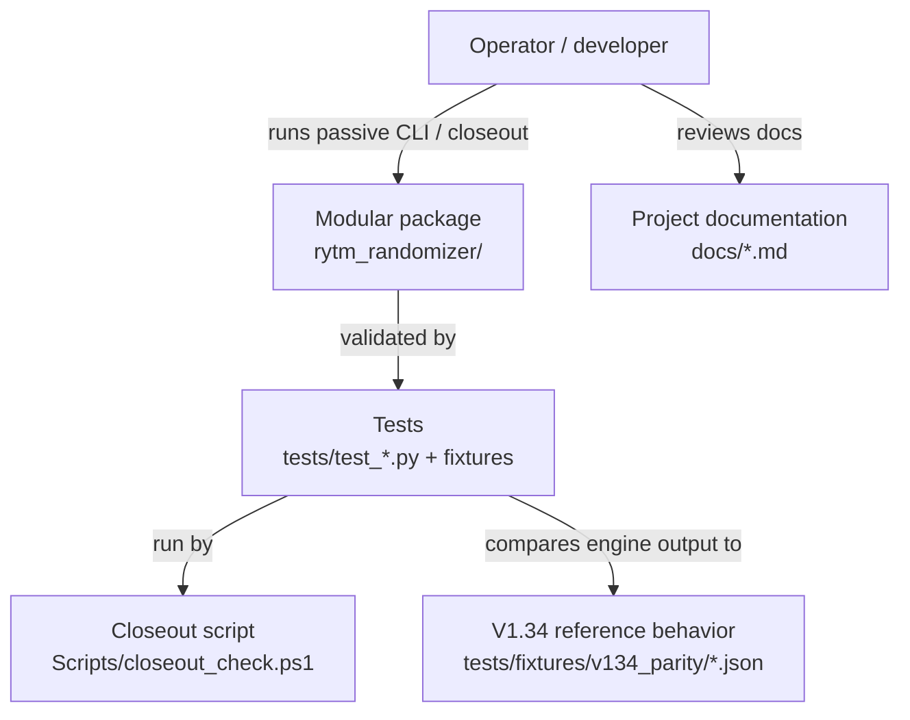

Current nuance:

- The V1.34 reference behavior is preserved as JSON goldens under
  `tests/fixtures/v134_parity/`. The original
  `rytm_hybrid_randomizer_v134.py` monolith was retired in 2026-05-17; the
  parity tests (`tests/test_engines_pad*`, `tests/test_group_runner.py`,
  `tests/test_scene_runner.py`) compare engine output to those fixtures via
  `tests/_parity_worker.py`.
- The modular package now owns the interactive runtime end-to-end:
  `rytm_randomizer.app` exposes the passive menu (default), `--arm` (real
  MIDI), and `--dry-run` (mock sender) modes. The interactive command loop
  lives in `rytm_randomizer.shell.InteractiveShell`.
- Closeout repeatedly verifies tests and the package's import smoke.

## 2. Package Layer Map

```mermaid
flowchart TB
    CLI["cli.py\npassive report/list/search/inspect/preview CLI"]
    App["app.py\nentry point: passive menu / --arm / --dry-run"]
    Shell["shell.py\ninteractive command shell"]
    Init["__init__.py\nexports constants only"]

    subgraph Metadata["Passive metadata"]
        Constants["constants.py"]
        Commands["commands.py"]
        Scenes["scenes.py"]
        Profiles["profiles.py"]
    end

    subgraph PassiveCore["Passive registry and preview core"]
        Registry["registry.py"]
        ProfileLookup["profile_lookup.py"]
        Inspection["inspection.py"]
        Preview["preview.py"]
        Audit["audit.py"]
    end

    subgraph BehaviorParity["Behavior parity evaluators"]
        MenuUtility["behavior_menu_utility.py"]
        AnchorProfile["behavior_anchor_profile.py"]
        MutationDepth["behavior_mutation_depth.py"]
        SceneGroup["behavior_scene_group.py"]
        Pad1["behavior_pad1_lane.py"]
        Pad2["behavior_pad2_lane.py"]
        Pad3["behavior_pad3_lane.py"]
        Pad4["behavior_pad4_lane.py"]
        SelectedProfile["behavior_selected_profile.py"]
        SelectedIsolated["behavior_selected_isolated_pad.py"]
        UndoCommit["behavior_undo_commit_state.py"]
        RuntimeState["selected_target_state.py\nanchor_state.py\nselected_isolated_pad_runtime_state.py"]
    end

    subgraph Reports["Read-only report surfaces (reports.py)"]
        RegistryReport["build/format/summarize_registry_report"]
        MockMapperReport["build/format/summarize_mock_mapper_report"]
        RuntimePlanReport["build/format/summarize_runtime_plan_report"]
        ActiveBoundaryReport["build/format/summarize_active_boundary_report"]
        AnchorProfileReport["build/format/summarize_anchor_profile_report"]
        CoverageReport["build/format/summarize_behavior_parity_coverage_report"]
        BridgeReport["build/format/summarize_mock_runtime_active_bridge_report"]
    end

    subgraph RuntimeMock["Runtime / active mock boundary"]
        MockMidi["mock_midi.py"]
        MockMapper["mock_message_mapper.py"]
        RuntimePlan["runtime_plan.py"]
        ActiveBoundary["active_boundary.py"]
        MockBridge["mock_runtime_active_bridge.py"]
        RealAdapter["real_midi_adapter.py\nimport-safe adapter boundary"]
    end

    CLI --> Registry
    CLI --> Preview
    CLI --> RegistryReport
    CLI --> MockMapperReport
    CLI --> RuntimePlanReport
    CLI --> ActiveBoundaryReport
    CLI --> AnchorProfileReport
    CLI --> CoverageReport
    CLI --> BridgeReport

    Registry --> Commands
    Registry --> Scenes
    Registry --> Profiles
    CommandLookup --> Commands
    SceneLookup --> Scenes
    ProfileLookup --> Profiles
    Inspection --> Validation["validation.py"]
    Preview --> Inspection
    Audit --> Validation

    Commands --> Constants
    Commands --> Scenes
    Profiles --> Constants

    BehaviorParity --> Commands
    BehaviorParity --> Profiles
    BehaviorParity --> Scenes
    BehaviorParity --> RuntimeState

    Reports --> BehaviorParity
    Reports --> RuntimePlan
    Reports --> ActiveBoundary
    Reports --> ProfileLookup

    MockMapper --> MockMidi
    MockMapper --> ProfileLookup
    RuntimePlanReport --> RuntimePlan
    ActiveBoundary --> MockMapper
    ActiveBoundary --> MockMidi
    MockBridge --> RuntimePlan
    MockBridge --> ActiveBoundary
    MockBridge --> MockMidi
    RealAdapter --> MockMidi
```

Current nuance:

- `cli.py` exposes passive visibility and formatter output only.
- `active_boundary.py` and `mock_runtime_active_bridge.py` are test/mock
  boundaries, not hardware execution paths.
- `real_midi_adapter.py` exists as an import-safe adapter boundary using
  injected providers. It does not import real MIDI libraries at module import
  time.

## 3. Passive CLI Command Flow

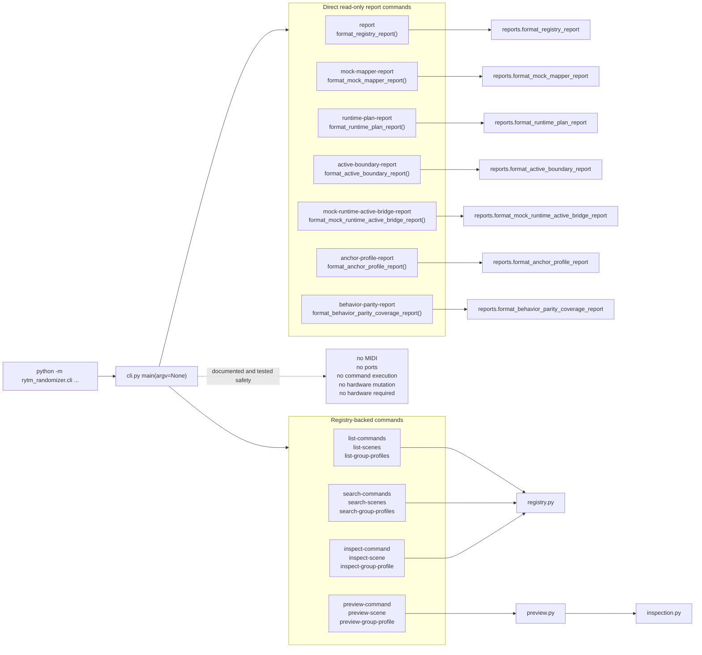

Current nuance:

- The CLI imports report formatter modules and passive registry/preview
  helpers.
- Tests assert the passive CLI does not introduce real MIDI imports, ports,
  active commands, bridge invocation, or sender construction.
- `mock-runtime-active-bridge-report` prints report data only; it does not call
  `evaluate_mock_runtime_active_bridge`.

## 4. Passive Metadata and Registry Graph

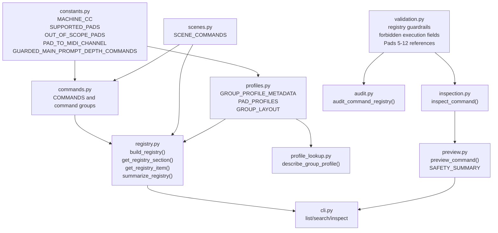

Current metadata scope from code:

- supported pads: `1`, `2`, `3`, `4`
- out-of-scope pads: `5` through `12`
- group profile metadata currently includes keys `2`, `3`, `4`, and `5`
- mock message mapper support is narrower than profile metadata support:
  - supported by mapper: `2`, `3`
  - unsupported/safe in mock mapper report: `4`
- runtime plan support is also narrower:
  - supported runtime planning keys: `2`, `3`
  - parked runtime planning key: `4`

## 5. Behavior Parity Evaluator Map

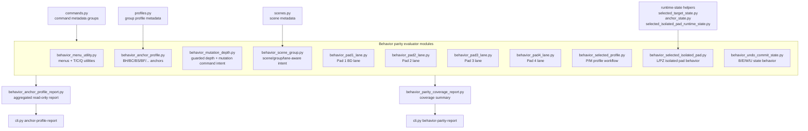

Current nuance:

- Behavior modules return passive result objects and metadata. They do not open
  ports or send MIDI.
- Packet constants in those files document which V1.34 command areas have been
  modeled.
- Report modules aggregate evaluator output into read-only CLI-visible text.

## 6. Runtime Planning and Active Boundary Flow

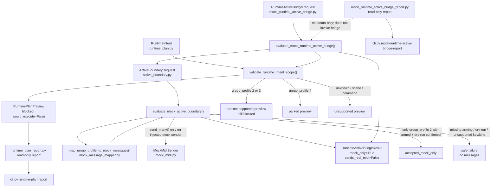

Current nuance:

- `runtime_plan.py` validates intent scope but always produces blocked previews
  with `would_execute=False`.
- `active_boundary.py` accepts only source kind `group_profile`, source key
  `2`, with arming and dry-run confirmation, and only through
  `MockMidiSender`.
- `mock_runtime_active_bridge.py` is test-only and routes a narrow request
  through runtime planning and active boundary evaluation.
- `mock_runtime_active_bridge_report.py` reports this contract without calling
  the bridge.

## 7. MIDI Boundary Map

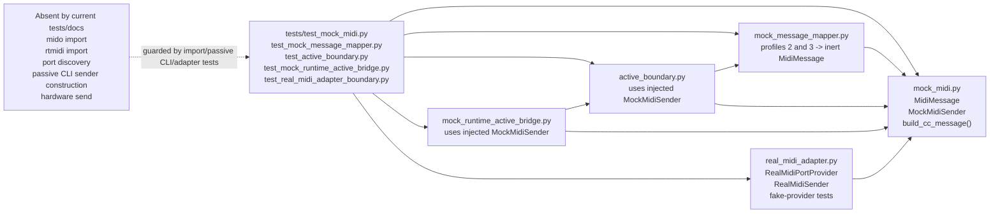

Current nuance:

- `mock_midi.py` is the in-memory mock boundary.
- `mock_message_mapper.py` supports group profile keys `2` and `3`.
- `real_midi_adapter.py` defines an import-safe adapter boundary and uses fake
  injected providers in tests. It does not import real MIDI libraries in module
  source.
- Passive CLI safety tests guard against importing or constructing real MIDI or
  sender behavior from passive CLI paths.

## 8. Report Surface Map

```mermaid
flowchart TB
    subgraph Reports["Formatter/report modules (consolidated in reports.py)"]
        RegistryReport["build/format/summarize_registry_report"]
        MockMapperReport["build/format/summarize_mock_mapper_report"]
        RuntimePlanReport["build/format/summarize_runtime_plan_report"]
        ActiveBoundaryReport["build/format/summarize_active_boundary_report"]
        AnchorProfileReport["build/format/summarize_anchor_profile_report"]
        CoverageReport["build/format/summarize_behavior_parity_coverage_report"]
        BridgeReport["build/format/summarize_mock_runtime_active_bridge_report"]
    end

    subgraph CLICommands["CLI report commands"]
        CLIRegistry["report"]
        CLIMockMapper["mock-mapper-report"]
        CLIRuntime["runtime-plan-report"]
        CLIActive["active-boundary-report"]
        CLIAnchor["anchor-profile-report"]
        CLICoverage["behavior-parity-report"]
        CLIBridge["mock-runtime-active-bridge-report"]
    end

    RegistryReport --> CLIRegistry
    MockMapperReport --> CLIMockMapper
    RuntimePlanReport --> CLIRuntime
    ActiveBoundaryReport --> CLIActive
    AnchorProfileReport --> CLIAnchor
    CoverageReport --> CLICoverage
    BridgeReport --> CLIBridge

    CLICommands --> Fixtures["tests/fixtures/cli_*_expected.txt"]
    CLICommands --> CLITests["tests/test_cli.py"]
```

Current nuance:

- Reports generally expose `build_*_report`, `summarize_*_report`, and
  `format_*_report` functions.
- CLI report commands use formatted report output and fixture-backed tests.
- Report modules are read-only visibility surfaces, not execution entry
  points.

## 9. Closeout and Test Coverage Map

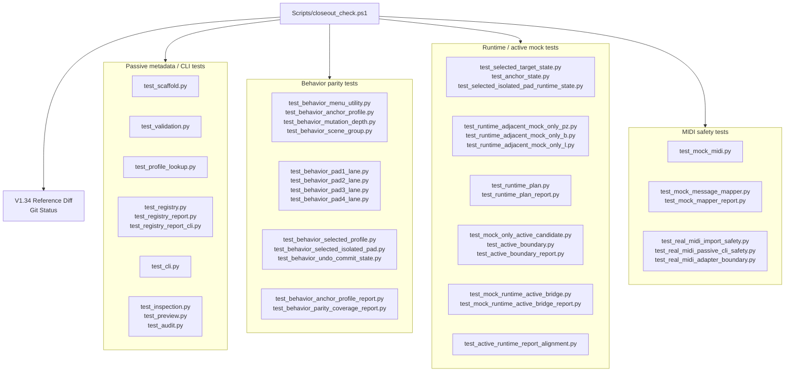

Current nuance:

- `Scripts/closeout_check.ps1` runs individual Python test files and then
  prints V1.34 reference diff and git status sections.
- The closeout suite currently includes passive CLI, behavior parity, runtime
  plan, active boundary, real MIDI safety, mock runtime bridge, and report
  coverage.

## 10. Current Safety Boundary Diagram

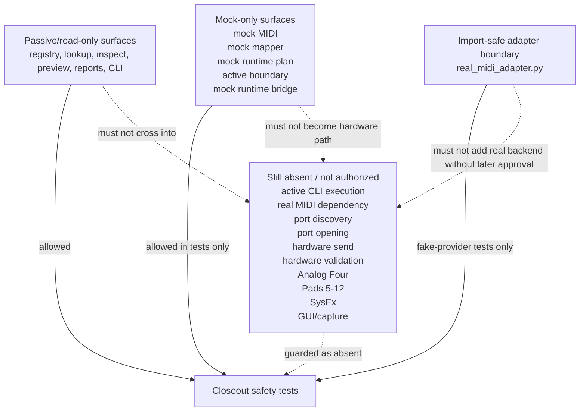

Current safety facts in code/tests/docs:

- passive CLI commands do not execute commands
- passive CLI commands do not open ports
- passive CLI commands do not send MIDI
- mock bridge report CLI does not invoke bridge behavior
- real MIDI adapter tests use fake providers
- package metadata remains protected from accidental MIDI dependency additions
- V1.34 reference remains protected by closeout

## 11. Current Command/Capability Surface

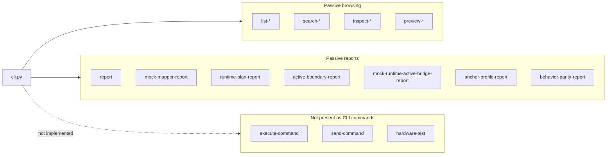

Current nuance:

- The CLI is visibility-first.
- No active execution command is present in `cli.py`.
- The closest active-facing surface is still report-only:
  `mock-runtime-active-bridge-report`.

## 12. Architecture Reading Guide

Use this map as follows:

- To understand what the operator can run, start with **Passive CLI Command
  Flow**.
- To understand where command/profile/scene data comes from, use **Passive
  Metadata and Registry Graph**.
- To understand V1.34 behavior-parity modeling, use **Behavior Parity
  Evaluator Map**.
- To understand the path toward active-facing work, use **Runtime Planning and
  Active Boundary Flow**.
- To understand why the project is still safe, use **MIDI Boundary Map** and
  **Current Safety Boundary Diagram**.
- To understand what closeout protects, use **Closeout and Test Coverage Map**.

## 13. Explicit Non-Claims

This document does not claim that the project currently has:

- real MIDI sending
- real MIDI dependency installation
- automatic hardware port discovery
- hardware validation
- active CLI execution
- scene execution
- command mutation execution
- Analog Four support
- Pads 5-12 support
- SysEx behavior
- GUI/capture behavior

Those remain absent unless a later committed code change and closeout evidence
prove otherwise.
