# RytmRandomizer Architecture Diagrams

## Purpose

This document maps the current application architecture using only the real
code, tests, scripts, and documentation structure present in this repository.

It does not describe desired future behavior as if it already exists. When a
component is a mock, report, passive preview, or guarded boundary, the diagram
labels it that way. Diagrams describing the upcoming codex dual-machine work
(§22) are explicitly labeled as forward-looking.

Current baseline used while creating / refreshing this document:

- Branch: Analog Four snapshot/style readiness bundle, built on the passive style profile/target/routing/render-plan/mock-preview and dual-machine mock-preview foundation.
- Protected reference: `tests/fixtures/v134_parity/*.json` (the retired V1.34 monolith's behavior, captured as 505 byte-frozen JSON golden files; parametrized into 685 pytest parity test items).
- Current package: `rytm_randomizer/` - 26 top-level Python files + 13 subpackages = 311 total Python modules. The 13 subpackages: `behavior/`, `cockpit/`, `data/`, `devices/` (with nested `devices/strategies/`), `dual_machine/`, `engines/`, `guardrails/`, `observability/`, `reports/`, `senders/`, `snapshot/`, `state/`, `style_analysis/`.
- Closeout scripts: `Scripts/closeout_check.ps1` (PowerShell, Windows) and `scripts/closeout_check.py` (Python, cross-platform).
- This file was audited and refreshed as part of PR #43, then updated through the style-profile, style-target-vector, Rytm style snapshot routing, Analog Four style snapshot routing, dual-machine style routing, reference/discovery slider, Rytm/Analog Four style mutation-intent, dual-machine style mutation-intent, Rytm style mutation render-plan, Rytm style mutation mock-preview, Analog Four style mutation mock-preview, dual-machine style mutation mock-preview, Analog Four saved-kit SysEx readiness-intake, Analog Four kit-catalog, Analog Four initialized baseline, Analog Four patch genome, Analog Four patch learning, Analog Four patch corpus, Analog Four patch send-plan, Analog Four SysEx Filter1 Frequency/Resonance calibration, Analog Four style kit-readiness, Analog Four kit-fingerprint, Analog Four OXI macro set planner, live runbook, stage-routing, stage-rehearsal-state, live-set-cockpit, live-show-export, live-transition-timeline, live-command-deck, live-state-packet, live-readiness, live-control-surface, live-analyzer-handoff, live-analyzer-targets, live GUI analyzer readiness, live GUI rehearsal session, live GUI capture queue, live GUI capture review, live GUI sidecar session, live GUI screen contract, live GUI render tree, live GUI analyzer overlay, live GUI analyzer frame, live GUI interaction script, live GUI action reducer, live GUI controller state, live GUI playback transcript, live GUI playback validation, live GUI test-harness contract, live GUI test-harness readiness, live GUI implementation bridge, live GUI desktop blueprint, live GUI desktop app plan, live GUI desktop component contract, live GUI desktop view-model, live GUI desktop render-contract, cockpit send-plan operator-readiness, cockpit send-plan rehearsal-surface, live-kit capture workbench, live-kit package audition, live-kit operator package, live-kit operator review ledger, reference-style blueprint, manual-feedback packet, and generic MIDI event-plan sender slices so the strategy/report-module list and counts stay current.

## Source Files Used

| Area | Files |
|---|---|
| Package entry points | `rytm_randomizer/app.py`, `rytm_randomizer/cli.py`, `rytm_randomizer/shell.py`, `rytm_randomizer/__init__.py` |
| Passive metadata | `rytm_randomizer/constants.py`, `rytm_randomizer/commands.py`, `rytm_randomizer/scenes.py`, `rytm_randomizer/profiles.py` |
| Data layer (single source of truth) | `rytm_randomizer/data/{param_maps,plans,profiles,scenes,scene_display,modes,analog_four_display,analog_four_sysex_calibration,analog_four_patch_templates,analog_four_patch_corpus,analog_four_learning,analog_four_midi,rytm_machine_catalog,style_discovery,style_profiles,style_targets,manual_feedback_packet,controller_mapping_profiles,controller_rehearsal_scenarios}.py` |
| Registry, lookup, inspection | `rytm_randomizer/registry.py`, `rytm_randomizer/profile_lookup.py`, `rytm_randomizer/inspection.py`, `rytm_randomizer/validation.py`, `rytm_randomizer/cli_registry.py` |
| Report surfaces | `rytm_randomizer/reports/__init__.py` + `reports/{_passive_section,formatter,manual_feedback_packet,cockpit_send_plan_operator_readiness,cockpit_send_plan_rehearsal_surface,controller_brain_rehearsal,controller_mapping_profile_catalog,reference_style_blueprint,analog_four_baseline,analog_four_kit_catalog,analog_four_patch_genome,analog_four_patch_learning,analog_four_patch_corpus,analog_four_patch_send_plan,analog_four_oxi_macro_set_planner,analog_four_style_kit_readiness,analog_four_style_mutation_intent,analog_four_style_mutation_mock_preview,analog_four_style_snapshot_routing,dual_machine_style_kit_readiness,dual_machine_style_kit_selection,dual_machine_style_live_audition,dual_machine_style_mutation_intent,dual_machine_style_mutation_mock_preview,dual_machine_style_performance_set_plan,dual_machine_style_selection_mock_preview,dual_machine_style_snapshot_routing,live_analyzer_handoff,live_analyzer_targets,live_command_deck,live_control_surface,live_gui_action_reducer,live_gui_analyzer_frame,live_gui_analyzer_overlay,live_gui_analyzer_readiness,live_gui_capture_queue,live_gui_capture_review,live_gui_controller_state,live_gui_desktop_app_plan,live_gui_desktop_blueprint,live_gui_desktop_component_contract,live_gui_desktop_view_model,live_gui_implementation_bridge,live_gui_interaction_script,live_gui_performance_console_model,live_gui_playback_transcript,live_gui_playback_validation,live_gui_rehearsal_session,live_gui_render_tree,live_gui_screen_contract,live_gui_sidecar_session,live_gui_test_harness_contract,live_gui_test_harness_readiness,live_performance_readiness,live_performance_runbook,live_performance_state,live_set_cockpit,live_show_export,live_stage_rehearsal_state,live_stage_snapshot_routing,live_transition_timeline,rytm_machine_matrix,rytm_snapshot_pad_compatibility,rytm_snapshot_intelligence,rytm_snapshot_mutation_preview,rytm_style_kit_readiness,rytm_style_mutation_intent,rytm_style_mutation_mock_preview,rytm_style_mutation_render_plan,rytm_style_snapshot_routing,style_performance_arcs,style_profiles,style_targets}.py` plus `reports/performance_console/{live_kit_capture_workbench,live_kit_package_audition,live_kit_operator_package,live_kit_operator_review_ledger,payload_helpers}.py` (subpackage; was the old top-level `reports.py`) |
| Behavior parity evaluators | `rytm_randomizer/behavior/*.py` (subpackage; was 8 top-level `behavior_*.py` files) |
| Runtime-adjacent state | `rytm_randomizer/state/{anchor,group,pad_mode,scene,selection,anchor_validation,selected_target_validation,selected_isolated_pad_validation}.py` |
| Mock MIDI + mapping | `rytm_randomizer/mock_midi.py`, `rytm_randomizer/mock_message_mapper.py`, `rytm_randomizer/mock_runtime_active_bridge.py` |
| Active / real MIDI boundaries | `rytm_randomizer/active_boundary.py`, `rytm_randomizer/real_midi_adapter.py`, `rytm_randomizer/mido_provider.py`, `rytm_randomizer/midi_io.py` |
| Generic senders | `rytm_randomizer/senders/{guarded,hardware,midi_event_plan}.py` |
| Engines (per-pad runtime cores) | `rytm_randomizer/engines/{_runtime,pad1,pad2,pad3,pad4}.py`, `rytm_randomizer/randomization.py`, `rytm_randomizer/scene_runner.py`, `rytm_randomizer/group_runner.py`, `rytm_randomizer/runtime_plan.py` |
| Devices (cross-machine boundary) | `rytm_randomizer/devices/{base,registry,analog_rytm,analog_four}.py`, `rytm_randomizer/devices/strategies/{analog_four_offset_manifest,analog_four_snapshot_decoder,analog_four_style_snapshot_routing,analog_four_style_mutation_intent,analog_four_style_mutation_mock_preview,analog_four_mutation_planner,analog_four_message_renderer,analog_rytm_snapshot_decoder,analog_rytm_snapshot_routing,analog_rytm_style_snapshot_routing,analog_rytm_style_mutation_intent,analog_rytm_style_mutation_mock_preview,analog_rytm_style_mutation_render_plan,analog_rytm_mutation_planner,analog_rytm_message_renderer}.py` |
| Snapshot Protocols + envelope | `rytm_randomizer/snapshot/{envelope,decoder,planner,mock_runtime,sysex_file}.py` |
| Guardrails | `rytm_randomizer/guardrails/{resolver,store,schema,validation}.py` |
| Observability | `rytm_randomizer/observability/{logging,tracing,metrics,errors}.py` |
| Style analysis | `rytm_randomizer/style_analysis/{extractor,feature_report,library,blueprint,analog_four_patch_genome,analog_four_patch_learning,analog_four_patch_corpus,analog_four_patch_send_plan}.py` |
| Tests | `tests/test_*.py`, `tests/architecture/test_*.py`, `tests/fixtures/v134_parity/`, `tests/_parity_worker.py`, `tests/conftest.py` |
| Project documentation | `CONTRIBUTING.md`, `docs/*.md`, `.claude/rules/*.md`, `.claude/skills/**/SKILL.md` |

---

## 1. Repository-Level System Map

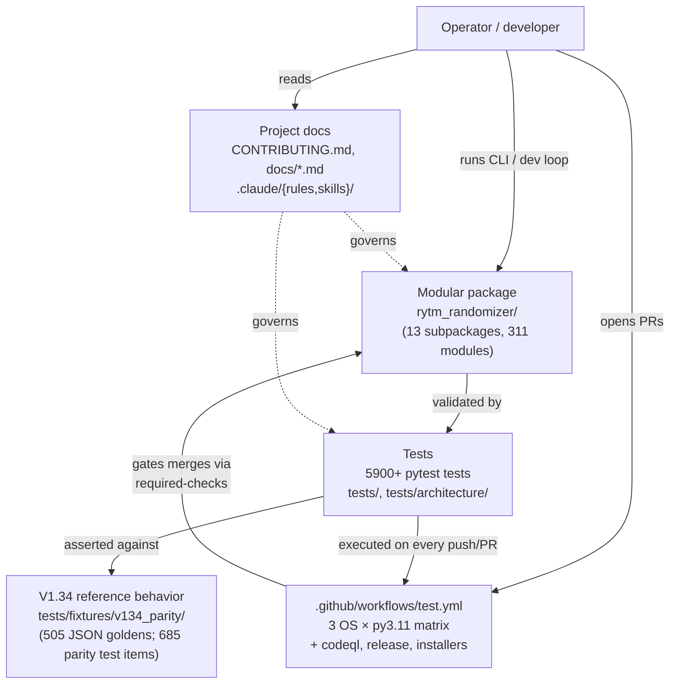

**Current nuance:**

- The V1.34 reference behavior is preserved as 505 JSON golden files (parametrized into 685 pytest test items). The original `rytm_hybrid_randomizer_v134.py` monolith was retired in 2026-05-17 (PR #29); the parity tests compare engine output to those fixtures via `tests/_parity_worker.py`.
- The modular package owns the interactive runtime end-to-end: `rytm_randomizer.app` exposes passive menu (default), `--arm` (real MIDI), and `--dry-run` (mock sender) modes. The interactive command loop lives in `rytm_randomizer.shell.InteractiveShell`.
- CI is the source-of-truth merge gate; `required-checks` aggregates per-PR results across all 3 OSes (macOS dropped on pull_request events by design, included on push).

---

## 2. Package Layer Map

The package layout as of `modularize-v1.34` @ `df54b3f` + the Strategy seam landing on PR #43.

```mermaid
flowchart TB
    subgraph EntryPoints["Entry points"]
        Init["__init__.py<br/>exports constants"]
        App["app.py<br/>--arm / --dry-run / passive"]
        CLI["cli.py<br/>passive CLI"]
        Shell["shell.py<br/>InteractiveShell + DispatchEntry"]
        HelpText["help_text.py"]
    end

    subgraph DataLayer["Data layer (single source of truth)"]
        DataPM["data/param_maps.py<br/>MACHINE_CC, per-machine dicts"]
        DataProfiles["data/profiles.py<br/>PROFILES, GROUP_LAYOUT"]
        DataScenes["data/scenes.py + scene_display.py"]
        DataPlans["data/plans.py"]
        DataModes["data/modes.py<br/>Literal aliases + Final tuples"]
        DataStyleProfiles["data/style_profiles.py<br/>passive techno style intent catalog"]
        DataStyleTargets["data/style_targets.py<br/>passive numeric style target vectors"]
        DataStyleDiscovery["data/style_discovery.py<br/>reference/discovery slider policy"]
        DataA4Display["data/analog_four_display.py<br/>A4 screen scales + labels"]
        DataA4SysexCalibration["data/analog_four_sysex_calibration.py<br/>A4 SysEx calibration facts"]
        DataA4PatchTemplates["data/analog_four_patch_templates.py<br/>A4 patch candidate facts"]
        DataA4PatchCorpus["data/analog_four_patch_corpus.py<br/>A4 patch corpus starter vectors"]
        DataA4Learning["data/analog_four_learning.py<br/>A4 patch learning routes"]
        DataControllerMapping["data/controller_mapping_profiles.py<br/>passive 16-encoder controller intent profiles"]
        DataControllerRehearsal["data/controller_rehearsal_scenarios.py<br/>passive virtual controller gesture scenarios"]
    end

    subgraph PassiveMetadata["Passive metadata"]
        Constants["constants.py"]
        Commands["commands.py"]
        Profiles["profiles.py"]
        Scenes["scenes.py"]
    end

    subgraph RegistryCore["Registry / lookup / inspection"]
        Registry["registry.py"]
        ProfileLookup["profile_lookup.py"]
        Inspection["inspection.py"]
        Validation["validation.py"]
        CliRegistry["cli_registry.py<br/>CliCommand registry"]
    end

    subgraph BehaviorPkg["behavior/ subpackage (8 modules)<br/>(WS-M2 moved 11 top-level behavior_*.py here;<br/>4 pad_*_lane.py modules then consolidated<br/>into one pad_lane.py)"]
        BehPadLane["pad_lane.py<br/>(consolidated Pad1/2/3/4 lane)"]
        BehOther["anchor_profile<br/>mutation_depth<br/>scene_group<br/>menu_utility<br/>selected_profile<br/>selected_isolated_pad<br/>undo_commit_state"]
    end

    subgraph StatePkg["state/ subpackage"]
        StateCore["anchor / group / pad_mode<br/>scene / selection"]
        StateValidation["anchor_validation<br/>selected_target_validation<br/>selected_isolated_pad_validation"]
    end

    subgraph EnginesPkg["engines/ subpackage"]
        EngRuntime["_runtime.py<br/>PadRuntimeMixin + IsolatedPadMixin<br/>PadRuntime dataclass"]
        EngPads["pad1 / pad2 / pad3 / pad4"]
    end

    subgraph DevicesPkg["devices/ subpackage<br/>(WS-S5 + Strategy seam)"]
        DevBase["base.py<br/>Device, MidiOutbox,<br/>MessageRenderer Protocols"]
        DevRegistry["registry.py<br/>register_device, get_device, all_devices"]
        DevAR["analog_rytm.py<br/>AnalogRytmDevice"]
        DevA4["analog_four.py<br/>AnalogFourDevice"]
        DevStrategies["strategies/<br/>analog_rytm_{snapshot_decoder,<br/>snapshot_routing,<br/>style_snapshot_routing,<br/>style_mutation_intent,<br/>style_mutation_render_plan,<br/>style_mutation_mock_preview,<br/>mutation_planner,<br/>message_renderer}.py<br/>analog_four_{offset_manifest,<br/>snapshot_decoder,<br/>style_snapshot_routing,<br/>style_mutation_intent,<br/>style_mutation_mock_preview,<br/>mutation_planner,<br/>message_renderer}.py"]
    end

    subgraph SnapshotPkg["snapshot/ subpackage<br/>(WS-S6 envelope + 3 Protocols)"]
        SnapEnvelope["envelope.py<br/>ELEKTRON_MFR_ID +<br/>unpack_elektron_7bit +<br/>find_kit_record +<br/>read_ascii_name"]
        SnapProto["decoder / planner / mock_runtime<br/>Protocols"]
    end

    subgraph GuardrailsPkg["guardrails/"]
        GResolver["resolver.py<br/>ResolvedBounds"]
        GStore["store.py"]
        GSchema["schema.py"]
        GValidation["validation.py<br/>PAD_PROFILE_KEY"]
    end

    subgraph ReportsPkg["reports/ subpackage<br/>(was reports.py)"]
        RInit["__init__.py<br/>report builders"]
        RFormatter["formatter.py<br/>PassiveReportHeader"]
        RManualFeedback["manual_feedback_packet.py<br/>passive manual feedback evidence packet<br/>+ registered CliCommand"]
        RMatrix["rytm_machine_matrix.py<br/>12-pad machine report + CliCommand"]
        RSnapshot["rytm_snapshot_pad_compatibility.py<br/>snapshot-safe pad/machine report + CliCommand"]
        RSnapshotIntel["rytm_snapshot_intelligence.py<br/>decoded/routed/file-backed snapshot readiness report<br/>+ registered CliCommand"]
        RSnapshotPreview["rytm_snapshot_mutation_preview.py<br/>passive snapshot mutation preview + event rows<br/>+ registered CliCommand"]
        RStyleRouting["rytm_style_snapshot_routing.py<br/>passive style-to-snapshot routing report<br/>+ registered CliCommand"]
        RStyleIntent["rytm_style_mutation_intent.py<br/>passive style mutation intent report<br/>+ registered CliCommand"]
        RStyleRenderPlan["rytm_style_mutation_render_plan.py<br/>passive style render-plan target windows<br/>+ registered CliCommand"]
        RStyleMockPreview["rytm_style_mutation_mock_preview.py<br/>passive style mock CC preview rows<br/>+ registered CliCommand"]
        RA4StyleRouting["analog_four_style_snapshot_routing.py<br/>passive A4 style-to-snapshot routing report<br/>+ registered CliCommand"]
        RA4StyleIntent["analog_four_style_mutation_intent.py<br/>passive A4 style mutation intent report<br/>+ registered CliCommand"]
        RA4StyleMockPreview["analog_four_style_mutation_mock_preview.py<br/>passive A4 style mock/deferred rows<br/>+ registered CliCommand"]
        RA4KitCatalog["analog_four_kit_catalog.py<br/>passive A4 decoded kit catalog<br/>+ registered CliCommand"]
        RA4Baseline["analog_four_baseline.py<br/>passive A4 initialized baseline report<br/>+ registered CliCommand"]
        RA4PatchGenome["analog_four_patch_genome.py<br/>passive A4 patch genome report<br/>+ registered CliCommand"]
        RA4PatchLearning["analog_four_patch_learning.py<br/>passive A4 patch learning report<br/>+ registered CliCommand"]
        RA4PatchCorpus["analog_four_patch_corpus.py<br/>passive A4 patch corpus report<br/>+ registered CliCommand"]
        RA4PatchSendPlan["analog_four_patch_send_plan.py<br/>passive A4 patch send-plan report<br/>+ registered CliCommand"]
        RA4OxiMacroSetPlanner["analog_four_oxi_macro_set_planner.py<br/>passive A4 OXI macro set planner<br/>+ registered CliCommand"]
        RControllerMapping["controller_mapping_profile_catalog.py<br/>passive 16-encoder controller-brain report<br/>+ registered CliCommand"]
        RControllerRehearsal["controller_brain_rehearsal.py<br/>passive controller-brain rehearsal/export packet<br/>+ registered CliCommand"]
        RControllerLiveRunbook["controller_brain_live_runbook.py<br/>passive controller-brain live runbook<br/>+ registered CliCommand"]
        RControllerLiveState["controller_brain_live_state.py<br/>passive controller-brain live state packet<br/>+ registered CliCommand"]
        RControllerBridgeReadiness["controller_brain_live_bridge_readiness.py<br/>passive controller-brain bridge readiness packet<br/>+ registered CliCommand"]
        RControllerDispatchRehearsal["controller_brain_live_dispatch_rehearsal.py<br/>passive controller-brain shadow dispatch rehearsal<br/>+ registered CliCommand"]
        RControllerFeedbackRehearsal["controller_brain_live_feedback_rehearsal.py<br/>passive controller-brain feedback rehearsal<br/>+ registered CliCommand"]
        RControllerCockpitHandoff["controller_brain_live_cockpit_handoff.py<br/>passive controller-brain Cockpit handoff<br/>+ registered CliCommand"]
        RControllerImplementationBridge["controller_brain_live_implementation_bridge.py<br/>passive controller-brain GUI implementation bridge<br/>+ registered CliCommand"]
        RControllerDesktopBlueprint["controller_brain_live_desktop_blueprint.py<br/>passive controller-brain desktop blueprint<br/>+ registered CliCommand"]
        RControllerDesktopAppPlan["controller_brain_live_desktop_app_plan.py<br/>passive controller-brain desktop app plan<br/>+ registered CliCommand"]
        RControllerDesktopComponentContract["controller_brain_live_desktop_component_contract.py<br/>passive controller-brain desktop component contract<br/>+ registered CliCommand"]
        RControllerDesktopViewModel["controller_brain_live_desktop_view_model.py<br/>passive controller-brain desktop view model<br/>+ registered CliCommand"]
        RControllerDesktopRenderContract["controller_brain_live_desktop_render_contract.py<br/>passive controller-brain desktop render contract<br/>+ registered CliCommand"]
        RDualStyleRouting["dual_machine_style_snapshot_routing.py<br/>passive rig-level style routing report<br/>+ registered CliCommand"]
        RDualStyleIntent["dual_machine_style_mutation_intent.py<br/>passive rig-level style mutation intent report<br/>+ registered CliCommand"]
        RDualStyleMockPreview["dual_machine_style_mutation_mock_preview.py<br/>passive rig-level style mock-preview report<br/>+ registered CliCommand"]
        RStyleProfiles["style_profiles.py<br/>passive techno style profile catalog<br/>+ registered CliCommand"]
        RStyleTargets["style_targets.py<br/>passive numeric target-vector catalog<br/>+ registered CliCommand"]
        RReferenceBlueprint["reference_style_blueprint.py<br/>passive 12-pad + A4 reference-style blueprint<br/>+ registered CliCommand"]
        RLiveCommandDeck["live_command_deck.py<br/>passive current-cue command deck<br/>+ registered CliCommand"]
        RLivePerformanceState["live_performance_state.py<br/>passive GUI-ready live state packet<br/>+ registered CliCommand"]
    end

    subgraph ObservabilityPkg["observability/"]
        OLogging["logging.py"]
        OTracing["tracing.py"]
        OMetrics["metrics.py<br/>MidiMetrics singleton"]
        OErrors["errors.py<br/>raises taxonomy"]
    end

    subgraph MidiBoundary["MIDI boundaries"]
        MidiIO["midi_io.py<br/>send_cc, send_param<br/>MidiSender Protocol"]
        MockMidi["mock_midi.py<br/>MidiMessage, MockMidiSender"]
        MockMapper["mock_message_mapper.py"]
        MockBridge["mock_runtime_active_bridge.py"]
        ActiveBoundary["active_boundary.py"]
        RealAdapter["real_midi_adapter.py<br/>(lazy mido import)"]
        MidoProvider["mido_provider.py"]
    end

    subgraph SendersPkg["senders/ subpackage"]
        SendGuarded["guarded.py<br/>generic guarded/mock Device plan sender"]
        SendHardware["hardware.py<br/>arm-gated Device plan sender"]
        SendMidiEventPlan["midi_event_plan.py<br/>generic CC/NRPN event-plan sender"]
    end

    subgraph RuntimePkg["Runtime orchestration"]
        Randomization["randomization.py"]
        SceneRunner["scene_runner.py"]
        GroupRunner["group_runner.py"]
        RuntimePlan["runtime_plan.py"]
    end

    subgraph StyleAnalysis["style_analysis/"]
        SAExtractor["extractor / feature_report / library / blueprint"]
        SAPatchGenome["analog_four_patch_genome.py<br/>FeatureReport -> A4 patch candidates"]
        SAPatchLearning["analog_four_patch_learning.py<br/>candidate ranking + trait routes"]
        SAPatchCorpus["analog_four_patch_corpus.py<br/>corpus nearest-match ranking"]
        SAPatchSendPlan["analog_four_patch_send_plan.py<br/>selected candidate -> CC/NRPN plan"]
    end

    Init -.-> Constants
    App --> Shell
    App --> CLI
    Shell --> EnginesPkg
    Shell --> BehaviorPkg
    Shell --> RegistryCore
    CLI --> RegistryCore
    CLI --> ReportsPkg
    CLI --> CliRegistry

    BehaviorPkg --> Commands
    BehaviorPkg --> DataLayer
    BehaviorPkg --> StatePkg

    EnginesPkg --> DataLayer
    EnginesPkg --> MidiIO
    EnginesPkg --> GuardrailsPkg
    EnginesPkg --> ObservabilityPkg

    DevAR --> DevStrategies
    DevA4 --> DevStrategies
    DevStrategies --> SnapshotPkg
    DevStrategies --> DataLayer
    DevAR --> DevRegistry
    DevBase --> SnapshotPkg

    GroupRunner --> EnginesPkg
    SceneRunner --> EnginesPkg
    RuntimePlan --> DataLayer

    MidiIO --> MockMidi
    MidiIO --> ObservabilityPkg
    MockMapper --> MockMidi
    ActiveBoundary --> MockMidi
    MockBridge --> ActiveBoundary
    RealAdapter --> MidoProvider
    SendersPkg --> MidiIO
    SendersPkg --> MockMidi
    SendHardware --> RealAdapter

    ReportsPkg --> RFormatter
    ReportsPkg --> RegistryCore
    ReportsPkg --> BehaviorPkg
    ReportsPkg --> StyleAnalysis
    StyleAnalysis --> DataLayer
    App --> SendersPkg
```

**Subpackage count (audit baseline):** 13 (`behavior/`, `cockpit/`, `data/`, `devices/`, `dual_machine/`, `engines/`, `guardrails/`, `observability/`, `reports/`, `senders/`, `snapshot/`, `state/`, `style_analysis/`). Plus `devices/strategies/` as a nested subpackage under `devices/`. The architecture test `test_no_new_top_level_modules.py` mechanically rejects new top-level modules (Gate 9).

---

## 3. Device + Strategy Capability Stack (WS-S5 + Strategy)

The cross-machine boundary. This is the abstraction PR #43 widens.

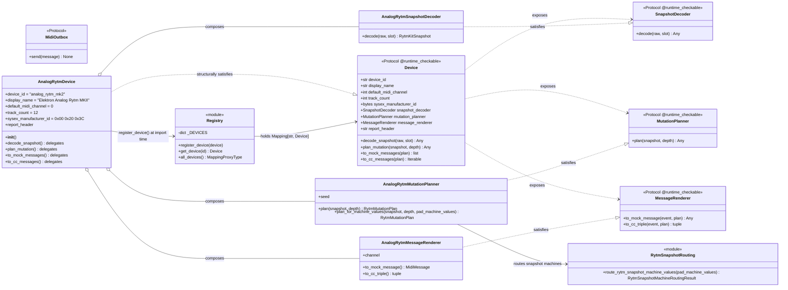

**Key:**

- **Protocol vs class.** `Device`, `SnapshotDecoder`, `MutationPlanner`, `MessageRenderer`, `MidiOutbox` are `@runtime_checkable Protocol`s. They're not inherited from — concrete classes match structurally. This is Gate 6 (type-system hygiene) and lets PR #21 / PR #36's `AnalogFourDevice` drop in without inheritance gymnastics.
- **Composition over inheritance.** `AnalogRytmDevice` and `AnalogFourDevice` construct strategy instances in `__init__` and delegate their convenience methods to them. The strategies don't know about each other except through their shared device-family types (`RytmKitSnapshot`, `RytmMutationPlan`, `RytmPlanEvent`, `AnalogFourKitSnapshot`, and `AnalogFourMutationPlan`).
- **Import-time registration.** `analog_rytm.py` calls `register_device(AnalogRytmDevice())` at module load. The `devices/__init__.py` imports `analog_rytm` for the side effect; consumers get a non-empty registry on first import.
- **Adding a new family** = one device class + three strategy modules + register at import. No parallel sibling subpackages allowed (enforced by `test_device_protocol_enforcement.py`).

---

## 4. Snapshot → Plan → Render Lifecycle (one Rytm CC)

The lifecycle of one parameter change, from incoming SysEx bytes to one outgoing CC. This is what generic guarded / hardware senders will consume once they're written.

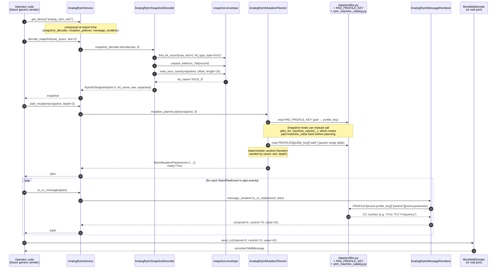

**Determinism guarantee:** the same `(snapshot, depth)` + the same planner `seed` always produce the same `RytmMutationPlan`. The same `(event, plan)` always produces the same triple. Renderers and decoders are pure — no I/O, no randomness, no state. This is what makes the generic senders' `for event in plan.events: out.send(renderer.to_mock_message(event, plan))` work.

---

## 5. Device + Strategy Composition vs Old "Stub" Shape

The Strategy seam landed in PR #43 replaces what was previously `NotImplementedError` stubs on `AnalogRytmDevice`. The diff is structural, not just behavioral.

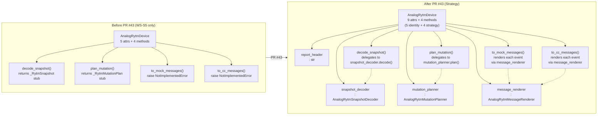

**What the seam unlocks:** future generic `senders/{guarded,hardware}.py` modules consume `Device.message_renderer` directly. The 8 near-identical per-device sender modules in codex's dual-machine cascade (analog_four/, dual_machine/, essence/) collapse to 2 generic modules + per-device `MessageRenderer` strategies. See §22 for the post-PR #43 codex shape.

---

## 6. Engines Subpackage (pads 1-4 runtime cores)

The engines own the V1.34 parity behavior — these are byte-frozen against the JSON goldens.

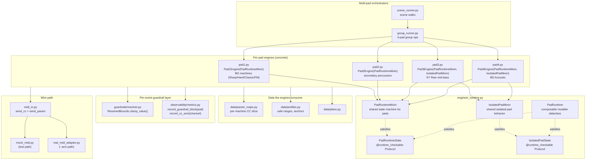

**Parity:** the 505 V1.34 golden files at `tests/fixtures/v134_parity/` (parametrized into 685 pytest test items) are diffed against `Pad{1-4}Engine` output by `test_engines_pad{1-4}.py`, `test_group_runner.py`, and `test_scene_runner.py`. Any change that alters byte-for-byte output of these engines fails parity tests.

**WS-S2 Protocol layer:** `PadRuntimeState` / `IsolatedPadState` / `PadRuntime` exist so future engines (pad 5-12, A4 tracks) can satisfy the contract structurally without inheriting from the existing mixins.

---

## 7. Data Layer + Guardrails Subpackage

Single source of truth for "tables of facts" + the safety/policy layer that gates mutations.

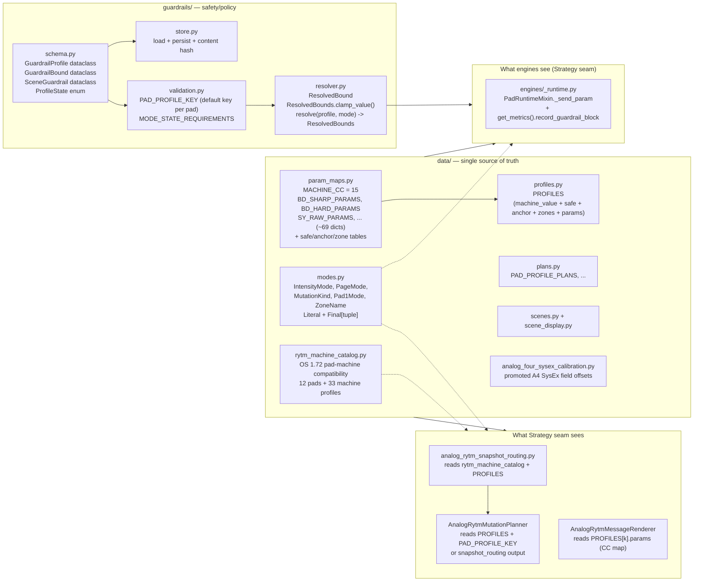

**Architecture test:** `test_data_not_code.py` enforces that "tables of facts" live only in `data/` and no other module re-defines a `data/` name (Gate 9 + data-vs-code rule).

**Cross-layer note (follow-up for a future PR):** `PAD_PROFILE_KEY` currently lives in `guardrails/validation.py` but is *configuration data* (pad → default profile key). It should move into `data/` proper. Out of scope for PR #43, flagged in the AnalogRytmMutationPlanner docstring.

---

## 8. Observability Tripod

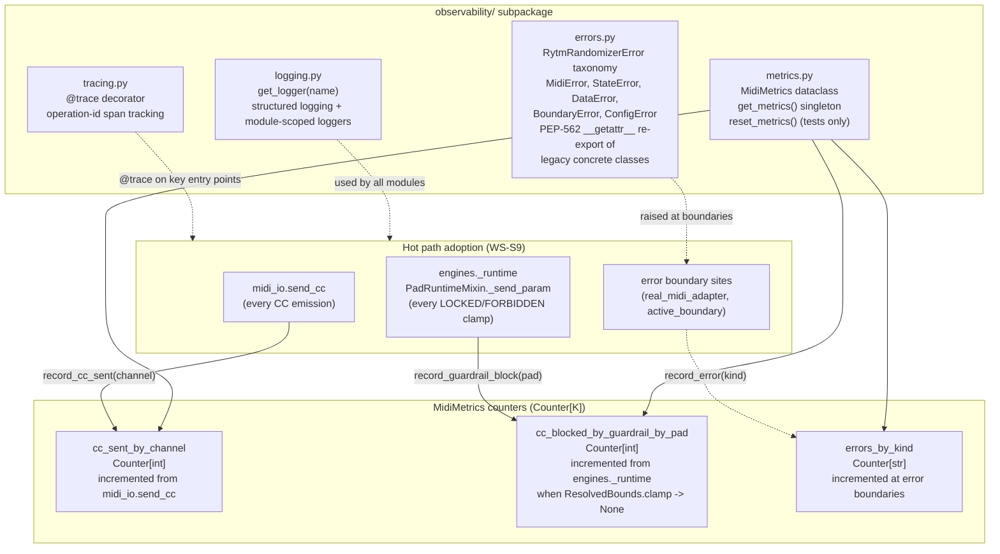

**Architecture test:** `test_observability.py` enforces that the hot path actually adopts `get_metrics().record_*` (Gate 7).

**Singleton + reset:** `MidiMetrics` is a module-level singleton accessed via `get_metrics()`. `reset_metrics()` is the test escape hatch — it zeroes the counters in place so the singleton identity stays stable for cached references.

---

## 9. Snapshot Subpackage (WS-S6 envelope + Protocols)

The shared Elektron SysEx envelope helpers + the three Protocols every per-device decoder/planner/runtime implements.

```mermaid
flowchart TB
    subgraph Envelope["snapshot/envelope.py (shared)"]
        MFR_ID["ELEKTRON_MFR_ID: Final[bytes]<br/>= 0x00 0x20 0x3C"]
        Pack["pack_elektron_7bit(unpacked)<br/>inverse of shared unpacking"]
        Unpack["unpack_elektron_7bit(packed)<br/>rejects lone trailing header<br/>(codex P2)"]
        KitCodec["ElektronKitCodec<br/>validated reference decode/encode<br/>device-configured checksum + length"]
        U14["encode/decode_elektron_u14<br/>two legal SysEx data bytes"]
        FindKit["find_kit_record(raw, slot, type_byte)<br/>scans for kit-type byte"]
        ReadName["read_ascii_name(record, offset, length)<br/>NUL-stripped ASCII"]
        FormatID["format_manufacturer_id(raw)"]
    end

    subgraph Protocols["snapshot/{decoder,planner,mock_runtime}.py"]
        SD["SnapshotDecoder Protocol<br/>decode(raw, slot) -> Any"]
        MP_proto["MutationPlanner Protocol<br/>plan(snapshot, depth) -> Any"]
        MockProto["MockRuntime Protocol<br/>capture_messages(plan) -> list"]
        BaseMockRuntime["BaseMockRuntime ABC<br/>capture_messages(plan, device)<br/>forwards to outbox + device.to_mock_messages"]
    end

    subgraph RytmImpls["Rytm impls (devices/strategies/)"]
        DeviceCodecs["elektron_kit_codecs.py<br/>A4 + Rytm envelope facts only"]
        RytmDecoder["AnalogRytmSnapshotDecoder<br/>uses envelope helpers"]
        RytmRouter["analog_rytm_snapshot_routing.py<br/>routes pad/machine values to profile keys"]
        RytmPlanner["AnalogRytmMutationPlanner<br/>(no shared planner state needed)"]
    end

    subgraph FutureImpls["Future device impls<br/>(PR #36 redo target)"]
        A4Decoder["AnalogFourSnapshotDecoder<br/>(MUST use shared envelope helpers,<br/>not fork them)"]
        A4Planner["AnalogFourMutationPlanner<br/>(produces ready=False<br/>while manifest-gated)"]
    end

    RytmDecoder -->|"depends on"| Envelope
    DeviceCodecs -->|"configures"| KitCodec
    RytmDecoder -.satisfies.-> SD
    RytmRouter --> RytmPlanner
    RytmPlanner -.satisfies.-> MP_proto

    A4Decoder -->|"MUST depend on"| Envelope
    A4Decoder -.must satisfy.-> SD
    A4Planner -.must satisfy.-> MP_proto

    BaseMockRuntime -.satisfies.-> MockProto
```

**Gate enforced:** the upcoming codex AnalogFour work cannot fork `unpack_elektron_7bit` etc. — the architecture test `test_no_cross_family_private_api_imports` rejects any per-family decoder that imports from a sibling's privates. Shared helpers live in `snapshot/envelope.py`.

**Codex P2 fix retained:** `unpack_elektron_7bit` rejects lone trailing header bytes (zero OR non-zero) so corrupt framing surfaces a `ValueError` instead of silently emitting a truncated payload.

---

## 10. Architecture Test Enforcement Graph

The 16 architecture-test files (234 individual test items) under `tests/architecture/` mechanically enforce the rules in `docs/PLAN_REQUIREMENTS.md` + `CONTRIBUTING.md`. Each one uses the **drained-allowlist** pattern: violations today are explicit `frozenset` entries that PR-review must approve; the long-term state is empty allowlists.

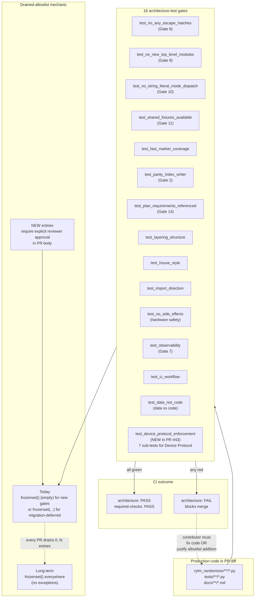

**Why the drained allowlist matters** (from the new learned skill `ast-walked-arch-tests-with-drained-allowlist`):

- **Strict from day 1** → fails on every legacy violation → developers add `# noqa` → rule erodes.
- **Lax forever** → never enforces anything.
- **Drained allowlist** → tests pass today, new violations fail immediately, allowlist shrinks over time. PR-review treats every new allowlist entry as a deliberate scope decision.

The 7 sub-tests in `test_device_protocol_enforcement.py` (added by PR #43) all use this pattern:
1. Every device-family subpackage registers via `devices/registry.py`
2. No cross-family private-API imports
3. `dual_machine/` only depends on `devices.all_devices()`
4. Every registered Device satisfies the Protocol (runtime `isinstance`)
5. Only one `register_device` definition exists (no parallel registry)
6. Per-device snapshot impls reference the WS-S6 Protocols
7. Device Protocol surface is stable (9 attrs + 4 methods pinned)

---

## 11. CI Pipeline + Required-Checks Gate

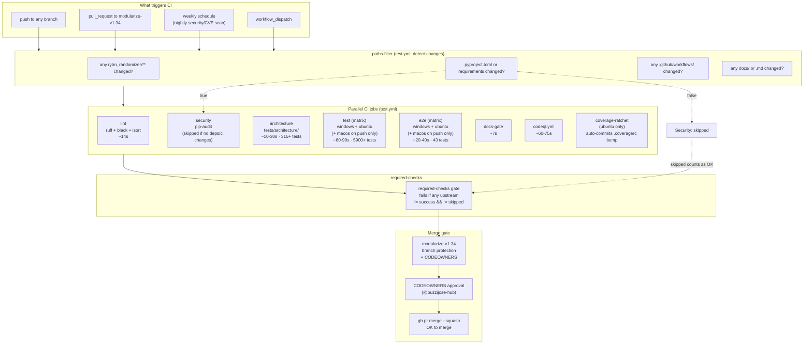

**macOS asymmetry:** the `test` and `e2e` matrices use a conditional JSON for the `os` list — `["windows-latest", "ubuntu-latest"]` on `pull_request`, `["windows-latest", "macos-latest", "ubuntu-latest"]` on push/schedule/workflow_dispatch. Rationale (from `test.yml:288-296`): macOS runner queues on GitHub Actions are 20-60 min for public repos; dropping macOS on PR keeps turnaround in minutes, while push/schedule still validates the full matrix.

**Path filters:** `security` only runs when `pyproject.toml` or workflows change (CVE scan only relevant to dependency changes). `docs-gate` only runs when docs change. These skips don't fail `required-checks` — the aggregator accepts `success` OR `skipped`.

---

## 12. 18 Plan-Requirement Gates

Every non-trivial PR must satisfy all 18 gates per `docs/PLAN_REQUIREMENTS.md`. The PR body must include a `[x]` / `[ ] N/A — reason` line per gate.

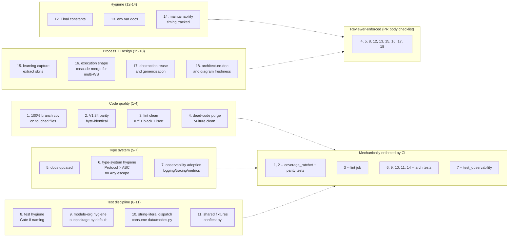

**Authoritative source:** [`docs/PLAN_REQUIREMENTS.md`](PLAN_REQUIREMENTS.md). The reviewer-enforced gates are checked by reading the PR body's conformance checklist.

---

## 13. Test Suite Layers (5900+ tests)

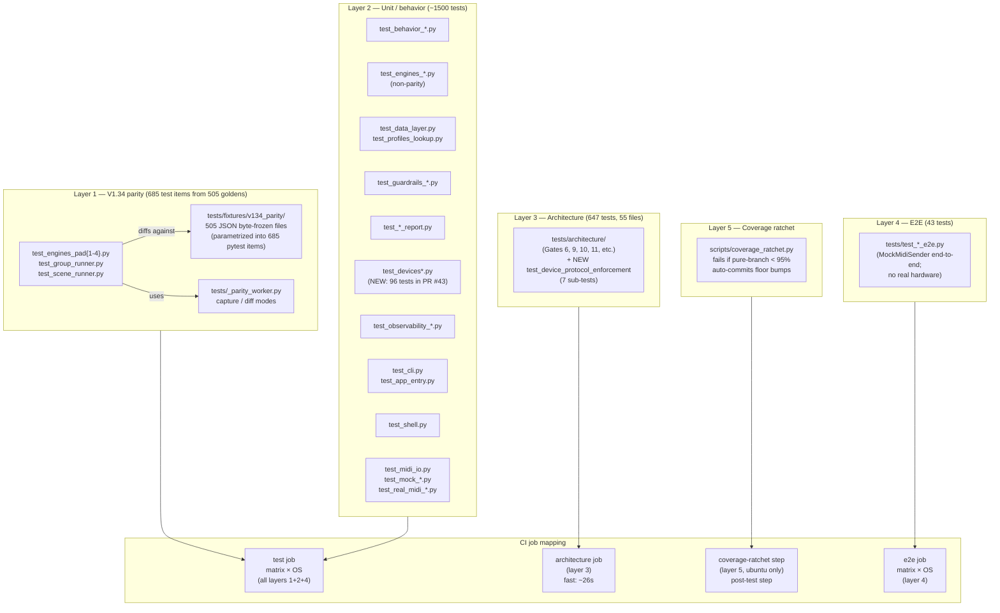

**Markers:** `pytest.mark.fast` is applied to every test that is not in Layer 1 (parity goldens). `pytest -m fast` runs Layers 2+3+4 in ~25s (parity goldens skipped). Bare `pytest` runs everything in ~30s with `-n auto` xdist parallelization (see CONTRIBUTING.md "Running tests fast").

---

## 14. Passive CLI Command Flow

```mermaid
flowchart LR
    Operator["python -m rytm_randomizer.cli ..."]
    CLI["cli.py main(argv)"]

    subgraph ReportCmds["Direct read-only report commands"]
        Report["report<br/>format_registry_report()"]
        MockMapper["mock-mapper-report"]
        Runtime["runtime-plan-report"]
        Active["active-boundary-report"]
        Bridge["mock-runtime-active-bridge-report"]
        Anchor["anchor-profile-report"]
        Coverage["behavior-parity-report"]
        RytmMatrix["rytm-12-pad-machine-matrix-report"]
        RytmSnapshot["rytm-snapshot-pad-compatibility-report"]
        RytmSnapshotIntel["rytm-snapshot-intelligence-report"]
        RytmSnapshotPreview["rytm-snapshot-mutation-preview-report"]
        StyleReport["style-profile-report"]
        StyleTargetReport["style-target-report"]
        StyleSnapshotRoutingReport["rytm-style-snapshot-routing-report"]
        StyleMutationIntentReport["rytm-style-mutation-intent-report"]
        StyleMutationRenderPlanReport["rytm-style-mutation-render-plan-report"]
        StyleMutationMockPreviewReport["rytm-style-mutation-mock-preview-report"]
        ReferenceStyleBlueprintReport["reference-style-blueprint-report"]
        A4StyleSnapshotRoutingReport["analog-four-style-snapshot-routing-report"]
        A4StyleMutationIntentReport["analog-four-style-mutation-intent-report"]
        A4StyleMutationMockPreviewReport["analog-four-style-mutation-mock-preview-report"]
        A4KitCatalogReport["analog-four-kit-catalog-report"]
        A4BaselineReport["analog-four-baseline-report"]
        A4PatchGenomeReport["analog-four-patch-genome-report"]
        A4PatchLearningReport["analog-four-patch-learning-report"]
        A4PatchCorpusReport["analog-four-patch-corpus-report"]
        A4PatchSendPlanReport["analog-four-patch-send-plan-report"]
        A4StyleKitReadinessReport["analog-four-style-kit-readiness-report"]
        A4OxiMacroSetPlannerReport["analog-four-oxi-macro-set-planner-report"]
        DualStyleSnapshotRoutingReport["dual-machine-style-snapshot-routing-report"]
        DualStyleMutationIntentReport["dual-machine-style-mutation-intent-report"]
        DualStyleMutationMockPreviewReport["dual-machine-style-mutation-mock-preview-report"]
        StylePerformanceArcReports["style-performance-arc-* reports<br/>set-plan/readiness/audition/rehearsal/live-session/live-render/live-cue-sheet/live-runbook/reference-match(+stage-packet)/stage-routing/stage-rehearsal-state/live-set-cockpit/live-show-export/live-transition-timeline/live-command-deck/live-state/live-readiness/live-control-surface/live-analyzer-handoff/live-analyzer-targets/live-gui-analyzer-readiness/live-gui-rehearsal-session/live-gui-capture-queue/live-gui-capture-review/live-gui-sidecar-session/live-gui-screen-contract/live-gui-render-tree/live-gui-analyzer-overlay/live-gui-analyzer-frame/live-gui-interaction-script/live-gui-action-reducer/live-gui-controller-state/live-gui-playback-transcript/live-gui-playback-validation/live-gui-test-harness-contract/live-gui-test-harness-readiness/live-gui-implementation-bridge/live-gui-desktop-blueprint/live-gui-desktop-app-plan/live-gui-desktop-component-contract/live-gui-desktop-view-model/live-gui-desktop-render-contract/live-gui-desktop-render-harness"]
        CockpitSendPlanReadinessReport["cockpit-send-plan-readiness-report<br/>operator SEND readiness from CockpitSendPlan"]
        CockpitSendPlanRehearsalSurfaceReport["cockpit-send-plan-rehearsal-surface-report<br/>GUI-ready SEND rehearsal surface from CockpitSendPlan/readiness JSON"]
        QuickStatus["quick-status"]
    end

    subgraph BrowseCmds["Registry-backed browse commands"]
        List["list-commands<br/>list-scenes<br/>list-group-profiles"]
        Search["search-commands<br/>search-scenes<br/>search-group-profiles"]
        Inspect["inspect-command<br/>inspect-scene<br/>inspect-group-profile"]
        Preview["preview-command<br/>preview-scene<br/>preview-group-profile"]
    end

    subgraph StyleBrowseCmds["Style-profile browse commands"]
        StyleList["list-style-profiles"]
        StyleSearch["search-style-profiles"]
        StyleInspect["inspect-style-profile"]
        StyleTargetInspect["inspect-style-target"]
    end

    Operator --> CLI
    CLI --> ReportCmds
    CLI --> BrowseCmds
    CLI --> StyleBrowseCmds

    ReportCmds --> ReportsPkg["reports/<br/>(PassiveReportHeader + builders)"]
    BrowseCmds --> RegistryCore["registry.py<br/>profile_lookup.py<br/>inspection.py"]
    StyleBrowseCmds --> ReportsPkg

    CLI -.->|"safety invariants tested by<br/>test_real_midi_passive_cli_safety<br/>test_real_midi_import_safety"| Safety["no MIDI sent<br/>no ports opened<br/>no execution<br/>no hardware required"]
```

**Architecture test:** `test_real_midi_import_safety.py` + `test_real_midi_passive_cli_safety.py` enforce that the passive CLI never imports `mido` or `rtmidi` and never opens a real port (hardware safety boundaries from CONTRIBUTING.md).

---

## 15. MIDI Boundary Map (mock vs real, lazy-import discipline)

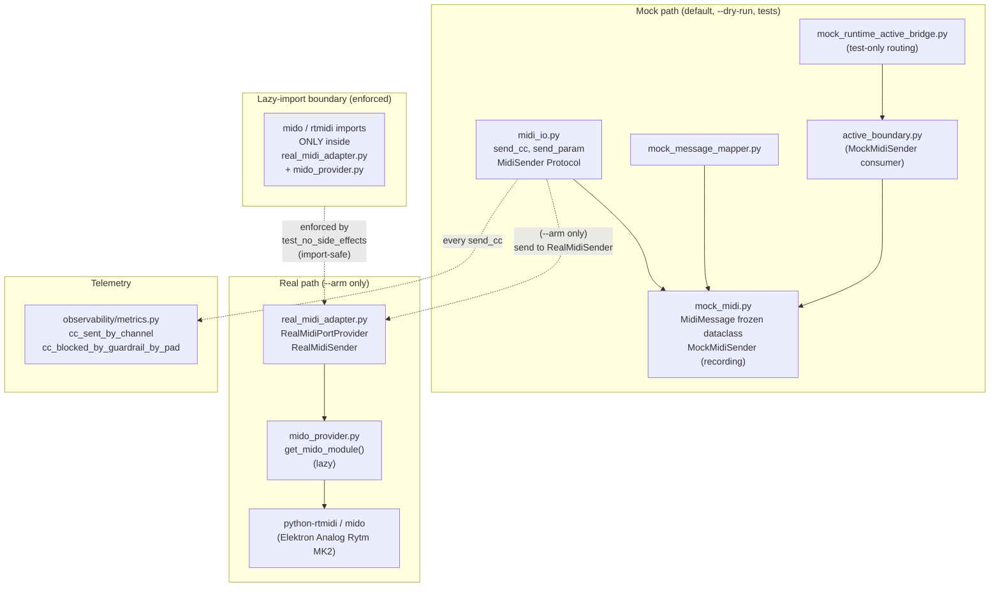

**Hardware-pinned dependencies:** `mido==1.3.3` and `python-rtmidi==1.5.8` are pinned in `pyproject.toml` (byte-level wire format compatibility with Analog Rytm MK2). Do not bump.

---

## 16. Safety Boundary Diagram

```mermaid
flowchart TB
    Passive["Passive surfaces<br/>cli.py, registry.py,<br/>profile_lookup, inspection,<br/>reports/, behavior/"]

    Mock["Mock-only surfaces<br/>mock_midi, mock_mapper,<br/>active_boundary, mock_bridge,<br/>MockMidiSender"]

    Adapter["Adapter boundary<br/>real_midi_adapter.py<br/>(lazy mido import;<br/>fake provider in tests)"]

    Armed["Armed-only surfaces<br/>(--arm flag required)<br/>real port open,<br/>real CC send"]

    Forbidden["Still absent / not authorized<br/>real MIDI in passive CLI<br/>port discovery at import<br/>hardware send without --arm<br/>SysEx writes<br/>GUI"]

    Tests["~30 safety tests<br/>test_no_side_effects<br/>test_real_midi_import_safety<br/>test_real_midi_passive_cli_safety<br/>test_real_midi_adapter_boundary"]

    Passive -.->|"must not import mido<br/>must not open ports"| Tests
    Mock -.->|"allowed but mock-only"| Tests
    Adapter -.->|"fake-provider tests only"| Tests
    Armed -.->|"only path that touches<br/>real hardware"| Tests
    Forbidden -.->|"guarded as absent"| Tests

    Passive -.x-Forbidden
    Mock -.x-Forbidden
    Adapter -.x-Forbidden
```

---

## 17. Cascade vs Bundled PR Flow (anti-pattern vs pattern)

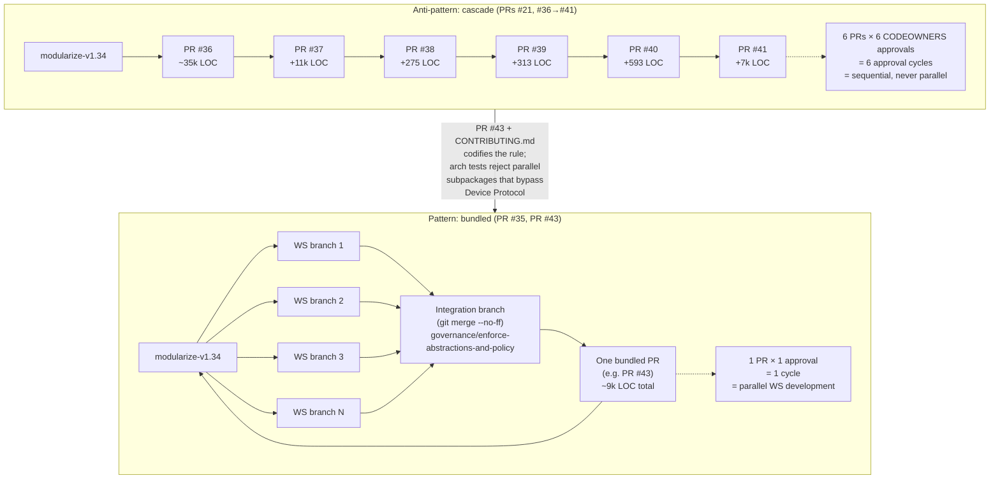

**The rule** (CONTRIBUTING.md "PR bundling"): under a CODEOWNERS-gated base branch, multi-workstream work must be bundled into one PR via an integration branch. Stacked PRs (where each PR's base is another open PR's head) multiply approval cycles and were exactly the failure mode of the codex dual-machine cascade.

---

## 18. Future Codex PR Shape (post-PR #43, dual-machine redo)

**Forward-looking diagram.** This is what PR #36's redo should look like after PR #43 merges. See the [architecture review on PR #36](https://github.com/buzzijose-hub/RytmRandomizer/pull/36#issuecomment-4490858526) for the file-by-file authoritative plan.

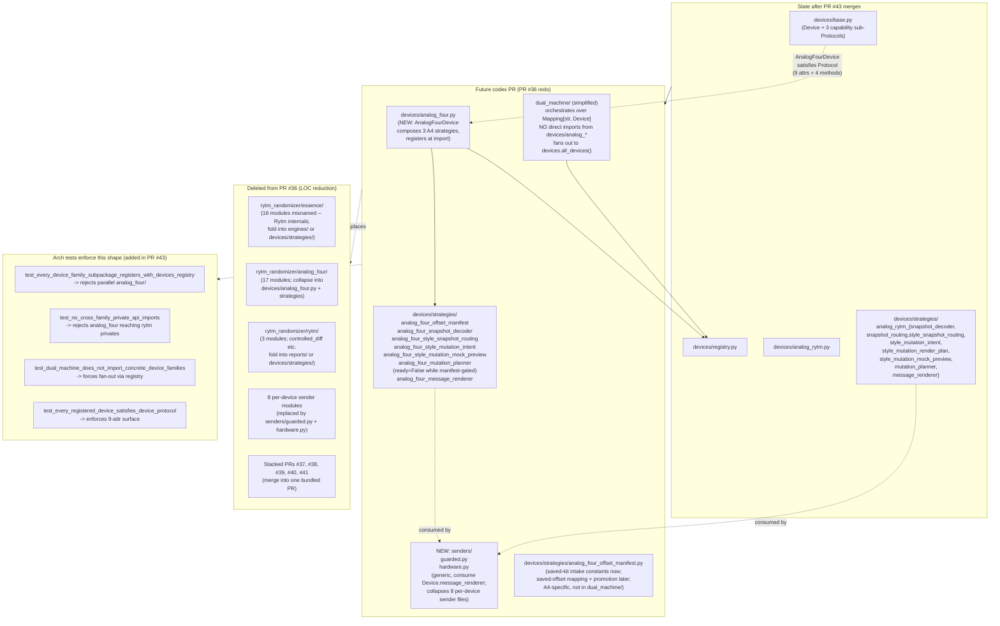

**Net effect:** codex's ~35k-LOC dual-machine cascade (PRs #36-#41) becomes a single ~6-8k-LOC bundled PR with 1 device class + 3 strategies + manifest + simplified `dual_machine/`. The 8 sender modules collapse to 2 generic. The arch tests catch any drift from this shape.

---

## 19. Registry Fan-Out (dual-machine orchestration via Mapping[str, Device])

How `dual_machine/` consumes the registry instead of importing per-family modules directly. This is the key abstraction that makes adding a 4th machine family (Syntakt, Digitone, etc.) trivial — no `dual_machine/` edits required.

```mermaid
sequenceDiagram
    autonumber
    participant Op as Operator code<br/>(e.g. CLI)
    participant DM as dual_machine/<br/>orchestrator
    participant Reg as devices.registry
    participant Rytm as AnalogRytmDevice
    participant A4 as AnalogFourDevice<br/>(future)
    participant Senders as senders/guarded.py<br/>(future generic)

    Op->>DM: dual_machine_bank_readiness()
    DM->>Reg: all_devices()
    Reg-->>DM: Mapping[<br/>"analog_rytm_mk2": AnalogRytmDevice,<br/>"analog_four_mk2": AnalogFourDevice]<br/>

    loop for device_id, device in all_devices().items()
        DM->>device: device.snapshot_decoder.decode(raw, slot)
        device-->>DM: device-specific snapshot

        DM->>device: device.mutation_planner.plan(snapshot, depth)
        device-->>DM: plan (with .ready / .readiness_reason)

        alt plan.ready is True
            DM->>Senders: execute_guarded_send(device, plan, sender)
            Senders->>device: device.message_renderer.to_mock_message(event, plan)
            device-->>Senders: MidiMessage
        else plan.ready is False
            Note over DM,Senders: skip; record readiness_reason in report
        end
    end

    DM-->>Op: cross-device readiness report
```

**Adding a 4th family** = `register_device(SyntaktDevice())` + 3 strategy modules. `dual_machine/` literally never changes. This is what the Strategy seam was for.

---

## 20. Reports Subpackage (post-PR #35 WS-S4 layout)

```mermaid
flowchart TB
    subgraph ReportsPkg["reports/ subpackage"]
        Init["__init__.py<br/>report builders + formatters<br/>(was reports.py before WS-S4)"]
        Formatter["formatter.py<br/>PassiveReportHeader (frozen dataclass)<br/>safety_section_lines()<br/>passive_footer_lines()<br/>+ Final-annotated constants"]
        MatrixModule["rytm_machine_matrix.py<br/>12-pad machine matrix report<br/>+ registered CliCommand"]
        SnapshotModule["rytm_snapshot_pad_compatibility.py<br/>snapshot-safe pad/machine report<br/>+ registered CliCommand"]
        SnapshotIntelModule["rytm_snapshot_intelligence.py<br/>decoded/routed/file-backed snapshot readiness report<br/>+ registered CliCommand"]
        SnapshotPreviewModule["rytm_snapshot_mutation_preview.py<br/>snapshot mutation preview + event rows<br/>+ registered CliCommand"]
        StyleSnapshotRoutingModule["rytm_style_snapshot_routing.py<br/>style target to snapshot routing report<br/>+ registered CliCommand"]
        StyleMutationIntentModule["rytm_style_mutation_intent.py<br/>style target to parameter-intent report<br/>+ registered CliCommand"]
        StyleMutationRenderPlanModule["rytm_style_mutation_render_plan.py<br/>style intent to target-value windows<br/>+ registered CliCommand"]
        StyleMutationMockPreviewModule["rytm_style_mutation_mock_preview.py<br/>style target windows to mock CC rows<br/>+ registered CliCommand"]
        A4StyleSnapshotRoutingModule["analog_four_style_snapshot_routing.py<br/>A4 style target to snapshot routing report<br/>+ registered CliCommand"]
        A4StyleMutationIntentModule["analog_four_style_mutation_intent.py<br/>A4 style target to mutation-intent report<br/>+ registered CliCommand"]
        A4StyleMutationMockPreviewModule["analog_four_style_mutation_mock_preview.py<br/>A4 style intent to mock CC/deferred rows<br/>+ registered CliCommand"]
        A4KitCatalogModule["analog_four_kit_catalog.py<br/>A4 decoded kit catalog report<br/>+ registered CliCommand"]
        A4OxiMacroSetPlannerModule["analog_four_oxi_macro_set_planner.py<br/>A4 OXI macro set planner<br/>+ registered CliCommand"]
        DualStyleSnapshotRoutingModule["dual_machine_style_snapshot_routing.py<br/>rig-level style routing report<br/>+ registered CliCommand"]
        DualStyleMutationIntentModule["dual_machine_style_mutation_intent.py<br/>rig-level style mutation-intent report<br/>+ registered CliCommand"]
        DualStyleMutationMockPreviewModule["dual_machine_style_mutation_mock_preview.py<br/>rig-level style mock-preview report<br/>+ registered CliCommand"]
        StyleProfileModule["style_profiles.py<br/>style intent catalog/list/inspect/search<br/>+ registered CliCommand"]
        StyleTargetModule["style_targets.py<br/>numeric target-vector report/inspect<br/>+ registered CliCommand"]
        ReferenceBlueprintModule["reference_style_blueprint.py<br/>12-pad + A4 reference-style blueprint<br/>+ registered CliCommand"]
        LiveAnalyzerHandoffModule["live_analyzer_handoff.py<br/>passive analyzer handoff packet<br/>+ registered CliCommand"]
        LiveAnalyzerTargetsModule["live_analyzer_targets.py<br/>passive analyzer target bands<br/>+ registered CliCommand"]
        LiveGuiAnalyzerReadinessModule["live_gui_analyzer_readiness.py<br/>GUI/analyzer readiness bundle<br/>+ registered CliCommand"]
        LiveGuiRehearsalSessionModule["live_gui_rehearsal_session.py<br/>GUI rehearsal-session packet<br/>+ registered CliCommand"]
        LiveGuiCaptureQueueModule["live_gui_capture_queue.py<br/>GUI capture queue packet<br/>+ registered CliCommand"]
        LiveGuiCaptureReviewModule["live_gui_capture_review.py<br/>GUI capture go/repeat/hold review<br/>+ registered CliCommand"]
        LiveGuiSidecarSessionModule["live_gui_sidecar_session.py<br/>sidecar-ready GUI state packet<br/>+ registered CliCommand"]
        LiveGuiScreenContractModule["live_gui_screen_contract.py<br/>deterministic GUI screen contract<br/>+ registered CliCommand"]
        LiveGuiRenderTreeModule["live_gui_render_tree.py<br/>deterministic GUI render tree<br/>+ registered CliCommand"]
        LiveGuiAnalyzerOverlayModule["live_gui_analyzer_overlay.py<br/>GUI analyzer overlay packet<br/>+ registered CliCommand"]
        LiveGuiAnalyzerFrameModule["live_gui_analyzer_frame.py<br/>GUI analyzer frame packet<br/>+ registered CliCommand"]
        LiveGuiInteractionScriptModule["live_gui_interaction_script.py<br/>GUI interaction script packet<br/>+ registered CliCommand"]
        LiveGuiActionReducerModule["live_gui_action_reducer.py<br/>GUI action reducer packet<br/>+ registered CliCommand"]
        LiveGuiControllerStateModule["live_gui_controller_state.py<br/>GUI controller state packet<br/>+ registered CliCommand"]
        LiveGuiPlaybackTranscriptModule["live_gui_playback_transcript.py<br/>GUI playback transcript packet<br/>+ registered CliCommand"]
        LiveGuiPlaybackValidationModule["live_gui_playback_validation.py<br/>GUI playback validation packet<br/>+ registered CliCommand"]
        LiveGuiTestHarnessContractModule["live_gui_test_harness_contract.py<br/>GUI test-harness contract packet<br/>+ registered CliCommand"]
        LiveGuiTestHarnessReadinessModule["live_gui_test_harness_readiness.py<br/>GUI test-harness readiness packet<br/>+ registered CliCommand"]
        LiveGuiImplementationBridgeModule["live_gui_implementation_bridge.py<br/>GUI implementation bridge packet<br/>+ registered CliCommand"]
        LiveGuiDesktopBlueprintModule["live_gui_desktop_blueprint.py<br/>GUI desktop blueprint packet<br/>+ registered CliCommand"]
        LiveGuiDesktopAppPlanModule["live_gui_desktop_app_plan.py<br/>GUI desktop app-plan packet<br/>+ registered CliCommand"]
        LiveGuiDesktopComponentContractModule["live_gui_desktop_component_contract.py<br/>GUI desktop component contract<br/>+ registered CliCommand"]
        LiveGuiDesktopViewModelModule["live_gui_desktop_view_model.py<br/>GUI desktop view-model packet<br/>+ registered CliCommand"]
        LiveGuiDesktopRenderContractModule["live_gui_desktop_render_contract.py<br/>GUI desktop render contract<br/>+ registered CliCommand"]
        LiveGuiDesktopRenderHarnessModule["live_gui_desktop_render_harness.py<br/>GUI desktop render harness<br/>+ registered CliCommand"]
    end

    subgraph Reports["Report builders (in __init__.py)"]
        R1["registry_report"]
        R2["mock_mapper_report"]
        R3["runtime_plan_report"]
        R4["active_boundary_report"]
        R5["mock_runtime_active_bridge_report"]
        R6["anchor_profile_report"]
        R7["behavior_parity_coverage_report"]
        R8["project_status_report<br/>(separate top-level project_status_report.py)"]
        R9["quick_status report"]
        R10["rytm_machine_matrix_report"]
        R11["rytm_snapshot_pad_compatibility_report"]
        R12["rytm_snapshot_intelligence_report"]
    end

    subgraph CLICmds["CLI commands → reports"]
        C1["report → registry_report"]
        C2["mock-mapper-report"]
        C3["runtime-plan-report"]
        C4["active-boundary-report"]
        C5["mock-runtime-active-bridge-report"]
        C6["anchor-profile-report"]
        C7["behavior-parity-report"]
        C8["project-status (separate)"]
        C9["quick-status"]
        C10["rytm-12-pad-machine-matrix-report"]
        C11["rytm-snapshot-pad-compatibility-report"]
        C12["rytm-snapshot-intelligence-report <syx-path> [--slot N|--list]"]
        C13["rytm-snapshot-mutation-preview-report <syx-path> [--events]"]
        C14["style-profile-report"]
        C15["list-style-profiles / inspect-style-profile / search-style-profiles"]
        C16["style-target-report / inspect-style-target"]
        C17["rytm-style-snapshot-routing-report"]
        C18["rytm-style-mutation-intent-report"]
        C19["analog-four-style-snapshot-routing-report"]
        C20["analog-four-style-mutation-intent-report"]
        C21["dual-machine-style-snapshot-routing-report"]
        C22["rytm-style-mutation-render-plan-report"]
        C23["rytm-style-mutation-mock-preview-report"]
        C24["analog-four-style-mutation-mock-preview-report"]
        C25["dual-machine-style-mutation-mock-preview-report"]
        C26["analog-four-kit-catalog-report"]
        C26Base["analog-four-baseline-report"]
        C26A["analog-four-patch-genome-report"]
        C26B["analog-four-patch-learning-report"]
        C26C["analog-four-patch-corpus-report"]
        C26D["analog-four-patch-send-plan-report"]
        C27["analog-four-style-kit-readiness-report"]
        C28["style-performance-arc-live-analyzer-handoff-report"]
        C29["style-performance-arc-live-analyzer-targets-report"]
        C30["style-performance-arc-live-gui-analyzer-readiness-report"]
        C31["style-performance-arc-live-gui-rehearsal-session-report"]
        C32["style-performance-arc-live-gui-capture-queue-report"]
        C33["style-performance-arc-live-gui-capture-review-report"]
        C34["style-performance-arc-live-gui-sidecar-session-report"]
        C35["style-performance-arc-live-gui-screen-contract-report"]
        C36["style-performance-arc-live-gui-render-tree-report"]
        C37["style-performance-arc-live-gui-analyzer-overlay-report"]
        C38["style-performance-arc-live-gui-analyzer-frame-report"]
        C39["style-performance-arc-live-gui-interaction-script-report"]
        C40["style-performance-arc-live-gui-action-reducer-report"]
        C41["style-performance-arc-live-gui-controller-state-report"]
        C42["style-performance-arc-live-gui-playback-transcript-report"]
        C43["style-performance-arc-live-gui-playback-validation-report"]
        C44["style-performance-arc-live-gui-test-harness-contract-report"]
        C45["style-performance-arc-live-gui-test-harness-readiness-report"]
        C46["style-performance-arc-live-gui-implementation-bridge-report"]
        C47["style-performance-arc-live-gui-desktop-blueprint-report"]
        C48["style-performance-arc-live-gui-desktop-app-plan-report"]
        C49["style-performance-arc-live-gui-desktop-component-contract-report"]
        C50["style-performance-arc-live-gui-desktop-view-model-report"]
        C51["style-performance-arc-live-gui-desktop-render-contract-report"]
        C52["style-performance-arc-live-gui-desktop-render-harness-report"]
    end

    subgraph Fixtures["Golden-fixture CLI tests"]
        GoldenTests["tests/fixtures/cli_*_expected.txt<br/>tests/test_cli.py<br/>test_*_report.py"]
    end

    Reports --> Formatter
    Reports --> MatrixModule
    Reports --> SnapshotModule
    Reports --> SnapshotIntelModule
    Reports --> SnapshotPreviewModule
    Reports --> StyleSnapshotRoutingModule
    Reports --> StyleMutationIntentModule
    Reports --> StyleMutationRenderPlanModule
    Reports --> StyleMutationMockPreviewModule
    Reports --> A4StyleSnapshotRoutingModule
    Reports --> A4StyleMutationIntentModule
    Reports --> A4StyleMutationMockPreviewModule
    Reports --> A4KitCatalogModule
    Reports --> DualStyleSnapshotRoutingModule
    Reports --> DualStyleMutationIntentModule
    Reports --> DualStyleMutationMockPreviewModule
    Reports --> StyleProfileModule
    Reports --> StyleTargetModule
    Reports --> LiveAnalyzerHandoffModule
    Reports --> LiveAnalyzerTargetsModule
    Reports --> LiveGuiAnalyzerReadinessModule
    Reports --> LiveGuiRehearsalSessionModule
    Reports --> LiveGuiCaptureQueueModule
    Reports --> LiveGuiCaptureReviewModule
    Reports --> LiveGuiSidecarSessionModule
    Reports --> LiveGuiScreenContractModule
    Reports --> LiveGuiRenderTreeModule
    Reports --> LiveGuiAnalyzerOverlayModule
    Reports --> LiveGuiAnalyzerFrameModule
    Reports --> LiveGuiInteractionScriptModule
    Reports --> LiveGuiActionReducerModule
    Reports --> LiveGuiControllerStateModule
    Reports --> LiveGuiPlaybackTranscriptModule
    Reports --> LiveGuiPlaybackValidationModule
    Reports --> LiveGuiTestHarnessContractModule
    Reports --> LiveGuiTestHarnessReadinessModule
    Reports --> LiveGuiImplementationBridgeModule
    Reports --> LiveGuiDesktopBlueprintModule
    Reports --> LiveGuiDesktopAppPlanModule
    Reports --> LiveGuiDesktopComponentContractModule
    Reports --> LiveGuiDesktopViewModelModule
    Reports --> LiveGuiDesktopRenderContractModule
    Reports --> LiveGuiDesktopRenderHarnessModule
    Formatter --> Init
    Reports --> Init

    Init --> CLICmds
    CLICmds --> Fixtures
```

**Architecture: all reports share** `PassiveReportHeader` + `safety_section_lines()` + `passive_footer_lines()`. The pre-WS-S4 duplication of `"Safety:"` / `"Source:"` / `"In-memory only: True"` literals across 6 sites is gone (Gate 4 dead-code purge).

---

## 21. Passive Metadata + Registry Graph

The metadata layer behind the passive CLI's `list-`, `search-`, `inspect-`, and `preview-` commands. Restored and refreshed against current paths.

```mermaid
flowchart TB
    subgraph DataLayer["data/ (single source of truth; WS-M3-era)"]
        DataPM["data/param_maps.py<br/>MACHINE_CC = 15<br/>BD_SHARP_PARAMS, BD_HARD_PARAMS,<br/>BD_CLASSIC_PARAMS, BD_FM_PARAMS,<br/>BD_ACOUSTIC_PARAMS,<br/>SY_RAW_PARAMS, ... (~69 dicts)<br/>+ safe/anchor/zone/order tables"]
        DataProfiles["data/profiles.py<br/>PROFILES (registry of profile_key → dict)"]
        DataPlans["data/plans.py<br/>PAD_PROFILE_PLANS, ..."]
        DataScenes["data/scenes.py + scene_display.py<br/>SCENE_COMMANDS, scene_menu_lines()"]
        DataModes["data/modes.py<br/>Literal aliases + Final tuples"]
        DataStyleProfiles["data/style_profiles.py<br/>STYLE_PROFILES"]
        DataStyleTargets["data/style_targets.py<br/>STYLE_TARGET_VECTORS"]
        DataStyleDiscovery["data/style_discovery.py<br/>STYLE_DISCOVERY_BANDS"]
    end

    subgraph TopLevel["Top-level passive surfaces"]
        Constants["constants.py<br/>MACHINE_CC, SUPPORTED_PADS,<br/>OUT_OF_SCOPE_PADS,<br/>PAD_TO_MIDI_CHANNEL,<br/>PAD1_DEFAULT_HOME"]
        Commands["commands.py<br/>COMMANDS dict, PAD{1-4}_COMMANDS"]
        Profiles["profiles.py<br/>GROUP_PROFILE_METADATA<br/>(derived from data/profiles.PROFILES)"]
        Scenes["scenes.py<br/>(re-export from data/scenes.py)"]
    end

    subgraph Lookup["Lookup + inspection"]
        Registry["registry.py<br/>build_registry()<br/>get_registry_section()<br/>get_registry_item()<br/>summarize_registry()"]
        ProfileLookup["profile_lookup.py<br/>describe_group_profile()"]
        Inspection["inspection.py<br/>inspect_command()"]
        Validation["validation.py<br/>registry guardrails<br/>forbidden execution fields<br/>Pads 5-12 references"]
        CliRegistry["cli_registry.py<br/>CliCommand frozen dataclass<br/>register/get/all_commands"]
    end

    subgraph Browse["CLI browse path"]
        CLI["cli.py main(argv)"]
    end

    DataPM --> DataProfiles
    DataStyleProfiles --> DataStyleTargets
    DataStyleTargets --> DataStyleDiscovery
    DataProfiles --> Profiles
    DataScenes --> Scenes
    DataPM -.-> Constants

    Constants --> Commands
    Constants --> Profiles
    Commands --> Registry
    Scenes --> Registry
    Profiles --> Registry

    Profiles --> ProfileLookup
    Validation --> Inspection
    Validation --> Registry

    Registry --> CLI
    Inspection --> CLI
    ProfileLookup --> CLI
    CliRegistry --> CLI
```

**Current metadata scope (verified from `constants.py` + `data/`):**

- Supported pads: `1`, `2`, `3`, `4` (`SUPPORTED_PADS = (1, 2, 3, 4)`)
- Out-of-scope pads: `5` through `12` (`OUT_OF_SCOPE_PADS = (5, 6, ..., 12)`)
- Group profile metadata: keys `1` through `9` for the V1.34 machine catalog (PROFILES at `data/profiles.py`)
- `MACHINE_CC = 15` (the program-change-like CC the Rytm uses for machine selection)
- Mock message mapper supports a narrower subset of profile keys for the active-bridge path (see §6 below)

---

## 22. Behavior Parity Evaluator Map

The `behavior/` subpackage holds the passive evaluators that model V1.34's command-by-command behavior. Restored and refreshed against the WS-M2 subpackage layout.

```mermaid
flowchart TB
    Commands["commands.py<br/>command metadata groups"]
    Scenes["scenes.py / data/scenes.py<br/>scene metadata"]
    Profiles["profiles.py / data/profiles.py<br/>group profile metadata"]
    StateValidation["state/{anchor,selected_target,<br/>selected_isolated_pad}_validation.py"]

    subgraph BehaviorPkg["behavior/ subpackage (8 modules; WS-M2 layout)"]
        MenuUtility["menu_utility.py<br/>menus + T/C/Q utilities"]
        AnchorProfile["anchor_profile.py<br/>BH/BC/BS/BF/... anchor commands"]
        MutationDepth["mutation_depth.py<br/>guarded depth + mutation intent"]
        SceneGroup["scene_group.py<br/>scene/group/lane-aware intent"]
        PadLane["pad_lane.py<br/>(WS-S2 consolidation:<br/>Pad1+Pad2+Pad3+Pad4 lane commands<br/>previously in 4 separate files)"]
        SelectedProfile["selected_profile.py<br/>P/M profile workflow"]
        SelectedIsolated["selected_isolated_pad.py<br/>L/PZ isolated pad behavior"]
        UndoCommit["undo_commit_state.py<br/>B/E/W/U state behavior"]
    end

    subgraph BehaviorReports["Aggregated read-only reports (in reports/)"]
        AnchorReport["anchor_profile_report builder<br/>(reports/__init__.py)"]
        CoverageReport["behavior_parity_coverage_report builder<br/>(reports/__init__.py)"]
    end

    subgraph CLIAccess["CLI commands"]
        CLIAnchor["cli.py anchor-profile-report"]
        CLICoverage["cli.py behavior-parity-report"]
    end

    Commands --> BehaviorPkg
    Scenes --> SceneGroup
    Profiles --> AnchorProfile
    Profiles --> PadLane
    StateValidation --> SelectedIsolated
    StateValidation --> UndoCommit

    BehaviorPkg --> AnchorReport
    BehaviorPkg --> CoverageReport

    AnchorReport --> CLIAnchor
    CoverageReport --> CLICoverage
```

**Current nuance:**

- Behavior modules return passive result objects and metadata. They do NOT open ports, send MIDI, or mutate device state.
- Packet constants in these files document which V1.34 command areas have been modeled (look for `PACKET_*` named constants).
- Per WS-S2, the four `behavior_pad{1-4}_lane.py` files at the package root were collapsed into one `behavior/pad_lane.py` containing all four pads' lane behavior (frozen dataclass `PadLaneCommand` plus `Pad{1,2,3,4}LaneBehaviorResult` records).

---

## 23. Runtime Planning + Active Boundary Flow

The runtime-plan validator + active-boundary mock-only evaluator. Restored from the original §6 and verified against current code.

```mermaid
flowchart TB
    Intent["RuntimeIntent<br/>runtime_plan.py"]
    Validate["validate_runtime_intent_scope()<br/>runtime_plan.py"]
    Preview["RuntimePlanPreview<br/>blocked, would_execute=False"]
    Provider["MockRuntimeProvider<br/>runtime_plan.py"]
    RuntimeReport["build/format_runtime_plan_report()<br/>(in reports/__init__.py)"]
    RuntimeCLI["cli.py runtime-plan-report"]

    BridgeReq["RuntimeActiveBridgeRequest<br/>mock_runtime_active_bridge.py"]
    BridgeEval["evaluate_mock_runtime_active_bridge()"]
    ActiveReq["ActiveBoundaryRequest<br/>active_boundary.py"]
    ActiveEval["evaluate_mock_active_boundary()"]
    ActiveErr["ActiveBoundaryError<br/>(BoundaryError, ValueError)"]
    Mapper["map_group_profile_to_mock_messages()<br/>mock_message_mapper.py"]
    Sender["MockMidiSender<br/>mock_midi.py"]
    Result["RuntimeActiveBridgeResult<br/>mock_only=True<br/>sends_real_midi=False"]
    BridgeReport["build/format_mock_runtime_active_bridge_report()<br/>(in reports/__init__.py)"]
    BridgeCLI["cli.py mock-runtime-active-bridge-report"]

    Intent --> Validate
    Validate --> Preview
    Preview --> RuntimeReport
    RuntimeReport --> RuntimeCLI

    BridgeReq --> BridgeEval
    BridgeEval --> Validate
    BridgeEval --> ActiveReq
    ActiveReq --> ActiveEval
    ActiveEval --> Mapper
    Mapper --> ActiveEval
    ActiveEval -->|"send_many() only on injected mock sender"| Sender
    ActiveEval --> Result
    ActiveEval -.->|"on rejection"| ActiveErr
    BridgeEval --> Result

    BridgeReport --> BridgeCLI
    BridgeReport -.->|"metadata-only;<br/>does not invoke bridge"| BridgeEval

    Validate -->|"group_profile in supported set"| Supported["runtime supported preview<br/>still blocked (would_execute=False)"]
    Validate -->|"parked profile key"| Parked["parked preview"]
    Validate -->|"unknown / scene / command kind"| Unsupported["unsupported preview"]

    ActiveEval -->|"armed + dry-run confirmed + supported key"| Accepted["accepted_mock_only"]
    ActiveEval -->|"missing arming / dry-run / unsupported"| Rejected["safe failure (no messages)"]
```

**Current nuance (verified from source):**

- `runtime_plan.py` exports `RuntimeIntent`, `RuntimeSafetyEnvelope`, `RuntimePlanPreview`, `MockRuntimeProvider`, `validate_runtime_intent_scope()`, `create_blocked_runtime_preview()`. The validator always produces blocked previews with `would_execute=False` in the passive path.
- `active_boundary.py` exports `ActiveBoundaryRequest`, `ActiveBoundaryResult`, `ActiveBoundaryError`, `evaluate_mock_active_boundary()`. The evaluator accepts source kind `group_profile` only, requires arming + dry-run confirmation, and routes only through an injected `MockMidiSender`.
- `mock_runtime_active_bridge.py` exports `RuntimeActiveBridgeRequest`, `RuntimeActiveBridgeResult`, `evaluate_mock_runtime_active_bridge()`. It composes the runtime-plan validator + active-boundary evaluator.
- `build_*_report` / `format_*_report` functions for both `runtime-plan-report` and `mock-runtime-active-bridge-report` live in `reports/__init__.py` (after the WS-S4 reports-subpackage move).

---

## 24. Closeout + Test Coverage Map

Both closeout entry points and what they verify. Restored from the original §9 and refreshed with cross-platform parity.

```mermaid
flowchart TB
    subgraph Entry["Closeout entry points"]
        CloseoutPS1["Scripts/closeout_check.ps1<br/>(Windows PowerShell)"]
        CloseoutPy["scripts/closeout_check.py<br/>(cross-platform Python; preferred)"]
        QuickStatus["scripts/quick_status.ps1<br/>(quick local status)"]
    end

    subgraph GateSteps["Closeout gate steps (closeout_check.py)"]
        Step1["1. pytest (full suite)<br/>with -n auto<br/>(5900+ tests)"]
        Step2["2. import smoke<br/>(import rytm_randomizer)"]
    end

    subgraph PytestLayers["What pytest runs"]
        PassiveTests["Layer 2 unit / behavior tests<br/>(~1500 tests)"]
        ParityTests["Layer 1 V1.34 parity tests<br/>(685 items from 505 goldens)"]
        ArchTests["Layer 3 architecture tests<br/>(647 tests across 55 files)"]
        E2ETests["Layer 4 e2e tests<br/>(43 tests)"]
        CovStep["Layer 5 coverage ratchet<br/>(scripts/coverage_ratchet.py)<br/>floor: ≥95% pure-branch"]
    end

    subgraph CIJobs["GitHub Actions jobs"]
        CIArch["architecture job"]
        CITest["test job (matrix)"]
        CIE2E["e2e job (matrix)"]
        CIRatchet["coverage-ratchet step (ubuntu)"]
    end

    CloseoutPS1 -->|"runs pytest"| Step1
    CloseoutPy --> Step1
    CloseoutPy --> Step2

    Step1 --> PassiveTests
    Step1 --> ParityTests
    Step1 --> ArchTests
    Step1 --> E2ETests
    Step1 --> CovStep

    PytestLayers --> CIJobs
    ArchTests -.->|"separate CI job"| CIArch
    E2ETests -.->|"separate CI job"| CIE2E
    CovStep -.->|"separate CI step"| CIRatchet
```

**Current nuance:**

- `Scripts/closeout_check.ps1` is the original Windows-only PowerShell entry. `scripts/closeout_check.py` is the cross-platform Python equivalent added in WS-M4 (preferred for new tooling).
- Both run pytest and an import smoke. The Python script also tests cross-platform (works on Windows / macOS / Linux without modification).
- CI splits the 5 layers across separate jobs (test / architecture / e2e / coverage-ratchet) so a failure in one layer is visible without scrolling through 5900+ test results — see §11 (CI Pipeline) for the full job map.

---

## 25. Command / Capability Surface

Refreshed from the original §11 to add `cli_registry.py` and the actual command set.

```mermaid
flowchart LR
    CLI["cli.py main(argv=None)"]

    subgraph Browse["Passive browsing"]
        List["list-commands<br/>list-scenes<br/>list-group-profiles<br/>list-style-profiles"]
        Search["search-commands<br/>search-scenes<br/>search-group-profiles<br/>search-style-profiles"]
        Inspect["inspect-command<br/>inspect-scene<br/>inspect-group-profile<br/>inspect-style-profile<br/>inspect-style-target"]
        Preview["preview-command<br/>preview-scene<br/>preview-group-profile"]
    end

    subgraph Reports["Passive reports"]
        RegistryC["report"]
        MockMapper["mock-mapper-report"]
        Runtime["runtime-plan-report"]
        Active["active-boundary-report"]
        Bridge["mock-runtime-active-bridge-report"]
        Anchor["anchor-profile-report"]
        Coverage["behavior-parity-report"]
        RytmMatrix["rytm-12-pad-machine-matrix-report"]
        RytmSnapshot["rytm-snapshot-pad-compatibility-report"]
        RytmSnapshotIntel["rytm-snapshot-intelligence-report <syx-path> [--slot N|--list]"]
        RytmSnapshotPreview["rytm-snapshot-mutation-preview-report <syx-path> [--events]"]
        StyleProfiles["style-profile-report"]
        StyleTargets["style-target-report"]
        StyleSnapshotRouting["rytm-style-snapshot-routing-report"]
        StyleMutationIntent["rytm-style-mutation-intent-report"]
        StyleMutationRenderPlan["rytm-style-mutation-render-plan-report"]
        StyleMutationMockPreview["rytm-style-mutation-mock-preview-report"]
        A4StyleSnapshotRouting["analog-four-style-snapshot-routing-report"]
        A4StyleMutationIntent["analog-four-style-mutation-intent-report"]
        A4StyleMutationMockPreview["analog-four-style-mutation-mock-preview-report"]
        A4KitCatalog["analog-four-kit-catalog-report"]
        A4Baseline["analog-four-baseline-report --kit K --pattern-kit P --whole-project W [--json]"]
        A4PatchGenome["analog-four-patch-genome-report"]
        A4PatchLearning["analog-four-patch-learning-report"]
        A4PatchCorpus["analog-four-patch-corpus-report"]
        A4PatchSendPlan["analog-four-patch-send-plan-report"]
        A4StyleKitReadiness["analog-four-style-kit-readiness-report"]
        A4OxiMacroSetPlanner["analog-four-oxi-macro-set-planner-report [--set-name N] [--sequence A,B] [--seed N] [--json]"]
        DualStyleSnapshotRouting["dual-machine-style-snapshot-routing-report"]
        DualStyleMutationIntent["dual-machine-style-mutation-intent-report"]
        DualStyleMutationMockPreview["dual-machine-style-mutation-mock-preview-report"]
        StylePerformanceArcReports["style-performance-arc-* reports<br/>set-plan/readiness/audition/rehearsal/live-session/live-render/live-cue-sheet/live-runbook/reference-match(+stage-packet)/stage-routing/stage-rehearsal-state/live-set-cockpit/live-show-export/live-transition-timeline/live-command-deck/live-state/live-readiness/live-control-surface/live-analyzer-handoff/live-analyzer-targets/live-gui-analyzer-readiness/live-gui-rehearsal-session/live-gui-capture-queue/live-gui-capture-review/live-gui-sidecar-session/live-gui-screen-contract/live-gui-render-tree/live-gui-analyzer-overlay/live-gui-analyzer-frame/live-gui-interaction-script/live-gui-action-reducer/live-gui-controller-state/live-gui-playback-transcript/live-gui-playback-validation/live-gui-test-harness-contract/live-gui-test-harness-readiness/live-gui-implementation-bridge/live-gui-desktop-blueprint/live-gui-desktop-app-plan/live-gui-desktop-component-contract/live-gui-desktop-view-model/live-gui-desktop-render-contract/live-gui-desktop-render-harness"]
        CockpitSendPlanReadiness["cockpit-send-plan-readiness-report"]
        CockpitSendPlanRehearsalSurface["cockpit-send-plan-rehearsal-surface-report"]
        Status["project-status / quick-status"]
    end

    subgraph CliRegistry["cli_registry.py<br/>(WS-S7 future-extension surface)"]
        Reg["CliCommand frozen dataclass<br/>register / get / all_commands<br/>default_error_formatter"]
    end

    subgraph NotPresent["Not present as CLI commands"]
        Execute["execute-command"]
        Send["send-command"]
        Hardware["hardware-test"]
    end

    subgraph Armed["Reachable only via app.py --arm"]
        ArmedRun["python -m rytm_randomizer.app --arm<br/>(real MIDI; requires --arm flag)"]
        DryRun["python -m rytm_randomizer.app --dry-run<br/>(MockMidiSender)"]
    end

    CLI --> Browse
    CLI --> Reports

    CliRegistry -->|"registered passive command:<br/>rytm-12-pad-machine-matrix-report"| CLI
    CliRegistry -->|"registered passive command:<br/>manual-feedback-packet-report"| CLI
    CliRegistry -->|"registered passive command:<br/>rytm-snapshot-pad-compatibility-report"| CLI
    CliRegistry -->|"registered passive command:<br/>rytm-snapshot-intelligence-report"| CLI
    CliRegistry -->|"registered passive command:<br/>rytm-snapshot-mutation-preview-report"| CLI
    CliRegistry -->|"registered passive commands:<br/>style-profile-report + list/search/inspect"| CLI
    CliRegistry -->|"registered passive commands:<br/>style-target-report + inspect-style-target"| CLI
    CliRegistry -->|"registered passive command:<br/>rytm-style-snapshot-routing-report"| CLI
    CliRegistry -->|"registered passive command:<br/>rytm-style-mutation-intent-report"| CLI
    CliRegistry -->|"registered passive command:<br/>rytm-style-mutation-render-plan-report"| CLI
    CliRegistry -->|"registered passive command:<br/>rytm-style-mutation-mock-preview-report"| CLI
    CliRegistry -->|"registered passive command:<br/>analog-four-style-snapshot-routing-report"| CLI
    CliRegistry -->|"registered passive command:<br/>analog-four-style-mutation-intent-report"| CLI
    CliRegistry -->|"registered passive command:<br/>analog-four-style-mutation-mock-preview-report"| CLI
    CliRegistry -->|"registered passive command:<br/>analog-four-kit-catalog-report"| CLI
    CliRegistry -->|"registered passive command:<br/>analog-four-baseline-report"| CLI
    CliRegistry -->|"registered passive command:<br/>analog-four-patch-genome-report"| CLI
    CliRegistry -->|"registered passive command:<br/>analog-four-patch-learning-report"| CLI
    CliRegistry -->|"registered passive command:<br/>analog-four-patch-corpus-report"| CLI
    CliRegistry -->|"registered passive command:<br/>analog-four-patch-send-plan-report"| CLI
    CliRegistry -->|"registered passive command:<br/>analog-four-style-kit-readiness-report"| CLI
    CliRegistry -->|"registered passive command:<br/>analog-four-oxi-macro-set-planner-report"| CLI
    CliRegistry -->|"registered passive command:<br/>dual-machine-style-snapshot-routing-report"| CLI
    CliRegistry -->|"registered passive command:<br/>dual-machine-style-mutation-intent-report"| CLI
    CliRegistry -->|"registered passive command:<br/>dual-machine-style-mutation-mock-preview-report"| CLI
    CliRegistry -->|"registered passive commands:<br/>style-performance-arc set-plan/readiness/audition/rehearsal/live-session/live-render/live-cue-sheet/live-runbook/reference-match(+stage-packet)/stage-routing/stage-rehearsal-state/live-set-cockpit/live-show-export/live-transition-timeline/live-command-deck/live-state/live-readiness/live-control-surface/live-analyzer-handoff/live-analyzer-targets/live-gui-analyzer-readiness/live-gui-rehearsal-session/live-gui-capture-queue/live-gui-capture-review/live-gui-sidecar-session/live-gui-screen-contract/live-gui-render-tree/live-gui-analyzer-overlay/live-gui-analyzer-frame/live-gui-interaction-script/live-gui-action-reducer/live-gui-controller-state/live-gui-playback-transcript/live-gui-playback-validation/live-gui-test-harness-contract/live-gui-test-harness-readiness/live-gui-implementation-bridge/live-gui-desktop-blueprint/live-gui-desktop-app-plan/live-gui-desktop-component-contract/live-gui-desktop-view-model/live-gui-desktop-render-contract/live-gui-desktop-render-harness"| CLI
    CliRegistry -->|"registered passive command:<br/>cockpit-send-plan-readiness-report"| CLI
    CliRegistry -->|"registered passive command:<br/>cockpit-send-plan-rehearsal-surface-report"| CLI
    CliRegistry -.->|"future-extension seam:<br/>future commands register CliCommand entries here<br/>instead of growing cli.py inline"| CLI

    CLI -.->|"not implemented in passive CLI"| NotPresent
    NotPresent -.->|"reachable via app.py --arm"| Armed
```

**Current nuance:**

- The `cli.py` is visibility-first. No active execution / send / hardware-test command is wired here.
- `app.py` is the interactive entry point and is the ONLY surface where the `--arm` flag triggers real MIDI. The passive CLI never opens a port — see §16 Safety Boundary Diagram.
- `cli_registry.py` (WS-S7) is the future-extension seam. The passive Rytm 12-pad machine matrix, manual feedback packet, snapshot pad-compatibility, snapshot intelligence, snapshot mutation preview, Rytm style snapshot routing, Rytm style mutation intent/render-plan/mock-preview, Analog Four style routing/intent/mock-preview/kit-catalog/baseline/patch-genome/patch-learning/patch-send-plan/readiness/OXI macro set planner, dual-machine style routing/intent/mock-preview, style-profile, style-target, reference-style blueprint, and style-performance-arc commands are registered there instead of growing `cli.py` with more inline report arms. The manual feedback packet turns installer/Profile Wizard/export/pad-scope/manual hardware observations into deterministic reviewer evidence without launching the GUI, running analysis, opening MIDI, or writing files; the reference-style blueprint report turns a description/audio/library FeatureReport into an influence-only 12-pad Rytm plus 4-track Analog Four starting blueprint; the A4 initialized-baseline report compares kit/pattern+kit/whole-project dumps and publishes a stable clean-slate fingerprint for future changed-patch diffs; the A4 patch-genome report turns a description/audio FeatureReport into four passive single-sound DNA candidates with front-panel targets plus CC/NRPN metadata; the A4 patch send-plan report compiles the selected candidate into ordered CC/NRPN events while skipping screen-only destination rows; the A4 kit catalog/readiness reports carry stable payload fingerprints for future GUI/audio-analyzer kit-state comparison; the A4 OXI macro set planner turns curated macro sequences into exact replayable set-plan JSON and Cockpit cards; the live render bundle reuses existing segment mock previews and deferred A4 rows, the live cue sheet converts that bundle into operator risk/move/recovery cues plus compact stage cards, the live runbook turns direct arcs or reference matches into launch/timeline/recovery context, the stage-routing report turns that runbook into saved-kit slot/fingerprint route cards, the stage-rehearsal-state report turns those route cards into go/rehearse/do-not-arm cue and machine states, the live set cockpit and live show export reports climb from rehearsal state into show handoff JSON, the live transition timeline turns that export into cue-to-cue prep/launch/hold/recovery cards, the live command deck turns the timeline into current-cue command cards and lookahead, the live state packet turns that deck into GUI-ready now/next cues plus machine panels/action/warning/recovery stacks, the live readiness report turns that state packet into launch-gate confidence/warning/recovery checks, the live control surface report turns readiness into GUI/audio-analyzer cards and replayable passive commands, the live analyzer handoff report pairs reference-match FeatureReport meters with that control surface for future analyzer panels, the live analyzer target packet turns that handoff into rehearsal target bands/checkpoints/calibration/warnings for future analyzer comparison, the live GUI analyzer readiness bundle turns that target packet into panel manifests/stream wiring/operator workflow/blocked active actions for future desktop surfaces, the live GUI analyzer overlay turns render-tree nodes into meter widgets, threshold markers, selected-capture badges, and overlay annotations, the live GUI analyzer frame turns overlay metadata into ordered frame events and visual assertions for future GUI tests, the live GUI interaction script turns frame metadata into operator action bindings and disabled hardware locks for future GUI controls, the live GUI implementation bridge turns test-harness readiness into future-GUI wiring metadata, the live GUI desktop blueprint turns that bridge into desktop shell/layout/widget/binding metadata, the live GUI desktop app plan turns that blueprint into app shell/route/component/state/style-token metadata, the live GUI desktop component contract turns that app plan into component/prop/action/selector metadata, the live GUI desktop view model turns that contract into component view-model/state-binding/disabled-action/style-token metadata, the live GUI desktop render contract turns that view model into render-surface/render-binding/style-token/assertion metadata, the live GUI desktop render harness turns that render contract into surface-harness/binding-harness/style-token-check/assertion metadata, and the reference-match report turns a description/audio/library/FeatureReport reference into a ranked arc plus optional embedded cue sheet, snapshot preview, and stage packet projection. Most legacy CLI dispatch remains in-line until the broader WS-S7 refactor lands. The architecture rule `test_no_parallel_device_registry` allows `cli_registry.py` (the CLI registry) as a non-device registry.

---

## 26. Cross-Reference Map (where to read for what)

```mermaid
flowchart LR
    subgraph Newcomer["I'm a newcomer"]
        N1["What is this?"]
        N2["How do I run it?"]
        N3["How do I contribute?"]
    end

    subgraph Contributor["I'm writing code"]
        C1["Where do I add X?"]
        C2["What's the rule for Y?"]
        C3["How do I avoid breaking parity?"]
        C4["How do I add a new device family?"]
        C5["How do I run tests fast?"]
    end

    subgraph Reviewer["I'm reviewing a PR"]
        R1["Are the 18 gates satisfied?"]
        R2["Does the architecture hold?"]
        R3["Is the PR appropriately scoped?"]
    end

    subgraph Sources["Authoritative sources"]
        README["README.md"]
        CONTRIB["CONTRIBUTING.md<br/>(developer handbook)"]
        ARCH["docs/ARCHITECTURE.md<br/>§6.1 Device + Strategy seam"]
        DIAG["docs/ARCHITECTURE_DIAGRAMS.md<br/>(this file)"]
        PLAN_REQ["docs/PLAN_REQUIREMENTS.md<br/>(18 gates)"]
        RULES[".claude/rules/<br/>{cascade-merge-pattern,<br/>parity-fixture-discipline,<br/>coverage-gate-100pct,<br/>architecture,<br/>skill-routing}"]
        SKILLS[".claude/skills/<br/>(19 skills incl. add-pad-command,<br/>extend-data-layer,<br/>python-on-windows)"]
        STATUS["docs/STATUS.md"]
    end

    N1 --> README
    N2 --> README
    N2 --> CONTRIB
    N3 --> CONTRIB

    C1 --> ARCH
    C1 --> CONTRIB
    C2 --> CONTRIB
    C2 --> RULES
    C3 --> RULES
    C3 --> ARCH
    C4 --> ARCH
    C4 --> DIAG
    C5 --> CONTRIB

    R1 --> PLAN_REQ
    R1 --> CONTRIB
    R2 --> ARCH
    R2 --> DIAG
    R3 --> CONTRIB

    Sources -.->|"diagrams illustrate"| DIAG
```

---

## 27. Reading Guide + Non-Claims

### How to use this map

- **First time:** Repository-Level System Map (§1) + Package Layer Map (§2) + Cross-Reference Map (§26).
- **Adding a feature:** Common contributor tasks in `CONTRIBUTING.md`, then the relevant subpackage diagram here (§§6 engines, §7 data+guardrails, §8 observability, §20 reports, §21 metadata, §22 behavior, §23 runtime/active boundary).
- **Adding a device family:** Device + Strategy Capability Stack (§3), Snapshot → Plan → Render Lifecycle (§4), Composition vs Stub (§5), Snapshot Subpackage (§9), Future Codex PR Shape (§18), Registry Fan-Out (§19).
- **Reviewing a PR:** Architecture Test Enforcement Graph (§10), CI Pipeline (§11), 18 Plan-Requirement Gates (§12), Cascade vs Bundled (§17).
- **Understanding safety:** MIDI Boundary Map (§15), Safety Boundary Diagram (§16).
- **Test ecosystem:** Test Suite Layers (§13), Closeout + Test Coverage Map (§24).
- **CLI surface:** Passive CLI Command Flow (§14), Command / Capability Surface (§25).
- **Cockpit (Phase 1, in flight):** C4 Component Diagram (§28), SEND Command Sequence (§29).

### Explicit non-claims

The diagrams DO NOT claim that the project currently has:

- Real MIDI sending in passive default (only `--arm` triggers real ports)
- Automatic hardware port discovery
- A working `AnalogFourDevice` (forward-looking in §18; PR #36 redo target)
- Pads 5-12 in the live mutation path (work-in-progress on PR #36)
- A shipped Tauri + web cockpit (forward-looking in §28 and §29; in active implementation against `feat/cockpit-and-profile-model-bundle`)
- Generic `senders/guarded.py` + `senders/hardware.py` (forward-looking in §18)
- A nested `dual_machine/` subpackage (forward-looking in §18)
- `analog_four/` / `rytm/` / `essence/` subpackages (anti-pattern, rejected by arch tests in §10)

These remain absent unless a later committed code change and CI evidence prove
otherwise. The forward-looking diagrams (§18, §19, §28, §29) are labeled as
such and describe the intended shape, not the current shape.

---

## 28. Cockpit & Profile-Model C4 Component Diagram (Phase 1)

> **Forward-looking diagram.** The Phase 1 cockpit is in active
> implementation (12 parallel workstreams against
> `feat/cockpit-and-profile-model-bundle`); not all of these components
> exist on `modularize-v1.34` yet. This diagram describes the intended
> Phase 1 shape; the source spec is the authoritative reference.

The Phase 1 cockpit — Tauri shell + web frontend + Python sidecar over
WebSocket — is the active-runtime counterpart to the 40+ passive
`live_gui_*` reports. The component shape is defined by
[`docs/superpowers/specs/2026-05-23-cockpit-and-profile-model-design.md`](superpowers/specs/2026-05-23-cockpit-and-profile-model-design.md);
the implementation plan is at
[`docs/superpowers/plans/2026-05-23-cockpit-and-profile-model.md`](superpowers/plans/2026-05-23-cockpit-and-profile-model.md);
the architecture-doc explanation is at
[`docs/ARCHITECTURE.md` §6.2](ARCHITECTURE.md#62-cockpit--profile-model-layer-phase-1).

```mermaid
flowchart TB
    Operator["Operator<br/>(at the Elektron rig)"]

    subgraph Desktop["Desktop binary (one process)"]
        TauriShell["Tauri shell (Rust)<br/>desktop/shell/<br/>~80 LOC<br/>· opens one window<br/>· spawns + supervises sidecar<br/>· system tray + Quit"]
        WebFrontend["Web frontend (TypeScript + React)<br/>desktop/web/<br/>· v10 cockpit UI<br/>· pure renderer over engine state<br/>· emits typed commands"]
        WSClient["WebSocket client<br/>desktop/web/src/ws/client.ts<br/>· subscribes to events<br/>· emits commands"]
    end

    subgraph Sidecar["Python sidecar process (spawned by Tauri)"]
        WSServer["WebSocket server<br/>cockpit/ws/server.py<br/>FastAPI + websockets<br/>· /ws endpoint<br/>· 127.0.0.1:4317"]
        Handlers["Command handlers<br/>cockpit/ws/handlers.py"]
        Engine["Mutation engine<br/>cockpit/engine/mutate.py<br/>· pure deterministic function<br/>· xorshift32 PRNG<br/>· C-portable spec"]
        Profiles["Profile registry<br/>cockpit/profiles/registry.py<br/>· built-in scenes<br/>· user profiles<br/>· $XDG_CONFIG_HOME/rytm-randomizer/profiles/"]
        History["History store<br/>cockpit/history/store.py<br/>· in-memory chain<br/>· UNDO + LOAD + SAVE"]
        Export["Model export<br/>cockpit/export/<br/>· MessagePack<br/>· header + CRC32"]
        DeviceAdapter["Device adapter<br/>cockpit/device/adapter.py<br/>· DeviceAdapter Protocol<br/>· MockDeviceAdapter (default)<br/>· RealMidiDeviceAdapter (--arm)"]
    end

    subgraph ExistingBoundary["Existing boundary (re-used)"]
        MidoProvider["mido_provider.py<br/>· lazy mido import<br/>· real MIDI port lifecycle"]
        RealAdapter["real_midi_adapter.py<br/>· RealMidiSender<br/>· RealMidiPortProvider Protocol"]
    end

    Rytm["Elektron Analog Rytm MK2<br/>(USB MIDI)"]
    Disk[("Profile registry<br/>flat JSON files<br/>(operator-authored<br/>+ built-in scenes)")]

    Operator -->|"runs Tauri binary"| TauriShell
    TauriShell -->|"spawns + supervises<br/>python -m rytm_randomizer.cockpit"| WSServer
    TauriShell -->|"loads HTML/JS from<br/>desktop/web/dist"| WebFrontend
    WebFrontend --> WSClient

    WSClient <-->|"WebSocket<br/>events + commands<br/>(typed JSON)"| WSServer
    WSServer --> Handlers
    Handlers --> Engine
    Handlers --> Profiles
    Handlers --> History
    Handlers --> DeviceAdapter
    Handlers --> Export

    Profiles <-->|"read / write"| Disk

    DeviceAdapter -->|"only when --arm"| RealAdapter
    RealAdapter --> MidoProvider
    MidoProvider -->|"USB MIDI<br/>(CC + SysEx)"| Rytm

    Operator -. "sees current state<br/>+ mutation preview<br/>+ history strip" .-> WebFrontend

    style TauriShell fill:#fef,stroke:#747
    style WebFrontend fill:#efe,stroke:#474
    style WSServer fill:#eef,stroke:#447
    style Engine fill:#eef,stroke:#447
    style DeviceAdapter fill:#ffe,stroke:#774
    style Rytm fill:#fee,stroke:#a44
    style Disk fill:#fee,stroke:#a44
```

**Notes:**

- **One desktop binary, two processes.** The Tauri shell process owns the
  window and supervises the sidecar; the Python sidecar process owns all
  business state. The boundary is the WebSocket. This matches the spec's
  "render-agnosticism" principle — the engine emits events, any UI renders.
- **Mock-first, arm-on-purpose.** `MockDeviceAdapter` is the default; no
  real MIDI port is opened until the operator (or a later flag) constructs
  the `RealMidiDeviceAdapter`. The hardware-safety boundary from the
  existing CLI (`--arm` discipline, lazy `mido` import) is preserved
  identically.
- **Profile registry is disk-backed.** Built-in `kind="scene"` profiles
  ship in `cockpit/profiles/builtin.py`; user `kind="user"` profiles are
  flat JSON files under the platform-appropriate config directory
  (`XDG_CONFIG_HOME` honored on Linux).
- **Device surfaces stay behind the shared device layer.** Phase 1 originally
  targeted the Analog Rytm MK2 only. The cockpit can now switch the center
  view to a four-track Analog Four MK2 staged surface, but A4 SEND remains
  separately gated and no parallel registry or top-level device subpackage is
  allowed.

---

## 29. Cockpit SEND Command Sequence (Phase 1)

The PREPARE -> SEND command lifecycle. The operator first preflights the
active `MutationCandidate` into an inert `CockpitSendPlan`; only a ready
plan can be sent. SEND then consumes that plan, history grows by one, the
preview and plan clear, and the UI re-renders from whole-state events.

```mermaid
sequenceDiagram
    autonumber
    participant Operator
    participant UI as Web frontend<br/>(React + WS client)
    participant WS as WebSocket server<br/>(cockpit/ws/server.py)
    participant Handler as command handlers<br/>(cockpit/ws/handlers.py)
    participant Engine as Mutation + send-plan engine<br/>(cockpit/engine/)
    participant Device as DeviceAdapter<br/>(mock or real)
    participant History as HistoryStore<br/>(cockpit/history/store.py)

    Operator->>UI: clicks PREPARE
    UI->>WS: prepare_send_plan { } (typed command)
    WS->>Handler: dispatch("prepare_send_plan", payload)

    Note over Handler: the active candidate was<br/>computed earlier by set_depth /<br/>regen and cached in engine state
    Handler->>Engine: prepare_send_plan(snapshot, profile, candidate, pad_locks)
    Engine-->>Handler: CockpitSendPlan (ready, packets, blockers)
    Handler-->>WS: { ok: true, send_plan }
    WS-->>UI: command ack (synchronous)
    WS-->>UI: event send_plan_changed { send_plan }
    UI->>UI: SEND enabled only if send_plan.ready

    Operator->>UI: clicks SEND
    UI->>WS: send { } (typed command)
    WS->>Handler: dispatch("send", payload)
    Handler->>Device: apply_send_plan(send_plan)
    Note over Device: the adapter consumes<br/>prepared packet rows; locked pads<br/>were already excluded by preflight
    Device-->>Handler: new Snapshot (post-send device state)

    Handler->>History: append(new_snapshot, kind="auto", via="send")
    History-->>Handler: updated History

    Handler-->>WS: { ok: true, new_snapshot_id, send_plan_id }
    WS-->>UI: command ack (synchronous)

    par engine emits whole-state events
        WS-->>UI: event snapshot_changed { snapshot }
    and
        WS-->>UI: event history_updated { history }
    and
        WS-->>UI: event mutation_previewed { candidate: null }
    and
        WS-->>UI: event send_plan_changed { send_plan: null }
    end

    UI->>UI: re-render pads from new snapshot<br/>+ add grey dot to history strip<br/>+ clear ghost overlay
    UI-->>Operator: visible new kit state
```

**Guarantees:**

- **Synchronous ack, then events.** Every command returns `{ ok: bool, ... }`
  immediately; the corresponding `*_changed` event arrives right after if
  state changed. UIs that prefer optimistic updates can act on the ack; UIs
  that prefer authoritative state wait for the event.
- **Whole-state events, not deltas.** `snapshot_changed.snapshot` is the
  complete new snapshot; `history_updated.history` is the complete updated
  chain. No ordering subtleties, no missed-delta failure modes.
- **SEND is gated by a ready plan.** The sidecar refuses `send` unless
  `current_send_plan.ready` is true. Candidate, depth, profile, preview,
  regen, and lock changes clear stale plans with `send_plan_changed`.
- **Preview and plan clear on SEND.** The `mutation_previewed { candidate: null }`
  and `send_plan_changed { send_plan: null }` events tell every UI to drop
  the ghost overlay and disable SEND until PREPARE runs again.
- **Locked pads are honored at preflight time.** `prepare_send_plan` excludes
  locked pads before the adapter sees packet rows. The adapter consumes the
  plan without recomputing CC/channel/value data at the hardware boundary.
- **History entry kind = "auto".** Post-SEND entries are `kind="auto"`
  with `via="send"`. Only explicit SAVE promotes a snapshot to
  `kind="saved"` with an optional label; only SAVE writes the snapshot
  to the device's persistent kit memory (Rytm SysEx kit dump).

---

## 30. Profile Wizard Sequence (Name → Add → Analyze → Review → Save, Phase 2)

> **Forward-looking diagram.** The Phase 2 Profile Wizard is in active
> implementation (7 parallel workstreams against
> `feat/profile-wizard-bundle`); not all of these components exist on
> `modularize-v1.34` yet. This diagram describes the intended Phase 2
> shape; the source spec is the authoritative reference.

The wizard's four-step lifecycle, from operator clicking "Create
profile…" through `profile_created`. The pattern mirrors §29's SEND
sequence: typed command in, synchronous ack, whole-state event(s) push
back. The new wrinkle in Phase 2 is the streaming `analysis_progress`
event — one per source as the analyzer worker thread walks them — so
the UI can render per-source progress bars during the Analyze step.
The source spec is at
[`docs/superpowers/specs/2026-05-24-profile-wizard-design.md`](superpowers/specs/2026-05-24-profile-wizard-design.md);
the architecture-doc explanation is at
[`docs/ARCHITECTURE.md` §6.3](ARCHITECTURE.md#63-profile-wizard-layer-phase-2).

```mermaid
sequenceDiagram
    autonumber
    participant Operator
    participant UI as Web wizard<br/>(desktop/web/src/wizard/)
    participant WS as WebSocket server<br/>(cockpit/ws/server.py)
    participant Handlers as Wizard handlers<br/>(cockpit/ws/wizard_handlers.py)
    participant Session as WizardSession<br/>(cockpit/ws/wizard_session.py)
    participant Analyze as Analysis adapter<br/>(cockpit/wizard/analyze.py)
    participant Builder as ProfileBuilder<br/>(cockpit/wizard/builder.py)
    participant Registry as ProfileRegistry<br/>(cockpit/profiles/registry.py)
    participant Disk as Profile directory<br/>(~/.rytm-randomizer/profiles/)

    Operator->>UI: clicks "Create profile..." in MutationPanel
    UI->>WS: wizard_start { }
    WS->>Handlers: dispatch("wizard_start", payload)
    Handlers->>Session: create new WizardSession (step="name")
    Session-->>Handlers: WizardState (empty)
    Handlers-->>WS: { ok: true, wizard_id }
    WS-->>UI: ack + event wizard_state_changed { state }
    UI-->>Operator: NameStep visible

    Note over Operator,UI: Step 1 - Name
    Operator->>UI: types "buzzi" + optional description
    UI->>WS: wizard_set_metadata { name: "buzzi", description }
    WS->>Handlers: dispatch("wizard_set_metadata", payload)
    Handlers->>Session: state.with_metadata(name, description)
    Handlers-->>WS: { ok: true, state }
    WS-->>UI: event wizard_state_changed { state }

    Note over Operator,UI: Step 2 - Add (two sources)
    Operator->>UI: + kit -> Tauri folder picker -> /Music/Kits/Industrial
    UI->>WS: wizard_add_source { kind: "kit", mode: "folder", location, display_name }
    WS->>Handlers: dispatch("wizard_add_source", payload)
    Handlers->>Session: state.with_source(InspirationSource)
    Handlers-->>WS: { ok: true, state, source_id }
    WS-->>UI: event wizard_state_changed { state }

    Operator->>UI: + artist -> text input "Surgeon"
    UI->>WS: wizard_add_source { kind: "artist", mode: "reference", location: "Surgeon", display_name: "Surgeon" }
    WS->>Handlers: dispatch("wizard_add_source", payload)
    Handlers->>Session: state.with_source(InspirationSource)
    Handlers-->>WS: { ok: true, state, source_id }
    WS-->>UI: event wizard_state_changed { state }

    Note over Operator,UI: Step 3 - Analyze (per-source progress)
    Operator->>UI: clicks Analyze
    UI->>WS: wizard_analyze { }
    WS->>Handlers: dispatch("wizard_analyze", payload)
    Handlers-->>WS: { ok: true } (ack returns immediately)
    WS-->>UI: ack

    loop for each InspirationSource in state.sources
        Handlers->>Analyze: analyze_source(source) on worker thread
        Note over Analyze: SysEx folder -> sysex_analyzer.extract_kit_traits<br/>Reference text -> reference_analyzer.lookup_traits
        Analyze-->>Handlers: tuple[StyleTrait, ...]
        Handlers->>Session: state.with_job_update(AnalysisJob status=ok)
        Handlers-->>WS: event analysis_progress { job }
        WS-->>UI: per-source progress bar advances
    end

    Handlers-->>WS: event wizard_state_changed { state (step="analyze", all jobs ok) }
    WS-->>UI: Analyze step shows all green; Review enabled

    Note over Operator,UI: Step 4 - Review
    Operator->>UI: clicks Review
    UI->>WS: wizard_review { }
    WS->>Handlers: dispatch("wizard_review", payload)
    Handlers->>Builder: build_profile(name, description, jobs)
    Builder-->>Handlers: ProfileModel (candidate)
    Handlers->>Session: state.with_candidate(profile)
    Handlers-->>WS: { ok: true, candidate_profile }
    WS-->>UI: event wizard_state_changed { state (step="review") }
    UI-->>Operator: trait bars + pad mapping table + Save button

    Note over Operator,UI: Step 4 (continued) - Save
    Operator->>UI: clicks Save
    UI->>WS: wizard_save { }
    WS->>Handlers: dispatch("wizard_save", payload)
    Handlers->>Registry: save(candidate_profile)
    Registry->>Disk: write ~/.rytm-randomizer/profiles/<id>.json
    Disk-->>Registry: file written
    Registry-->>Handlers: profile_id

    par engine emits two whole-state events
        Handlers-->>WS: event profile_created { profile }
    and
        Handlers-->>WS: event profile_changed { profile }
    end

    WS-->>UI: cockpit ProfileChips picks up the new "buzzi" profile
    Handlers-->>WS: { ok: true, profile_id }
    WS-->>UI: ack
    UI-->>Operator: wizard closes; cockpit shows the new active profile
```

**Guarantees:**

- **Synchronous ack, then events.** Every wizard command returns
  `{ ok: bool, ... }` immediately; whole-state events arrive right
  after. `wizard_analyze` is the one exception: the ack returns as soon
  as the analysis task is queued, and the result is delivered through a
  stream of `analysis_progress` events plus a final
  `wizard_state_changed`.
- **Whole-state events match Phase 1.** `wizard_state_changed.state` is
  the complete `WizardState`; the UI re-renders from it without
  delta-merging.
- **Two events on save.** `wizard_save` emits both `profile_created`
  (the wizard's confirmation) and `profile_changed` (the cockpit's
  existing active-profile event). This lets the wizard close cleanly
  while the cockpit's `ProfileChips` picks up the new profile without
  a separate code path.
- **Passive throughout.** The wizard reads files, decodes SysEx
  in memory, and writes one JSON file at save time. It never opens a
  MIDI port and never sends MIDI; the armed runtime is the only thing
  in the cockpit that touches hardware.

---

## 31. Profile Wizard Component Diagram (Phase 2)

> **Forward-looking diagram.** The Phase 2 Profile Wizard is in active
> implementation (7 parallel workstreams against
> `feat/profile-wizard-bundle`); not all of these components exist on
> `modularize-v1.34` yet. This diagram describes the intended Phase 2
> shape; the source spec is the authoritative reference.

The Phase 2 Profile Wizard sits inside the existing cockpit subpackage
and extends the cockpit's WebSocket Protocol. This diagram shows the
new modules (`cockpit/wizard/` and `cockpit/ws/wizard_*`), the web
wizard surface that consumes the extended protocol, and the existing
abstractions the wizard reuses (`style_analysis/`, `cockpit/data/`,
`cockpit/profiles/`, `cockpit/ws/`).

```mermaid
flowchart TB
    Operator["Operator<br/>(at the Elektron rig)"]

    subgraph Desktop["Desktop binary (one process)"]
        subgraph TauriHost["Tauri shell (Rust)"]
            TauriShell["desktop/shell/<br/>· opens one window<br/>· spawns + supervises sidecar<br/>· @tauri-apps/plugin-dialog<br/>(file/folder picker)"]
        end

        subgraph WebFrontend["Web frontend (TypeScript + React)"]
            CockpitView["Cockpit view<br/>desktop/web/src/cockpit/<br/>(Phase 1 surface)"]
            MutationPanel["MutationPanel.tsx<br/>+ Create profile... button"]
            WizardRoot["&lt;Wizard /&gt;<br/>desktop/web/src/wizard/Wizard.tsx<br/>(route: /wizard)"]
            WizardSteps["&lt;WizardSteps /&gt;<br/>· NameStep<br/>· AddStep<br/>· AnalyzeStep<br/>· ReviewStep"]
            WizardStore["wizard_store.ts<br/>desktop/web/src/state/<br/>· subscribes to wizard events<br/>· holds current WizardState"]
            WSClient["WebSocket client<br/>(shared with cockpit)"]
        end
    end

    subgraph Sidecar["Python sidecar process"]
        subgraph WizardLayer["cockpit/wizard/ (Phase 2 - NEW)"]
            WState["state.py<br/>· WizardState<br/>· InspirationSource<br/>· AnalysisJob"]
            WAnalyze["analyze.py<br/>· analyze_source dispatcher<br/>· feature_report_to_traits"]
            WSysex["sysex_analyzer.py<br/>· extract_kit_traits(path)"]
            WReference["reference_analyzer.py<br/>· lookup_traits(text)<br/>· built-in Final dict"]
            WBuilder["builder.py<br/>· build_profile(name, description, jobs)<br/>· EmptyAnalysisError"]
            WPadMap["pad_mapping.py<br/>· TRAIT_TO_PAD: Final[Mapping[str, int]]"]
        end

        subgraph WizardWS["cockpit/ws/wizard_* (Phase 2 - NEW)"]
            WSWizProto["wizard_protocol.py<br/>· 8 command types<br/>· 3 event types"]
            WSWizSession["wizard_session.py<br/>· WizardSession dataclass<br/>(per WS client)"]
            WSWizHandlers["wizard_handlers.py<br/>· wizard_start/set_metadata<br/>· wizard_add/remove_source<br/>· wizard_analyze/review/save/cancel"]
        end

        subgraph CockpitCore["cockpit/ (Phase 1 - reused)"]
            WSServer["ws/server.py<br/>FastAPI + websockets<br/>/ws @ 127.0.0.1:4317"]
            WSHandlers["ws/handlers.py<br/>+ wizard_* dispatch branch"]
            WSProto["ws/protocol.py<br/>+ wizard_* entries in<br/>COMMAND_TYPES / EVENT_TYPES"]
            Registry["profiles/registry.py<br/>save() / load() / list()"]
            ProfileModel["data/profile_model.py<br/>ProfileModel, StyleTrait,<br/>TraitPadWeight"]
        end

        subgraph StyleAnalysis["style_analysis/ (reused)"]
            Extractor["extractor.py<br/>extract_features(path)<br/>-> FeatureReport"]
            FeatureReport["feature_report.py<br/>FeatureReport dataclass"]
            Library["library.py<br/>folder iteration helpers"]
        end

        subgraph SnapshotEnv["snapshot/envelope.py (reused)"]
            Envelope["unpack_elektron_7bit<br/>find_kit_record<br/>read_ascii_name"]
        end
    end

    Disk[("Profile directory<br/>~/.rytm-randomizer/profiles/<br/>flat JSON files")]

    Operator -->|"clicks Create profile..."| MutationPanel
    MutationPanel -->|"opens /wizard route"| WizardRoot
    WizardRoot --> WizardSteps
    WizardSteps -->|"reads"| WizardStore
    WizardSteps -->|"sends typed commands"| WSClient
    WizardStore <-->|"subscribes to events"| WSClient
    TauriShell -->|"@tauri-apps/plugin-dialog<br/>(folder / file picker)"| WizardSteps

    WSClient <-->|"WebSocket<br/>wizard_* commands + events<br/>(typed JSON)"| WSServer
    WSServer --> WSHandlers
    WSHandlers -->|"cmd.startswith('wizard_')"| WSWizHandlers
    WSHandlers --> WSProto
    WSWizHandlers --> WSWizProto
    WSWizHandlers --> WSWizSession
    WSWizSession --> WState

    WSWizHandlers --> WAnalyze
    WSWizHandlers --> WBuilder
    WSWizHandlers -->|"on wizard_save"| Registry
    Registry <-->|"read / write"| Disk

    WAnalyze --> WSysex
    WAnalyze --> WReference
    WAnalyze -->|"audio file/folder"| Extractor
    Extractor --> FeatureReport
    WAnalyze -->|"folder iteration"| Library

    WSysex --> Envelope
    WBuilder --> WPadMap
    WBuilder --> ProfileModel

    Operator -. "sees per-source progress<br/>+ trait bars<br/>+ pad mapping table" .-> WizardSteps

    style WState fill:#efe,stroke:#474
    style WAnalyze fill:#efe,stroke:#474
    style WSysex fill:#efe,stroke:#474
    style WReference fill:#efe,stroke:#474
    style WBuilder fill:#efe,stroke:#474
    style WPadMap fill:#efe,stroke:#474
    style WSWizProto fill:#efe,stroke:#474
    style WSWizSession fill:#efe,stroke:#474
    style WSWizHandlers fill:#efe,stroke:#474
    style WizardRoot fill:#efe,stroke:#474
    style WizardSteps fill:#efe,stroke:#474
    style WizardStore fill:#efe,stroke:#474
    style WSServer fill:#eef,stroke:#447
    style WSHandlers fill:#eef,stroke:#447
    style WSProto fill:#eef,stroke:#447
    style Registry fill:#eef,stroke:#447
    style ProfileModel fill:#eef,stroke:#447
    style TauriShell fill:#fef,stroke:#747
    style Disk fill:#fee,stroke:#a44
```

**Notes:**

- **Green nodes are new in Phase 2.** Blue nodes are the Phase 1 surface
  the wizard extends. The diagram makes the additive shape explicit:
  the wizard composes the existing `style_analysis/`, `cockpit/data/`,
  `cockpit/profiles/`, and `cockpit/ws/` layers rather than rebuilding
  any of them.
- **One new dispatch branch.** `cockpit/ws/handlers.py` grows one
  `elif cmd_type.startswith("wizard_")` branch that delegates to
  `wizard_handlers.handle_wizard_command(...)`. The Phase 1 commands
  continue working unchanged.
- **One small UI change in the cockpit.** `MutationPanel.tsx` gains a
  "Create profile…" button (the `<WizardLauncher />` from §6.3).
  Everything else under `desktop/web/src/wizard/**` is new and isolated.
- **Tauri's plugin-dialog is the only new toolchain dependency.**
  `@tauri-apps/plugin-dialog` ships as part of the Tauri 2 standard kit;
  no new Python package and no new Rust crate are introduced.
- **Architecture invariants apply unchanged.** Gate 9 (subpackage by
  default) is satisfied because the new code lives under
  `cockpit/wizard/` rather than as new top-level modules. Gate 10
  (`Literal` types) is satisfied by the discriminators on
  `InspirationSource`, `AnalysisJob`, and `WizardState`. Gate 12
  (`Final` constants) is satisfied by `TRAIT_TO_PAD` and the
  reference-analyzer lookup table.

## 32. Cockpit · Export Pipeline (Phase 3)

> **Forward-looking diagram.** The Phase 3 Model Export Pipeline is in
> active implementation (7 parallel workstreams against
> `feat/phase-3-export-pipeline`); not all of these components exist on
> `modularize-v1.34` yet. This diagram describes the intended Phase 3
> shape; the source spec at
> [`docs/superpowers/specs/2026-05-24-phase-3-export-pipeline-design.md`](superpowers/specs/2026-05-24-phase-3-export-pipeline-design.md)
> is the authoritative reference.

The Phase 3 export pipeline lives inside the existing
`cockpit/export/` subpackage and drives the operator's end-to-end
"profile to portable signed binary on disk" flow. This sequence diagram
shows the full pack -> sign -> atomic-write -> verify chain that the new
`cockpit-export-profile-model` CLI orchestrates. The same code path is
mirrored (without the disk write) by the new
`cockpit-export-rehearsal-report` passive report so an operator can
preview exactly what would be written without committing it.

```mermaid
sequenceDiagram
    autonumber
    actor Operator as Operator<br/>(at the Elektron rig)
    participant GUI as cockpit_gui<br/>(Phase 1 / 3.5)
    participant CLI as cli.py<br/>cockpit-export-profile-model
    participant Registry as profiles/registry.py<br/>ProfileRegistry
    participant Pack as serialize.py<br/>pack_profile_model
    participant Sign as signing.py<br/>sign_profile_blob / pack_signed
    participant Writer as writer.py<br/>atomic_write
    participant Verifier as verifier.py<br/>verify_file
    participant Disk as ~/profiles/&lt;id&gt;.rymp<br/>(filesystem)
    participant Keystore as ~/.rytm-randomizer/keys/<br/>(Phase 3.5)

    Operator->>GUI: clicks "Export profile"<br/>(or invokes CLI directly)
    GUI->>CLI: cockpit-export-profile-model<br/>--profile-id X --output Y --key-id K
    activate CLI
    CLI->>Registry: load(profile_id)
    Registry-->>CLI: ProfileModel
    CLI->>Keystore: read &lt;key_id&gt;.key
    Keystore-->>CLI: key bytes (32B for hmac-sha256)
    CLI->>Pack: pack_profile_model(profile)
    Pack-->>CLI: payload bytes<br/>(RYMP || ver || model_ver || len || msgpack || crc32)
    CLI->>Sign: sign_profile_blob(payload,<br/>algo="hmac-sha256", key_id, key)
    Note over Sign: hmac-sha256 over<br/>algo || 0x1f || key_id || 0x1f || payload
    Sign-->>CLI: signature (32 bytes)
    CLI->>Sign: pack_signed(payload, algo, key_id, sig)
    Sign-->>CLI: signed envelope bytes<br/>(RYMS || ver || algo || key_id || sig || payload_len || payload)
    CLI->>Writer: atomic_write(output_path, envelope)
    activate Writer
    Note over Writer: 1. NamedTemporaryFile in path.parent<br/>2. write + flush + fsync<br/>3. os.replace(tmp, output)<br/>4. unlink tmp on any failure
    Writer->>Disk: write tmp file (same dir as output)
    Writer->>Disk: fsync tmp fd
    Writer->>Disk: os.replace(tmp, output)
    Writer-->>CLI: None (or OSError; tmp cleaned up)
    deactivate Writer
    CLI->>Verifier: verify_file(output_path,<br/>key_resolver=lambda kid: key)
    activate Verifier
    Verifier->>Disk: read output_path
    Disk-->>Verifier: envelope bytes
    Note over Verifier: 1. dispatch on magic (RYMS/RYMP/other)<br/>2. parse envelope (never raises)<br/>3. hmac.compare_digest(expected, actual)<br/>4. parse inner RYMP + check CRC32
    Verifier-->>CLI: VerificationResult(ok=True, reason="ok",<br/>signed=True, header=...)
    deactivate Verifier
    CLI-->>Operator: file written: &lt;output&gt;<br/>bytes: N · signed: yes · verified: ok
    deactivate CLI

    Note over Operator,Disk: Phase 4 hardware loader reads the same RYMS envelope from SD/flash,<br/>looks up the same key_id in its on-device keystore, runs the same<br/>hmac.compare_digest, and unwraps the same RYMP payload — the bytes<br/>written here are the bytes Phase 4 will execute against.
```

**Notes:**

- **Two distinct magics.** `b"RYMP"` (Phase 1) marks a bare packed
  payload; `b"RYMS"` (Phase 3) marks a signed envelope wrapping a
  Phase 1 payload bit-identically. The verifier dispatches on the
  leading 4 bytes and reports `bad_magic` for anything else. The
  hardware loader does the same.
- **Stdlib only.** `hmac` + `hashlib` (HMAC-SHA256), `zlib` (CRC32),
  `tempfile.NamedTemporaryFile` + `os.fsync` + `os.replace` (atomic
  write). No new third-party package, no new toolchain.
- **Never-raises verifier.** Every kind of badness (bad magic, truncated
  envelope, wrong signature, bad CRC, unknown algo, unknown key, IO
  error) becomes a `VerificationResult(ok=False, reason=..., detail=...)`
  rather than an exception. The cockpit GUI will eventually invoke the
  verifier over arbitrary third-party `.rymp` files; raising would crash
  the GUI.
- **Atomic write is load-bearing.** The temp file is opened in the
  SAME directory as the target so the final `os.replace` is a
  same-filesystem rename (atomic on POSIX and Windows). `os.fsync`
  before `os.replace` guarantees no observable "renamed but truncated"
  state after a power loss.
- **Phase 3.5 keystore is the only deferred piece.** The CLI accepts a
  `--key-id` flag; the actual key bytes resolve from
  `~/.rytm-randomizer/keys/<key_id>.key` (raw 32-byte file in Phase 3).
  A wizard / UI for generating, rotating, and importing keys is
  deferred. The `--unsigned` flag exists so an operator can export
  today without a keystore.
- **The CLI is mirrored by a passive rehearsal report.** The new
  `reports/cockpit_export_rehearsal.py` runs the same pack -> sign ->
  verify chain in memory (no disk write) and emits panels + bindings +
  primary action + replay command — exactly the shape PR #104
  established for `cockpit_send_plan_rehearsal_surface.py`. The
  matching architecture invariant for that PR-#104 report (the file
  flagged as missing by its review) lands in the same Phase 3 PR.
- **Phase 4 reads the same bytes.** The `.rymp` file on disk is the
  cross-language contract between the Python authoring host and the
  embedded C-portable loader. The architecture invariant test pins
  every magic, every format-version constant, the supported algorithm
  set, and the signature lengths — drift fails CI loudly.

## 33. Cockpit WebSocket Handshake Sequence (post CODE_REVIEW.md sweep)

The CODE_REVIEW.md sweep (PR 1, C1) replaced "loopback only protects us"
with an explicit per-launch token handshake. The full handshake — pinned
subprotocol upgrade, hello frame, constant-time token compare,
size-capped command loop — is exercised on **every** connection. This
sequence is the authoritative shape of the auth boundary; mismatched
behaviour fails `tests/architecture/test_no_unauthenticated_ws_endpoints.py`.

```mermaid
sequenceDiagram
    autonumber
    actor TauriShell as Tauri shell<br/>(release: auto-spawn;<br/>dev: human operator)
    participant TokenFile as $RYTM_RAND_WS_TOKEN_FILE<br/>(or ~/.rytm-randomizer/cockpit-ws-token)
    participant Sidecar as cockpit/__main__.py<br/>(python -m rytm_randomizer.cockpit)
    participant Server as cockpit/ws/server.py<br/>create_app(session, token=...)
    participant Endpoint as @app.websocket("/ws")
    participant Dispatcher as handlers.handle_command

    Note over Sidecar: BOOT
    Sidecar->>Sidecar: secrets.token_urlsafe(32)
    Sidecar->>TokenFile: write token (mode 0o600,<br/>best-effort on Windows)
    Sidecar->>Server: create_app(session, token=...)
    Note over Server: refuses to start if<br/>token is empty (C1 hardening)
    Server->>Endpoint: register /ws with closure<br/>capturing expected_token

    Note over TauriShell: CLIENT CONNECTS
    TauriShell->>TokenFile: read token
    TokenFile-->>TauriShell: "<urlsafe>"
    TauriShell->>Endpoint: WebSocket upgrade<br/>Sec-WebSocket-Protocol: rytm-rand-cockpit-v1

    Endpoint->>Endpoint: accept(subprotocol=WS_SUBPROTOCOL)
    Note over Endpoint: L8 — casual new WebSocket(url)<br/>without subprotocol fails upgrade

    Note over Endpoint: HANDSHAKE (C1)
    TauriShell->>Endpoint: {"type": "hello", "token": "<urlsafe>"}
    Endpoint->>Endpoint: hmac.compare_digest(token, expected_token)<br/>(constant-time)

    alt token matches
        Endpoint-->>TauriShell: {"ok": true}
        Note over Endpoint: BOOTSTRAP
        Endpoint-->>TauriShell: session_status<br/>snapshot_changed<br/>profile_changed<br/>history_updated<br/>performance_console_changed
        Note over Endpoint: COMMAND LOOP (SX1)
        loop until disconnect
            TauriShell->>Endpoint: text frame
            Endpoint->>Endpoint: len(frame.encode("utf-8"))<br/>≤ RYTM_RAND_WS_MAX_MESSAGE_BYTES<br/>(default 1 MiB)
            alt frame ≤ cap
                Endpoint->>Dispatcher: handle_command(envelope, session)
                Dispatcher-->>Endpoint: ack
                Endpoint-->>TauriShell: ack
                Endpoint->>Endpoint: drain_pending_events(session, emitter)
                Endpoint-->>TauriShell: queued events
            else frame > cap
                Endpoint-->>TauriShell: {"ok": false,<br/>"code": "message_too_large"}
                Endpoint--xTauriShell: close(1009)
            end
        end
    else token missing / malformed
        Endpoint-->>TauriShell: {"ok": false,<br/>"code": "auth_required"}
        Endpoint--xTauriShell: close(1008)
    else token mismatch
        Endpoint-->>TauriShell: {"ok": false,<br/>"code": "auth_failed"}
        Endpoint--xTauriShell: close(1008)
    end
```

**Notes:**

- **Per-launch token; never persisted across restarts.** `secrets.token_urlsafe(32)`
  on every boot; the token file is overwritten so a stale token cannot survive a
  cockpit restart. This is why a foreign browser tab that snapshotted the path
  earlier still can't authenticate.
- **`hmac.compare_digest`, not `==`.** Naive `==` is variable-time and leaks the
  prefix length under a timing attack. The compare is the only constant-time
  primitive in the path.
- **`accept(subprotocol=WS_SUBPROTOCOL)` is the L8 fix.** Browser tabs that call
  `new WebSocket(url)` omit the `Sec-WebSocket-Protocol` header; the upgrade
  negotiation fails before our handler runs. This is defence-in-depth on top of
  the token, not a replacement for it.
- **Size cap is checked on raw text BEFORE `json.loads`.** `receive_json` buffers
  unbounded input before parsing. We call `receive_text` then `len(raw.encode("utf-8"))`
  so a hostile client can't OOM the sidecar by streaming a gigabyte payload.
- **Ack-first, events-second.** The dispatcher returns an ack; `drain_pending_events`
  fires only after the client has the correlated ack. This is why
  `pending_events` is a real `CockpitSession` field (H1) — the handler queues, the
  endpoint drains, no side-channel `setattr`.

## 34. Cockpit C4 Component Diagram — Security Layer Overlay (Phase 1 + CODE_REVIEW.md sweep)

This refines [§28 Cockpit & Profile-Model C4 Component Diagram (Phase 1)](#28-cockpit--profile-model-c4-component-diagram-phase-1)
to show where the new security boundaries (token, subprotocol, size cap,
path policy) plug in. The Phase 1 components are unchanged; the new
boxes are dashed.

```mermaid
flowchart LR
    subgraph "Tauri shell process"
        Shell["Tauri shell<br/>(spawns sidecar,<br/>injects RYTM_RAND_WS_TOKEN_FILE)"]
        TokenReader["token-file reader<br/>(shell side)"]
        WebFrontend["React frontend<br/>(WS client)"]
        Shell --> WebFrontend
        Shell --> TokenReader
        TokenReader --> WebFrontend
    end

    subgraph "Filesystem (per-operator, $HOME)"
        TokenFile["cockpit-ws-token<br/>(0o600, per-launch)"]
        WizardRoots["WIZARD_SOURCE_ROOTS<br/>(default ~/.rytm-randomizer/<br/>wizard-sources/)"]
        Profiles["~/.rytm-randomizer/<br/>profiles/*.json"]
    end

    subgraph "Python sidecar process"
        Main["__main__.py<br/>(mints token,<br/>writes file,<br/>builds session)"]
        TokenProvision["_provision_token()"]
        Server["ws/server.py<br/>create_app(session, token=...)"]
        SubprotocolGate["Subprotocol gate<br/>(rytm-rand-cockpit-v1)<br/>L8"]
        Handshake["Handshake<br/>hmac.compare_digest<br/>C1"]
        SizeCap["Per-message size cap<br/>SX1<br/>(default 1 MiB)"]
        Dispatcher["handlers.handle_command"]
        WizardDispatcher["wizard_handlers.handle_wizard_command"]
        PathPolicy["WizardPathPolicy.validate<br/>C2 + H4"]
        Session["CockpitSession<br/>(pending_events: list[dict]<br/>real field — H1)"]
        Writer["cockpit/export/writer.py<br/>atomic_write<br/>(single canonical surface — C3)"]
        Registry["ProfileRegistry.save<br/>(routes through writer.atomic_write<br/>— M7 + M6)"]
    end

    Main --> TokenProvision
    TokenProvision --> TokenFile
    TokenProvision --> Server
    Server --> SubprotocolGate
    SubprotocolGate --> Handshake
    Handshake --> SizeCap
    SizeCap --> Dispatcher
    Dispatcher --> WizardDispatcher
    WizardDispatcher --> PathPolicy
    PathPolicy --> WizardRoots
    Dispatcher --> Session
    Dispatcher --> Registry
    Registry --> Writer
    Writer --> Profiles

    WebFrontend -.->|"text frame ≤ cap"| SubprotocolGate
    WebFrontend -.->|"first frame:<br/>hello + token"| Handshake

    style SubprotocolGate stroke-dasharray: 5 5,stroke:#a44
    style Handshake stroke-dasharray: 5 5,stroke:#a44
    style SizeCap stroke-dasharray: 5 5,stroke:#a44
    style PathPolicy stroke-dasharray: 5 5,stroke:#a44
    style TokenFile stroke-dasharray: 5 5,stroke:#a44
    style Writer fill:#efe,stroke:#474
```

**What changed vs §28:**

- `SubprotocolGate`, `Handshake`, `SizeCap`, `PathPolicy`, `TokenFile`
  are all dashed-red — they are the new boundaries introduced by the
  CODE_REVIEW.md sweep (PRs 1 + 2).
- The `Writer` box is now the SINGLE green source of truth for "write
  bytes to disk." The old `cli.py` fallback implementation was deleted in
  PR 3 (C3); `ProfileRegistry.save` now routes through it (PR 7, M7) so
  both export and profile-save use the same atomic primitive.
- `Session` carries `pending_events` as a real declared field, not a
  smuggled attribute (PR 4, H1).
- The arch tests `test_no_unauthenticated_ws_endpoints`,
  `test_no_unconstrained_path_inputs`, `test_no_silent_overwrite_writes`,
  `test_no_side_channel_session_attrs`, and `test_abstraction_reuse`
  hard-fail CI if any dashed-red boundary is bypassed or if a second
  canonical `atomic_write` surface appears.

## 35. Export Pipeline (Phase 3 + CODE_REVIEW.md sweep) — Single Canonical atomic_write

Refines [§32 Cockpit · Export Pipeline (Phase 3)](#32-cockpit--export-pipeline-phase-3)
to show the post-sweep wire: there is exactly ONE `atomic_write` surface
in the package, and the rehearsal report derives its envelope-size
projection from the analytic formula in `signing.py` instead of a
hard-coded 256-byte estimate.

```mermaid
sequenceDiagram
    autonumber
    actor Operator as Operator
    participant CLI as cockpit/export/cli.py<br/>(NO fallback — hard-imports writer.py)
    participant Registry as profiles/registry.py<br/>ProfileRegistry
    participant Pack as serialize.py<br/>pack_profile_model<br/>(format_version: Literal[1])
    participant Sign as signing.py<br/>signed_envelope_overhead_bytes<br/>+ pack_signed
    participant Writer as writer.py<br/>atomic_write<br/>(THE canonical surface)
    participant Verifier as verifier.py<br/>verify_file (never raises)
    participant Disk as ~/exports/&lt;id&gt;.rymp
    participant Rehearsal as reports/<br/>cockpit_export_rehearsal.py

    Note over CLI,Verifier: PR 3 deleted the 60-LOC fallback atomic_write<br/>from cli.py. The hard import on line 1 means a missing<br/>writer.py fails loudly at module load, never silently<br/>switches to divergent behaviour.

    Operator->>CLI: cockpit-export-profile-model<br/>--profile-id X --output Y --key-hex ...
    CLI->>Registry: load(profile_id)
    Registry-->>CLI: ProfileModel
    CLI->>Pack: pack_profile_model(profile)
    Pack-->>CLI: payload (RYMP || ver=1 || ... || crc32)
    CLI->>Sign: pack_signed(payload, algo, key_id, sig)
    Sign-->>CLI: signed envelope (RYMS || ... || payload)
    CLI->>Writer: atomic_write(output, envelope, overwrite=False)
    Writer->>Disk: NamedTemporaryFile in same dir<br/>+ fsync + os.replace
    Writer-->>CLI: WriteResult (FileExistsError on collision,<br/>WriteError on OSError — both classified)
    CLI->>Verifier: verify_file(output, key_resolver=...)
    Verifier->>Disk: read envelope
    Verifier-->>CLI: VerificationResult(ok=True, reason="ok", signed=True)
    CLI-->>Operator: ack

    Note over Rehearsal,Sign: PARALLEL: passive rehearsal report
    Rehearsal->>Sign: signed_envelope_overhead_bytes(algo, key_id)
    Note over Sign: returns 45 + len(algo) + len(key_id)<br/>— exact, not the old 256-byte estimate
    Sign-->>Rehearsal: overhead_bytes (e.g. 70 for v1 defaults)
    Rehearsal-->>Operator: projected file size = payload_len + overhead

    Note over Registry,Writer: PR 7 (M7) — ProfileRegistry.save now ALSO routes<br/>through writer.atomic_write, so wizard saves get the<br/>same overwrite=False discipline as exports.
```

**Notes:**

- **Single canonical `atomic_write` surface (PR 3, C3).** The previous
  `cli.py` carried a try/except-ImportError fallback that diverged on
  three observable points (overwrite refusal class, OSError wrap, default
  dir). That entire block is gone; `cli.py` does
  `from .writer import WriteResult, atomic_write, default_export_dir`
  unconditionally and a broken `writer.py` fails at import.
- **Exact envelope-size formula (PR 10, H6).** `signed_envelope_overhead_bytes(*, algo, key_id)`
  computes `45 + len(algo_utf8) + len(key_id_utf8)`. For the v1 defaults
  `algo="hmac-sha256"` + `key_id="buzzi-2026-key"` the overhead is exactly
  70 bytes. The rehearsal report derives its projection from this function
  so the report and the actual writer agree byte-for-byte.
- **`pack_profile_model(format_version=)` is `Literal[1]` (M4).** The
  test-only seam that produced a blob the unpacker would reject is gone.
- **`ProfileRegistry.save` reuses the canonical writer (PR 7, M7).** The
  wizard's save path inherits `overwrite=False`, atomic temp + fsync +
  os.replace, and the classified `WriteError` taxonomy.
- **`_safe_load_profile` distinguishes error classes (PR 7, M6).**
  `PermissionError` is loud (refuses to start with a denied profile dir);
  malformed JSON is warn-and-skip (the rest of the registry still loads).
- **The arch test `test_abstraction_reuse.py` (PR 13, Gate 17) flags any
  module that grows a second canonical surface for these primitives.**
