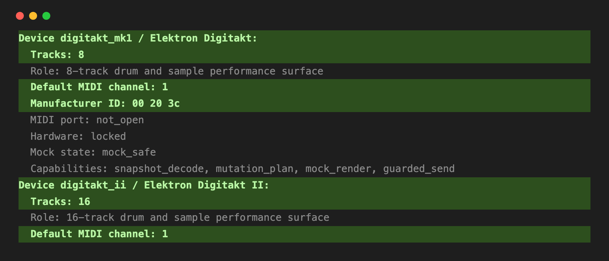
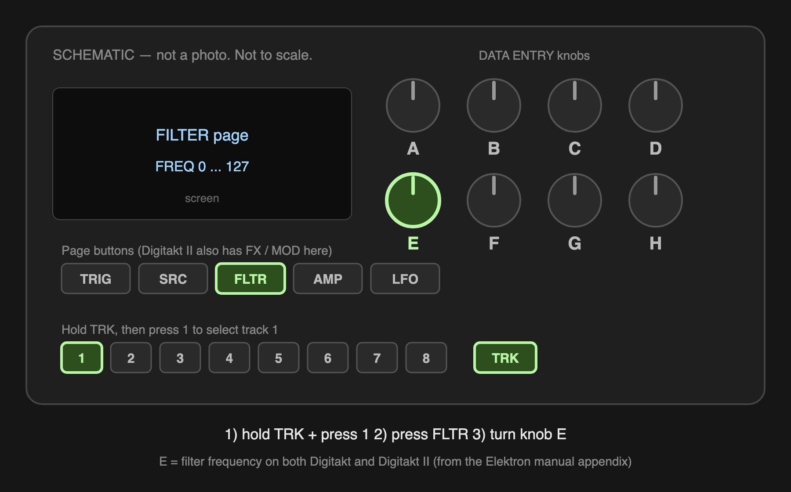

# Digitakt verification — step-by-step

**For:** Steve
**Time needed:** about 20 minutes for Part A, plus 15 for Part B
**What you need:** your Digitakt (or Digitakt II), a USB cable, and a computer

**This is two separate jobs.** Part A checks four numbers on a screen and needs
no cable. Part B captures a backup file from your machine and sends it to us.
Do Part A first — if you only have time for one, Part A is the one we need
most.

---

## What you are checking, in plain English

We added Digitakt support to the app. We wrote down some facts about your
machine — how many tracks it has, what MIDI channel it uses by default — but
**nobody has checked those facts against a real Digitakt.** That is what you
are doing.

You are not testing whether the app can control your Digitakt. It cannot, on
purpose, and it will not try. See "Is this safe?" below.

**Your job is to read four numbers off a screen and tell us if they match your
machine.** That is genuinely it.

---

## Is this safe? (Read this — it is short)

**Yes. The app cannot send anything to your Digitakt.** This is not a setting
you could accidentally flip; it is built into the code.

- The app never opens a MIDI *output* port to your Digitakt.
- The part of the app that would build messages to send produces an **empty
  list**, always, for Digitakt. There is nothing to send.
- Your patterns, samples, projects and sounds **cannot be changed by this
  test.** Nothing gets written to your machine.

You can leave your Digitakt on with your own project loaded. Nothing will
touch it.

**Part A does not need the cable at all.** Steps 1–2 read numbers out of the
app; Step 3 is just you looking at your machine.

**Part B does use the cable, and it is still safe.** Data flows one way only —
*from* your Digitakt *to* your computer. You press the send button on the
Digitakt itself; the computer only listens. Nothing is written back.

---

# SETUP — Do this once, before anything else

You need two things on your computer: **Python** (the language the app is
written in) and **the project itself**. This takes about 15 minutes, once.
After that, Parts A and B just work.

---

## Setup 1 — Install Python 3.11.9 (exactly this version)

Download the installer for your computer and run it:

| Your computer | Download this file |
|---|---|
| **Mac** | `https://www.python.org/ftp/python/3.11.9/python-3.11.9-macos11.pkg` |
| **Windows** | `https://www.python.org/ftp/python/3.11.9/python-3.11.9-amd64.exe` |

Double-click it and click through the installer with the default choices.

> **Windows only — one box you MUST tick:** on the very first screen, tick
> **"Add python.exe to PATH"** before clicking Install Now. If you miss it,
> uninstall and run the installer again.

> **Why not the newest Python?** The app depends on a MIDI library that only
> ships ready-made for Python up to 3.12. On newer versions the install tries
> to build it from source code and fails with a wall of errors. And 3.11.9 is
> the last 3.11 release that python.org still offers as a normal installer —
> later 3.11 versions are source-code only. So: 3.11.9, exactly.

> **Already have a different Python?** That's fine — leave it. These can live
> side by side, and the steps below ask for 3.11 by name.

---

## Setup 2 — Download the project

1. Download this file (it's a zip, about 8 MB):

   `https://github.com/buzzijose-hub/RytmRandomizer/archive/refs/heads/worktree-digitakt-device-support.zip`

2. Double-click the zip to unpack it. You get a folder with a long name:
   `RytmRandomizer-worktree-digitakt-device-support`
3. **Rename that folder to just `RytmRandomizer`.**
4. **Move it into your home folder:**
   - **Mac:** in Finder, press `Cmd` + `Shift` + `H` — that opens your home
     folder (the one with your name). Drag `RytmRandomizer` into it.
   - **Windows:** move it into `C:\Users\<your name>\`.

Getting the name and the location right matters — every command later
assumes the folder is called `RytmRandomizer` and sits in your home folder.

---

## Setup 3 — Open a Terminal and go into the project


**On a Mac:** press `Cmd` + `Space`, type `Terminal`, press `Enter`.

**On Windows:** press the Windows key, type `PowerShell`, press `Enter`.

A window opens with a blinking cursor. It looks plain and a bit intimidating.
Every command in this guide can be copy-pasted — you never have to type one
from memory.

Paste this and press `Enter`:

```
cd ~/RytmRandomizer
```

Nothing visible happens except the prompt now ends in `RytmRandomizer`. That
is correct — it just moved you into the folder.

> **"No such file or directory"?** The folder is misnamed or in the wrong
> place. Go back to Setup 2, steps 3 and 4.

---

## Setup 4 — Create the app's private Python area

Paste the line for your computer and press `Enter`:

**Mac:**
```
python3.11 -m venv .venv
```

**Windows:**
```
py -3.11 -m venv .venv
```

This takes a few seconds and prints nothing. It creates a hidden folder called
`.venv` that keeps the app's pieces separate from everything else on your
computer.

> **"command not found: python3.11"** (Mac) or **"No suitable Python runtime
> found"** (Windows): Python 3.11.9 did not install. Redo Setup 1. On Windows,
> check the "Add python.exe to PATH" box this time.

---

## Setup 5 — Install the app

**Mac:**
```
.venv/bin/python -m pip install -e .
```

**Windows:**
```
.venv\Scripts\python.exe -m pip install -e .
```

(Yes, that ends in a space and a full stop. The full stop means "this folder".)

This downloads what the app needs and takes a minute or two. Lots of text
scrolls past. **The last lines should include the words**
`Successfully installed` and mention `mido` and `python-rtmidi`.

> **A long red error mentioning `rtmidi`, `compiler`, `wheel` or `Microsoft
> Visual C++`:** you are almost certainly on the wrong Python version. Delete
> the `.venv` folder inside `RytmRandomizer` and redo Setup 1 and Setup 4.

---

## Setup 6 — Check it worked

**Mac:**
```
.venv/bin/python -m rytm_randomizer.cli live-gui-device-inventory-report
```

**Windows:**
```
.venv\Scripts\python.exe -m rytm_randomizer.cli live-gui-device-inventory-report
```

If you see text starting with `RytmRandomizer passive live GUI device
inventory model`, **setup is done.** You never need to repeat it.

**Leave this Terminal window open** — Part A starts right here.

---

# PART A — Check the four numbers

## Step 1 — Be in the project folder

If you just finished setup, you already are — skip to Step 2.

If you are coming back another day: open a Terminal (Setup 3) and paste:

```
cd ~/RytmRandomizer
```

---

## Step 2 — Run the check

Copy this line, paste it, press `Enter`:

```
.venv/bin/python -m rytm_randomizer.cli live-gui-device-inventory-report
```

> **On Windows,** use this instead:
> ```
> .venv\Scripts\python.exe -m rytm_randomizer.cli live-gui-device-inventory-report
> ```
> Use that full path, not plain `python`. On Windows, typing `python` can hit a
> Microsoft Store placeholder that fails with a confusing disk error.

A page of text scrolls past, one block per device. **Scroll until you find the
block for your machine** — it starts with `Device digitakt_mk1` or
`Device digitakt_ii`. It looks like this:



The **highlighted lines are the ones you check**. Everything in grey is
background detail you can ignore.

---

## Step 3 — Check the numbers against your machine

This is the actual verification. **Find the line for the machine you own** and
check each thing in the table.

### If you have a Digitakt (the original)

The app says:

```
- digitakt_mk1 / Elektron Digitakt / 8 tracks
```

| # | What the app claims | How to check it on your Digitakt | Match? |
|---|---|---|---|
| 1 | It is called **"Elektron Digitakt"** | Read the name on the front of the machine | ☐ yes ☐ no |
| 2 | It has **8 tracks** | Count the track buttons — the row you press to pick a track | ☐ yes ☐ no |
| 3 | Default **MIDI channel 1** | `SETTINGS` → `MIDI CONFIG` → `CHANNELS` — look at the **Auto Channel** | ☐ yes ☐ no |
| 4 | Manufacturer ID **00 20 3c** | Nothing to check — this is Elektron's company code, same for all their gear | n/a |

### If you have a Digitakt II

The app says:

```
- digitakt_ii / Elektron Digitakt II / 16 tracks
```

| # | What the app claims | How to check it on your Digitakt II | Match? |
|---|---|---|---|
| 1 | It is called **"Elektron Digitakt II"** | Read the name on the front of the machine | ☐ yes ☐ no |
| 2 | It has **16 tracks** | Count the track buttons | ☐ yes ☐ no |
| 3 | Default **MIDI channel 1** | `SETTINGS` → `MIDI CONFIG` → `CHANNELS` — look at the **Auto Channel** | ☐ yes ☐ no |
| 4 | Manufacturer ID **00 20 3c** | Nothing to check | n/a |

> **On the track count:** count the buttons you press to *select a track*, not
> the sixteen step buttons underneath. On the original Digitakt those are two
> different rows. If you are unsure, say so rather than guessing — "I wasn't
> sure how to count this" is a genuinely useful answer.

> **On the MIDI channel:** if yours is set to something other than 1, that may
> just be because *you* changed it at some point. Tell us what it is set to
> **and** whether you remember changing it. Both facts matter.

---

## Step 4 — Tell us what you found

Reply with this, filled in:

```
Machine:          Digitakt  /  Digitakt II     (circle one)

1. Name matches:           yes / no
2. Track count matches:    yes / no   — I counted: ____
3. Auto Channel is:        ____       — did I change it? yes / no / don't remember

Anything that looked odd:
```

**If something does not match, that is a success, not a failure.** Finding a
wrong number is exactly why we asked you to do this. Please do not "round" an
answer to what you think we want.

---

# PART B — Capture a backup file from your Digitakt

**Why we need this.** Part A checks facts we read from the manual. This part
gets us something no manual can give: **the actual bytes your Digitakt
produces.** We need those to teach the app how your machine stores its
settings. Until someone sends us a real file, that work cannot start — this is
the missing piece, and you are the person who can supply it.

**You are not installing anything or changing your Digitakt.** You are asking
it to send a copy of one kit, the same way you would make a backup, and saving
that copy as a file.

---

## What Part B is, in one sentence

Your Digitakt can send a copy of a kit over USB. You catch that copy with a
free program and save it as a file ending in `.syx`. You do that twice — once
with a knob low, once with it high — then one command files them for us.

---

## Step 5 — Get a program that can catch the file

You need one free program. Pick the one for your computer:

| Your computer | Program | Where |
|---|---|---|
| **Mac** | SysEx Librarian | `https://www.snoize.com/SysExLibrarian/` |
| **Windows** | MIDI-OX | `http://www.midiox.com/` |

Download it, install it, open it. Both are small, long-established free tools.

> **If you already own something that records SysEx** — Elektron Transfer, a
> DAW, anything — use that instead. Any tool that saves a `.syx` file is fine.

---

## Step 6 — Connect the Digitakt

1. Plug the Digitakt into your computer with the USB cable.
2. Turn the Digitakt on.
3. In the program from Step 5, set the **input / source** to your Digitakt.
   It will appear by name in a dropdown — "Elektron Digitakt" or similar.

> **If the Digitakt does not appear in the list:** try a different USB cable
> first. Some cables are charge-only and carry no data — this is by far the
> most common cause, and it is not something you did wrong.

---

## Step 7 — Tell the program to start listening

- **SysEx Librarian (Mac):** click **Record One** (or **Record Many**). It
  will say it is waiting.
- **MIDI-OX (Windows):** open **View → SysEx**, then **Command Window →
  Receive Manual Dump**.

The program now sits waiting. Nothing happens until you do Step 9.

---

## Step 8 — Set up a throwaway kit and turn the knob LOW

**First, protect your own work.** Save your current project on the Digitakt
(`SETTINGS` → `PROJECT` → `SAVE`). Then start a fresh, empty one
(`SETTINGS` → `PROJECT` → `NEW`). Starting a new project can throw away
anything you have not saved — that is why you save first.

> These project menus are the standard Elektron ones. If yours are named
> differently, check the Digitakt manual or ask Eddie — do **not** skip the
> save.

Now set **track 1's filter frequency to its lowest value**:



1. **Hold `TRK` and press `1`** — this selects track 1.
2. **Press `FLTR`** — the screen shows the FILTER page.
3. **Turn knob `E` all the way to the left.** The screen's `FREQ` value goes
   down to **`0`**.

Leave everything else alone. Write down the number the screen shows — you will
tell us it later.

> The picture is a **diagram, not a photo**, and not to scale. The button and
> knob names come from the Elektron manual. If your machine looks different,
> that's useful to know — tell us.

---

## Step 9 — Send the kit from the Digitakt

On the Digitakt itself:

1. Press **`SETTINGS`**.
2. Go to **`SYSEX DUMP`**.
3. Choose **`SYSEX SEND`**.
4. Choose **`KIT`** — the currently loaded kit, **not** the whole project.
5. Press **`YES`** to send.

> **Why a kit and not the whole project:** a kit is a few kilobytes; a whole
> project can be hundreds of times larger. These files get committed into the
> project's history permanently, so smaller is genuinely better. A kit is also
> exactly what the software models.

The Digitakt shows a progress bar. The program on your computer should show
data arriving — a size in bytes, or a new row in a list.

> **Honest note:** these menu names are from the Rytm and Analog Four, which
> use the same scheme. **We have not confirmed them on a Digitakt.** If your
> menus differ, that is useful information — tell us what you actually see and
> we will correct the instructions. You are the first person doing this.

> **If nothing arrives:** check the program is still in "waiting/record" mode
> — some tools time out after 30 seconds and need restarting before you press
> `YES`.

---

## Step 10 — Save the file as `low.syx`

1. In the program, **save** what it caught.
2. Save it **on your Desktop**, named exactly **`low.syx`**.
3. Check the file size. **A kit should be a few kilobytes.** If it is hundreds
   of kilobytes you probably sent the whole project — redo Step 9 and choose
   `KIT`.

---

## Step 11 — The second capture: turn the knob HIGH (the important one)

This is the most valuable step in the whole guide. With two files that differ
in **exactly one** known way, we can find where that setting lives by comparing
them. With only one file we would be guessing.

1. On the Digitakt, **change nothing except this one knob:** track 1 should
   still be selected and the FILTER page still showing (if not: hold `TRK` +
   press `1`, then press `FLTR`). **Turn knob `E` all the way to the right** —
   `FREQ` goes up to **`127`**. Write down the number the screen shows.
2. In the capture program, start listening again (Step 7).
3. Send the kit again (Step 9).
4. Save it **on your Desktop**, named exactly **`high.syx`**.

You now have `low.syx` and `high.syx` — the same kit, differing only in one
knob. Don't worry if you got this wrong: the command in the next step checks
the two files really are different and tells you if they aren't.

---

## Step 12 — Run one command; it does the rest

You do **not** have to create folders, compute checksums, or write the
provenance note by hand. One command does all of it.

Once you have **both** `low.syx` and `high.syx` on your Desktop, run:

```
.venv/bin/python scripts/intake_digitakt_capture.py \
  --device digitakt_mk1 \
  --low  ~/Desktop/low.syx \
  --high ~/Desktop/high.syx \
  --captured-by "Steve" \
  --os-version "1.52A" \
  --menu-path "SETTINGS > SYSEX DUMP > SYSEX SEND > KIT"
```

Change these to match you:

| Part | What to put |
|---|---|
| `--device` | `digitakt_mk1` or `digitakt_ii` |
| `--low` / `--high` | where you saved the two files |
| `--captured-by` | your name |
| `--os-version` | from `SETTINGS > SYSTEM > OS VERSION` on the Digitakt |
| `--menu-path` | **the exact menu names you actually pressed** |

> **On Windows,** start the command with `.venv\Scripts\python.exe` instead of
> `.venv/bin/python`, and put it all on one line.

### What it does for you

- Checks the files really are Digitakt dumps — and tells you plainly if you
  sent the whole project by mistake, or if the capture tool caught nothing.
- Checks the two files actually differ, so "I forgot to move the knob" is
  caught immediately rather than three weeks later.
- Creates `tests/fixtures/digitakt_saved_kit/`, copies the files in with
  consistent names, computes the SHA256s.
- Writes the provenance note automatically.

**If anything is wrong it stops and writes nothing**, so a failed run never
leaves a half-finished mess behind. Read the message — it says what to redo.

It is **passive**: it reads your files and writes into the project folder. It
never opens a MIDI port and never contacts your Digitakt.

---

## Step 13 — Send it

The command prints where it put everything. Then either:

- **Simplest:** send Eddie the whole `tests/fixtures/digitakt_saved_kit`
  folder. Done.

Either way, **include the two numbers you wrote down** — what the screen showed
for `FREQ` in the low file and in the high file (e.g. "0 and 127"). The
on-screen number tells us far more than "turned it most of the way up".
- **If you use git:** commit that folder on a new branch and open a pull
  request. Do **not** commit to `main` or `modularize-v1.34`.

### One thing that really matters

**Use a disposable kit, not your real work.** Make a new kit, leave it
initialized, change only what Steps 8 and 11 ask. This keeps your own material out of
a public repository and makes the file far easier for us to read.

---


## What we do with your files

We compare the bytes, find where each setting lives, and write that into the
app with your files kept as the evidence. Nothing is sent back to your
Digitakt.

**Your files contain your project** — pattern and sound settings. They do not
contain audio samples, and they carry nothing personal. If your project is
private, send a throwaway one instead: make a new empty project, tweak a
couple of knobs, and capture that. It works just as well for our purposes.

---

## Things that might go wrong

| What you see | What it means | What to do |
|---|---|---|
| `command not found: .venv/bin/python` | Setup did not finish, or you are in the wrong folder | Run `cd ~/RytmRandomizer`, then redo Setup 4 and 5 |
| `No such file or directory` | The folder is misnamed or in the wrong place | Re-check Setup 2 and Setup 3 |
| No `Device digitakt_...` block anywhere | Wrong version of the app | Send Eddie the first 20 lines of output |
| Only Rytm and Analog Four are listed, no Digitakt | You are on an older version | Send Eddie a screenshot |
| Terminal output looks like a wall of nonsense | Normal — most of it is irrelevant | Scroll to your `Device digitakt_...` block |

### Part B problems

| What you see | What it means | What to do |
|---|---|---|
| Digitakt not in the program's device list | Usually a charge-only USB cable | Try a different cable first |
| Program catches nothing when you press `YES` | It stopped waiting | Restart the record/receive step, then send again |
| Menu names on the Digitakt do not match Step 9 | Expected — we have not confirmed these on a Digitakt | **Tell us what you actually see.** This is useful, not a failure |
| Saved file is 0 bytes | Nothing was captured | Redo Steps 7–9; make sure recording starts *before* you press `YES` |

**Any error at all: copy the text, paste it in a message, send it.** Do not try
to fix it. A screenshot works too.

---

## Stuck? Paste this into ChatGPT or Claude

You do not have to wait on Eddie to get unstuck. Copy everything in the box
below into ChatGPT, Claude, or whichever assistant you use, then describe your
problem underneath it.

The prompt tells the assistant what you are doing, what is safe, and — most
importantly — **to say "I don't know" rather than guess about your hardware.**
That last part matters: a confident wrong answer about a menu path will waste
more of your time than a plain "ask Eddie".

```text
I am helping test a music-software project. I am not a programmer, so please
explain things simply and one step at a time.

MY HARDWARE: an Elektron Digitakt (or Digitakt II) drum machine/sampler,
connected to my computer by USB.

WHAT I AM DOING - a one-time setup, then two parts:

SETUP (once) - Python 3.11.9 specifically (not newer: a MIDI library it needs,
python-rtmidi 1.5.8, only has ready-made builds up to Python 3.12). I
downloaded the project as a zip, renamed the folder to RytmRandomizer and put
it in my home folder. Then, from inside that folder:
  macOS:    python3.11 -m venv .venv
            .venv/bin/python -m pip install -e .
  Windows:  py -3.11 -m venv .venv
            .venv\Scripts\python.exe -m pip install -e .
If pip errors mention rtmidi, a compiler, a wheel or Visual C++, I am probably
on the wrong Python version.

PART A - I run one command in a terminal and read four facts off the screen,
then check them against my actual machine:
  1. the device name
  2. the number of tracks (should be 8 on a Digitakt, 16 on a Digitakt II)
  3. the default MIDI channel (Auto Channel, in SETTINGS > MIDI CONFIG >
     CHANNELS)
  4. the manufacturer ID (00 20 3c - I do not need to check this one)

The command, run from the project folder:
  macOS:    .venv/bin/python -m rytm_randomizer.cli live-gui-device-inventory-report
  Windows:  .venv\Scripts\python.exe -m rytm_randomizer.cli live-gui-device-inventory-report

PART B - I capture two SysEx dumps from the Digitakt:
  - first I save my own project, then start a NEW empty project, so my real
    work is never touched
  - I select track 1 (hold TRK, press 1), press FLTR, and turn DATA ENTRY knob
    E all the way LEFT (FREQ 0)
  - a free catcher program (SysEx Librarian on Mac, MIDI-OX on Windows) with
    its MIDI input set to the Digitakt, in record/receive mode
  - on the Digitakt: SETTINGS > SYSEX DUMP > SYSEX SEND > KIT > YES
    (a KIT, not the whole PROJECT - a kit is a few kilobytes)
  - save it on my Desktop as low.syx
  - then turn ONLY knob E all the way RIGHT (FREQ 127), capture again, and save
    it on my Desktop as high.syx
  - then ONE command validates both files, files them, computes checksums and
    writes the provenance note:
      .venv/bin/python scripts/intake_digitakt_capture.py --device digitakt_mk1
        --low ~/Desktop/low.syx --high ~/Desktop/high.syx --captured-by "Steve"
        --os-version "<from SETTINGS > SYSTEM>" --menu-path "<what I pressed>"
    (Windows: .venv\Scripts\python.exe instead of .venv/bin/python)
    If it prints an error it has written nothing -- the message says what to
    redo. Help me read it rather than working around it.

IMPORTANT SAFETY FACTS - please do not suggest anything that contradicts these:
  - This software CANNOT send anything to my Digitakt. It is receive-only by
    design. My patterns, samples and projects cannot be altered by it.
  - In Part B the data flows one way only: FROM the Digitakt TO my computer.
  - I should never be asked to install firmware, reset my device, factory
    reset, or overwrite a project. If a step seems to ask for that, stop and
    tell me to check with the project owner.

HOW I WANT YOU TO HELP:
  - Explain terminal commands before I run them, in plain language.
  - Help me read error messages and tell me what they mean.
  - Help me find menus on the Digitakt and set up the catcher program.
  - Ask me what I see on screen rather than assuming.

CRITICAL - WHEN YOU DO NOT KNOW:
  The exact Digitakt menu path for SysEx dump, and the TRK / FLTR / knob E
  instructions, have NOT been confirmed on real hardware by the project. It is an educated guess based on other Elektron
  devices. If my menus do not match, DO NOT invent a path that sounds
  plausible. Say you are not certain, and tell me to report what I actually
  see. A wrong guess here costs more time than saying "I don't know".

  The same applies to anything else you are unsure about. I would much rather
  hear "I'm not sure, ask Eddie" than a confident answer that turns out wrong.

MY PROBLEM IS:
[describe what happened, and paste any error text or what your screen shows]
```

**One thing to watch for:** if the assistant tells you to do something that
writes *to* the Digitakt — install, update, reset, overwrite, restore — stop
and ask Eddie. Nothing in this test requires that.

---

## What happens next

If your numbers match, we mark the Digitakt facts as hardware-verified and
that unblocks the next stage of the work.

If something does not match, we fix the wrong number and ask you to check that
one thing again. That is a five-minute follow-up, not a repeat of everything.

---

## For the record — what this test does NOT cover

Being straight about the limits, so nobody later thinks this proved more than
it did:

- **Part A** does not verify the Digitakt's saved-project byte layout. Those
  offsets stay unverified and the code refuses to use them.
- **Part B does not verify them either** — it *collects the evidence* that
  lets us do that work later. Sending the files does not make the app able to
  control your Digitakt; that is a separate change with its own review.
- It does **not** test sending anything to the device, because that capability
  deliberately does not exist yet.
- It does **not** test capture, mutation, or any performance feature for the
  Digitakt — there are none.

This test covers the **identity facts only**: name, track count, default MIDI
channel, manufacturer ID. That is the full scope, and it is the part that is
currently unverified.

---

*Questions: ask Eddie. There is no wrong question here, and "I don't
understand this step" is the most useful thing you can tell us — it means the
instructions need fixing, not you.*
