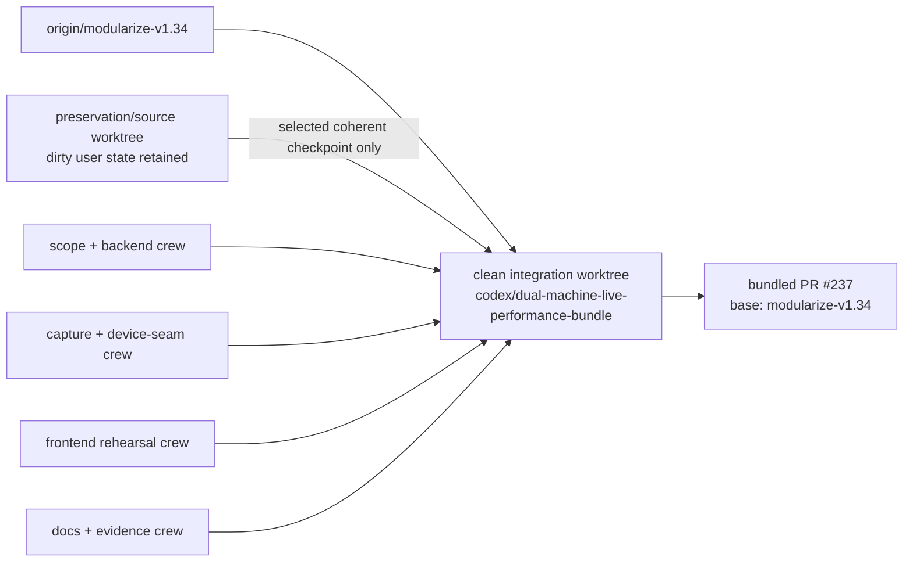

# Targeted dual-machine live-kit mutation plan

Date: 2026-08-26

Status: in-flight — software-complete / hardware-blocked. Implementation, local
verification, review, push, and non-stacked PR #237 delivery are complete; CI
is green on the current code head. Required review and operator-present studio
hardware evidence remain outstanding; no merge was attempted.

Hardware status: no real MIDI input or output was opened during implementation
or automated verification. Studio rehearsal remains an explicit operator task.

## Why

The Cockpit needed one coherent live-performance path for Analog Rytm and
Analog Four saved KIT captures:

- capture the current saved KIT without granting output authority;
- represent explicit Rytm pad and A4 track targets;
- intersect include targets with independent deny locks;
- make a verified captured Rytm KIT the mutation anchor;
- prepare and send only the exact selected Rytm scope;
- retain A4 evidence while refusing to guess unproven saved-KIT offsets; and
- preserve OXI as the owner of sequencing, notes, triggers, mutes, and pattern
  motion.

The bundle also had to preserve frozen V1.34 output, passive defaults, lazy MIDI
imports, the Device/strategy architecture, and one non-stacked PR.

## Delivered architecture

### Capture boundary

The packaged Cockpit supports an explicitly armed, input-only current-KIT
capture sidecar. Rytm and A4 frames pass through the canonical codecs and must
prove exact decode/re-encode stability before they become semantic evidence.
Capture does not enumerate or open an output port and does not send a dump
request.

### Target and lock model

The canonical scope equation is:

```text
(explicit targets or the complete registered device domain) - locks
```

Rytm pad ids are `1..12`; A4 track ids are `1..4`. Identifiers are strict
non-boolean integers. Empty targets preserve the backward-compatible all-scope
default. Invalid input leaves authoritative state unchanged. A target or lock
change invalidates any prepared plan.

The scope travels through `MutationScope`, the public `MutationPlanner` and
`Device` seams, candidate construction, PREPARE, and the inert send-plan
boundary. The boundary repeats the scope check so a stale or externally built
candidate cannot address a locked or untargeted item.

### Rytm captured-anchor promotion

A round-trip-verified `RytmKitSnapshot` is projected only through promoted
snapshot-shell semantic rows. Unknown bytes are retained by the codec but are
never guessed into a semantic field. Adoption is in-memory, adds capture
history, recomputes the candidate from the exact source id, and performs no
MIDI I/O.

### Analog Four fail-closed planning

Captured A4 KIT evidence, targets, and locks are retained independently from
Rytm state. Saved-KIT mutation remains blocked and produces a zero-event,
unsendable pending plan until every required mapping proof is promoted:

1. unpacked offset for each semantic field;
2. typed raw-value encoding;
3. per-track stride evidence;
4. exact decode/mutate/re-encode round trips;
5. fixture-backed byte-diff isolation; and
6. physical-device validation.

The machine-readable evidence matrix and promotion rule live in
`docs/2026-08-26-targeted-live-kit-mutation_A4_MAPPING_GAP.json`. Manual-backed
live CC facts are not accepted as saved-KIT offset evidence.

### Sole output authority

The existing `senders.armed_apply.ArmedApplySession` remains the sole real
MIDI output authority. Cockpit PREPARE creates an inert plan containing exact
target-minus-lock evidence. SEND requires the current plan id, current
authority, explicit arming, and operator confirmation before that existing
boundary may open the exact selected Rytm output port lazily. There is no second
Cockpit hardware sender and no restored real-device adapter output path.

A4 captured-KIT hardware output is outside this slice and remains blocked.

### Authoritative bootstrap and frontend

The server bootstrap is an eleven-event authoritative snapshot, in this order:
`session_status`, `snapshot_changed`, `profile_changed`,
`profile_catalog_changed`, `history_updated`, `patch_genome_changed`,
`kit_captures_changed`, `mutation_targets_changed`, `mutation_locks_changed`,
`dual_machine_stage_changed`, and `performance_console_changed`. A wired
connection manager may append `connection_changed` as event 12. The frontend
hydrates independent capture, target, lock, candidate, plan, authority,
failure, and recovery state, guards optimistic updates by request generation,
suppresses stale locked ghosts, renders a per-machine DeviceRail, and displays
the exact selected send scope. Rytm connection state mirrors the armed-output
manager; A4 capture/session state is not continuous physical hot-plug telemetry.

## Workstreams and integration

| Workstream | Scope | Result |
|---|---|---|
| WS-1 | mutation scope, target model, candidates, send plans | complete |
| WS-2 | session, protocol, handlers, bootstrap | complete |
| WS-3 | capture bridge, Rytm anchor, A4 blocked planner | complete |
| WS-4 | TypeScript state, DeviceRail, controls, rehearsal | complete |
| WS-5 | docs, evidence manifest, verification, review, PR | complete; PR #237 open and CI green |



| Crew | Worktree / ownership | Non-overlap rule |
|---|---|---|
| Preservation lead | Original `codex/rush16-anchor-audition-batch` checkout | Read/classify only; preserve unrelated RUSH commits, dirty files, references, and artifacts. |
| Scope + backend | Isolated implementation worktree | Own `snapshot/mutation_scope.py`, `cockpit/mutation_targets.py`, `cockpit/data/stage.py`, `cockpit/stage/`, `cockpit/engine/send_plan.py`, `cockpit/ws/{protocol,session,handlers}.py`, and their focused Python tests. |
| Capture + device seam | Isolated implementation worktree | Own `cockpit/capture/`, `devices/saved_kit_capture.py`, `devices/{analog_rytm,analog_four}.py`, and matching capture/device tests. |
| Frontend rehearsal | Isolated implementation worktree | Own `desktop/web/` protocol/state/components/styles/tests; do not edit backend or docs. |
| Docs + evidence | Clean integration worktree | Own README/contributor docs, `docs/**`, project memory, and the A4 mapping manifest; do not edit production/tests. |
| Integrator | `RytmRandomizer-worktrees/dual-machine-live-performance` | Resolve overlap once, run serialized closeout, and deliver the single branch/PR. |

The dependency graph is base → disjoint crew outputs → one clean integration
branch → one PR. No crew opens a PR and no branch is based on another open
branch. File ownership is exclusive during implementation; any unavoidable
shared-file edit is handed to the integrator instead of edited concurrently.
The user's unrelated dirty checkout remains preserved.

PR #236 has a known six-file overlap: `README.md`, `docs/ARCHITECTURE.md`,
`docs/ARCHITECTURE_DIAGRAMS.md`, `docs/STATUS.md`,
`output/al16/AL02_LOCK_RYTM_manifest.json`, and
`tests/test_al16_rytm_export.py`. A rebase after #236 must resolve the set as
one integration unit. The combined AL02 manifest dependency hashes must be
recomputed from the #236 writer SHA and this bundle's device/snapshot SHAs,
then the expected generated-manifest digest/test must be updated together.
Taking either side's manifest hash alone is forbidden.

After a host freeze warning, all remaining validation is intentionally
serialized: one test, build, or review process at a time.

## Safety and parity invariants

- V1.34 engines, runners, and all 505 golden fixture files remain byte-frozen.
- Parity verification runs without `PARITY_CAPTURE_MODE=1`.
- Ordinary CLI and Cockpit composition stay passive.
- Capture is input-only; capture adoption is in-memory.
- No direct OXI control is added.
- A prepared plan is inert and explicit.
- Armed SEND requires `confirm: true` and the exact current `send_plan_id`;
  the implementation/tests fix the reviewed missing-id acceptance defect.
- Target and lock changes revoke stale plans.
- A4 mapping uncertainty is a categorical zero-event blocker.
- `mido==1.3.3` and `python-rtmidi==1.5.8` remain pinned.
- MIDI imports remain lazy at the approved boundary.
- No `Any` escape hatch, new package-root module, or sibling device package is
  introduced.

## Self-driving decision rules

- Invalid target input: reject it without changing prior target state.
- Unstable or contradictory capture: retain no promoted anchor.
- Unmapped Rytm field: preserve the raw frame but omit semantic projection.
- A4 `offsets_promoted=False`: emit a blocked zero-event plan.
- Focused failure: fix the first attributable regression and rerun serially.
- Frozen parity failure or fixture diff: stop; never regenerate fixtures.
- Hardware dependency: record the blocker; never simulate a successful physical
  rehearsal.
- External delivery: push one integration branch, open one PR, request the
  required reviewer, monitor CI, and do not merge.

## Verification plan

1. Target model and planner:
   bounds, boolean rejection, empty-default behavior, explicit filtering,
   target-plus-lock intersection, deterministic plan evidence, and stale-plan
   rejection.
2. WebSocket/session:
   eleven-event bootstrap, set/replace/clear commands, authoritative rollback,
   capture isolation, disconnect revocation, and per-machine recovery.
3. Capture:
   canonical framing, exact round trip, Rytm projection and adoption,
   wrong-device rejection, and A4 retained-but-blocked evidence.
4. Output boundary:
   PREPARE/SEND exact-scope enforcement, sole `ArmedApplySession` authority,
   passive composition, and injected providers only.
5. Frontend:
   authoritative hydration, generation guards, targets/locks, disabled A4 send,
   DeviceRail, exact selector, and complete mock rehearsal.
6. Broad gates:
   all Cockpit Python tests, frontend 100% coverage, TypeScript typecheck,
   ESLint, production build, strict touched-file Python coverage, architecture
   tests, frozen V1.34 parity, lint trio, fast suite, and full suite.
7. Review:
   separate read-only review dimensions for architecture, house style,
   parity/tests, side effects, observability, abstraction reuse, docs freshness,
   and maintainability/string/env/learning concerns.

## Plan-requirements conformance

- [x] Gate 1 - 100% branch coverage required for every touched Python module.
- [x] Gate 2 - V1.34 parity stays byte-identical; capture mode is forbidden.
- [x] Gate 3 - Python and frontend lint, format, type, and build gates.
- [x] Gate 4 - no dead or duplicate target, codec, or hardware-send surface.
- [x] Gate 5 - status, quickstart, architecture, diagrams, and run artifacts.
- [x] Gate 6 - frozen dataclasses, Protocols, TypedDicts, and Literals; no Any.
- [x] Gate 7 - structured observability on state and authority transitions.
- [x] Gate 8 - intent-named focused tests reuse shared fixtures.
- [x] Gate 9 - additions remain within approved existing subpackages.
- [x] Gate 10 - Literal-backed wire discriminators; no ad hoc mode dispatch.
- [x] Gate 11 - shared Cockpit fixtures extended rather than duplicated.
- [x] Gate 12 - new constants use Final.
- [x] Gate 13 - no new environment variables.
- [x] Gate 14 - pre/post maintainability audit and durable report.
- [x] Gate 15 - plan, run report/log, state, architecture diff, replay playbook,
  rule, skill, and machine-readable evidence are durable.
- [x] Gate 16 - the graph, worktrees, crew/file ownership, one clean bundled
  branch, one base branch, and no-stack rule are explicit above.
- [x] Gate 17 - reuses codecs, Device strategies, MutationScope, history,
  snapshot promotion, send-plan, and ArmedApply abstractions.
- [x] Gate 18 - architecture prose and relevant diagrams updated.

## Maintainability audit

1. One documented include-minus-deny equation replaces device-local variants.
2. Capture, adoption, planning, and output authority remain distinct seams.
3. Rytm and A4 state is independent without parallel package hierarchies.
4. Bounds and discriminators use typed constants rather than magic values.
5. No new environment-variable configuration is introduced.
6. Shared fixtures and test helpers minimize setup duplication.
7. Focused suites precede serialized broad gates.
8. Errors are categorical and actionable; uncertain mapping fails closed.
9. No persisted target schema or frozen format migration is required.
10. A future device family can reuse the same Device/strategy and scope seams.

The post-implementation audit is recorded in
`docs/2026-08-26-targeted-live-kit-mutation_MAINTAINABILITY_REPORT.md`.

## Rollback

The target model, wire fields, capture bridge, and UI controls are additive.
Reverting this single logical branch returns empty targets to the previous
all-scope behavior. No device was written, no parity fixture was regenerated,
no A4 offset was promoted, and no external data migration is required.

## Done criteria

- Rytm pad targets and A4 track targets round-trip as authoritative state.
- Candidates and prepared Rytm packets contain only target-minus-lock scope.
- A verified Rytm capture becomes the semantic mutation anchor.
- Captured A4 mutation is visibly blocked with zero events and explicit missing
  evidence.
- OXI ownership remains unchanged.
- Automated gates pass without hardware I/O or parity-fixture changes.
- Per-dimension review findings are resolved or documented.
- One PR is opened against `modularize-v1.34`, required review is requested,
  and CI is observed; the PR is not merged.
- Physical capture/send rehearsal and A4 mapping promotion are reported as
  studio blockers, never claimed complete.
