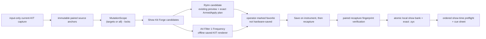

# Show Kit Forge comprehensive implementation plan

Date: 2026-09-04

Status: in-flight — implementation published in [PR #238](https://github.com/buzzijose-hub/RytmRandomizer/pull/238);
final CI and operator-present studio validation are tracked in the run state

Branch: `codex/show-kit-forge-complete`

Base: `origin/modularize-v1.34` at
`0b77f9fef019dbfe1da943019b339bd446f95725`

Delivery shape: one clean integration worktree, one branch, and one
non-stacked PR against `modularize-v1.34`.

Resumed 2026-09-07 from preserved uncommitted implementation evidence. The
original dirty checkout and prior `show-kit-forge` worktree remain untouched.
The new integration worktree is
`C:/Users/Jose Buzzi/Documents/RytmRandomizer-worktrees/show-kit-forge-complete`.
This continuation performs independent audits, repairs, serialized gates, and
one PR; it does not infer completion from the prior run's notes.

This plan is governed by [`docs/PLAN_REQUIREMENTS.md`](../../PLAN_REQUIREMENTS.md)
and preserves its complete 18-gate checklist below.

Gate 14 baseline:
[`2026-09-04-show-kit-forge_MAINTAINABILITY_AUDIT.md`](2026-09-04-show-kit-forge_MAINTAINABILITY_AUDIT.md).
Gate 14 post-plan re-audit:
[`2026-09-04-show-kit-forge_MAINTAINABILITY_REPORT.md`](2026-09-04-show-kit-forge_MAINTAINABILITY_REPORT.md).
Architecture delta:
[`2026-09-04-show-kit-forge_ARCHITECTURE_BEFORE_AFTER.md`](2026-09-04-show-kit-forge_ARCHITECTURE_BEFORE_AFTER.md).

Hardware status: implementation and automated verification are hardware-inert.
Analog Four generated-scratch validation and the previously outstanding Rytm
one-pad SEND/restore rehearsal remain operator-present studio work and will not
be represented as completed by tests.

## Why

### September 7 maintainer-review closeout

PR #238 remains the single delivery vehicle. The continuation starts from
`6cfde1fcd306fa2f5a30ca4a8f2869ec369d9914` and reconciles the maintainer's
[requested changes](https://github.com/buzzijose-hub/RytmRandomizer/pull/238#pullrequestreview-5133649443).
The earlier automated software verdict is not maintainer approval.

| Workstream | Exclusive ownership | Depends on |
| --- | --- | --- |
| Calibration consistency and codec reuse | Root A4 calibration/field data, A4 strategies, dedicated tests; isolated `cr-pr238-calibration-closeout` worktree | Existing captured evidence and generic saved-KIT field codec |
| Show-pack compatibility and validation reuse | Show Bank data/lifecycle/store/export/workspace, WS handlers, neutral shared validation, focused tests; isolated `cr-pr238-validation-closeout` worktree | Calibration public API for trusted native values |
| A4 live-SEND development audit and offline preparation | Frozen report DTO, pure evidence builder and adversarial tests in isolated `cr-pr238-a4-preparation`; root wires authenticated read-only workspace/WS/UI review | Reuses codecs, calibration, scope and capture facts; physical transmission remains blocked |
| Integration and studio build | Frontend token/identifier projections, architecture/docs, review reconciliation, packaging and exact-build receipt | Both code workstreams and the SEND audit |

The complete finding/evidence ledger is
[`2026-09-07-show-kit-forge-review-reconciliation.md`](../../2026-09-07-show-kit-forge-review-reconciliation.md).
Heavy test and build processes remain serialized. The original dirty checkout,
earlier unfinished worktree, and unrelated local artifacts remain preserved.
No parity regeneration, pin changes, review bypass, or physical output is
authorized. GitHub integration may proceed only through its required reviews
and checks. A source-identified studio build is required even while approval or
physical evidence remains outstanding.

Jose needs a single show-preparation workflow that starts from two known-good,
captured hardware kits and ends with an ordered, locally verifiable bank of
paired Rytm/A4 favorites. The workflow must make experimentation quick while
never confusing an in-memory candidate, an unsaved live state, a manual
hardware save, and a verified recapture.

The August 28 evidence closes exactly one A4 saved-KIT mapping gap: Filter 1
Frequency across synth Tracks 1-4. It does not validate Amp Attack, any other
unverified field, destination-slot semantics, or an A4 Cockpit transmit path.
Show Kit Forge therefore adds narrow offline A4 candidate generation while
keeping A4 hardware SEND categorically blocked.

## Scope and operator contract

The delivered workflow can:

1. create and name a versioned show bank;
2. adopt one round-trip-verified Rytm capture and one round-trip-verified A4
   capture as immutable source anchors;
3. generate deterministic small, medium, large, or custom-depth candidate
   pairs using the canonical `(targets or complete domain) - locks` scope;
4. audition Rytm through the existing exact-plan ArmedApply boundary while
   keeping OXI in charge of sequencing, triggers, mutes, and pattern motion;
5. generate A4 Filter 1 Frequency candidates as offline saved-KIT bytes only;
6. mark a candidate favorite without calling it hardware-saved;
7. instruct `Save on instrument, then recapture` before either favorite can be
   verified;
8. explicitly retain selected source/favorite capture bytes with deterministic
   manifests and no silent overwrite;
9. export/import/verify a self-contained show pack with cue order and recovery
   instructions; and
10. compare current manual dumps with the expected paired fingerprints before
    granting `show-ready`.

Cockpit never issues a persistent SAVE. Local export is not hardware-write
authority. A4 SEND remains blocked even when its offline candidate is valid.

## Evidence promotion boundary

Repository fixtures preserve the exact August 28 initialized scratch-kit
baseline and saved Filter 1 Frequency captures. Tests pin their hashes and
prove:

- A4 MKII saved-KIT framing and checksum validation;
- Track 1 unpacked offset `128` and Track 1-4 unpacked stride `350`;
- unsigned 8.8 fixed-point values for `0.00`, `63.50`, and `127.00`;
- exact decode/re-encode identity for every source fixture;
- bounded arbitrary representable Filter 1 Frequency mutation;
- exact re-decode of the rendered semantic value;
- intended-byte isolation before envelope repacking; and
- preservation of every unknown, unselected, or locked byte.

The durable evidence status distinguishes offline captured-kit mutation
validation from hardware-write validation. Only Filter 1 Frequency gains the
former status. Existing Filter 2 Resonance hardware-write evidence is retained;
Filter 1 Resonance, Filter 2 Frequency, Amp Attack, and all other unsupported
Show Kit Forge families remain fail-closed.

A generated scratch-kit fixture and JSON validation handoff are marked
`pending_physical_outbound_validation`. They contain exact source/generated
hashes, intended tracks/values, checksum and byte-isolation evidence, plus the
short operator procedure: manually load into a scratch slot, listen, save on
the A4, dump the saved KIT, and compare the returned fingerprint. No fabricated
observation will be recorded.

## Architecture

### Reused seams

- `devices/` registry and existing Rytm/A4 saved-KIT codecs remain the device
  identity and frame-validation boundary.
- `snapshot.mutation_scope.MutationScope` remains the only include-minus-lock
  resolver.
- Cockpit capture remains input-only and keeps incoming KIT dumps in memory
  until an explicit retain action.
- Current Cockpit `MutationCandidate`, history, stage coordination, send-plan,
  and `ArmedApplySession` remain the Rytm audition path.
- `cockpit.export.writer.atomic_write` / `atomic_write_set` remain the atomic
  publication primitives.
- Show-bank persistence lives beneath the existing `cockpit/` package and uses
  the same platform application-data root as profiles/library.
- WebSocket events remain whole-state, ack-first projections; React consumes
  the authoritative server state through the existing Zustand store.
- Existing live-kit package-audition/operator-package metadata is referenced in
  provenance and recovery guidance rather than reimplemented.

### New focused seams

The implementation may add a nested `cockpit/show_bank/` package, not a new
package-root hierarchy. It owns four bounded responsibilities:

1. immutable show-bank domain/state transitions;
2. deterministic paired-candidate orchestration over existing mutation/codecs;
3. explicit atomic store/import/export/verification; and
4. show-time readiness/cue-sheet projection.

Stable DTOs and wire shapes live in `cockpit/data/show_bank.py`. Static status,
depth-preset, bound, and evidence facts live under `data/`. The Cockpit session
injects the store/service; no module-level mutable registry or alternate sender
is introduced.

## Workstreams and ownership

Implementation is integrated into the clean worktree from isolated worktrees
with exclusive file ownership. Read-only dimension reviews inspect the
integration tree. No workstream opens a PR or bases work on another open PR.

Continuation assignments (all paths beneath `RytmRandomizer-worktrees/`):

| Worktree / branch | Ownership |
| --- | --- |
| `show-kit-forge-complete` / `codex/show-kit-forge-complete` | integration, wire adapter, docs, verification, PR |
| `show-kit-forge-a4-fix` / `codex/show-kit-forge-a4-fix` | A4 renderer, then store/export failure contracts; read-only review dimensions |
| `show-kit-forge-state-fix` / `codex/show-kit-forge-state-fix` | model, lifecycle, workspace, final SEND and disconnect safety |
| `show-kit-forge-ui-finish` / `codex/show-kit-forge-ui-finish` | frontend UI/state/protocol and browser verification |

The kickoff is Jose's explicit autonomous mission. Resume by reading the
state file and run log, reconciling Git/GitHub, then executing the next
unfinished gate. The current permission profile permits local edits and the
requested feature push/PR; it does not authorize MIDI operations, merge,
force-push, parity regeneration, or modification of preserved worktrees.
Stop on an explicit user stop instruction, recording the checkpoint. This
continuation has a 72-hour wall-clock cap from 2026-09-07; at exhaustion record
the exact incomplete state. Termination is the single comprehensive PR with
completed software verification/review and an honest pending studio checklist.

| Workstream | Exclusive implementation ownership | Dependency |
|---|---|---|
| WS-1 evidence + A4 codec | `data/analog_four_*`, A4 saved-KIT strategy files, A4 evidence/fixtures, focused codec tests | repository evidence |
| WS-2 show-bank domain + storage | `cockpit/data/show_bank.py`, `cockpit/show_bank/{model,store,export,readiness}.py`, focused persistence/corruption/export/readiness tests | atomic writer + capture DTO |
| WS-3 forge + WebSocket | `cockpit/show_bank/forge.py`, capture frame retention, session/protocol/handlers/bootstrap, WS/state/journey tests | WS-1 and WS-2 public contracts |
| WS-4 frontend | `desktop/web/src/{ws,state,cockpit}` Show Kit Forge UI and tests | WS-3 wire contract |
| WS-5 integration/docs | architecture prose/diagrams, Quickstart, hardware validation, STATUS, run artifacts, generated mirrors, review, PR | WS-1 through WS-4 |

Shared integration files (`cockpit/ws/handlers.py`, protocol/store files, central
docs) are edited by the integrator only after the focused contracts stabilize.
Heavy test/build processes are serialized to avoid freezing the workstation.

## State truth and transitions

The model carries the requested statuses:

`source -> candidate -> favorite -> hardware-saved -> verified -> show-ready`

Transitions are monotonic except explicit recovery, duplication, or removal.
Source anchor identity is immutable. `favorite` means only that the operator
selected a candidate. `hardware-saved` requires an explicit operator
attestation and destination slot; it does not assert byte identity. `verified`
requires a fresh retained capture matching the expected favorite. `show-ready`
requires both machines to verify together. Any fingerprint mismatch revokes
readiness and emits recovery guidance without overwriting retained evidence.

The persisted model includes bank/entry ids and ordering; names/descriptions;
paired source and favorite devices, kit names, hardware slots, fingerprints,
and capture filenames; seed/profile/depth/preset; targets and locks; OXI
project/pattern/chapter metadata; audition, energy, transition, and recovery
notes; timestamps; and evidence provenance.

## Persistence and corruption policy

- Schema version and canonical sorted-key JSON are mandatory.
- Names/ids/counts/text/file sizes are bounded before allocation or I/O.
- Exact framed `.syx` bytes are stored only after an explicit retain/verify
  command.
- The configured store contains immutable bank-revision manifests plus shared,
  content-addressed captures; every manifest names exact retained hashes.
- Existing files/directories are never silently replaced.
- Multi-file publication uses the existing transactional write-set primitive;
  the manifest is published last as the commit marker where a staged directory
  export is required.
- Import revalidates paths, canonical schema, hashes, family frame codecs,
  cross-references, required retained evidence, entry ordering, and source
  immutability before publication. Imported history is catalog-only: it cannot
  supply a Rytm ArmedApply candidate, and historical preflight evidence never
  grants current-session readiness.
- Corruption is reported categorically and leaves the last valid bank intact.
- Show-pack export contains a canonical manifest, paired captures, SHA-256
  checksum list, ordered cue sheet, and recovery instructions.

## Verification plan

1. A4 codec/evidence: hash-pinned binary fixtures, exact 8.8 decode/encode,
   arbitrary bounded value, Tracks 1-4 stride, scope/locks, checksum, re-decode,
   intended-byte isolation, and unsupported-field rejection.
2. Model/state: every status transition, immutable anchors, deterministic ids
   and ordering, metadata bounds, duplicate/remove/reorder/recovery, and
   truthful save/verify semantics.
3. Persistence: explicit retain only, atomic publication, no overwrite,
   manifest/capture verification, bounded import, traversal/symlink/corruption
   rejection, and self-contained deterministic export.
4. Rytm audition: captured anchor reuse, target-minus-lock generation and final
   plan validation, exact plan-id/port confirmation, manual-save guidance, and
   semantic recapture comparison where mapped.
5. A4 audition: offline Filter 1 Frequency candidates, selected unlocked
   tracks only, all other families mapping-blocked, zero A4 send authority, and
   scratch-validation handoff.
6. WebSocket/frontend: authoritative bootstrap/reconnect state, complete
   mock-backed forge journey, presets/custom depth, candidate comparison,
   favorite/save/recapture distinctions, source return, bank editing, export,
   corruption/recovery, readiness mismatch refusal, cue order, OXI metadata,
   keyboard/accessibility labels, and narrow viewport.
7. Serialized closeout: Cockpit Python, frontend coverage/typecheck/lint/build,
   fast suite, architecture suite, all 685 frozen parity cases, strict touched
   typing/coverage, Ruff, Black, isort, Vulture, JSON/codegen checks,
   `git diff --check`, then full suite when resources permit.
8. Review: one read-only reviewer per architecture, house style/types,
   parity/tests, hardware safety/side effects, observability, abstraction reuse,
   docs freshness, and maintainability/string/env/learning dimension; resolve
   all Critical/Important findings and post one consolidated PR comment.

## Plan-requirements conformance

- [x] **Gate 1** — every touched production Python module reached 100%
  branch coverage.
- [x] **Gate 2** — all 505 V1.34 golden files stay untouched and all 685 parity
  cases run without capture mode.
- [x] **Gate 3** — Python/frontend lint, format, strict typecheck, and build
  passed; exact evidence is recorded in the run report.
- [x] **Gate 4** — Vulture and reviewer checks reject dead or duplicate paths.
- [x] **Gate 5** — STATUS, Quickstart, architecture, diagrams, manual hardware
  validation, plan, run log/report, and studio checklist are in scope.
- [x] **Gate 6** — frozen DTOs, TypedDict/Literal/Protocol surfaces, and no
  `Any` escape hatches.
- [x] **Gate 7** — candidate, persistence, verification, readiness, refusal,
  and authority transitions receive bounded structured observability.
- [x] **Gate 8** — focused intent-named tests and no hidden hardware access.
- [x] **Gate 9** — all additions stay inside existing `data/`, `devices/`, and
  `cockpit/` packages; no new package-root module or device hierarchy.
- [x] **Gate 10** — statuses/actions/presets use typed constants and validated
  dispatch, never scattered string literals.
- [x] **Gate 11** — shared capture/frame/session fixtures are extended rather
  than copied across tests.
- [x] **Gate 12** — new module-level constants use `Final`.
- [x] **Gate 13** — no new runtime environment variable; build-only
  `TAURI_CLI_VERSION` and `STUDIO_WINDOWS` are documented in CONTRIBUTING,
  LOCAL_DEV_TOOLING_NOTES and BUILDING_INSTALLERS.
- [x] **Gate 14** — pre/post maintainability evidence and complexity review are
  durable in the linked
  [baseline](2026-09-04-show-kit-forge_MAINTAINABILITY_AUDIT.md) and
  [post-plan report](2026-09-04-show-kit-forge_MAINTAINABILITY_REPORT.md).
- [x] **Gate 15** — reusable Show Kit Forge safety lessons and every required
  handoff artifact are linked in the durable-handoff section below; verification
  results, the PR URL, and remaining studio work are recorded in the run state.
- [x] **Gate 16** — the clean worktree, exclusive file ownership, dependency
  graph, one branch, one base, and one non-stacked PR are explicit above.
- [x] **Gate 17** — Device codecs, MutationScope, capture, history, stage,
  send-plan, ArmedApply, atomic writer, existing live-kit packages, and Zustand
  event reduction are reused.
- [x] **Gate 18** — architecture prose and diagrams describe the shipped
  persistence, candidate, and readiness lifecycle exactly.

## Gate 15 durable handoff

The learning phase is repo-scoped and directly discoverable:

| Required output | Durable artifact |
| --- | --- |
| Reusable skill | Updated [`targeted-live-kit-mutation` skill](../../../.claude/skills/learned/targeted-live-kit-mutation/SKILL.md) |
| Project rule | Updated [`targeted-mutation-safety` rule](../../../.claude/rules/targeted-mutation-safety.md) |
| Project agent guidance | Root [`CLAUDE.md`](../../../CLAUDE.md), with direct Show Kit Forge handoff links |
| Run report | [`2026-09-04-show-kit-forge_RUN_REPORT.md`](2026-09-04-show-kit-forge_RUN_REPORT.md), including verification evidence and the five fresh-clone answers |
| Preserved run log | [`docs/2026-09-04-show-kit-forge_RUN_LOG.md`](../../2026-09-04-show-kit-forge_RUN_LOG.md) |
| Architecture before/after | [`2026-09-04-show-kit-forge_ARCHITECTURE_BEFORE_AFTER.md`](2026-09-04-show-kit-forge_ARCHITECTURE_BEFORE_AFTER.md) |
| Replay playbook | Existing [`docs/AUTONOMOUS_RUN_PLAYBOOK.md`](../../AUTONOMOUS_RUN_PLAYBOOK.md); no plan-local duplicate |
| State-file schema | [`2026-09-04-show-kit-forge_STATE.schema.json`](2026-09-04-show-kit-forge_STATE.schema.json) |
| Resumable state | [`2026-09-04-show-kit-forge_STATE.json`](2026-09-04-show-kit-forge_STATE.json), with verification counts, PR URL, and remaining hardware blockers |

No collaborator rebase guide applies because this plan does not integrate an
external collaborator's open PR. The repo-scoped learned skill is already the
canonical copy; no user-home-only skill requires forward-porting.

## Rollback

Revert the single PR. The feature adds a version-1 store with no implicit
migration and performs no automatic capture retention or hardware write.
Existing banks remain ordinary local files; import/export verification can read
them before any later migration. Existing Rytm and A4 source kits are never
overwritten by rollback or by this feature.

## Done criteria

- The narrow A4 Filter 1 Frequency capability is fixture-backed, exact, and
  offline-only; every unsupported A4 field and A4 SEND remains blocked.
- A complete paired show bank can be created, edited, persisted, exported,
  imported, verified, and rendered as an ordered cue sheet.
- Cockpit visibly distinguishes candidate, live unsaved, favorite,
  hardware-saved, verified, and show-ready states.
- Rytm audition uses the existing armed exact-plan path; A4 audition produces
  only a local scratch candidate and pending studio artifact.
- Source anchors remain immutable and recoverable; retained `.syx` bytes match
  their manifests.
- A mismatched current capture refuses show readiness for the pair.
- Automated gates and multidimensional review are complete without physical
  MIDI access or parity-fixture changes.
- One comprehensive PR is open against `modularize-v1.34` with the full
  18-gate and strict-rules checklists and required reviewer requested.
