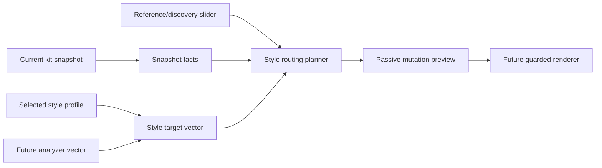

# Style Profile Snapshot Routing Design

Date: 2026-05-21
Status: local draft, not pushed while PR #56 is waiting for human review
Depends on: PR #56, `feat: add passive style profile foundation`

## Purpose

This design connects Jose's musical intent layer to the live snapshot workflow.
The goal is not to clone artists or tracks. The goal is to let the software
capture usable essence: tension, movement, darkness, low-end weight, grit,
hypnosis, metallic bite, space, and performance energy.

The dream-state workflow should support targets such as Jeff Mills, Robert Hood,
Underground Resistance, Oscar Mulero, Rodhad, Birmingham techno, hardgroove,
industrial techno, dark techno, Detroit minimal, and warehouse peak-time tools.
Those names become inspiration inputs that shape safe mutation priorities across
the Analog Rytm MKII and Analog Four MKII.

## Non-Goals

- No MIDI sends.
- No hardware port opening.
- No audio analysis implementation in this slice.
- No machine-switching runtime behavior in this slice.
- No pushed branch or stacked PR while PR #56 remains open.
- No V1.34 parity fixture changes.

## Product Model

PR #56 gives us the passive style profile catalog. This design treats that
catalog as the human intent layer.

Future slices add a routing layer that turns style intent into mutation plans:

- Style profile -> target vector.
- Current kit snapshot -> current machine and parameter facts.
- Optional future audio analyzer -> reference target vector.
- Reference/discovery slider -> blend policy.
- Device strategies -> per-machine safety and rendering boundaries.

The result is a passive preview first, then a guarded mock renderer, and only
later an armed hardware renderer.

## Inputs

The planner should eventually accept these inputs:

- `device_target`: Rytm only, Analog Four only, or both machines.
- `snapshot_id`: the captured live kit/project snapshot to mutate from.
- `style_profile_key`: one style profile from the PR #56 catalog.
- `reference_vector`: optional future analyzer output from an audio file.
- `discovery_amount`: integer range 0 to 100.
- `mutation_budget`: optional performance safety limit per pad or track.

The important live-performance behavior is target isolation. Jose may snapshot
only the Rytm, only the Analog Four, or both machines. A snapshot from one
machine must never mutate the other machine by accident.

## Reference/Discovery Slider

The slider controls how close the result stays to the captured snapshot versus
how boldly it explores.

| Range | Name | Behavior |
| --- | --- | --- |
| 0-20 | Reference | Preserve machines, tiny deltas, correct toward the target only where the snapshot already supports it. |
| 21-60 | Balanced | Keep the live kit identity, allow moderate zone shifts, use style profile priorities to choose where movement happens. |
| 61-85 | Discovery | Broader safe mutation, compatible machine alternatives become candidates, deeper lane movement is allowed. |
| 86-100 | Wild discovery | Maximum guardrailed exploration, still never outside pad/machine compatibility or device strategy limits. |

This slider should apply independently per selected machine target. A Rytm-only
snapshot route must leave the Analog Four alone, and an Analog Four-only route
must leave the Rytm alone.

## Rytm Routing Model

The Rytm side must use all 12 pads and obey the current Analog Rytm MKII manual
machine matrix.

Baseline lane roles:

- Pad 1 BD: low-end foundation and kick identity.
- Pad 2 SD: snare, secondary body, or dual-oscillator percussion.
- Pad 3 RS: rim, chip, raw synth percussion, or compatible BD/SD/CP support.
- Pad 4 CP: clap, chip, raw motion, or compatible BD/SD/RS support.
- Pad 5 BT: bass tom lane.
- Pad 6 LT: low tom lane, XT Classic compatible.
- Pad 7 MT: mid tom lane, XT Classic compatible.
- Pad 8 HT: high tom lane, XT Classic compatible.
- Pad 9 CH: closed hat lane, CH family plus OH-compatible support.
- Pad 10 OH: open hat lane, OH family plus CH-compatible support.
- Pad 11 CY: cymbal lane, CY family plus CB-compatible support.
- Pad 12 CB: cowbell lane, CB family plus CY-compatible support.

Important corrections from hardware testing and manual review:

- Pad 10 is OH/Open Hat, not XT Classic.
- XT Classic belongs to pads 6, 7, and 8.
- Machine switching must be compatible with the pad's allowed family.
- Snapshot machine preservation is the default unless the planner has a clear,
  compatible reason to explore a machine alternative.

## Analog Four Routing Model

The Analog Four side has four tracks, not 12 pads. It should use the same
Device Strategy boundary as the Rytm, but with a different lane model.

Baseline track roles:

- Track 1: bass, sub, or fundamental synth voice.
- Track 2: stab, chord, or tonal hit.
- Track 3: texture, noise, drone, or tension layer.
- Track 4: lead, modulation, sequence motion, or accent voice.

The planner must not reuse Rytm pad assumptions for the Analog Four. Shared
concepts are style targets, mutation zones, slider semantics, and device
strategy contracts. Machine and parameter details remain device-specific.

## Style Target Vector

Each style profile should eventually map to a normalized target vector. The
first implementation can be data-only and passive.

Candidate axes:

- `low_end_weight`
- `transient_density`
- `attack_sharpness`
- `decay_tail`
- `darkness`
- `metallicity`
- `noise_grit`
- `drive_pressure`
- `space_depth`
- `motion_amount`
- `repetition_hypnosis`
- `percussive_density`
- `tonal_center_weight`
- `industrial_edge`
- `minimal_restraint`
- `warehouse_intensity`

These axes should be bounded values, likely 0 to 100. They should be stable
enough for tests and reports, not free-form text.

## Future Audio Analyzer Target

The analyzer should produce the same kind of vector as the style profile layer.
That lets us blend:

- user style intent,
- reference track essence,
- current kit snapshot facts,
- discovery amount.

The analyzer can be added later without changing the planner's public shape.
For example, a Jeff Mills track analysis could emphasize repetition hypnosis,
transient density, metallicity, minimal restraint, and warehouse intensity. The
planner would use that as target pressure, not as an attempt to recreate the
track exactly.

## Planning Output

The passive planner should output a deterministic routing plan:

- target machine or machines,
- selected style profile,
- discovery band,
- per-pad or per-track role,
- current snapshot machine,
- compatible machine candidates,
- allowed mutation zones,
- blocked reasons, if any,
- expected intensity,
- preview-safe parameter groups,
- renderer readiness status.

Blocked lanes are a feature, not a failure. If a snapshot machine cannot be
decoded, or if a machine candidate is incompatible with the pad, the report
should say that plainly and skip that lane.

## Safety Rules

- Passive CLI reports never send MIDI.
- Snapshot mutation planning never opens a hardware port.
- Unknown snapshot data produces an explicit blocked lane.
- Unknown machine compatibility produces an explicit blocked lane.
- Rytm and Analog Four targets are isolated unless both are explicitly selected.
- Machine switching is opt-in by planner policy, not accidental.
- Device-specific rendering remains behind `devices/` and `devices/strategies/`.
- No top-level `mido` imports.

## Test Strategy

Initial TDD slices should cover pure data and pure planning first:

- Style target vector schema tests.
- Style profile to target vector report tests.
- Slider band tests for reference, balanced, discovery, and wild discovery.
- Rytm pad compatibility tests for all 12 pads.
- Pad 10 OH and pads 6-8 XT Classic regression tests.
- Device target isolation tests: Rytm only, Analog Four only, both.
- Passive CLI safety tests proving reports do not open ports.
- Architecture tests proving no new top-level modules or cross-family imports.

## Proposed PR Sequence After PR #56

1. PR 57: style target vector schema and passive report.
   No snapshot mutation behavior. This proves the style catalog can become
   planner input.

2. PR 58: style routing planner for passive Rytm snapshot previews.
   Uses existing snapshot machine facts and 12-pad compatibility. No hardware
   sends.

3. PR 59: reference/discovery slider semantics in the passive preview.
   Adds deterministic blend behavior and per-target isolation tests.

4. PR 60: Analog Four style routing foundation.
   Adds four-track planning through the Device Strategy boundary.

5. PR 61: analyzer target vector schema.
   Adds the shape of future audio analysis output without implementing DSP yet.

6. Later runtime PR: guarded mock renderer, then armed hardware renderer.
   Only after passive previews are stable and reviewed.

## Open Questions

- Should style vectors be manually authored first, then later calibrated from
  analyzer output?
- Should machine alternatives be shown as ranked candidates before any runtime
  machine switching is allowed?
- Should the first slider UI live in CLI prompts, a GUI control, or both?
- Should style routing support multiple style tags at once, such as
  `detroit_minimal + industrial_edge`?

## Done Criteria For This Design

- It gives a clear path from style profiles to snapshot mutation previews.
- It protects live performance snapshot mode as the primary workflow.
- It keeps anchor mode compatible as a separate workflow.
- It treats the Rytm and Analog Four as different devices with shared planning
  concepts.
- It is ready to become a TDD implementation plan after PR #56 merges.
